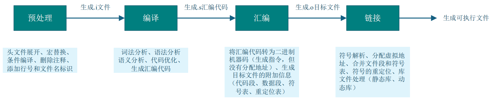
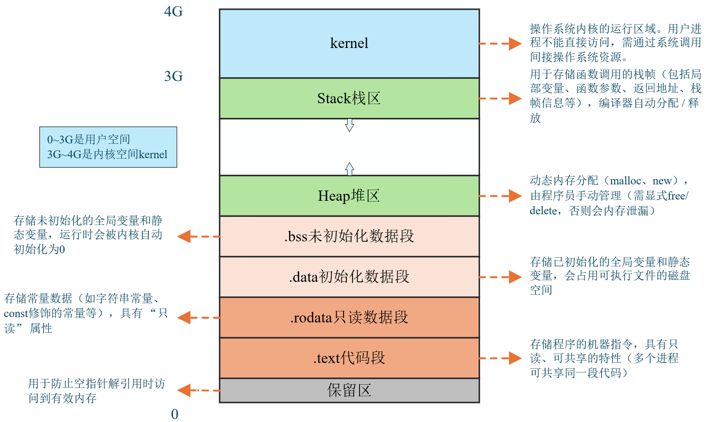
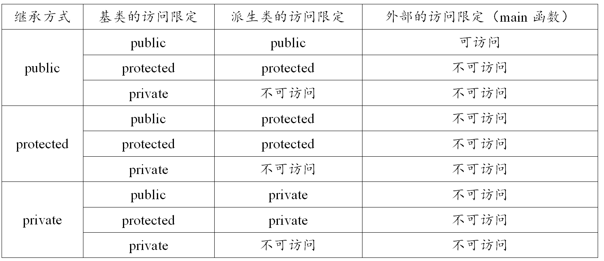
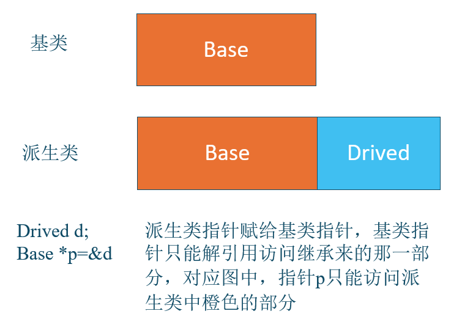
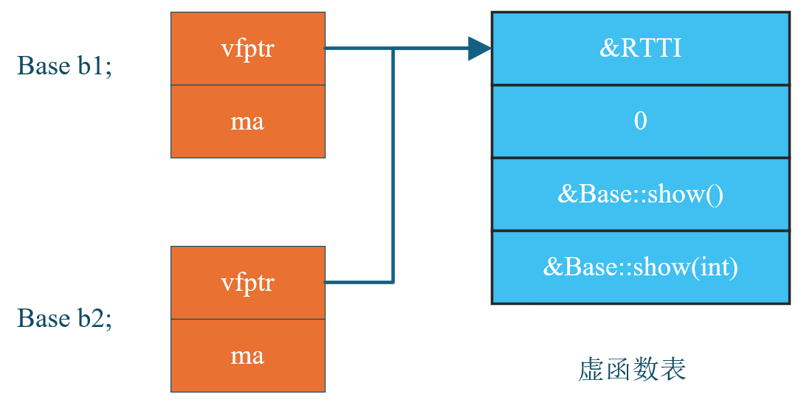
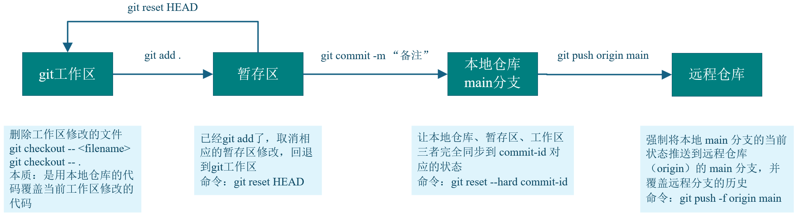

# 1. 基础知识

## 1.1 流操作

strstream类专门用于处理字符串流操作,它允许将字符串当作流来处理,可以方便地进行字符串的读写操作。（C++11 后已被弃用）

fstream用于文件流操作,主要处理文件的输入输出。

iostream是标准的输入输出流类,用于控制台的输入输出操作。

## 1.2 转义字符表示法

- **八进制转义**：`\` + 1-3 个八进制数字（0-7），如 `\112`（对应 'J'）；

- **十六进制转义**：`\x` + 1 个及以上十六进制数字，如 `\x4A`（也对应 'J'）；

- **特殊转义序列**：预定义的固定含义字符，如 `\n`（换行）、`\t`（制表符）等。

合法的转义需要保证最终数值在 `char` 的范围内（通常 0-255）

## 1.3 free()和malloc()

- free()函数只是内存归还给程序的堆空间，由操作系统统一管理，而不能直接释放物理内存
- malloc()函数实际上是向操作系统申请虚拟内存，而不是直接申请物理内存
```cpp
class A
{
public:
    A() { printf("A"); }
    ~A() { printf("~A"); }
    void B() { printf("B"); }
};
int main()
{
    A* a = (A*)malloc(sizeof(A));
    a->B();
    free(a);
    return 0;
}
//此题最后输出B
```

`malloc` 是 C 语言的内存分配函数，仅负责分配一块大小为 `sizeof(A)` 的原始内存，**不会调用类 `A` 的构造函数**。

  **`a->B();`**

调用 `A` 类的成员函数 `B()`。在 C++ 中，**非静态成员函数的调用只依赖于对象的指针（或引用）是否非空，不检查对象是否被正确构造**。

## 1.4 编译流程



## 1.5 编译器报错：Segmentation fault

有可能有三种错误：

- 访问空指针
- 数组访问越界
- 使用已释放的内存

## 1.6 左值和右值

- 左值：有内存地址，有名字，值是可以被修改的


- 右值：没内存地址，没名字

```C++
int main()
{
	int a = 10;     // a是左值，10是右值
	int &c = 20;    // 左值引用
	int &&c = 20;   // 右值引用
	c = 30;
    int &&d = c;    // 错误，不能用一个右值引用变量来引用一个左值
	return 0；
}
```

## 1.7 运算符优先级

| 优先级 | 运算符组         | 具体运算符                                                   | 结合性                              | 示例代码                                     |
| ------ | ---------------- | ------------------------------------------------------------ | ----------------------------------- | -------------------------------------------- |
| 1      | 基础成员访问     | `()`（函数调用 / 分组）、`[]`（数组访问）、<br />`->`（指针成员）、`.`（对象成员） | 左结合                              | `func(3)`、`arr[0]`、`p->x`、`obj.y`         |
| 1      | 后缀增减         | `++`（后缀自增）、`--`（后缀自减）                           | 左结合                              | `a++`、`b--`                                 |
| 1      | 类型相关         | `typeid`、`const_cast`/`dynamic_cast`/`reinterpret_cast`/`static_cast` | 左结合                              | `typeid(int)`、`static_cast<int>(3.14)`      |
| 2      | 前缀增减与符号   | `++`（前缀自增）、`--`（前缀自减）、`+`（正号）、`-`（负号） | 右结合                              | `++a`、`-b`、`+3.14`                         |
| 2      | 逻辑非与位运算   | `!`（逻辑非）、`~`（按位取反）                               | 右结合                              | `!flag`、`~0x0F`                             |
| 2      | 指针操作         | `*`（解引用）、`&`（取地址）                                 | 右结合                              | `*p`、`&a`                                   |
| 2      | 内存管理         | `new`、`new[]`（动态分配）、`delete`、`delete[]`（动态释放） | 右结合                              | `int* p = new int`、`delete p`               |
| 2      | 大小计算         | `sizeof`（类型 / 对象大小）、`sizeof...`（参数包大小）       | 右结合                              | `sizeof(int)`、`sizeof(arr)`                 |
| 3      | 成员指针访问     | `->*`（指针访问成员指针）、`.*`（对象访问成员指针）          | 左结合                              | `p->*mem_ptr`、`obj.*mem_ptr`                |
| 4      | 乘法与除法       | `*`（乘法）、`/`（除法）、`%`（取模）                        | 左结合                              | `a * b`、`c / d`、`e % 3`                    |
| 5      | 加法与减法       | `+`（加法）、`-`（减法）                                     | 左结合                              | `x + y`、`m - n`                             |
| 6      | 移位运算         | `<<`（左移）、`>>`（右移）                                   | 左结合                              | `a << 2`（左移 2 位）、`b >> 1`（右移 1 位） |
| 7      | 关系运算（大小） | `<`（小于）、`>`（大于）、`<=`（小于等于）、`>=`（大于等于） | 左结合                              | `a < b`、`x >= y`                            |
| 8      | 关系运算（相等） | `==`（等于）、`!=`（不等于）                                 | 左结合                              | `a == 5`、`x != y`                           |
| 9      | 按位与           | `&`（按位与）                                                | 左结合                              | `a & 0x01`（取最低位）                       |
| 10     | 按位异或         | `^`（按位异或）                                              | 左结合                              | `a ^ b`                                      |
| 11     | 按位或           | ` | `（按位或）                                              | 二进制位逻辑或（对应位有 1 则为 1） |                                              |
| 12     | 逻辑与           | `&&`（逻辑与）                                               | 左结合                              | `a > 0 && b < 10`                            |
| 13     | 逻辑或           | `                                                            |                                     | 左结合                                       |
| 14     | 三目运算符       | `?:`（条件运算符）                                           | 右结合                              | `a > b ? a : b`（取较大值）                  |
| 15     | 赋值运算         | `=`、`+=`、`-=`、`*=`、`/=`、`%=`、`<<=`、`>>=`、`&=`、`^=`、` | =` | 赋值或复合赋值                      | （如`a += b`等价于`a = a + b`）              |
| 16     | throw 表达式     | `throw`（抛出异常）                                          | 右结合                              | `throw std::runtime_error("error")`          |
| 17     | 逗号运算符       | `,`（逗号）                                                  | 左结合                              | `a = 1, b = 2, a + b`（结果为 3）            |

## 1.8 或、与、非、异或（逻辑 / 位运算）总结表

| 运算类型     | 运算符 | 运算名称 | 核心用法                                                     | 操作数要求                                                   | 关键特性                                       |
| ------------ | ------ | -------- | ------------------------------------------------------------ | ------------------------------------------------------------ | ---------------------------------------------- |
| **逻辑运算** | &&     | 逻辑与   | 判断两个条件是否**同时成立**，常用于多条件同时满足的判断（如 `if (cond1 && cond2)`） | 操作数需能隐式转换为 `bool` 类型（如 int、bool、指针等）     | 有短路特性（左操作数为假时，右操作数不执行）   |
| **逻辑运算** | \|\|   | 逻辑或   | 判断两个条件是否**至少一个成立**，常用于多条件满足其一的判断（如 `if (cond1cond2)`） | 同逻辑与，操作数需能隐式转换为 `bool` 类型                   | 有短路特性（左操作数为真时，右操作数不执行）   |
| **逻辑运算** | !      | 逻辑非   | 对单个条件的真假性**取反**，常用于否定条件（如 `if (!cond)`） | 同逻辑与，操作数需能隐式转换为 `bool` 类型                   | 单目运算，优先级高于算术运算符，需注意括号搭配 |
| **位运算**   | &      | 位与     | 对两个整数的**每一位逐位运算**，用于保留指定位（如保留特定位、判断奇偶性） | 操作数必须是整数类型（char、short、int、long 等，不可为 bool 或浮点数） | 无短路特性                                     |
| **位运算**   | \|     | 位或     | 对两个整数的**每一位逐位运算**，用于设置指定位（如将某位置为 1） | 同一位与，操作数必须是整数类型                               | 无短路特性，左右操作数均会执行                 |
| **位运算**   | `^`    | 位异或   | 用于翻转指定位、交换两个整数（无需临时变量）    “**同 0 异 1**”。 | 同一位与，操作数必须是整数类型                               | 无短路特性                                     |
| **位运算**   | `~`    | 位非     | 对单个整数的**每一位逐位取反**（0→1，1→0），用于按位翻转数值 | 同一位与，操作数必须是整数类型                               | 单目运算，取反范围包含符号位（依赖补码规则）   |

## 1.9 四种类型转换

| 转换运算符         | 核心作用                                     | 适用场景                                                     | 特点 / 限制                                                  |
| ------------------ | -------------------------------------------- | ------------------------------------------------------------ | ------------------------------------------------------------ |
| `static_cast`      | 编译时完成类型转换，不进行运行时类型检查     | 1. 基本数据类型间转换（如 `double`→`int`）2. 类层次中基类与派生类的指针 / 引用转换（向上转换安全，向下转换有风险）3. 空指针与目标类型空指针的转换、任意类型与 `void` 类型的转换 | 1. 无法移除指针 / 引用的 `const`/`volatile` 属性2. 依赖开发者保证转换安全性，编译不检查实际类型匹配 |
| `dynamic_cast`     | 运行时进行类型转换，支持安全的向下转换       | 1. 多态类（含虚函数）的指针 / 引用转换，尤其是基类→派生类的 “向下转换”2. 类层次中的交叉转换，支持向上转换和向下转换 | 1. 要求基类必须包含至少一个虚函数（支持运行时类型识别 RTTI）2. 转换失败时：指针返回 `nullptr`，引用抛出 `std::bad_cast` 异常 |
| `const_cast`       | 移除指针或引用的 `const`/`volatile` 属性     | 1. 通过指针 / 引用间接修改 “被 `const` 修饰的对象”（需确保原对象本身非 `const` 定义，否则行为未定义） | 1. 仅能操作指针或引用，不能直接修改 `const` 修饰的内置变量2. 不改变对象本身的 `const` 性，仅改变指针 / 引用对其的访问权限 |
| `reinterpret_cast` | 重新解释数据的二进制表示，仅改变类型解读方式 | 1. 不同类型指针 / 引用之间的转换（如 `int*`→`char*`）2. 指针与整数类型（如 `uintptr_t`）之间的转换3. 函数指针之间的转换 | 1. 不进行任何类型检查，几乎允许所有类型转换2. 不改变底层比特位，仅修改类型标签3. 结果依赖平台（如指针大小、字节序），可移植性差4. 风险极高，易导致未定义行为（如访问非法内存） |

### 一、`static_cast` 静态转换（编译期，无运行时检查）

适用：基础类型、继承类指针 / 引用、void* 转换

禁止：去掉 const、跨无关类强制转

```cpp
#include <iostream>
using namespace std;

class Base {};
class Derived : public Base {};

int main() {
    // 1. 基础类型转换
    double d = 3.14;
    int i = static_cast<int>(d); 
    cout << i << endl; // 3

    // 2. 继承向上转换（安全）
    Derived der;
    Base* pBase = static_cast<Base*>(&der);

    // 3. 继承向下转换（不安全，编译不报错，运行可能崩）
    Base base;
    Derived* pDer = static_cast<Derived*>(&base);

    // 4. void* 互转
    void* p = &i;
    int* pi = static_cast<int*>(p);

    return 0;
}
```

**核心限制**：不能用它去掉 `const` 属性。

------

### 二、`dynamic_cast` 动态转换（运行时 RTTI，安全向下转）

前提：基类**必须有虚函数**，开启 RTTI

失败规则：指针返回`nullptr`，引用抛异常

```cpp
#include <iostream>
using namespace std;

class Base {
public:
    virtual ~Base() {} // 必须有虚函数，开启RTTI
};
class Derived : public Base {};

int main() {
    Base* p1 = new Derived;
    // 安全向下转换，成功
    Derived* d1 = dynamic_cast<Derived*>(p1); 
    if(d1) cout << "转换成功" << endl;

    Base* p2 = new Base;
    // 转换失败，返回nullptr
    Derived* d2 = dynamic_cast<Derived*>(p2); 
    if(!d2) cout << "转换失败" << endl;

    // 引用版：失败抛 std::bad_cast
    try {
        Base b;
        Derived& dr = dynamic_cast<Derived&>(b);
    } catch (...) {
        cout << "引用转换异常" << endl;
    }

    return 0;
}
```

**考点**：无虚函数直接编译报错；向下转换优先用它。

------

### 三、`const_cast` 去掉 const/volatile（**唯一能去掉 const 的运算符**）

只能改**指针 / 引用**，不能改普通变量；原对象必须非 const，否则 UB

```cpp
#include <iostream>
using namespace std;

int main() {
    // 1. 原对象非const，安全去掉const
    int num = 100;
    const int* p = &num;
    int* p2 = const_cast<int*>(p);
    *p2 = 200;
    cout << num << endl; // 200

    // 2. 原对象是const，修改 → 未定义行为(UB)
    const int n = 10;
    int* pn = const_cast<int*>(&n);
    // *pn = 20; // 严禁！标准UB，编译器可能优化掉

    return 0;
}
```

**核心**：只修改**访问权限**，不修改对象本身 const 属性。

------

### 四、`reinterpret_cast` 重新解释二进制（最强、最危险）

直接解析内存比特位，无任何检查，可跨类型强转

```cpp
#include <iostream>
using namespace std;

int main() {
    // 1. int* <-> char* 指针互转
    int a = 0x12345678;
    char* pc = reinterpret_cast<char*>(&a);

    // 2. 指针 <-> 整数（uintptr_t）
    uintptr_t addr = reinterpret_cast<uintptr_t>(&a);

    // 3. 函数指针强转（极度危险）
    void (*fp)() = nullptr;
    int (*fpi)(int) = reinterpret_cast<int (*)(int)>(fp);

    return 0;
}
```


## 1.10 数组名和数组

**多数情况下数组名会隐式转换为 “指向第一个元素的指针”，但在少数特殊场景中会保留 “整个数组” 的语义**。以下是具体总结：

### （1）数组名表示 “指向第一个元素的指针”（默认转换）

- **参与指针运算（如 `+`、`-`）**

```C++
int arr[5] = {1,2,3,4,5}; 
arr + 1：         //arr 转换为 int* 类型（指向 arr[0]），+1 后指向 arr[1]（步长为 sizeof(int)）
*(arr + 2);       //等价于 arr[2]，结果为 3。
```

- **作为函数参数传递**

​		C 语言中，数组作为参数传递时，会被自动转换为指向首元素的指针（“数组退化”）。

```C++
void func(int arr[]) {  // 等价于 void func(int* arr)
    // 此处 arr 是 int* 类型，而非数组
}
int main() {
    int arr[5] = {1,2,3,4,5};
    func(arr);  // arr 转换为指向 arr[0] 的 int*
}
```

- **赋值给同类型指针**

```C++
int arr[5];
int* p = arr;  // 正确：arr 转换为 int*，指向 arr[0]
```

- **作为解引用运算符 `*` 的操作数**

例：`*arr` 等价于 `arr[0]`（`arr` 转换为指向 `arr[0]` 的指针，解引用后得到首元素）。

### （2）数组名表示 “整个数组的地址”

- **作为 `sizeof` 运算符的操作数**

​		`sizeof(数组名)` 计算的是**整个数组的总字节数**（而非指针的大小），此时数组名表示整个数组。

```C++
int arr[5];
printf("%zu", sizeof(arr));  // 结果为 5 * sizeof(int)（通常是 20 字节）
printf("%zu", sizeof(arr + 0));  // arr+0 触发转换，结果为 sizeof(int*)（通常是 8 字节）
```

- **作为 `&`（取地址运算符）的操作数**

​		`&数组名` 得到的是 “整个数组的地址”，类型为 “指向数组的指针”（而非指向首元素的指针）。

```C++
int arr[5] = {1,2,3,4,5};
int (*p)[5] = &arr;  // 正确：&arr 类型是 int (*)[5]（指向“5个int的数组”的指针）
```

**注意：**`&arr`和`arr`的数值地址相同（都指向数组起始位置），但类型不同：

​			`arr` 是 `int*` 类型，`+1` 移动 `sizeof(int)` 字节（指向 `arr[1]`）；

​			`&arr` 是 `int (*)[5]` 类型，`+1` 移动 `5*sizeof(int)` 字节（指向数组末尾的下一个位置）。

- **作为字符串字面量初始化另一个数组**

当用字符串字面量（本质是字符数组）初始化另一个字符数组时，字符串字面量保留数组语义，用于完整初始化目标数组。

```C++
char str[] = "hello";  // "hello" 是字符数组（含 '\0'），此处表示整个数组，用于初始化 str
```

| 场景                       | 数组名的含义               | 类型示例（以 `int arr[5]` 为例）     |
| -------------------------- | -------------------------- | ------------------------------------ |
| 多数表达式（运算、传参等） | 指向首元素的指针           | `int*`（指向 `arr[0]`）              |
| `sizeof(数组名)`           | 整个数组（计算总大小）     | 数组类型 `int[5]`                    |
| `&数组名`                  | 整个数组的地址             | `int (*)[5]`（指向整个数组）         |
| 字符串字面量初始化数组     | 整个字符串数组（完整赋值） | 字符数组类型 `char[6]`（如 "hello"） |

```C++
int arr[5]={1,2,3,4,5};

&arr;  				//类型为 int (*)[5]，表示整个数组的地址
*&arr;  			//表示数组首元素arr[0]的地址
**&arr;  			//*&arr（已转换为 int*）再解引用，得到 arr[0] 的值,1
&arr+1;  			//表示从arr[5]开始的下一个数组地址
arr;   				//表示数组首元素arr[0]的地址
*arr;  				//表示数组首元素arr[0]的值
arr+1;  			//指向 arr[1]（值为 2 的地址）
&arr[0];  			//指向 arr[0]（值为 1 的地址）
*(arr + 1);   		//等价于arr[1]，2
&arr[0] + 1; 		// 指向 arr[1] 的地址
sizeof(arr); 		//整个数组的总字节数（通常 20 字节）
sizeof(&arr);  		//通常 4 字节（32 位系统）
sizeof(arr + 0);    //通常 4 字节（32 位系统）
```

## 1.11 程序的内存布局

**32 位系统** 下的进程虚拟地址空间布局



（1）栈内存（局部变量对象）

1. 栈内存是**函数内局部创建**，函数执行完毕时，**编译器自动释放内存**，程序员**不用手动 delete**，不会内存泄漏；
2. 栈内存的**生命周期 = 所在函数的执行周期**：函数执行完，栈对象就被销毁，内存空间回收，里面的数据全部失效；
3. 栈内存创建 / 释放的**速度极快**（CPU 直接操作寄存器），几乎无性能开销；
4. 栈内存的**作用域仅限当前线程**：局部变量的内存地址，**只有当前主线程能访问**，跨线程访问有风险（但这份代码规避了）。

（2）堆内存（new 创建的对象）

1. 堆内存是**程序员手动申请**，必须**手动 delete 释放**，编译器不会管，忘记 delete 就会**内存泄漏**；
2. 堆内存的**生命周期 = 从 new 到 delete 的整个阶段**，不受函数执行周期的限制，函数执行完，堆对象依然存在；
3. 堆内存创建 / 释放的**速度比栈慢**（需要操作系统分配内存页），有微小的性能开销；
4. 堆内存是**进程全局的**：只要拿到堆对象的指针，**任意线程都可以访问**，完美支持「跨线程传递数据」。

## 1.12 各种数值类型

| 类型类别                              | 具体类型                      | 字节数                 | 取值范围                                                 |
| ------------------------------------- | ----------------------------- | ---------------------- | -------------------------------------------------------- |
| **固定宽度无符号整数**（`<cstdint>`） | `uint8_t`                     | 1                      | `0` ~ `2⁸ - 1`（即 `0` ~ `255`）                         |
|                                       | `uint16_t`                    | 2                      | `0` ~ `2¹⁶ - 1`（即 `0` ~ `65535`）                      |
|                                       | `uint32_t`                    | 4                      | `0` ~ `2³² - 1`（即 `0` ~ `4,294,967,295`）              |
|                                       | `uint64_t`                    | 8                      | `0` ~ `2⁶⁴ - 1`                                          |
| **固定宽度有符号整数**（`<cstdint>`） | `int8_t`                      | 1                      | `-2⁷` ~ `2⁷ - 1`（即 `-128` ~ `127`）                    |
|                                       | `int16_t`                     | 2                      | `-2¹⁵` ~ `2¹⁵ - 1`（即 `-32,768` ~ `32,767`）            |
|                                       | `int32_t`                     | 4                      | `-2³¹` ~ `2³¹ - 1`                                       |
|                                       | `int64_t`                     | 8                      | `-2⁶³` ~ `2⁶³ - 1`                                       |
| **基础无符号整数**                    | `unsigned char`               | 1                      | `0` ~ `255`（与 `uint8_t` 等价）                         |
|                                       | `unsigned short`              | 2                      | `0` ~ `65535`（与 `uint16_t` 等价）                      |
|                                       | `unsigned int`                | 4                      | `0` ~ `4,294,967,295`（多数环境与 `uint32_t` 等价）      |
|                                       | `unsigned long`               | 4（32 位）/ 8（64 位） |                                                          |
|                                       | `unsigned long long`          | 8                      | `0` ~ `18,446,744,073,709,551,615`（与 `uint64_t` 等价） |
| **基础有符号整数**                    | `signed char`                 | 1                      | `-128` ~ `127`（与 `int8_t` 等价）                       |
|                                       | `short` / `short int`         | 2                      | `-32,768` ~ `32,767`（与 `int16_t` 等价）                |
|                                       | `int`                         | 4                      | `-2³¹` ~ `2³¹ - 1`                                       |
|                                       | `long` / `long int`           | 4（32 位）/ 8（64 位） |                                                          |
|                                       | `long long` / `long long int` | 8                      |                                                          |
| **浮点类型**                          | `float`                       | 4                      | 约 `3.4×10⁻³⁸` ~ `3.4×10³⁸`（有效数字约 7 位）           |
|                                       | `double`                      | 8                      | 约 `1.7×10⁻³⁰⁸` ~ `1.7×10³⁰⁸`（有效数字约 15~17 位）     |
|                                       | `long double`                 | 8（或 16，依平台）     | 通常与 `double` 精度一致；                               |

| 特性          | `size_t`                                                     | `ssize_t`                                                    |
| ------------- | ------------------------------------------------------------ | ------------------------------------------------------------ |
| 含义          | 无符号尺寸类型 (Unsigned Size)                               | 有符号尺寸类型 (Signed Size)                                 |
| 底层实现      | 通常是 `unsigned int` (32位) 或 `unsigned long`/`unsigned long long` (64位) | 通常是 `int` (32位) 或 `long` (64位)                         |
| 主要用途      | 表示对象大小、数组索引、容器容量。永远非负。                 | 表示系统调用（如 `read`, `write`）的返回值。需要表示错误（-1）。 |
| 典型场景      | `sizeof()` 的返回值、`malloc` 参数、`vector::size()`、循环计数。 | `read()`, `write()`, `recv()`, `send()` 的返回值。           |
| Printf 格式符 | `%zu` (C99 标准)                                             | `%zd` (C99 标准)                                             |
| 陷阱          | 下溢风险：`0 - 1` 会变成极大的正数，导致逻辑错误或无限循环。 | 混合运算风险：与 `size_t` 直接比较或运算时，可能因符号扩展导致意外结果。 |

## 1.13 strcpy用法

**（1）函数原型**

```c
char* strcpy(char* dest, const char* src);
```

- 参数
  - `dest`：目标缓冲区（char 类型指针），用于存储复制后的字符串。
  - `src`：源字符串（const char 类型指针），需以空字符 `'\0'` 结尾（C 风格字符串的标志）。
- **返回值**：返回目标缓冲区 `dest` 的指针（通常很少使用该返回值）。

**（2）工作原理**

`strcpy` 会从 `src` 的第一个字符开始，逐个复制到 `dest` 中，**直到遇到 `src` 中的 `'\0'`**（包括 `'\0'` 也会被复制到 `dest` 中）。

例如，若 `src` 是 `"abc"`（实际存储为 `'a','b','c','\0'`），则 `strcpy` 会将这 4 个字符完整复制到 `dest`。

## 1.14 register关键字

​	核心作用是**建议编译器将变量存储在 CPU 寄存器中**，以减少变量的访问时间（寄存器访问速度远快于内存），从而提升程序执行效率。它本质是对编译器的 “优化建议”，而非强制命令。

​	`register` 关键字的核心使用限制之一就是：**只能修饰局部自动变量（即函数内部声明的、无 `static` 修饰的变量）**，而**不能用于类的数据成员**，原因是：类的数据成员属于类的实例（对象）的一部分，其存储位置在对象的内存空间中（堆或栈上），具有明确的内存地址，供对象访问和修改。而 `register` 关键字的本质是 “建议编译器将变量存储在 CPU 寄存器中”，**寄存器没有内存地址**，

```cpp
#include <stdio.h>

int main() {
    // 建议将循环计数器 i 存入寄存器（频繁自增和判断）
    register int i;
    long long sum = 0;
    for (i = 0; i < 1000000000; i++) {
        sum += i;
    }
    printf("sum = %lld\n", sum);
    return 0;
}
```

- C++11 后，`register` 的语义被弱化，仅保留 “提示编译器优化” 的作用，且不能修饰函数参数。
- C++17 正式将 `register` 列为**弃用关键字**（deprecated），未来可能被移除，因为编译器优化已完全替代其功能。

## 1.15 memcpy的用法

在 C++ 中，`memcpy` 是一个用于内存块复制的标准库函数，定义在 `<cstring>` 头文件中。它可以将指定大小的内存块从源地址复制到目标地址，是处理内存级数据复制的常用工具。

**`memcpy` 的函数原型**

```cpp
void* memcpy(void* destination, const void* source, size_t num);
```

- **参数说明**：
  - `destination`：指向目标内存块的指针（复制的目的地）
  - `source`：指向源内存块的指针（复制的来源）
  - `num`：要复制的字节数（`size_t` 类型，通常是无符号整数）
- **返回值**：返回指向目标内存块 `destination` 的指针

**基本用法**

`memcpy` 的核心功能是按字节复制内存，使用时需要确保：

1. 目标内存块有足够的空间容纳 `num` 字节的数据
2. 源内存块和目标内存块的大小至少为 `num` 字节
3. 两个内存块不应重叠（如果需要处理重叠内存，应使用 `memmove`）

```cpp
#include <iostream>
#include <cstring> // 包含 memcpy 函数

int main() {
    // 示例 1：复制字符数组
    char source[] = "Hello, memcpy!";
    char destination[20]; // 确保目标数组足够大
    
    // 复制整个源字符串（包括终止符 '\0'）
    memcpy(destination, source, strlen(source) + 1);
    std::cout << "复制的字符串: " << destination << std::endl;
    
    // 示例 2：复制整数数组
    int src[] = {1, 2, 3, 4, 5};
    int dest[5];
    
    // 计算需要复制的总字节数：元素个数 × 每个元素的大小
    size_t bytes = sizeof(src);
    memcpy(dest, src, bytes);
    
    std::cout << "复制的整数: ";
    for (int i = 0; i < 5; ++i) {
        std::cout << dest[i] << " ";
    }
    std::cout << std::endl;
    
    return 0;
}
```

**注意事项**

1. **内存重叠问题**：如果源内存和目标内存有重叠，`memcpy` 的行为是未定义的，此时应使用 `memmove` 替代。
2. **类型无关性**：`memcpy` 以字节为单位复制，不关心数据类型，因此可以用于复制任何类型的数据（包括自定义结构体）。
3. **字符串处理**：虽然可以用 `memcpy` 复制字符串，但对于以 `\0` 结尾的字符串，`strcpy` 或 `strncpy` 可能更合适，因为它们会自动处理终止符。
4. **安全问题**：使用 `memcpy` 时必须确保目标缓冲区足够大，否则会导致缓冲区溢出，这是常见的安全漏洞来源。

### **与 strcpy()的区别**

- `memcpy` 可以复制任意类型的内存块，需要显式指定复制的字节数
- `strcpy` 专门用于复制字符串，会在遇到 `\0` 时自动停止，不需要指定长度

总之，`memcpy` 是一个高效的内存复制工具，适用于需要精确控制复制字节数的场景，但使用时必须格外注意内存边界和重叠问题。

## 1.16 判断奇偶数

```cpp
if((*p & 0x1)==0);  //偶数
if((*p & 0x1)==1)； //奇数
```

## 1.17 大端和小端

多字节数据由 “高位字节” 和 “低位字节” 组成。例如，十六进制数 `0x1234` 中：

- 高位字节：`0x12`（权重更高，对应 “千位、百位” 的概念）；
- 低位字节：`0x34`（权重更低，对应 “十位、个位” 的概念）。

**大端字节序：**高位字节存储在低地址，低位字节存储在高地址。类比 “人类书写数字的习惯”：我们写 `1234` 时，先写高位的 `12`，再写低位的 `34`，大端的存储顺序与之一致。

**小端字节序：**低位字节存储在低地址，高位字节存储在高地址。与人类书写习惯相反，更贴近计算机底层的 “字节级操作” 逻辑。

```cpp
//比如十六进制数  0x1234
//大端：0001001000110100    直接按照上面的顺序写就是大端
//小端：0011010000010010    先写34 再写12  就是小端
```

## 1.18  explicit用法

| 应用场景                       | 作用                                                         | 适用 C++ 版本 | 效果描述                                                     |
| ------------------------------ | ------------------------------------------------------------ | ------------- | ------------------------------------------------------------ |
| 修饰单参数构造函数             | 禁止通过 “参数类型” 隐式转换为类对象                         | 所有版本      | 必须显式调用构造函数创建对象，无法直接用参数值隐式初始化类对象 |
| 修饰类型转换运算符             | 禁止从类类型隐式转换为目标类型（如`operator bool()`、`operator int()`） | C++11 及以后  | 不能直接将类对象隐式转为目标类型，需通过`static_cast`等显式转换方式 |
| 修饰类模板推导指引             | 禁止从初始化表达式隐式推导模板类类型                         | C++17 及以后  | 无法通过表达式隐式推导出模板类的具体类型，需显式构造或直接指定模板参数 |
| 条件显式（`explicit(表达式)`） | 根据常量表达式的值（`true`/`false`）动态决定是否禁止隐式转换 | C++20 及以后  | 表达式为`true`时禁止隐式转换，为`false`时允许，灵活控制转换的显式性 |

`explicit` 的本质是**阻止 “悄悄发生的隐式类型转换”**，强制开发者通过 “显式构造 / 转换” 来表达意图，从而避免因意外转换导致的逻辑错误，让代码行为更可控、更安全。

## 1.19 静态成员

```cpp
#include <iostream>
using namespace std;
class cla {
    static int n;
 
  public:
    cla() { n++; }
    ~cla() { n--; }
    static int get_n() { return n; }
};
int cla::n = 0;
int main() {
    cla *p = new cla;
    delete p;
    cout << "n=" << cla::get_n() << endl;
    return 0;
}
// 输出 0
```

此题引出的问题是：**为什么都已经析构了还可以调用静态函数呢？   是因为静态函数和静态变量 存放在.bss段中吗？**

**（1）静态成员不属于 “对象”，而属于 “类” 本身**

​	C++ 中，类的非静态成员（如普通成员变量、非静态成员函数）是**依附于对象存在的**：每个对象都有独立的非静态成员变量副本，调用非静态成员函数时需要通过对象（或指针 / 引用），本质是传递了 `this` 指针指向具体对象。

但**静态成员（静态变量、静态函数）属于类本身**，而非某个具体对象：

- 它们在程序启动时（类首次被使用前）就已初始化，生命周期贯穿整个程序运行过程，直到程序结束才销毁。
- 调用静态函数时，不需要依赖任何对象（无需 `this` 指针），直接通过类名（如 `cla::get_n()`）即可调用，与对象是否存在无关。

**（2）为什么对象析构后仍能调用静态函数？**

在你的代码中：

- `delete p;` 销毁了通过 `new` 创建的 `cla` 对象，此时会调用该对象的析构函数（`n--`），但这仅影响对象本身的生命周期（对象被销毁）。
- 静态函数 `get_n()` 和静态变量 `n` 属于 `cla` 类，它们的生命周期与程序绑定，并不会因为某个对象的析构而消失。因此，即使所有 `cla` 对象都被销毁，依然可以通过类名调用静态函数访问静态变量。

**（3）关于存储位置：.bss 段是实现细节，而非核心原因**

静态成员的存储位置确实与普通成员不同：

- 非静态成员变量：存储在对象的内存空间中（栈或堆，取决于对象创建方式）。

- 静态成员变量：如果是未初始化的全局静态变量或类静态变量，通常存放在 **.bss 段**（未初始化数据段）；如果是初始化的，则存放在 **.data 段**（已初始化数据段）。

- 静态成员函数：与普通函数一样，存放在 **.text 段**（代码段），因为它们是可执行的机器指令。

**注意：**

**（1）静态数据成员必须 “类内声明，类外定义”；静态函数不受限制**

**（2）在C++17以后，静态数据成员只需要在类内声明的时候加上inline，就不用在类外定义**

| 成员类型                       | 类内操作                          | 类外操作                                             |
| ------------------------------ | --------------------------------- | ---------------------------------------------------- |
| 非 const 静态数据成员          | 声明（`static T name;`）          | 定义 + 初始化（`T 类名::name = 初始值;`）            |
| const 静态数据成员（C++11+）   | 声明 + 初始化（仅字面类型）       | 可选：需取地址时补充定义（`const T 类名::name;`）    |
| const 静态数据成员（C++11 前） | 声明（`static const T name;`）    | 定义 + 初始化（`const T 类名::name = 初始值;`）      |
| static constexpr 成员          | 声明 + 初始化（编译期常量）       | 无需定义                                             |
| 静态成员函数                   | 声明（`static 返回值 函数名();`） | 定义（`返回值 类名::函数名() { ... }`），不加 static |

## 1.20 strlen()和sizeof()区别

计算**以`'\0'`结尾的字符串的有效长度**（不含`'\0'`）。与`sizeof`区别：

- `strlen`：函数，算有效字符数（不含`'\0'`）。
- `sizeof`：运算符，算内存总字节数（含`'\0'`）。

```cpp
char s[] = "abc";
printf("strlen: %zu, sizeof: %zu", strlen(s), sizeof(s)); 
// 输出：3（有效字符）、4（含'\0'的总字节）
```

| 特性               | strlen                              | sizeof                                        |
| ------------------ | ----------------------------------- | --------------------------------------------- |
| **本质**           | 库函数（`<string.h>`）              | 运算符（编译期关键字）                        |
| **计算对象**       | 仅针对**以 '\0' 结尾的字符串**      | 任意数据类型 / 变量 / 数组（无 '\0' 限制）    |
| **计算内容**       | 字符串中**有效字符数**（不含 '\0'） | 变量 / 类型**占用的字节数**（含 '\0' 或填充） |
| **计算时机**       | 运行期（遍历字符串直到 '\0'）       | 编译期（已知类型大小，无需运行）              |
| **返回值类型**     | `size_t`（无符号整数）              | `size_t`（无符号整数）                        |
| **是否需要头文件** | 需要（`#include <string.h>`）       | 不需要（内置运算符）                          |

简单记：`strlen` 数 “字符个数”（不含 '\0'），`sizeof` 算 “字节大小”（含所有内存）；前者是运行期函数，后者是编译期运算符。

## 1.21 strcat()用法

`strcat()`用于将**源字符串**的内容追加到**目标字符串**的末尾，拼接后形成一个新的字符串。

```cpp
#include <cstring>  // 必须包含的头文件

char* strcat(char* destination, const char* source);
```

- 参数：
  - `destination`：目标字符串（已存在的字符串，需有足够空间容纳拼接后的结果）。
  - `source`：源字符串（被追加的字符串，`const` 表示其内容不会被修改）。
- **返回值**：返回拼接后的目标字符串 `destination` 的首地址（方便链式调用）。
- 工作原理

1. 从 `destination` 的结尾（即第一个 `'\0'` 处）开始，逐个复制 `source` 的字符（包括 `source` 的 `'\0'`）。
2. 最终 `destination` 会包含原 `destination` + 原 `source` 的内容，且仅以一个 `'\0'` 结尾。

```cpp
#include <iostream>
#include <cstring>
using namespace std;

int main() {
    char dest[20] = "Hello";  // 目标字符串（需预留足够空间）
    const char* src = " World";  // 源字符串
    
    // 拼接：将src追加到dest末尾
    strcat(dest, src);
    
    cout << "拼接后：" << dest << endl;  // 输出：Hello World
    return 0;
}
```

- **注意事项**

​	（1）**目标字符串必须有足够空间**

  - 若 `dest` 的内存空间不足以容纳拼接后的结果（原 `dest` 长度 + `src` 长度 + 1 个 `'\0'`），会导致**缓冲区溢出**（未定义行为，可能崩溃或数据错乱）。
  - 示例：`char dest[6] = "Hello";` 只能容纳 6 个字符（含 `'\0'`），若拼接 `" World"`（6 个字符 + `'\0'`），则会溢出。

​	（2）**目标字符串必须可修改**

  - `dest` 必须是**字符数组**（如 `char dest[20];`），不能是字符串常量（如 `char* dest = "Hello";`，常量不可修改）。

​	（3）**源字符串必须以 `'\0'` 结尾**

  - `strcat()` 通过 `'\0'` 判断 `source` 的结束位置，若 `source` 没有 `'\0'`，会导致复制越界。

## 1.22 extern 用法

在 C++ 中，`extern` 是一个用于声明外部变量或函数的关键字，主要用于处理跨文件的变量 / 函数引用和 C/C++ 混合编程场景。以下是其核心用法整理：

**（1）声明外部全局变量**

​	当一个全局变量在 A 文件中定义，需要在 B 文件中使用时，需在 B 文件中用`extern`声明该变量（告知编译器：此变量已在其他地方定义，此处仅为引用）。

**（2）声明外部函数**

函数默认具有外部链接性，`extern`可显式声明 "该函数在其他文件中定义"（通常用于头文件）

**（3）兼容C语言编译**

如果 C++ 调用 C 语言编译的函数，直接调用会找不到（名字不一样），需要`extern "C"`告诉编译器 “按 C 语言规则处理这个函数”。

| 用法场景                | 作用                                                         | 语法示例                                                     | 关键注意点                                                   |
| ----------------------- | ------------------------------------------------------------ | ------------------------------------------------------------ | ------------------------------------------------------------ |
| 1. 跨源文件共享全局变量 | 让当前文件访问其他源文件中定义的全局变量（全局变量默认仅当前文件可见） | 声明：`extern int g_num;`  定义（其他文件）：`int g_num = 100;` | 声明时**不能初始化**（初始化 = 定义）；全局变量仅能在一个文件定义 |
| 2. 跨源文件共享函数     | 声明其他文件定义的函数（函数默认带 extern 属性，可省略）     | 显式：`extern int add(int a, int b);`  省略：`int add(int a, int b);` | 两种写法等价，省略 extern 更简洁                             |
| 3. C/C++ 混合编程       | 告诉 C++ 编译器按 C 语言规则处理函数（避免名字修饰导致的链接错误） | `extern "C" { int add(int a, int b); }`                      | 包裹 C 语言函数声明；仅 C++ 支持，C 语言无此语法             |

**注意：**

（1）**`extern`与`static`冲突**

`static`修饰的变量 / 函数仅在当前文件可见（内部链接），`extern`声明外部链接的变量 / 函数，两者不能同时使用。

（2）**局部变量不能用`extern`**

`extern`仅用于全局变量 / 函数的声明，不能修饰局部变量（局部变量无链接性）。

（3）**避免重复定义**

`extern`声明可多次出现，但变量 / 函数的定义只能有一次（否则会导致链接错误）

## 1.23 strcmp()用法

```c
#include <string.h>  // 必须包含的头文件
int strcmp(const char *s1, const char *s2);
```

- 参数：`s1` 和 `s2` 是两个待比较的字符串（以 `'\0'` 结尾的字符数组）。
- 特性：参数为 `const` 类型，函数不会修改传入的字符串。

**按 ASCII 码值逐个比较两个字符串的字符**，直到遇到以下两种情况之一：

- 发现两个对应位置的字符不相等；
- 遇到字符串结束符 `'\0'`（即其中一个或两个字符串结束）。

**返回值规则**

返回一个整数，用于表示两个字符串的大小关系：

- **返回 0**：**`s1` 和 `s2` 完全相同（所有字符都相等，且同时结束**）。
- **返回正整数**：`s1` 大于 `s2`（第一个不相等的字符中，`s1` 的字符 ASCII 码值更大）。
- **返回负整数**：`s1` 小于 `s2`（第一个不相等的字符中，`s1` 的字符 ASCII 码值更小）。

⚠️ 注意：C 标准仅规定返回值的**符号**（正 / 负 / 零），不规定具体数值（不同编译器可能返回 1、-1 或字符 ASCII 差值，如 `'b'-'a'=1`）。因此，使用时只需判断符号或是否为 0，不要依赖具体数值。

## 1.24 静态链接和动态链接

| 对比维度                | 静态链接（Static Linking）                                   | 动态链接（Dynamic Linking）                                  |
| ----------------------- | ------------------------------------------------------------ | ------------------------------------------------------------ |
| 链接时机                | **链接阶段：**将目标文件与静态库合并，**把库中所需代码复制到可执行文件中**，最终生成独立的可执行文件。 | **链接阶段：**仅做 “符号引用记录”：将目标文件与动态库的 “接口信息”记录到可执行文件中。<br />**运行阶段：**操作系统加载可执行文件时，根据链接阶段记录的引用，**动态加载对应的动态库到内存**，完成最终链接。 |
| 可执行文件大小          | 较大（包含库的完整代码）                                     | 较小（仅包含库的引用信息）                                   |
| 库代码存储方式          | 库代码被 “复制” 并嵌入到可执行文件中                         | 库代码单独存储为动态库文件（如.dll、.so、.dylib）            |
| 资源占用（磁盘 / 内存） | 多个程序使用同一库时，重复占用（每个程序都包含副本）         | 多个程序共享同一库时，仅加载 / 存储一份，节省资源            |
| 更新与维护              | 库更新需重新编译整个程序，生成新可执行文件                   | 库更新只需替换动态库文件，无需重新编译主程序                 |
| 依赖性                  | 可执行文件独立运行，不依赖外部库                             | 运行依赖外部动态库，缺失或版本不兼容会导致程序无法启动       |
| 兼容性风险              | 低（库代码固化，不受外部版本影响）                           | 高（动态库接口变更可能导致依赖程序运行异常）                 |

## 1.25 printf家族

**1. 核心分类：窄字符（`char`） vs 宽字符（`wchar_t`）**、

char 占一个字节   wchar_t 占两个字节

| 函数族                            | 字符类型                | 字符串前缀 | 缓冲区类型 | 用途                           |
| --------------------------------- | ----------------------- | ---------- | ---------- | ------------------------------ |
| `printf`, `sprintf`, `fprintf`    | **窄字符（`char`）**    | `"..."`    | `char*`    | ANSI / 多字节字符串            |
| `wprintf`, `swprintf`, `fwprintf` | **宽字符（`wchar_t`）** | `L"..."`   | `wchar_t*` | Unicode（Windows 上是 UTF-16） |

> ✅ 记住：**带 `w` 的处理宽字符，不带 `w` 的处理窄字符**

**对比表格：关键函数一览**

| 函数                  | 输出目标           | 字符类型  | 安全性                     | 典型用法                               |
| --------------------- | ------------------ | --------- | -------------------------- | -------------------------------------- |
| `printf`              | 控制台             | `char`    | —                          | 调试输出 ANSI 字符串                   |
| `wprintf`             | 控制台             | `wchar_t` | —                          | 调试输出 Unicode 字符串                |
| `sprintf`             | `char[]` 缓冲区    | `char`    | ❌ 不安全（无长度限制）     | 已**不推荐使用**                       |
| `swprintf`            | `wchar_t[]` 缓冲区 | `wchar_t` | ✅ 相对安全（有长度限制）   | 宽字符串格式化                         |
| `snprintf` (C99/C++)  | `char[]` 缓冲区    | `char`    | ✅ 安全（有长度限制）       | 推荐替代 `sprintf`                     |
| `_stprintf` (Windows) | `TCHAR[]`          | `TCHAR`   | 取决于宏                   | MFC/Win32 中用于兼容 ANSI/Unicode      |
| `asprintf`            | 动态分配的 `char*` | `char`    | ✅ 安全（自动分配足够空间） | 需要动态生成字符串且不想手动计算长度时 |

## 1.26 malloc和calloc区别

| 特性       | `malloc`                         | `calloc`                                |
| ---------- | -------------------------------- | --------------------------------------- |
| 函数原型   | `void* malloc(size_t size)`      | `void* calloc(size_t num, size_t size)` |
| 参数数量   | 1 个（总字节数）                 | 2 个（元素个数 × 单个元素大小）         |
| 内存初始化 | **不初始化**（内容是随机垃圾值） | **自动初始化为 0**（所有位设为 0）      |
| 溢出检查   | 无（需手动计算总大小，可能溢出） | 有（内部会检查 `num * size` 是否溢出）  |
| 适用场景   | 确定会立即覆盖写入数据时         | 需要初始值为 0 的数组/结构体时          |

## 1.27 堆和栈的区别

| 对比维度        | 栈（Stack）                                                  | 堆（Heap）                                                   |
| --------------- | ------------------------------------------------------------ | ------------------------------------------------------------ |
| 核心定位        | 函数调用、局部变量的临时内存（自动管理）                     | 动态内存分配（手动管理），存储生命周期长的对象               |
| 内存管理方式    | 编译器自动分配 / 释放（入栈 / 出栈），无需手动干预           | 程序员手动申请（new/malloc）、手动释放（delete/free），易泄漏 |
| 分配方式        | 连续内存区域，按 “后进先出（LIFO）” 规则分配（栈帧压栈 / 出栈） | 非连续内存区域，由内存分配器（如 ptmalloc）管理，按需分配    |
| 大小限制        | 固定大小（通常几 MB），超出则触发栈溢出（Stack Overflow）    | 大小灵活（受物理内存 / 虚拟内存限制），理论上可分配 GB 级内存 |
| 分配 / 释放效率 | 极快（仅修改栈指针，无系统调用）                             | 较慢（需查找空闲内存块，可能触发系统调用 /brk/mmap）         |
| 内存碎片        | 无碎片（入栈出栈连续，自动回收）                             | 存在内部 / 外部碎片（频繁申请释放小块内存导致）              |
| 生长方向        | 从高地址向低地址生长（栈顶指针向下移动）                     | 从低地址向高地址生长（堆顶指针向上移动）                     |
| 访问速度        | 更快（CPU 缓存命中率高，内存地址连续）                       | 较慢（内存地址分散，缓存命中率低）                           |
| 初始化规则      | 局部变量默认未初始化（值随机），需手动赋值；const 局部取地址则在栈初始化 | 申请后默认未初始化（值随机），需手动 memset/new 初始化       |
| 生命周期        | 随栈帧销毁而销毁（函数执行完毕，局部变量立即释放）           | 由程序员控制（不释放则直到程序结束，易内存泄漏）             |
| 线程安全性      | 每个线程独立拥有栈，无线程安全问题                           | 进程共享堆，多线程访问需加锁（否则数据竞争）                 |
| 典型使用场景    | 函数参数、局部变量、函数返回地址、临时变量                   | 动态大小数据（如 vector/string 底层）、类对象、大内存块      |
| 错误类型        | 栈溢出（递归过深 / 局部数组过大）                            | 内存泄漏、野指针、双重释放、内存碎片                         |

**核心记忆点**

1. 栈：自动管理、小而快、无碎片、有大小限制，适合临时短生命周期数据；
2. 堆：手动管理、大而慢、有碎片、无大小限制，适合动态长生命周期数据；
3. 工程原则：小数据 / 临时数据优先用栈，大数据 / 动态数据用堆，堆内存需严格管理释放逻辑。

## 1.28 三个平台线程创建和等待线程

| 平台         | 创建线程                        | 等待线程结束        | 特点                                   |
| ------------ | ------------------------------- | ------------------- | -------------------------------------- |
| **Windows**  | _beginthreadex 或  _beginthread | WaitForSingleObject | 句柄方式，需手动回收资源               |
| **Linux**    | pthread_create                  | pthread_join        | POSIX 标准，无句柄，自动回收资源       |
| **纯 C++11** | std::thread                     | t.join()            | 跨平台、最简单、现代用法，自动回收资源 |

注：

**_beginthread 创建的线程，不能用 WaitForSingleObject！**因为 _beginthread 在线程结束时**自动关闭句柄**，句柄失效了

必须用 **_beginthreadex** 才能安全等待

## 1.29 Windows ↔ Linux 线程同步 / 通信机制精准对照表

| 作用场景                    | Windows                   | Linux                                   | 一句话说明                                   |
| --------------------------- | ------------------------- | --------------------------------------- | -------------------------------------------- |
| **轻量级互斥锁**            | 临界区 `CRITICAL_SECTION` | `pthread_mutex_t`                       | 同一时间只允许一个线程访问，用户态为主，极快 |
| **跨进程互斥锁**            | `Mutex`（互斥体）         | `pthread_mutex_t`（带属性）/ 命名信号量 | 可跨进程，内核态                             |
| **事件通知（等待 - 唤醒）** | `Event`（事件对象）       | `sem_t`（无名信号量）/ `pthread_cond_t` | 一个线程发信号，另一个线程阻塞等待           |
| **多线程并发限流**          | `Semaphore`（信号量）     | `sem_t`                                 | 控制同时最多 N 个线程进入                    |
| **读写分离锁**              | `SRWLock`                 | `pthread_rwlock_t`                      | 读共享、写互斥，读多写少场景                 |
| **线程消息**                | `PostThreadMessage`       | `eventfd` / 管道 / 消息队列             | 线程间异步发指令 / 数据                      |


# 2. C++基础部分

## 2.1 C++中的struct

​		在C++中，struct不再是”简单的数据结构“，而是一个完善的、支持面向对象特性的类，与class唯一的区别就是，默认访问权限都为public，而class的变量与方法默认为private

​		在 C++ 中，结构体（或类）的成员若为**自身的对象类型**，会因 “无限递归、大小无法确定” 而不允许；但如果是**自身的指针类型**或**引用类型**，则是允许的（指针大小固定，引用无无限递归问题）。此外，**相互引用**时，可通过 “前向声明”+“指针 / 引用” 的方式实现。

```C++
struct A{A a;};   // 不允许的
struct A{A* a;};  // 可以
struct A{A& a;};  // 可以
struct B; struct A{B& b;}; struct B{A& a;};  //可以相互引用
```


## 2.2 引用

- 引用的本质就是起别名，例如  张三→三哥   都指向的同一个人    


- 引用：int&，声明时 & 紧贴类型  


- 取地址：&var，&在变量前面


- &&：右值引用。右值引用的主要设计目的就是为了支持移动语义。（我没搞懂这个的作用）

  - int &&c = 20；专门用来引用右值类型，指令上，可以自动产生临时量，然后直接引用临时量c=20;
  - 右值引用变量本身是一个左值，只能用左值引用来引用它
  - 不能用一个右值引用变量来引用一个左值
  
  ```C++
  int main() {
      int original = 42;  // 原始变量（本尊）
      
      // 1. 引用（起别名）：声明时 & 紧贴类型
      int& alias = original;  // alias 是 original 的别名（张三→三哥）
      
      // 2. 取地址：& 在变量前面
      int* pointer = &original;  // 获取 original 的内存地址
      
      cout << "原始值: " << original << endl;  // 42
      cout << "别名值: " << alias << endl;     // 42
      cout << "指针值: " << *pointer << endl;  // 42
      
      // 通过别名修改
      alias = 100;
      cout << "\n修改后原始值: " << original << endl;  // 100
      
      // 通过指针修改
      *pointer = 200;
      cout << "再次修改后原始值: " << original << endl;  // 200
      
      // 验证本质
      cout << "\n原始地址: " << &original << endl;
      cout << "别名地址: " << &alias << endl;   // 与原始地址相同
      cout << "指针地址: " << pointer << endl;  // 与原始地址相同
      
      return 0;
  }
  ```

### 2.2.1 引用和指针的区别

- 引用必须初始化，指针可以不初始化

- 引用一旦初始化就不能再引用其他对象，而指针可以重新指向其他地址

- 引用只有一级引用，没有多级引用；指针可以有一级指针，也可以有多级指针

- 从汇编指令来看，定义引用变量和指针变量，汇编指令是一模一样的；通过引用修改变量的值和通过指针修改变量的值，汇编指令也是一模一样的

### 2.2.2 父类和子类的引用

```C++
#include <iostream>
using namespace std;
class shape 
{public:  
        virtual int area()=0;
};  

class rectangle:public shape 
{public: 
        int a, b;  
        void setLength (int x, int y) {a=x;b=y;} 
        int area() {return a*b;} 
};

rectangle r; 

shape *s1=&r;   // 父类指针指向子类对象
shape &s2=r;    // 父类引用绑定到子类对象上
```

| 特性               | `shape *s1 = &r;`（基类指针）                         | `shape &s2 = r;`（基类引用）                          |
| ------------------ | ----------------------------------------------------- | ----------------------------------------------------- |
| **本质**           | 定义一个指针变量 `s1`，存储派生类对象 `r` 的地址      | 定义一个引用 `s2`，作为派生类对象 `r` 的 “别名”       |
| **是否创建新对象** | 指针 `s1` 是独立变量（占内存，如 4/8 字节），存储地址 | 引用 `s2` 不创建新对象，仅绑定到 `r`，无额外内存开销  |
| **初始化要求**     | 可先定义再赋值（如 `shape *s1; s1 = &r;`）            | 必须在定义时初始化（`shape &s2; s2 = r;` 是错误的）   |
| **是否可改变指向** | 可重新指向其他对象（如 `s1 = &another_rect;`）        | 一旦绑定，无法再绑定到其他对象（引用的指向是 “常量”） |
| **是否可为空**     | 可赋值为 `nullptr`（如 `s1 = nullptr;`）              | 不存在 “空引用”，必须绑定到有效对象                   |
| **访问成员方式**   | 使用 `->` 访问成员（如 `s1->area();`）                | 使用 `.` 访问成员（如 `s2.area();`）                  |

**总结：**

- 两者的**核心功能相似**（都能通过基类类型操作派生类对象，实现多态），但**本质和使用规则完全不同**。
- 指针更灵活（可重指向、可为空），但需手动管理地址；引用更安全（无空引用、不可变），但初始化后无法修改绑定。

### 2.2.3 右值引用

```C++
int &&d=20;
MyString &&e=MyString("aaa");
```

**右值引用的两大核心用途**

**（1）实现 “移动语义”：避免深拷贝，提升性能**

​	传统的**拷贝语义**（拷贝构造函数、拷贝赋值运算符）会对对象的资源（如堆内存、文件句柄）进行 “深拷贝”，开销大；而**移动语义**通过右值引用，直接 “转移” 右值对象的资源（而非拷贝），大幅减少开销。

- 移动构造函数

- 移动赋值运算符    （详情见3.15 对象优化的规则）

**（2）实现 “完美转发”：保留参数的左右值属性**

```C++
// 模板参数 T&& 是“万能引用”（可接收左值或右值）
template <typename T>
void forwardFunc(T&& arg) {
  // std::forward<T>(arg)：保留 arg 的原始左右值属性
  process(std::forward<T>(arg));  
}

// 测试：分别传递左值和右值
void process(int& arg) { cout << "处理左值\n"; }   // 左值版本
void process(int&& arg) { cout << "处理右值\n"; }  // 右值版本

int main() {
  int a = 10;
  forwardFunc(a);         // 传递左值，调用 process(int&)
  forwardFunc(20);        // 传递右值，调用 process(int&&)
  forwardFunc(std::move(a));  // 传递将亡值，调用 process(int&&)
  return 0;
}
```


## 2.3 友元函数

在 C++ 中，友元函数是一种特殊的函数，它可以访问类的**私有成员和保护成员**，就像类的成员函数一样，但友元函数本身**不是类的成员函数**。

友元函数主要用于以下场景：

- 当需要在类外部操作类的私有成员，且这种操作逻辑更适合用非成员函数实现时（例如某些运算符重载，如 `+` 用于两个不同类对象或类对象与基本类型的运算）。
- 实现跨类的操作，需要同时访问多个类的私有成员时。

在不破坏类封装性的前提下（仅授权特定函数访问），允许外部函数灵活操作类的私有成员，特别适合运算符重载等场景。

```C++
class Complex {
private:
    double real;   // 实部（私有成员）
    double imag;   // 虚部（私有成员）
public:
    Complex(double r = 0, double i = 0) : real(r), imag(i) {}              // 构造函数：初始化real和imag
    
    friend Complex operator+(const Complex& c1, const Complex& c2);        // 声明友元函数：允许operator+访问私有成员
    
    void display() {                                       // 成员函数：打印复数
        cout << real << " + " << imag << "i" << endl;
    }
};

Complex operator+(const Complex& c1, const Complex& c2) {       // 友元函数定义：实现两个复数相加
    Complex res;  // 临时对象：存储相加结果
    res.real = c1.real + c2.real;  // 直接访问c1、c2的私有成员real
    res.imag = c1.imag + c2.imag;  // 直接访问c1、c2的私有成员imag
    return res;   // 返回结果对象
}

int main() {
    Complex c1(1, 2), c2(3, 4);  // 创建两个复数对象
    Complex c3 = c1 + c2;        // 调用友元函数实现加法
    c3.display();                // 输出结果：4 + 6i
    return 0;
}
```

以下运算符**只能通过类的成员函数**重载，不能通过友元函数重载（因为它们与类的 “成员访问”“状态修改” 强相关）：

- 赋值运算符 `=`；
- 下标运算符 `[]`；
- 函数调用运算符 `()`；
- 指向成员的指针运算符 `->` 等。

## 2.4 形参默认值

形参默认值是 C++ 中简化函数调用的实用特性，核心要点：

- **从右向左指定默认值**，不能跳过前面的参数；

  ```C++
  void func(int a, int b = 2, int c = 3) {}    // 从右向左依次指定默认值
  void func(int a = 1, int b) {}               // 错误：b左侧的a没有默认值，却给b设了默认值
  ```

- **同一个形参只能给一次默认值**；

  ```C++
  void printAdd(int a, int b = 10);  // 函数声明：为b指定默认值
  void printAdd(int a, int b = 20)   // 函数定义：如果再次给b指定默认值，会编译错误
      
  void printAdd(int a, int b = 10);  
  void printAdd(int a = 5, int b)    // 正确，两个变量只给了一次默认值
  ```

## 2.5 inline内联函数

- inline内联函数，在**编译过程**中，**没有函数调用的开销**，直接在函数的调用点将函数体展开
- inline内联函数不再生成相应的函数符号
- inline只是建议编译器把这个函数处理成内联函数，并不是所有的inline都会被处理为内联函数（比如递归函数，递归次数需要在运行的时候确定）
- 类体内实现的方法会被自动处理为内联函数
- 内联函数与普通函数的**调用方式完全相同**（直接通过函数名 + 参数列表调用）。

内联函数的核心适用原则是：**“短小精悍且高频调用”**。它通过牺牲代码体积（适度范围内）换取调用效率，适合那些逻辑简单、被频繁执行的小函数。需要注意的是，`inline`只是对编译器的 “建议”，最终是否内联由编译器决定（复杂函数会被自动忽略）

## 2.6 const的用法

### 2.6.1 C和C++中const的区别

- **C**中的const修饰的变量**可以不初始化**，叫做**常变量**
- **C++**中的const修饰的变量**必须初始化**，叫做**常量**
- C++中，所有出现const常量的地方都被常量初始化替换了（相当于变成了立即数，在编译的时候就已经替换了）

### 2.6.2 const修饰的变量和普通变量的区别

- 编译方式不同：const修饰的变量在编译的时候直接替换，也就是变量替换为立即数

- 不能作为左值（初始化完成后，值不能被修改）

```c++
int* p   <===    const int* q      错误
const int* p   <===    int* q     正确   p指向q，但不能通过p修改q的值
    
int**  <===   const int**      错误
const int**   <===  int**      错误  二级指针必须两边都要加const才正确
 
int**  <===   int*const*       错误
int*const*  <===    int**      可以  蜕化为一级指针
```

**注意：const右边如果没有指针*，考虑数据类型的时候忽略const**

### 2.6.5 `const char * const * p;` 的层级关系

这个声明包含三级结构（从右到左）：

- p作为二级指针，存放的是一级指针的地址，由于p没有直接被const修改，p的指向可以改变
- `const *p`，`*p`是一级指针的地址，用const修饰，那么说明一级指针的地址不可修改
- `const **p`，`**p`是一级指针的指向的内容，用const修饰，那么说明一级指针的指向的内容不可修改（分析的时候去掉char）

### 2.6.6 const修饰成员函数

在 C++ 中，`const`修饰成员函数核心是**限制函数对对象状态的修改**

**（1）核心作用：保证 “只读” 行为**

const 成员函数的核心语义是：**不会修改对象的非静态成员变量**，也不会调用非 const 成员函数（避免间接修改对象）。

这一特性使得：

- **const 对象**只能调用 const 成员函数（防止修改 const 对象的状态）；
- **非 const 对象**可以调用 const 和非 const 成员函数（灵活性更高）。

**（2）使用规则与限制**

- **不能修改非静态成员变量**

- 不能调用非 const 成员函数
- 可以访问成员变量，但不能修改
- 静态成员变量不受限制
- 例外情况：`mutable`关键字

```C++
#include <iostream>

class MyClass {
private:
    int m_value = 10;                  // 非静态成员变量
    static int s_count;                // 静态成员变量
    mutable int m_cache = 0;           // mutable成员变量（例外情况）

public:
    // const成员函数：展示各种规则
    void print() const {
        // 1. 可以访问成员变量，但不能修改非静态成员变量
        std::cout << "访问m_value: " << m_value << std::endl;  // 合法
        // m_value = 20;  // 错误：不能修改非静态成员变量

        // 2. 不能调用非const成员函数
        // modify();  // 错误：const函数不能调用非const成员函数

        // 3. 静态成员变量不受限制（可修改）
        s_count++;  // 合法：静态成员变量不受const限制
        std::cout << "修改后s_count: " << s_count << std::endl;

        // 4. mutable关键字例外（可修改）
        m_cache = 100;  // 合法：mutable成员可在const函数中修改
        std::cout << "修改后m_cache: " << m_cache << std::endl;
    }

    // 非const成员函数
    void modify() {
        m_value = 20;  // 合法：非const函数可修改成员变量
    }
};

// 初始化静态成员变量
int MyClass::s_count = 0;

int main() {
    const MyClass obj1;  // const对象
    MyClass obj2;        // 非const对象

    // 5. const对象只能调用const成员函数
    obj1.print();        // 合法：const对象调用const函数
    // obj1.modify();    // 错误：const对象不能调用非const函数

    // 6. 非const对象可以调用const和非const成员函数
    obj2.print();        // 合法：非const对象调用const函数
    obj2.modify();       // 合法：非const对象调用非const函数

    return 0;
}
```

###  2.6.7 很多人会混淆的 3 种 const（面试必考）

```cpp
// 1. const 在最前面 → 修饰【返回值】
const std::string func();   // 表明返回的是const的变量,但是返回值是临时对象，本来就没法修改！const写这里没有意义

// 2. const 在括号后面 → 修饰【函数】，表示成员函数不能修改成员变量
std::string func() const;

// 3. const 在参数里 → 修饰【参数】，不能修改参数
std::string func(const char* s);
```

## 2.7 volatile

volatile是一个类型修饰符，用于告知编译器：

​	被修饰的变量的值可能被程序之外的因素（如硬件、中断、其他线程）意外修改，因此编译器不能对该变量的访问进行优化。必须每次都从内存中读取新值，而不能使用寄存器缓存的值。

## 2.8 指针数组和数组指针

### （1）指针数组  `P* a[3]`

- **本质**：一个**数组**，数组名为 `a`，包含 3 个元素。
- **元素类型**：每个元素都是 `P*`（指向类 `P` 的指针）。
- 解析逻辑：`[]` 运算符优先级高于 `*`，因此 `a` 先与 `[3]` 结合，形成数组，再被 `*` 修饰，表示数组元素是指针。

```C++
class P {};
P p1, p2, p3;

// 指针数组：数组a的3个元素都是指向P的指针
P* a[3] = {&p1, &p2, &p3}; 
```

### （2）数组指针  `P(*a)[3]`

- **本质**：一个**指针**，指针名为 `a`。
- **指向的类型**：该指针指向一个**数组**，数组包含 3 个元素，每个元素的类型是 `P`（类 `P` 的对象）。
- 解析逻辑：括号 `()` 改变优先级，`*` 先与 `a` 结合，形成指针，再与 `[3]` 结合，表示指针指向的是一个含 3 个 `P` 元素的数组。

`()`和 [] `优先级相同，因左结合性，先处理左边的`()`，再处理右边的`[]。

```C++
class P {};
P arr[3]; // 一个包含3个P对象的数组

// 数组指针：a是指针，指向包含3个P元素的数组
P(*a)[3] = &arr; 
```

## 2.9 深拷贝与浅拷贝

深拷贝和浅拷贝的核心区别在于**是否复制 “指针 / 引用指向的底层资源”**，主要发生在：

- **对象的拷贝构造和赋值操作；**   特别要注意类的成员变量里面包含指针，这种情况下拷贝构造和赋值操作会出现浅拷贝的问题，释放指针会出现二次释放的问题
- **函数参数 / 返回值按值传递对象；**
- **指针、动态数组等复合类型的复制。**

当复制的对象 / 变量包含**动态分配的资源**（堆内存、文件句柄等）时，必须使用深拷贝；若仅包含基本类型（`int`、`float`等），浅拷贝足够且安全。

出现浅拷贝问题的时候，一定要自定义拷贝构造函数，赋值重载函数

### (1）针对“包含指针/引用的复合类型变量”

当变量是指针、数组、结构体（含指针成员）等复合类型时，拷贝可能涉及“浅”或“深”的区别：

```Cpp
int* p = new int(10);
int* q = p;   //浅拷贝：q和p指向同一块内存

int* p1 = new int(10);
int* q1 = new int(*p1);   //深拷贝：q1指向新内存，内容与p1指向的相同
```

### （2）针对 “对象”

当对象包含动态分配的资源（如指针成员指向堆内存）时，拷贝对象的行为会区分深浅；

**浅拷贝：**复制对象的所有成员变量（包括指针的地址），但不复制底层资源。此时两个对象的成员指针会指向同一块内存，可能导致二次释放的问题。**类的默认拷贝构造函数就是浅拷贝**：（默认拷贝构造函数指的是，没有显式的定义拷贝构造函数）

```cpp
class A {
public:
    int* data;
    A(int val) : data(new int(val)) {}
};

A a(10);
A b = a; // 浅拷贝：b.data和a.data指向同一块内存
```

**深拷贝：**不仅复制对象的成员变量，还会为成员重新分配内存，能够保证两个对象的资源完全独立，互不影响。

例如：**自定义的深拷贝构造函数**

```C++

class A {
public:
    int* data;
    A(int val) : data(new int(val)) {}
    A(const A& other) : data(new int(*(other.data))) {}    // 深拷贝构造函数
};

A a(10);
A b = a; // 深拷贝：b.data指向新内存，内容与a.data相同
```

## 2.10 mutable

​	在 C++ 中，`mutable` 是一个关键字，主要用于**打破 `const` 修饰带来的常量性限制**，允许在特定场景下修改被修饰的变量。它的核心作用是区分 “对象的物理常量性” 和 “逻辑常量性”，常见于以下两种场景：

### 2.10.1 修饰类的非静态成员变量：允许在 `const` 成员函数中修改

```cpp
#include <iostream>
#include <string>
using namespace std;

class Student {
private:
    string _name;
    mutable string _cache;  // 缓存：用于存储计算后的结果，可在const函数中修改
    mutable bool _cacheValid;  // 标记缓存是否有效

public:
    Student(string name) : _name(name), _cacheValid(false) {}

    // const成员函数：逻辑上不修改对象的核心状态（_name）
    string getInfo() const {
        if (!_cacheValid) {
            // 计算结果并缓存（修改mutable变量）
            _cache = "Name: " + _name + ", Status: Active";
            _cacheValid = true;  // 更新缓存状态
        }
        return _cache;
    }
};

int main() {
    const Student s("Alice");  // const对象：理论上不能被修改
    cout << s.getInfo() << endl;  // 调用const成员函数，内部修改了mutable变量
    return 0;
}
```

### 2.10.2 修饰 lambda 表达式中的捕获变量：允许修改按值捕获的变量

​	Lambda 表达式按值捕获变量时，默认捕获的是 “常量副本”（在 lambda 内部不能修改）。若需要在 lambda 中修改按值捕获的变量，需用 `mutable` 修饰 lambda。

```cpp
#include <iostream>
using namespace std;

int main() {
    int x = 10;

    // 普通lambda：按值捕获x，内部不能修改x
    auto lambda1 = [x]() {
        // x++;  // 错误：按值捕获的x默认是const，不能修改
        cout << "lambda1: x = " << x << endl;
    };

    // mutable lambda：允许修改按值捕获的x
    auto lambda2 = [x]() mutable {
        x++;  // 合法：mutable取消了捕获变量的const限制
        cout << "lambda2: x = " << x << endl;
    };

    lambda1();  // 输出：lambda1: x = 10
    lambda2();  // 输出：lambda2: x = 11
    cout << "外部x = " << x << endl;  // 输出：外部x = 10（lambda内部修改的是副本）
    return 0;
}
```

**说明**：

- `lambda1` 按值捕获 `x`，内部 `x` 是 `const` 副本，无法修改。
- `lambda2` 用 `mutable` 修饰后，按值捕获的 `x` 变为 “可修改的副本”，允许在 lambda 内部修改（但不会影响外部的原变量 `x`）。

## 2.11 友元类

​	在 C++ 中，**友元类（Friend Class）** 是一种特殊的类关系：当类 A 被声明为类 B 的友元类时，类 A 的所有成员函数都可以直接访问类 B 的**私有成员（private）** 和**保护成员（protected）**，即使这些成员在类 B 中被限制访问。友元类的核心作用是**打破类的封装性**，允许特定类之间进行更紧密的数据交互，通常用于两个关系非常密切的类（如工具类与被管理类）。

### 友元类的声明语法

在需要被访问的类（如类 B）的内部，使用 `friend` 关键字声明友元类（如类 A）：

```cpp
class B {
    // 声明 A 是 B 的友元类
    friend class A;  // 关键语法
    
private:
    int x;  // 私有成员，仅 B 自身和友元类可访问
protected:
    int y;  // 保护成员，仅 B 自身、子类和友元类可访问
public:
    int z;  // 公共成员，任何类可访问
};
```

此时，类 A 的所有成员函数都可以直接访问类 B 的 `x`（私有）、`y`（保护）和 `z`（公共）成员。

### 友元类的特性

1. **单向性**

   友元关系是单向的。如果类 A 是类 B 的友元，不代表类 B 是类 A 的友元。

   例如：A 可以访问 B 的私有成员，但 B 不能访问 A 的私有成员（除非 A 也声明 B 为友元）。

2. **不可传递性**

   友元关系不能传递。如果 A 是 B 的友元，B 是 C 的友元，不代表 A 是 C 的友元（A 不能访问 C 的私有成员）。

3. **不可继承性**

   友元关系不会被继承。如果类 B 是类 A 的友元，B 的子类不会自动成为 A 的友元（除非显式声明）。

## 2.12 两种枚举的区别

（1）规则 1：无指定类型的枚举，默认基础类型是 `int`

（2）规则 2：枚举值默认从 `0` 开始，**依次自增 1**

（3）规则 3：枚举常量是「只读的整型常量」，不可修改

| 特性     | 传统枚举 (`enum`)                        | 强类型枚举 (`enum class` / `enum struct`)                    |
| -------- | ---------------------------------------- | ------------------------------------------------------------ |
| 作用域   | 枚举值暴露在所在作用域中（无作用域限制） | 枚举值属于枚举类型内部（有作用域限制）                       |
| 隐式转换 | 可隐式转换为整型（如 `int`）             | 不能隐式转换为整型（需显式转换）                             |
| 底层类型 | 默认为 `int`，但由编译器决定，不可控     | 可显式指定底层类型（如 `enum class E : uint8_t`），默认也是 `int` |
| 前置声明 | 不能安全地前置声明（因底层类型不确定）   | 支持前置声明（因底层类型可确定或明确指定）                   |
| 命名冲突 | 枚举值可能与其他标识符冲突               | 枚举值不会污染外层作用域，避免命名冲突                       |
| 使用方式 | 直接使用枚举值（如 `Color red = Red;`）  | 必须加作用域限定（如 `Color red = Color::Red;`）             |
| C 兼容性 | 与 C 语言兼容                            | C++ 特有，不兼容 C                                           |
| 示例     | `enum Color { Red, Green, Blue };`       | `enum class Color { Red, Green, Blue };`2.13                 |

## 2.13 C++ 子类向父类转换

### 一、转换的两种方式

1. **值拷贝（对象切片）**

```cpp
Child c;
Parent p = c;  // 对象切片
```

- **特点**：创建新的父类对象
- **结果**：丢失子类特有部分，不可恢复
- **内存**：子类特有数据被"切掉"

2. **指针/引用转换**

```cpp
Child c;
Parent* p = &c;    // 指针转换
Parent& r = c;     // 引用转换
```

- **特点**：不创建新对象
- **结果**：保留完整子类对象
- **内存**：只改变访问接口

### 二、方法调用规则

| 转换方式  | 父类普通方法 | 子类重写虚函数         | 子类特有方法   | 备注                           |
| --------- | ------------ | ---------------------- | -------------- | ------------------------------ |
| 值拷贝    | ✅ 可调用     | ❌ 调用父类版本         | ❌ 不可调用     | 完全变成父类对象               |
| 指针/引用 | ✅ 可调用     | ✅ 调用子类版本（多态） | ❌ 不可直接调用 | 需向下转型才能调用子类特有方法 |

### 三、重要规则速记

1. **向上转型**（子类→父类）：总是安全的
2. **向下转型**（父类→子类）：需要显式转换
3. **对象切片**：值拷贝时发生，信息丢失
4. **多态生效条件**：
   - 使用指针或引用
   - 函数是虚函数


## 2.14 结构体和联合体的区别

| 特性         | 结构体 (struct)                              | 联合体 (union)                                             |
| ------------ | -------------------------------------------- | ---------------------------------------------------------- |
| 内存布局     | 独立存储：每个成员有独立的内存地址。         | 共享存储：所有成员共用同一块内存空间（起始地址相同）。     |
| 大小计算     | 大于等于所有成员大小之和（需考虑内存对齐）。 | 等于最大成员的大小（需考虑内存对齐）。                     |
| 数据存活     | 所有成员同时存在，互不干扰。                 | **同一时刻只能有一个成员有效**，**写入新成员会覆盖旧值。** |
| 默认访问权限 | `public`                                     | `public`                                                   |
| 主要用途     | 描述一个对象的完整属性（如：学生信息）。     | 节省内存或表示互斥数据（如：网络协议包、变体类型）。       |
| C++ 特性支持 | 可包含构造函数、析构函数、虚函数等。         | 可包含构造函数、析构函数（但有严格限制），不可含虚函数。   |

## 2.15 strstr()、strchr()、find()

| 函数名     | 所属库/类        | 查找目标                 | 成功返回值                | 失败返回值     | 典型场景             |
| ---------- | ---------------- | ------------------------ | ------------------------- | -------------- | -------------------- |
| `strstr()` | `<cstring>` (C)  | 子字符串 (`const char*`) | 指向匹配位置的指针        | `nullptr`      | 查找关键词、短语     |
| `strchr()` | `<cstring>` (C)  | 单个字符 (`int`)         | 指向匹配位置的指针        | `nullptr`      | 查找分隔符、特定符号 |
| `find()`   | `<string>` (C++) | 字符 或 子串             | 匹配位置的索引 (`size_t`) | `string::npos` | C++ 开发首选         |

```cpp
#include <iostream>
#include <string>   // std::string, find()
#include <cstring>  // strstr(), strchr()

using namespace std;

int main() {
    string cppStr = "Hello C++ World";
    const char* cStr = "Hello C++ World";

    // ==========================================
    // 1. strstr() : 查找子串 "C++" (C 风格)
    // ==========================================
    const char* res_str = strstr(cStr, "C++");
    if (res_str != nullptr) {
        // 返回的是指针，直接打印输出剩余部分
        cout << "strstr 结果: " << res_str << endl; // 输出: C++ World
        
        // 获取索引：当前指针 - 起始指针
        int index = res_str - cStr; 
        cout << "strstr 索引: " << index << endl;   // 输出: 6
    }

    // ==========================================
    // 2. strchr() : 查找字符 'W' (C 风格)
    // ==========================================
    const char* res_chr = strchr(cStr, 'W');
    if (res_chr != nullptr) {
        cout << "strchr 结果: " << res_chr << endl; // 输出: World
        int index = res_chr - cStr;
        cout << "strchr 索引: " << index << endl;   // 输出: 10
    }

    // ==========================================
    // 3. find() : C++ 风格 (万能，推荐)
    // ==========================================
    
    // A. 查找子串 (对应 strstr)
    size_t pos_sub = cppStr.find("C++");
    if (pos_sub != string::npos) {
        cout << "find(子串) 索引: " << pos_sub << endl; // 输出: 6
        // 截取子串后的内容
        cout << "find 剩余部分: " << cppStr.substr(pos_sub) << endl;
    }

    // B. 查找字符 (对应 strchr)
    size_t pos_char = cppStr.find('W');
    if (pos_char != string::npos) {
        cout << "find(字符) 索引: " << pos_char << endl; // 输出: 10
    }

    return 0;
}
```


## 2.16 RAII思想

**RAII (Resource Acquisition Is Initialization)**，中文译为**“资源获取即初始化”**，是 C++ 中最核心、最强大的编程范式。

它不仅仅是一个技巧，更是一种**设计哲学**。它的核心思想可以概括为一句话：

> **将资源的生命周期绑定到对象的生命周期上。**
> **对象创建时获取资源，对象销毁时自动释放资源。**

------

**1. 核心逻辑：利用栈的确定性**

在 C++ 中，**局部变量（栈对象）**的生命周期是确定的：

- **进入作用域**（`{`） -> 构造函数被调用 -> **获取资源**。
- **离开作用域**（`}`） -> 析构函数被调用 -> **释放资源**。

无论代码是如何离开作用域的（正常返回、`return`、还是抛出异常 `throw`），析构函数**一定会被执行**。

**2. 传统方式（非 RAII）vs RAII 方式**

| 场景           | ❌ 传统方式 (手动管理)                                        | ✅ RAII 方式 (自动管理)                                       |
| :------------- | :----------------------------------------------------------- | :----------------------------------------------------------- |
| **代码结构**   | 1. 分配资源 (`new`/`fopen`) 2. 使用资源 3. **手动**释放资源 (`delete`/`fclose`) | 1. 创建对象 (构造函数内部分配) 2. 使用对象 3. **无需**手动释放 (析构函数自动处理) |
| **异常安全**   | ⚠️ **脆弱**：如果在步骤 2 和 3 之间抛出异常，步骤 3 永远不会执行，导致**资源泄漏**。 | 🛡️ **安全**：即使步骤 2 抛出异常，栈展开（Stack Unwinding）机制也会强制调用析构函数，**资源必被释放**。 |
| **代码复杂度** | 需要多个 `return` 点都记得释放资源，或者使用 `goto` 跳到清理代码。 | 代码线性流畅，无需关心清理逻辑。                             |
| **心智负担**   | 高：时刻担心“我有没有漏掉 `delete`？”                        | 低：只要对象活着，资源就在；对象死了，资源就没了。           |

**3. RAII 管理的“资源”不仅仅是内存**

很多人误以为 RAII 只是用来防内存泄漏的，其实它适用于**任何需要“成对操作”的资源**：

1. **内存**：`new` / `delete` (智能指针 `unique_ptr`, `shared_ptr` 就是内存的 RAII 封装)。
2. **文件句柄**：`fopen` / `fclose`。
3. **互斥锁 (Mutex)**：`lock()` / `unlock()` (即 `std::lock_guard`, `std::unique_lock`)。
4. **数据库连接**：`connect()` / `disconnect()`。
5. **网络套接字**：`socket()` / `close()`。
6. **图形资源**：创建纹理 / 销毁纹理。
7. **临时状态修改**：修改全局变量/日志级别，退出作用域后恢复原状。

**4. RAII 的三大优势**

1. **异常安全 (Exception Safety)**：
   这是 C++ 区别于其他语言（如 Java/Python 依赖 GC 或 `try-finally`）的最大优势。C++ 的栈展开机制保证了局部对象的析构函数在异常发生时必然执行，从而保证资源不泄漏。
2. **代码简洁 (Clean Code)**：
   消除了大量的样板代码（boilerplate code）。你不再需要在函数的每个 `return` 前写清理代码，也不需要写复杂的 `goto` 跳转。逻辑流更加清晰。
3. **防止资源泄漏 (No Leaks)**：
   只要遵循“资源由对象管理”，理论上就可以杜绝内存泄漏、句柄泄漏等问题。

### **总结**

**RAII 思想**就是：
**把“资源管理”的责任，从“程序员的大脑”转移给“编译器和栈对象”。**

- **以前**：程序员负责记住 `malloc` 后必须 `free`。
- **现在**：程序员负责定义对象的作用域，编译器负责在作用域结束时调用析构函数来释放资源。

## 2.17  new和malloc对比

| 对比维度        | new（C++）                                                   | malloc（C）                                          |
| --------------- | ------------------------------------------------------------ | ---------------------------------------------------- |
| 核心定位        | 面向对象的**对象创建**（内存分配 + 对象生命周期管理）        | 面向过程的**原始内存分配**（仅分配内存，无对象概念） |
| 所属语言        | C++ 专属，可重载 `operator new/delete`                       | C 标准库，C++ 兼容，不可重载                         |
| 返回值类型      | 对应类型指针，无需强制类型转换（类型安全）                   | void*，必须手动强制类型转换（存在类型风险）          |
| 内存大小指定    | 编译器自动计算（如 `new int` 自动匹配 int 字节数）           | 需手动指定字节数（如 `malloc(sizeof(int))`）         |
| 初始化支持      | 支持直接初始化（`new int(10)`）、数组初始化（C++11 后`new int[5]{1,2}`） | 仅分配内存，值随机，需手动调用`memset`初始化         |
| 数组处理        | `new[]` 额外存储数组长度（供`delete[]`调用析构）             | 仅分配连续内存，不记录数组长度                       |
| 构造 / 析构调用 | 自动调用构造函数；`delete` 自动调用析构函数                  | 不调用任何构造 / 析构函数                            |
| 内存不足处理    | 默认抛出`bad_alloc`异常；可指定`nothrow`返回`nullptr`        | 返回`NULL`，需手动检查返回值                         |
| 释放方式        | 单个对象：`delete 指针`；数组：`delete[] 指针`               | 统一使用`free(指针)`（数组 / 单个内存通用）          |
| 核心使用场景    | C++ 类对象创建、需要构造 / 析构、追求类型安全                | 兼容 C 代码、手动控制内存粒度、老项目 C 风格代码     |
| 关键禁忌        | 不可与 malloc/free 混用                                      | 不可与 new/delete 混用                               |

**总结**（一句话记忆）

​	new 是 “创建对象”（分配内存 + 管理生命周期），malloc 是 “分配内存”（仅给一块原始内存）；C++ 用 new/delete，C 用 malloc/free，绝不混用。

## 2.18 野指针和悬空指针

### **一、核心定义（最关键区分）**

| 概念     | 精准定义                                                     | 通俗理解                               | 核心特征                      |
| :------- | :----------------------------------------------------------- | :------------------------------------- | :---------------------------- |
| 悬空指针 | 指针**曾经指向合法内存**，但该内存被 `delete/free` 释放（或栈对象销毁），指针仍指向原地址 | 有 “合法出身”，但指向的内存已被 “拆迁” | 「曾经有效，现在无效」        |
| 野指针   | 指向**任意非法内存**的指针（包含悬空指针、未初始化指针、越界指针等） | 所有 “钥匙无效” 的指针统称             | 「指向的内存始终 / 当前非法」 |

👉 关键结论：**所有悬空指针都是野指针，但野指针不一定是悬空指针**（悬空指针是野指针的子集）。

### 二、典型场景（附代码示例）

1. **悬空指针（野指针的典型子集）**

```cpp
// 场景1：堆内存释放后未置空
int* p = new int(10); // 指向合法堆内存
delete p;             // 内存释放，p变为悬空指针（野指针）
// cout << *p << endl; // 错误：访问已释放内存（未定义行为）

// 场景2：返回栈变量地址
int* getPtr() {
    int a = 10;
    return &a; // 栈变量a销毁，返回的指针是悬空指针
}
int* p2 = getPtr(); // p2是悬空指针（野指针）
```

2. **野指针（除悬空指针外的其他场景）**

```cpp
// 场景1：未初始化指针（纯野指针，非悬空）
int* p3; // 指向随机非法地址，不是“已释放内存”，仅属于野指针
// cout << *p3 << endl; // 错误：访问随机非法内存

// 场景2：越界指针（纯野指针，非悬空）
int arr[3] = {1,2,3};
int* p4 = &arr[5]; // 指向数组外部非法地址，仅属于野指针
// cout << *p4 << endl; // 错误：访问越界内存
```

### 三、形象比喻（辅助记忆）

| 指针类型 | 房子比喻                                                     |
| :------- | :----------------------------------------------------------- |
| 有效指针 | 钥匙能打开对应房子（内存），房子归你使用                     |
| 悬空指针 | 曾经有房子的钥匙，但房子已拆迁（内存释放），钥匙还在却打不开任何房子 |
| 野指针   | 所有 “无效钥匙”：1. 拆迁房的钥匙（悬空指针）；2. 随机捡的钥匙（未初始化指针）；3. 别人家的钥匙（越界指针） |

## 2.19 移动语义

**1. 为什么需要移动语义？**

- 传统问题：C++11 前对象的传递 / 赋值只能「拷贝」，临时对象（如函数返回值）的拷贝会浪费大量内存和 CPU（比如拷贝大 `vector`）；
- 移动语义本质：**将对象的资源（堆内存、文件句柄等）从一个对象「转移」到另一个对象**，而非拷贝，原对象变为 “空壳”，避免无意义的拷贝开销。

**2. 前置概念：左值 vs 右值（移动语义的基础）**

| 类型 | 定义                         | 例子                                                       | 能否被移动   |
| :--- | :--------------------------- | :--------------------------------------------------------- | :----------- |
| 左值 | 有名字、可取地址的对象       | `int a = 10;` 中的 `a`；`vector<int> v;` 中的 `v`          | 需手动转换   |
| 右值 | 无名字、不可取地址的临时对象 | `10`、函数返回的临时 `vector`、`std::move(a)` 转换后的对象 | 自动触发移动 |

**3. 移动语义的核心实现**

| 函数类型       | 语法格式                                                     | 核心特点                                                     |
| :------------- | :----------------------------------------------------------- | :----------------------------------------------------------- |
| 移动构造函数   | `类名(类名&& 源对象) noexcept { 转移资源；源对象置空； }`    | 1. 参数是**右值引用**（`T&&`）；2. `noexcept` 标记（避免异常，优化性能）；3. 转移资源后源对象置空（防止析构重复释放） |
| 移动赋值运算符 | `类名& operator=(类名&& 源对象) noexcept { 释放自身资源；转移资源；源对象置空；return *this; }` | 1. 需判断自赋值（`this != &other`）；2. 先释放当前对象资源，再转移源对象资源 |

**4. 典型使用场景**

| 场景             | 效果                                                         |
| :--------------- | :----------------------------------------------------------- |
| 函数返回大对象   | `vector<int> create_big_vec()` 返回的临时对象自动触发移动，无拷贝开销 |
| 左值对象转移资源 | `std::move(a)` 手动将左值 a 的资源转移给 b，适合 “a 不再使用” 的场景 |
| 独占资源对象     | `std::unique_ptr` 禁用拷贝，仅支持移动，保证资源唯一归属     |

## 2.20 std::move()

**1. 核心定位：**

| 角色                | 说明                                                         |
| ------------------- | ------------------------------------------------------------ |
| 不是 “移动器”       | 不实际移动任何资源，不修改对象内容，不调用任何移动函数（移动构造 / 赋值） |
| 是 “类型转换器”     | 唯一作用：将传入的对象（左值 ）强制转换为**右值引用类型（T&&）** |
| 移动语义的 “触发器” | 转换为右值引用后，编译器会匹配移动构造 / 赋值函数，真正的资源转移由这些函数完成 |

**2. 基本用法**

```cpp
#include <utility> 

T a;
T b = std::move(a); // a 被转为右值引用，b 调用移动构造
```

**3. 使用场景**

| 场景               | 示例代码                         | 效果说明                                                     |
| ------------------ | -------------------------------- | ------------------------------------------------------------ |
| 手动转移左值资源   | `vector<int> b = std::move(a);`  | a 的资源转移给 b，a 变为 “空壳”（不可再使用，除非重新赋值）  |
| 传递左值到移动参数 | `func(std::move(obj));`          | 函数参数为右值引用（T&&）时，用 move 传递左值，避免拷贝      |
| 容器元素移动       | `vec.push_back(std::move(str));` | 把 str 的资源移动到容器，而非拷贝，提升性能（尤其大字符串 / 容器） |

**4. 关键注意事项（避坑核心）**

**（1）移动后原对象的状态**

- 移动后原对象变为 “有效但未定义的空状态”：

  ✅ 合法操作：赋值（a = vector<int>{1,2,3}）、析构；

  ❌ 非法操作：访问资源（a[0]、a.size()无意义）；

- 核心原则：移动后不要再使用原对象，除非重新赋值。

**（2）不是所有对象移动都有意义**

- 基础类型（`int`/`bool`/`double`）：移动 = 拷贝，无性能提升；
- 无动态资源的类（仅含 int/bool 成员）：移动和拷贝逻辑一致，没必要用 `std::move()`；
- 仅对含动态资源的对象（`vector`/`string`/`unique_ptr`）使用，才有性能收益。

**（3）右值无需手动 move**

编译器会自动识别临时对象（右值）并触发移动，手动加 `std::move()` 是多余的：

**（4）move 不改变对象生命周期**

`std::move()` 不会销毁原对象，原对象仍会在生命周期结束时析构（析构空资源指针是安全的，`delete[] nullptr` 无副作用）。

**（5）与 std::forward 的区别（补充）**

| 函数         | 核心作用                   | 适用场景        |
| :----------- | :------------------------- | :-------------- |
| std::move    | 无条件转为右值引用         | 明确要移动资源  |
| std::forward | 按原始类型转发（完美转发） | 模板 / 泛型编程 |

**5. 核心总结**

（1）`std::move()` 是**类型转换器**，仅将左值转为右值引用，不移动资源、不修改对象；

（2）它的作用是**触发移动语义**：让编译器匹配移动构造 / 赋值，真正的资源转移由这些函数完成；

（3）移动后原对象变为空壳，不可再使用；仅对含动态资源的对象使用才有性能意义；

（4）临时右值无需手动加 `std::move()`，编译器会自动触发移动。

## 2.21 函数指针

### 2.21.1 定义

函数的名称代表了函数在内存中的地址，既然函数有地址，那可以用指针指向函数的地址 ，这种指针就是函数指针。

```cpp
double multiply(double a, double b){
	return a*b;
}
cout<<(unsigned long long)multiply<<endl;   //打印函数的地址

// 返回类型（*函数指针名称）（参数列表）;
double (*ptr)(double, double);  //定义函数指针
```

（1）作为函数调用，既可以将函数指针当函数使用，也可以使用解引用运算符+函数指针的形式

```cpp
double multiply(double a, double b){
	return a*b;
}

double add(double a, double b){
	return a+b;
}

int main1(){
    double (*ptr)(double, double)=multiply;
    double res1 = ptr(1,2);      //将函数指针作为函数调用
    double res2 = (*ptr)(3,4);   //解引用运算符+函数指针
    cout<<res1<<endl;
    cout<<res2<<endl;
}

int main2(){
    double (*ptr)(double, double)=multiply;
    double res1 = ptr(5,6);      
    ptr= &add;     
    ptr= add;   //这个取地址运算符可加可不加，效果一样
    res2=ptr(7,8);
    cout<<res1<<endl;
    cout<<res2<<endl;
    
}
```

（2）使用 typedef 给函数指针起别名，ptr不再是一个变量，而是一个类型别名，通常用大写开头表示

```cpp
typedef double (*ptr)(double, double);
typedef double (*FuncPtr)(double, double);
```


```cpp
double multiply(double a, double b){
	return a*b;
}

typedef double (*MyFuncTypePtr1)(double, double);
typedef double (MyFuncTypePtr2)(double, double);   //两种方式均可

int main(void){
    MyFuncTypePtr1 ptr1 = multiply;     //变成普通变量定义方式
    MyFuncTypePtr2* ptr2 = multiply;
    
    double res1 = ptr1(9,10);
    double res2 = ptr2(11,12);
    cout<<res1<<endl;
    cout<<res2<<endl;
}
```

### 2.21.2 函数指针的应用场景

**（1）作为函数的参数**

```cpp
bool compare(float a, float b){return a<b;}

int main1(){
    vector<float> numbers{1,7,3,2,90,6};
    sort(number.begin(),number.end(),compare);   //作为函数的参数
    for(auto number:numbers){
        cout<<number<<",";
    }
}

/------------------------------------------------------------------------------/
struct Compare{
    bool operator()(float a,float b){return a<b;}
}

int main2(){
    vector<float> numbers{1,7,3,2,90,6};
    sort(number.begin(),number.end(),Compare());   //重载类的()运算符代替函数指针
    for(auto number:numbers){
        cout<<number<<",";
    }
}

/------------------------------------------------------------------------------/
int main3(){
    vector<float> numbers{1,7,3,2,90,6};
    sort(numbers.begin(), numbers.end(), [](float a, float b){return a < b;}); //使用lamda表达式代替函数指针
    for(auto number:numbers){
        cout<<number<<",";
    }
}
```

**（2）回调函数中使用**

### 2.21.3  类成员函数指针

```cpp
// 返回类型(类名::*函数指针名称)(参数列表);

#include <iostream>
#include <vector> 
using namespace std;

class DemoClass {
public:
    double add(double a, double b) { return a + b; }
    double multiply(double a, double b) { return a * b; }
};

int main(void) {
    // 声明成员函数指针，定义ptrMemberFunc类型，专门用来指向DemoClass类里面、符合【返回值类型为double、参数为(double,double)】的成员函数
    double (DemoClass::*ptrMemberFunc)(double, double);  
    ptrMemberFunc = &DemoClass::add;   // 指向 add 函数

    DemoClass obj;
    double result = (obj.*ptrMemberFunc)(0.5, 2.1);   // 通过对象调用 (注意 .* 操作符)
    cout << "Add Result: " << result << endl;

    ptrMemberFunc = &DemoClass::multiply;   // 指向 multiply 函数
    DemoClass* pObj = &obj;
    result = (pObj->*ptrMemberFunc)(0.5, 2.1);    // 通过指针调用 (注意 ->* 操作符)
    cout << "Multiply Result: " << result << endl;

    return 0;
}
```

虚继承中，使用函数指针指向父类的成员函数，子类重写父类成员函数，仍然调用的是子类的重写的函数

```cpp
#include <iostream>
using namespace std;

class BaseClass {
public:
    virtual void print() { cout << "Base Class"; }
};

class SubClass : public BaseClass {
public:
    void print() override { cout << "Sub Class"; }
};

int main() {
    void (BaseClass::*pMemFunc)() = &BaseClass::print;

    BaseClass *pObj = new SubClass();
    (pObj->*pMemFunc)();

    delete pObj;
    return 0;
}
```

## 2.22 自定义隐式类型转换运算符

**核心语法**

```cpp
operator 目标类型(){ return 对应数据; }
```

作用：**对象可以自动隐式转换为目标类型**

```cpp
#include <iostream>
#include <string>
using namespace std;

class Person
{
private:
    int m_age;
    string m_name;
public:
    Person(int age, string name) : m_age(age), m_name(name) {}
    operator int() const{ return m_age; }    // 1. 自定义转换：Person对象 → 自动转 int
    operator string() const{ return m_name; }   // 2. 自定义转换：Person对象 → 自动转 string
};

void printAge(int a){ cout << "年龄：" << a << endl; }
void printName(string s){ cout << "姓名：" << s << endl;}

int main()
{
    Person p(20, "张三");
    printAge(p);     // 函数需要 int，直接传 Person 对象 → 自动调用 operator int()
    printName(p);    // 函数需要 string，直接传 Person 对象 → 自动调用 operator string()
    int age = p;     // 变量赋值也会自动隐式转换
    string name = p;
    cout << "赋值测试：" << age << " | " << name << endl;
    return 0;
}
```

## 2.23 C++ 三大互斥锁

1. **std::mutex**：**原生裸锁**（锁本身，资源）
2. **std::lock_guard**：**极简 RAII 锁管家**
3. **std::unique_lock**：**灵活 RAII 锁管家**

> 核心关系：
>
> `mutex` 是真正的锁；`lock_guard / unique_lock` 是**基于 RAII 封装的锁管理工具**，用来自动管理 mutex 的加锁、解锁。

### 2.23.1 std::mutex

作用：底层原生互斥锁，是**真正实现互斥功能**的资源。

常用接口：

- `lock()`：加锁，拿不到锁就阻塞等待
- `unlock()`：解锁
- `try_lock()`：尝试加锁，不阻塞，拿到返回 true，拿不到 false

特点：

1. 无 RAII 特性，**必须手动 lock、手动 unlock**
2. 中途 return、抛异常会跳过 unlock，容易死锁
3. 不能递归加锁（同一线程重复 lock 会死锁）

使用场景：一般**不单独裸用**，配合 lock_guard /unique_lock 做底层锁资源。

### 2.23.2 std::lock_guard

作用：对 mutex 的**轻量 RAII 封装器**

核心原理（RAII）

- 构造函数：**自动调用 mutex.lock () 加锁**
- 出作用域析构：**自动调用 mutex.unlock () 解锁**

特点

1. 纯 RAII，**全程不用手动写 lock/unlock**
2. 不可拷贝、不可移动
3. **不支持手动解锁、不支持延迟加锁**
4. 开销极小，性能最好

使用场景：只需要保护一个代码块，**简单固定作用域互斥**，无中途解锁需求。

```cpp
std::mutex mtx;
void func(){
    std::lock_guard<std::mutex> lg(mtx); 
    // 自动加锁，作用域结束自动解锁
}
```

### 2.23.3 unique_lock

作用：**增强版 RAII 锁管家**，兼容 lock_guard 所有能力，更灵活。

核心原理：同样遵循 RAII：构造可自动加锁，析构**自动兜底解锁**。

特点

1. 支持**手动 lock () /unlock ()**，可中途临时解锁
2. 支持**延迟加锁、超时加锁、try_lock**
3. 可以**移动语义**，不能拷贝
4. **必须配合 condition_variable 条件变量使用**
5. 比 lock_guard 稍重，但通用性极强

使用场景

1. 需要**中途手动解锁 / 加锁**
2. 配合条件变量做线程等待、唤醒
3. 需要延迟加锁、超时尝试加锁

```cpp
std::mutex mtx;
void func(){
    std::unique_lock<std::mutex> ul(mtx);
    ul.unlock();   // 可手动解锁
    // ... 无关逻辑
    ul.lock();     // 可再次加锁
} // 出作用域自动兜底解锁
```

**三者对比总结**

| 类型        | 定位           | 是否 RAII | 能否手动加解锁 | 可否移动 | 适用场景                       |
| :---------- | :------------- | :-------- | :------------- | :------- | :----------------------------- |
| std::mutex  | 原生裸锁       | 否        | 可以           | 否       | 底层锁资源，不单独裸用         |
| lock_guard  | 极简 RAII 管家 | 是        | 不可以         | 否       | 简单代码块互斥，追求轻量       |
| unique_lock | 灵活 RAII 管家 | 是        | 可以           | 可以     | 需中途解锁、条件变量、灵活加锁 |

- **mutex 是真锁，手动加解锁，无 RAII；**
- **lock_guard 极简自动管锁，不能手动干涉；**
- **unique_lock 灵活自动管锁，可手动解锁、适配条件变量。**

```
std::unique_lock<锁类型>

锁类型可以是：
• std::mutex（默认、最常用） 
• std::recursive_mutex   ——递归锁
• std::timed_mutex      ——超时锁
• std::shared_mutex     ——读写锁（C++17）

平时写：std::unique_lock<std::mutex>
```

## 2.24 常量指针和指针常量的区别？

​	（1）常量指针：const int *p   指针修饰的变量内容不能更改，指针指向可以更改（本质是指针）

​	（2）指针常量：int * const p  指针指向不能更改，指向的变量内容可以更改（本质是常量）

## 2.25 函数指针和指针函数的区别?

​	（1）函数指针：int (*fun)()     本质是指针，指向一个函数   

​	（2）指针函数：int* fun()       本质是函数，返回值是指针

## 2.26 C和C++的区别？

| 对比维度     | C 语言                                                       | C++                                                          |
| ------------ | ------------------------------------------------------------ | ------------------------------------------------------------ |
| **设计目标** | 核心：**简单、透明、可预测**，语言特性少，控制权完全交给程序员，代码性能和行为可精确预测 | 核心：**零开销抽象**，编译器承担更多工作，换取编译期安全与高层抽象，不使用的特性无额外开销 |
| **资源管理** | 内存、文件、锁、socket 等资源，**手动申请释放，需程序员自行配对管理** | 依靠编译器实现 **RAII 机制**，自动管理资源，避免内存泄漏     |
| **类型安全** | 类型系统宽松，依赖程序员约定，编译期检查弱                   | 类型系统严格，**编译期强制类型检查**，安全性更高             |
| **抽象能力** | 仅支持函数、结构体；需用**函数指针表 + 结构体手动模拟多态**，自行处理虚表、类型转换 | 原生支持面向对象、泛型编程、语法糖，自带封装、继承、多态，抽象能力更强 |
| **兼容性**   | 基础语言，C++ 大体为其超集                                   | 大体兼容 C，但并非 100% 兼容                                 |
| **适用场景** | 操作系统内核、资源受限的嵌入式设备                           | 应用层业务、中间件、高性能计算、游戏引擎                     |

**（1）设计上**：C 语言追求简单透明，面向过程的语言，将所有控制都交给程序员；C++ 是面向对象的语言，编译器做很多事，比如模板实例化、函数重载，在**编译阶段就完成处理，运行时不会产生额外性能开销**。

**（2）资源管理**：C 语言申请内存这些资源需要手动释放，容易漏；C++ 使用RAII思想，栈上对象销毁自动释放申请的资源。

**（3）类型安全**：C 语言类型检查很松，容易出错；C++ 编译期强制检查，更安全。

**（4）使用场景**：C 语言适合内核操作系统、嵌入式代码；C++ 适合应用层、高性能项目。

## 2.27 如何拿到类的中的私有成员变量的值

（1）提供公有成员函数 

（2）友元 friend 函数 / 友元类：把外部函数 / 类声明为友元，直接访问私有成员。

（3）内存偏移强制类型转换：利用**私有成员在内存中的偏移地址**，用指针强转直接取值。（需要注意内存对齐）

## 2.28 const 用法

const 核心一句话：**编译器承诺在其生命周期内不被修改**。分 **修饰变量、指针、函数、类成员、类对象** 5 大类

------

### 一、修饰普通变量（只读变量）

```cpp
const int a = 10;
// a = 20;  // 编译报错，不能修改
```

1. 必须**定义时初始化**
2. 局部 / 全局都能用
3. 和 constexpr 区别
   - `const`：可运行时初始化
   - `constexpr`：必须编译期初始化

------

### 二、修饰指针（高频难点，必背）

口诀：**const 在谁前面，就不能改谁**

#### 1. `const int* p`：指针指向的值只读，指针可改

```cpp
int x=10,y=20;
const int* p = &x;
// *p = 100;  // 错，值不能改
p = &y;       // 对，指针可以改
```

#### 2. `int* const p`：指针本身只读，值可改

```cpp
int x=10;
int* const p = &x;
*p = 100;    // 对，值可改
// p = &y;   // 错，指针不能改
```

#### 3. `const int* const p`：值和指针都不能改

```cpp
const int* const p = &x;
// 都不能改
```

#### 4. 搭配 const_cast

`const_cast<int*>(p)` 可**临时去掉 const**，但**原对象本身不能是 const**，否则未定义行为。

------

### 三、修饰函数（3 种用法）

#### 1. 修饰函数返回值：返回值只读

```cpp
const int func() { return 10; }
// 一般int类型没必要，多用于返回指针/引用
const string& getStr(); // 禁止外部修改内部字符串
```

#### 2. 修饰函数参数：参数只读（最常用）

```cpp
// 避免拷贝，且禁止修改传入对象
void func(const string& s);
void func(const int* p);
```

**最佳实践**：类 / 结构体传参，优先用 `const &`。

#### 3. 修饰成员函数（this 指针只读，超级重点）

```cpp
class A {
public:
    void show() const { 
        // 函数内不能修改成员变量
        // num = 100; 报错
    }
private:
    int num;
};
```

规则：

1. `const` 成员函数**不能修改成员变量**
2. **const 对象只能调用 const 成员函数**
3. 普通对象可调用普通 /const 成员函数
4. 可重载：`void f()` 和 `void f() const` 是两个函数

------

### 四、修饰类成员变量

#### 1. 普通 const 成员（非静态）

```cpp
class A {
private:
    const int num;
public:
    // 必须在初始化列表初始化，不能在构造函数内赋值
    A() : num(100) {}
};
```

- 每个对象都有独立的 const 成员
- 必须**初始化列表赋值**，构造函数内部不能赋值

#### 2. static const /static constexpr 静态常量

```cpp
class A {
private:
    static constexpr int num = 100; // C++11及以后推荐
    // static const int num = 100; 旧写法
};
```

- 属于**整个类**，所有对象共享
- 可直接当编译期常量用（数组大小、模板参数）
- ❌ 禁止：`constexpr int num=100;`（非静态成员不能用 constexpr，你之前踩过的坑）

------

### 五、修饰类对象

```cpp
const A a;
// a.show(); 只能调用 const 成员函数
```

const 对象：内部成员都视为只读，只能调用 const 成员函数。

------

### 六、mutable：突破 const 限制（特殊用法）

`mutable` 修饰的成员，**const 函数里也能修改**

```cpp
class A {
private:
    mutable int cnt = 0;
public:
    void show() const {
        cnt++; // 允许修改
    }
};
```

用途：缓存、计数器、日志标记等。

------

### 七、const 核心考点

（1）修饰变量：变量是常量

（2）修饰指针：常量指针（指针指向的值不可更改），指针常量（指针指向不可更改）

（3）修饰普通函数：① 函数传参：禁止修改传入对象  ② 函数返回值：返回值不能被修改 

（4）修饰类：① **类成员**：必须**初始化列表赋值**，构造函数内部不能赋值  ② **类对象**：只能调用 const 成员函数   ③ **类成员函数**：本质是修饰this指针，不能修改类成员的值

**static 用法**

（1）**修饰全局变量**：变量 / 函数仅限当前文件，跨文件不可见

（2）**修饰局部变量**：函数内变量只初始化 1 次，全程存活，值保留

（3）**修饰类成员变量**：属于类，所有对象共享，全局区存储，类外初始化（C++17以后可以类内初始化）

（4）**修饰类成员函数**：无 this 指针，只能访问静态成员，类名直接调用


## 2.29  static 用法

`static` 核心一句话：**改变作用域与生命周期，分【全局 / 局部变量】、【类内成员】、【成员函数】三大场景**

------

### 一、全局作用域：static 修饰全局变量 / 函数（文件内私有）

#### 1. static 全局变量

```cpp
static int g_num = 10;
```

- 作用域：**仅限当前 .cpp 文件**，其他文件不可访问
- 生命周期：**整个程序运行期间**
- 对比普通全局：普通全局跨文件可见，static 全局**文件隔离**

#### 2. static 全局函数

```cpp
static void func(){}
```

- 只能在当前文件调用，**不对外暴露**
- 常用于工具函数，避免命名冲突

------

### 二、局部作用域：static 修饰局部变量（静态局部变量）

```cpp
void test()
{
    static int num = 0; // 只初始化1次
    num++;
    cout << num << endl;
}
// 调用3次输出：1 2 3
```

1. 生命周期：**程序全程存在**，函数调用结束不销毁
2. 初始化：**只执行 1 次**，后续调用保留上次值
3. 作用域：**仅限函数内部**，外部不可访问
4. 特点：默认初始化为 0

------

### 三、类中：static 修饰成员变量（静态成员变量）

```cpp
class A
{
public:
    static int count; // 类内声明
};
int A::count = 0;   // 类外初始化（C++17前必须）
```

1. 归属：**属于类，不属于对象**，所有对象共享同一份
2. 内存：存储在**全局静态区**，不在对象内存里，`sizeof(A)` 不包含它
3. 访问：`A::count` / 对象访问 `a.count`
4. 初始化：
   - C++17 前：**类外初始化**
   - C++17：可类内直接初始化 `static inline int count=0;`
5. 搭配：`static constexpr int num=100;`（编译期常量，可直接类内初始化）

------

### 四、类中：static 修饰成员函数（静态成员函数）

```cpp
class A
{
public:
    static void show()
    {
        cout << count << endl; // 可访问静态成员
        // cout << age; // 报错！不能访问普通成员变量
    }
private:
    static int count;
    int age;
};
```

**核心规则（必背）**

1. 归属：**属于类，不属于对象**，没有 `this` 指针
2. 权限：**只能访问静态成员变量 / 静态函数**，不能访问普通成员
3. 调用：`A::show()` / 对象调用 `a.show()`
4. 用途：工具函数、计数、全局配置

------

### 五、完整示例代码（所有用法放一起）

```cpp
#include <iostream>
using namespace std;

// 1. static全局变量/函数（文件内私有）
static int g_val = 100;
static void staticGlobalFunc() { cout << g_val << endl; }

// 2. 类中static成员
class Person
{
public:
    static int count;          // 静态成员变量声明
    static constexpr int MaxAge = 150; // 静态编译期常量

    Person() { count++; }

    // 静态成员函数
    static void showCount()
    {
        cout << "总人数：" << count << endl;
    }
private:
    int age; // 普通成员，静态函数不能访问
};
int Person::count = 0; // 静态成员初始化

// 3. 静态局部变量
void staticLocalTest()
{
    static int num = 0;
    num++;
    cout << num << endl;
}

int main()
{
    staticGlobalFunc();

    staticLocalTest(); // 1
    staticLocalTest(); // 2

    Person p1, p2;
    Person::showCount(); // 2
    cout << Person::MaxAge << endl;

    return 0;
}
```

------

### 六、static 核心考点

（1）**修饰全局变量**：变量 / 函数仅限当前文件，跨文件不可见

（2）**修饰局部变量**：函数内变量只初始化 1 次，全程存活，值保留

（3）**修饰类成员变量**：属于类，所有对象共享，全局区存储，类外初始化（C++17以后可以类内初始化）

（4）**修饰类成员函数**：无 this 指针，只能访问静态成员，类名直接调用

**const 核心考点**

（1）修饰变量：变量是常量

（2）修饰指针：常量指针（指针指向的值不可更改），指针常量（指针指向不可更改）

（3）修饰普通函数：① 函数传参：禁止修改传入对象  ② 函数返回值：返回值不能被修改 

（4）修饰类：① **类成员**：必须**初始化列表赋值**，构造函数内部不能赋值  ② **类对象**：只能调用 const 成员函数   ③ **类成员函数**：本质是修饰this指针，不能修改类成员的值


# 3 面向对象

## 3.1 两种创建对象方式

C++中创建对象主要有两种方式：

- 在栈上创建（不使用new）：对象在声明时创建，作用域结束时自动销毁。

- 在堆上创建（使用new）：通过动态内存分配创建，需要手动delete销毁，或者使用智能指针自动管理。

此外，现代C++还推荐使用智能指针（如std::unique_ptr, std::shared_ptr）来管理堆上的对象，以避免内存泄漏。

```C++
// 1.示例：栈上创建对象
MyClass obj;  // 构造函数自动调用,作用域结束时自动调用析构函数

// 2.示例：堆上创建对象
MyClass* ptr = new MyClass();  // 显式调用 new
// ...使用对象...
delete ptr;  // 必须显式释放

#include <memory>
// 使用 unique_ptr（C++11+）
auto obj = std::make_unique<MyClass>();  // 自动管理内存
// 当 obj 离开作用域时自动释放内存
```

## 3.2 什么是抽象类

抽象类：至少存在一个“纯虚函数”。**抽象类不能创建对象**,但可以声明指针和引用

普通的虚函数并不能让类变成抽象类，它只负责给多态机制一个动态绑定的入口。

抽象类指针=“遥控器”，派生类对象=“电视机”。遥控器本身不是电视机，但它能指向任何一个具体电视机，并帮你切换频道（调用接口）

```C++
class Animal {     // 抽象类（有纯虚函数）
public:
    virtual void makeSound() const = 0;  // =0 表示纯虚函数  纯虚函数（必须被子类实现）
};

class Dog : public Animal {        // 具体子类1
public:
    void makeSound() const override {  // 实现纯虚函数
        std::cout << "汪汪！" << std::endl;
    }
};

int main() {
    // Animal animal;  // 错误！不能创建抽象类对象
    Dog dog;
    Animal* animal1 = &dog;        // 通过抽象类指针操作具体对象
    animal1->makeSound();  // 输出：汪汪！
    return 0;
}
```

## 3.3 构造函数

- 如果一个类没有定义任何构造函数，编译器会自动生成一个默认构造函数（不做任何初始化）。
- 如果定义了构造函数，那么编译器就不会再自动生成默认构造函数。
- 但是，如果定义的构造函数的所有参数都有默认值，那么它就可以作为默认构造函数使用。

### 3.3.1 构造函数的初始化列表

**1. 继承场景下（子类对象）的初始化顺序（最常用）**

当实例化子类对象时，完整初始化步骤如下：


- 步骤 1：父类构造函数

  先初始化子类中「继承自父类的部分」，若有多层继承（如 GrandChild -> Child -> Base），则从最顶层父类开始（Base → Child → GrandChild）。

- 步骤 2：子类成员变量初始化

  按成员变量在子类中声明的顺序初始化（而非初始化列表中的书写顺序），每个成员变量调用自身的构造函数。

- 步骤 3：子类构造函数体执行

  最后执行构造函数大括号内的代码（如cout、变量赋值等）。

**2. 普通类对象（无继承）的初始化顺序**

- 步骤 1：按成员变量声明顺序初始化所有成员变量；
- 步骤 2：执行类构造函数的函数体。

**3. 含虚继承 / 多个父类的特殊场景**

- 虚基类（`virtual public`）的构造函数**最先执行**（无论继承层级多深）；
- 非虚多父类：按子类继承列表中父类的书写顺序调用构造函数（如`Derived : public A, public B`，先 A 后 B）。

**注意：析构顺序与初始化顺序完全相反（子类构造体 → 子类成员 → 父类）**


成员变量的初始化和它们**定义的顺序有关**，和构造函数初始化列表中出现的先后顺序无关！

对于这个题，创建对象t后，调用show()函数，会进行构造函数初始化列表，按照变量的定义顺序，先对ma赋值，因为编译器的原因，会对申请的空间进行初始化为0xcccccccc（-858993460），因此ma=-858993460，mb=10。

```C++
class Test
{
public:
    Test(int data=10):mb(data),ma(mb){}
    void show(){ cout << "ma:" << ma << "mb:" << mb << endl;}
private:
    int ma;
    int mb;
};

int main(){
    Test t;
    t.show();   // ma:-858993460  mb:10
    return 0; 
}
```

### 3.3.2 构造函数的类型

| 构造函数类型   | 参数形式             | 调用场景                                     | 核心作用                       |
| -------------- | -------------------- | -------------------------------------------- | ------------------------------ |
| 默认构造函数   | 无参数或全默认参数   | 无参创建对象（如`Student s;`）               | 提供默认初始化                 |
| 带参数构造函数 | 自定义参数           | 有参创建对象（如`Student s("Tom", 20, 80)`） | 自定义初始化对象               |
| 拷贝构造函数   | `const 类名&`        | 用已有对象初始化新对象（如`s3 = s2`）        | 复制对象（深拷贝避免资源问题） |
| 移动构造函数   | `类名&&`（右值引用） | 用临时对象初始化新对象（如`s4 = 临时对象`）  | 接管资源，提高效率             |

```C++
#include <iostream>
#include <string>
using namespace std;

class Student {
private:
    string name;
    int age;
    int* score; // 模拟堆资源

public:
    // 1. 默认构造函数（无参数）
    Student() {
        name = "Unknown";
        age = 0;
        score = new int(0); // 初始化堆内存
        cout << "默认构造函数被调用\n";
    }

    // 2. 带参数的构造函数
    Student(string n, int a, int s) {
        name = n;
        age = a;
        score = new int(s); // 用参数初始化堆内存
        cout << "带参数构造函数被调用\n";
    }

    // 3. 拷贝构造函数（参数为const引用）
    Student(const Student& other) {
        name = other.name;
        age = other.age;
        // 深拷贝：重新分配堆内存，避免浅拷贝导致的double free
        score = new int(*other.score); 
        cout << "拷贝构造函数被调用\n";
    }

    // 4. 移动构造函数（参数为右值引用）
    Student(Student&& other) noexcept {
        name = other.name;
        age = other.age;
        // 直接接管other的堆资源，不复制
        score = other.score; 
        other.score = nullptr; // 避免other析构时释放资源
        cout << "移动构造函数被调用\n";
    }

    // 析构函数：释放堆资源
    ~Student() {
        if (score != nullptr) {
            delete score;
            score = nullptr;
        }
        cout << "析构函数被调用\n";
    }

    // 打印信息（辅助函数）
    void print() {
        cout << "Name: " << name << ", Age: " << age 
             << ", Score: " << *score << endl;
    }
};

int main() {
    // 调用默认构造函数
    Student s1; 
    s1.print(); // Name: Unknown, Age: 0, Score: 0

    // 调用带参数的构造函数
    Student s2("Alice", 18, 90); 
    s2.print(); // Name: Alice, Age: 18, Score: 90

    // 调用拷贝构造函数（用s2初始化s3）
    Student s3 = s2; 
    s3.print(); // Name: Alice, Age: 18, Score: 90

    // 调用移动构造函数（用临时对象初始化s4）
    Student s4 = Student("Bob", 19, 85); // 临时对象是右值
    s4.print(); // Name: Bob, Age: 19, Score: 85

    return 0;
}
```

注意：**一个空类默认会生成构造函数,拷贝构造函数,赋值操作符,析构函数**

在 C++ 中，当一个类为空（没有任何用户定义的成员）时，编译器会**自动生成以下 6 个默认成员函数**（C++11 及以后标准）：

- 默认构造函数（无参）

- 拷贝构造函数

- 拷贝赋值运算符（`operator=`）

- 析构函数

- 移动构造函数（C++11 新增）

- 移动赋值运算符（C++11 新增）

```C++
#include <iostream>
using namespace std;

// 空类：没有任何用户定义的成员
class Empty {};

int main() {
    // 1. 调用默认构造函数（编译器生成）
    Empty e1; 

    // 2. 调用拷贝构造函数（编译器生成）
    Empty e2(e1);  // 用e1初始化e2
    Empty e3 = e1; // 等价于拷贝构造

    // 3. 调用拷贝赋值运算符（编译器生成）
    Empty e4;
    e4 = e1;       // 赋值操作

    // 4. 析构函数（编译器生成）：程序结束时自动调用，释放资源（空类无实际资源）
    return 0;
}
```

## 3.4 静态联编和动态联编

  ​		在 C++ 中，**联编（Binding）** 指的是将函数调用与具体的函数实现代码关联起来的过程。根据关联发生的时机，分为**静态联编（Static Binding）** 和**动态联编（Dynamic Binding）**，二者的核心区别在于 “确定调用哪个函数” 的时机不同

###   （1）静态联编

  ​		静态联编也称为**早期绑定（Early Binding）**，指的是**在编译阶段就确定函数调用与函数实现的关联**。编译器在编译时就能明确知道应该调用哪个函数，无需运行时的额外判断。使用场景为：

  - **普通函数调用**（非成员函数、非虚成员函数）；
  - **函数重载**（编译器根据参数类型、个数等确定具体调用版本）；
  - **非虚成员函数的调用**（即使通过对象指针 / 引用调用，也在编译时确定）。

### 	（2）动态联编

​		动态联编也称为**晚期绑定（Late Binding）**，指的是**在程序运行阶段才确定函数调用与函数实现的关联**。编译器在编译时无法确定具体调用哪个函数，需要根据运行时的对象实际类型来判断。

​		动态联编是 C++ 多态（Polymorphism）的核心实现机制，仅适用于**虚函数** 的调用，且需满足：

- 通过**基类的指针或引用**调用虚函数；

- 派生类重写（Override）了基类的虚函数

## 3.5 this指针

​		`this`指针是类的**非静态成员函数**中隐含的一个特殊指针，它**指向当前调用该成员函数的对象**。简单来说，当对象调用成员函数时，`this`指针就代表这个对象本身，用于在成员函数内部访问当前对象的成员（变量或函数）

​		`this`指针是 C++ 实现面向对象的重要机制，它隐式关联了成员函数与调用它的对象，解决了同名变量冲突问题，并支持灵活的对象操作（如链式调用）。

**1. 定义与本质**

- **定义**：`this` 是一个隐含的指针，存在于每一个**非静态成员函数**中。
- **指向**：它指向**调用该成员函数的对象实例**本身。**this指针存放的是实例化的对象的地址**
- 本质：它是编译器传递给成员函数的一个隐藏参数。
  - 编译器视角：`func(&obj)` （将对象地址作为第一个参数传入）

**2. 关键特性（必考点）**

| 特性         | 说明                                                         |
| :----------- | :----------------------------------------------------------- |
| **作用域**   | 仅在**非静态成员函数**内部有效。全局函数、静态成员函数中不存在 `this`。 |
| **类型**     | 类型为 `类名* const`（即：指向类对象的常量指针）。 ⚠️ 注意：指针本身是常量（不能修改指向），但指向的内容默认可变。 |
| **存储位置** | **不存储在对象内存中**。 通常存储在**寄存器**（如 `rcx`, `rdi`）或函数的**栈帧**中。 |
| **大小影响** | **不影响 `sizeof(对象)` 的结果**。 空类大小为 1 字节，不会因为有了 `this` 机制而变成 8 字节（64位系统）。 |
| **生命周期** | 随成员函数的调用而产生，随函数返回而销毁。                   |

**3. 常见误区澄清 (Q&A)**

**❓ Q1:** `this` **指针占用对象的空间吗？**

**答：不占用。**

- 对象的大小 (`sizeof`) 只包含**非静态数据成员**（加上对齐填充和虚表指针）。
- `this` 是函数调用时的临时参数，存在栈或寄存器里，不属于对象实体。
- **证据**：空类 `class Empty{};` 的 `sizeof` 为 1，而不是 `1 + sizeof(void*)`。

**❓ Q2: 静态成员函数 (**`static`**) 有** `this` **指针吗？**

**答：没有。**

- 静态成员函数属于**类**，不属于具体的**对象**。
- 既然没有具体的对象实例被调用，自然就没有指向对象的 `this` 指针。
- **后果**：静态函数内不能直接访问非静态成员变量（因为不知道访问哪个对象的变量）。

**❓ Q3:** `this` **能修改吗？**

**答：不能修改 `this` 的指向，但可以修改它指向的内容。**

- `this` 的类型本质是 `ClassName * const`。
- ✅ `this->age = 10;` (合法，修改内容)
- ❌ `this = &otherObj;` (非法，不能改变指针指向)

**❓ Q4:** `const` **成员函数中的** `this` **是什么？**

**答：类型变为 `const ClassName \* const`。**

- 这意味着：既不能修改指针指向，也不能通过该指针修改成员变量（除非成员变量被 `mutable` 修饰）。


## 3.6 类的几种成员方法

### （1）普通成员方法

- 编译器会添加一个this形参变量
- 属于类的作用域
- 调用该方法时，需要依赖一个对象
- 可以访问对象的私有成员

### （2）static静态成员方法

- 不会生成this形参

- 属于类的作用域

- 用类名作用域来调用方法

- 可以任意访问对象的私有成员，仅限于不依赖对象的成员（只能调用其他的static静态成员）

  注意：静态成员变量一定要在类外进行定义并且初始化。

###     （3）const常成员方法

- 编译器会生成    const 类名 *this   指针
- 调用依赖一个对象，普通对象或者常对象都可以
- 可以任意访问对象的私有成员，但是只能读，不能写
  注意：只要是只读的成员方法，一律实现成const常成员方法

## 3.7 空间配置器

### （1）分离 “内存分配” 与 “对象构造 / 析构”

主要做了四件事情：内存开辟、内存释放、对象构造、对象析构

配置器的职责是**纯粹的 “内存块操作”**（比如分配一段能存`n`个`T`类型对象的内存）；而**对象的构造 / 析构由容器或相关组件（如 “类型萃取” 机制）控制**。这种分离让性能更优：

- 对于简单类型（如`int`、`double`等 POD 类型），构造 / 析构无需额外操作，直接操作内存块即可，节省函数调用开销；
- 对于自定义类型，容器会主动调用构造 / 析构函数，保证对象正确初始化和资源释放。
- 对于空间配置器allocator，通过四个函数allocate、deallocate、construct、destrory来实现

```C++
template<typename T>
class Allocator
{
public:
	T* allocate(size_t size)  // 负责内存开辟
	{
		return (T*)malloc(sizeof(T) * size);
	}

	void deallocate(void* p)  // 负责内存释放
	{
		free(p);
	}

	void construct(T* p, const T& val)  // 负责对象构造（使用定位new）
	{
		new (p) T(val);
	}

	void destroy(T* p)  // 负责对象析构（调用对象的析构函数）
	{
		p->~T();
	}
};
```

## 3.8 运算符的重载

目的：使对象之间的运算和编译器内置类型一样

编译器做对象运算的时候，会调用对象的运算符重载函数（优先调用成员方法），如果没有成员方法，就在全局作用域找合适的运算符重载函数

++运算符的重载：

- 前置++：operator++()
- 后置++：operator++(int)     后置++  括号里面要带参数

```C++
#include <iostream>
using namespace std;

class Complex {
private:
    double real;  // 实部
    double imag;  // 虚部

public:
    // 构造函数
    Complex(double r = 0, double i = 0) : real(r), imag(i) {}

    // 重载+运算符，实现两个复数相加
    Complex operator+(const Complex& other) const;

    // 重载前缀++运算符
    Complex& operator++();

    // 重载后缀++运算符
    Complex operator++(int);

    // 友元函数，重载<<运算符，用于输出复数
    friend ostream& operator<<(ostream& out, const Complex& c);
};

// 实现+运算符重载
Complex Complex::operator+(const Complex& other) const {
    // 复数相加：实部加实部，虚部加虚部
    return Complex(real + other.real, imag + other.imag);
}

// 实现前缀++运算符重载
Complex& Complex::operator++() {
    // 前缀自加：先加后用，这里选择对实部进行加1操作
    real++;
    return *this;
}

// 实现后缀++运算符重载
Complex Complex::operator++(int) {
    // 后缀自加：先用后加，通过参数int区分
    Complex temp = *this;  // 保存当前值
    real++;                // 实部加1
    return temp;           // 返回未加之前的值
}

// 实现<<运算符重载，方便输出复数
ostream& operator<<(ostream& out, const Complex& c) {
    out << c.real;
    if (c.imag >= 0) {
        out << "+";  // 虚部为正时显示加号
    }
    out << c.imag << "i";
    return out;
}

int main() {
    Complex c1(2.5, 3.7);
    Complex c2(1.6, -2.8);

    cout << "初始值：" << endl;
    cout << "c1 = " << c1 << endl;
    cout << "c2 = " << c2 << endl;

    // 测试加法运算
    Complex c3 = c1 + c2;
    cout << "\nc1 + c2 = " << c3 << endl;

    // 测试前缀自加
    ++c1;
    cout << "++c1 = " << c1 << endl;

    // 测试后缀自加
    Complex c4 = c2++;
    cout << "c2++ 运算后，返回值 = " << c4 << endl;
    cout << "c2++ 运算后，c2 = " << c2 << endl;

    return 0;
}
```

## 3.9 继承

### 3.9.1 单继承



**总结：**

- 外部只能访问对象public的成员，protected和private成员无法直接访问

- 在继承结构中，派生类可以继承基类中的private成员，但派生类无法直接访问

- 在基类中protected定义的成员，可以被派生类访问，但不能被外部访问。private定义的成员，只有自己能访问到，派生类和外部都无法访问

- 私有变量只有自己或者友元函数能访问

- 派生类的访问权限是不会超过继承方式的

**使用继承的好处：**

- 代码的复用
- 在基类中给派生类提供统一的虚函数接口，让派生类进行重写，然后就可以使用多态

**基类和派生类之间的类型转换：**

在继承结构中进行上下类型转化，只支持从下到上的类型转换。（从派生类→基类）



### 3.9.2多重继承

#### （1）多重继承的对象内存布局

- 派生类（如`ClassC`）继承多个基类（`ClassA`、`ClassB`）时，其对象内存中会**包含所有基类的完整子对象**（每个基类的成员和虚函数相关数据会作为独立部分存在于派生类对象中）。
- 这些基类子对象在内存中占据**不同的位置**，按继承声明的顺序排列（如`ClassC`先继承`ClassA`，再继承`ClassB`，则`ClassA`子对象在前，`ClassB`子对象在后）。

#### （2）基类指针指向派生类对象的地址规则

- 当基类指针（如`ClassA *pA ，ClassB* pB`）指向派生类对象（`ClassC aObject`）时，指针实际指向的是派生类对象中

  对应基类子对象的起始地址

  - `pA`指向`ClassC`对象中`ClassA`子对象的起始地址；
  - `pB`指向`ClassC`对象中`ClassB`子对象的起始地址；
  - 由于两个基类子对象在内存中位置不同，因此`pA`和`pB`的地址**不相等**。

#### （3）派生类指针与第一个基类指针的地址关系

- 在标准 C++ 实现中，**派生类对象的起始地址与第一个基类子对象的起始地址相同**（因第一个基类子对象在内存布局中位于最前方）。

  题目中`ClassA`是`ClassC`的第一个基类，因此`ClassC* pC`（指向整个派生类对象）与`ClassA* pA`（指向第一个基类子对象）的地址**相等**。

```C++
class ClassA
{
public:
    virtual ~ ClassA() {};
    virtual void FunctionA() {};
};
class ClassB
{
public:
    virtual void FunctionB() {};
};
class ClassC : public ClassA,public ClassB
{
public:
};
ClassC aObject;
ClassA* pA=&aObject;
ClassB* pB=&aObject;
ClassC* pC=&aObject;    // pA和pB不相同，pC和pA相同
```


## 3.10 重载、隐藏、覆盖

- **重载关系：**一组函数要重载，必须处在同一作用域当中；且函数名字相同，参数列表不同（基类和派生类有相同名字的成员函数，不算是重载关系）

- **隐藏（作用域的隐藏）关系：**在继承结构中，派生类的同名成员，把基类的同名成员给隐藏调用了

- **覆盖：**如果派生类中的方法和基类继承的某个方法的返回值、函数名、参数列表都相同，而且基类的方法是virtual虚函数，那么派生类的这个方法，会自动处理成虚函数。（进行了虚函数表中虚函数地址的覆盖）

注意：

- **覆盖**仅发生在**虚函数**上，且要求子类重写父类的虚函数（函数签名、返回类型需一致）

- 子类中定义了与父类**同名的非虚函数**时，子类的函数会 “屏蔽” 父类的同名函数。当通过**子类对象或子类指针**调用该函数时，会优先使用子类的版本，而父类的版本被 “**隐藏**” 了。

```C++
class A
{
public:
    void foo()
    {
        printf("1");
    }
    virtual void fun()
    {
        printf("2");
    }
};
class B: public A
{
public:
    void foo()
    {
        printf("3");
    }
    void fun()
    {
        printf("4");
    }
};
int main(void)
{
    A a;
    B b;
    A *p = &a;
    p->foo();     // 1
    p->fun();     // 2
    p = &b;
    p->foo();     // 1
    p->fun();     // 4
    A *ptr = (A *)&b;
    ptr->foo();   // 1
    ptr->fun();   // 4
    return 0;
}
```

## 3.11 虚函数

- 如果类里面定义了虚函数，那么**编译阶段**，编译器给这个类类型产生一个唯一的vftable虚函数表，虚函数表中主要存储的是RTTI指针和虚函数的地址。当程序运行时，每一张虚函数表都会加载到内存的.rodata区。

- 一个类里面定义了虚函数，那么这个类定义的对象，在**运行时**，内存在开辟阶段，多存储一个vfptr虚函数指针，指向相应类型的虚函数表vftable。一个类型定义的多个对象，他们的vfptr指向的都是同一张虚函数表。

- 一个类里面的虚函数的个数，不影响对象内存的大小，影响的是虚函数表的大小。

- 静态成员函数、内联函数、构造函数 不能声明为虚函数

```c++
class Base{
public:
    Base(int data=10):ma(data){}
    
    virtual void show(){cout<<"Base::show()"<<endl;}
    virtual void show(int){cout<<"Base::show(int)"<<endl;}
protected:
    int ma;
}
```



## 3.12 静态绑定和动态绑定

### （1）静态绑定

​	又称 “编译时绑定”，指**在程序编译阶段**，编译器就根据**变量 / 指针的 “声明类型”**（而非实际指向的对象类型）确定要调用的函数版本。 **静态绑定的适用场景：**

​	只要不满足 “基类指针 / 引用 + 虚函数” 的组合，均为静态绑定，常见场景：

- 调用**普通函数**（非虚函数）、**静态成员函数**（`static` 修饰）；

- 通过**对象本身**（而非指针 / 引用）调用虚函数；

- 在**构造函数 / 析构函数**中调用虚函数（此时对象类型不完整，强制静态绑定）；

- 虚函数被 `final` 修饰（禁止派生类重写，无多态版本）。

### （2）动态绑定

​	又称 “运行时绑定”，指**在程序运行阶段**，根据**指针 / 引用实际指向的对象类型**（而非声明类型）确定要调用的函数版本。

基类指针调用虚函数时，无论指向的是基类对象还是派生类对象，只要满足 **“基类指针 / 引用 + 虚函数” 的条件，就是动态绑定。**

**动态绑定的适用场景应该是：通过指针或引用调用虚函数**，而不仅仅是 “基类的指针或引用”。

### （3）两者对比

| 对比维度           | 静态绑定                               | 动态绑定                                 |
| ------------------ | -------------------------------------- | ---------------------------------------- |
| 绑定时机           | 程序编译阶段                           | 程序运行阶段                             |
| 确定函数版本的依据 | 变量 / 指针的 “声明类型”               | 指针 / 引用 “实际指向的对象类型”         |
| 依赖条件           | 无需虚函数，不依赖多态                 | 必须满足：① 虚函数重写；② 指针 / 引用    |
| 适用函数类型       | 普通函数、静态函数、对象调用的虚函数等 | 基类指针 / 引用调用的虚函数              |
| 效率               | 高（编译时已确定，无运行时开销）       | 稍低（运行时需通过 “虚函数表” 查找函数） |
| 灵活性             | 低（无法适应对象类型变化）             | 高（支持多态，动态适配对象类型）         |

```C++
#include <iostream>
using namespace std;

// 基类
class Base {
public:
    // 1. 普通函数（非虚函数）
    void non_virtual_func() {
        cout << "Base: 普通函数（静态绑定）" << endl;
    }

    // 2. 虚函数（支持动态绑定）
    virtual void virtual_func() {
        cout << "Base: 虚函数（可能动态绑定）" << endl;
    }

    // 3. 构造函数（内部调用虚函数）
    Base() {
        cout << "Base 构造函数调用：";
        virtual_func(); // 构造函数中调用虚函数
    }

    // 4. 析构函数（内部调用虚函数）
    ~Base() {
        cout << "Base 析构函数调用：";
        virtual_func(); // 析构函数中调用虚函数
    }
};

// 派生类（公有继承 Base）
class Derived : public Base {
public:
    // 重写普通函数（非虚函数，不支持多态）
    void non_virtual_func() {
        cout << "Derived: 普通函数（静态绑定）" << endl;
    }

    // 重写虚函数（必须加 override 明确重写）
    void virtual_func() override {
        cout << "Derived: 虚函数（可能动态绑定）" << endl;
    }

    // 派生类构造函数
    Derived() {
        cout << "Derived 构造函数调用：";
        virtual_func();
    }

    // 派生类析构函数（必须加 virtual，否则基类指针析构时不触发多态）
    ~Derived() override {
        cout << "Derived 析构函数调用：";
        virtual_func();
    }
};

int main() {
    // 场景1：普通函数调用（静态绑定）
    cout << "=== 场景1：普通函数（非虚函数） ===" << endl;
    Base* base_ptr1 = new Derived(); // 基类指针指向派生类对象
    base_ptr1->non_virtual_func();   // 静态绑定：按声明类型 Base 调用
    delete base_ptr1;
    cout << endl;

    // 场景2：对象直接调用虚函数（静态绑定）
    cout << "=== 场景2：对象直接调用虚函数 ===" << endl;
    Derived der_obj;                 // 派生类对象
    der_obj.virtual_func();          // 静态绑定：按对象实际类型 Derived 调用
    cout << endl;

    // 场景3：基类指针指向派生类，调用虚函数（动态绑定）
    cout << "=== 场景3：基类指针 + 虚函数（动态绑定） ===" << endl;
    Base* base_ptr2 = new Derived(); // 基类指针指向派生类对象
    base_ptr2->virtual_func();       // 动态绑定：按实际对象类型 Derived 调用
    delete base_ptr2;                // 析构时动态绑定（因基类析构是虚函数）
    cout << endl;

    return 0;
}
```

## 3.13 多态

### **（1）静态多态（编译时多态）**

静态多态指**在编译阶段就已确定要调用的具体函数**，其核心是 “编译期绑定”，主要通过以下机制实现：

- **函数重载**：同一作用域内的同名函数，因参数列表（参数类型、个数、顺序）不同而形成重载。编译时编译器会根据实参的类型 / 数量，匹配到唯一对应的函数（通过 “名字粉碎” 技术生成不同的内部标识）。
- **模板（函数模板 / 类模板）**：通过 “参数化类型” 实现多态，编译器在编译期会根据传入的具体类型，实例化出针对该类型的具体函数 / 类（模板的 “单态化”）。例如`template <typename T> void swap(T& a, T& b)`可适配 int、double 等各种类型，编译后会生成多个具体版本的`swap`函数。

### **（2）动态多态（运行时多态）**

动态多态指**在程序运行阶段才确定要调用的具体函数**，其核心是 “运行期绑定”，需满足以下条件：

- 基于继承结构：存在基类和派生类的继承关系；

- 基类中声明虚函数：基类的成员函数需用`virtual`关键字修饰；

- 派生类重写（override）虚函数：派生类的函数需与基类虚函数的 “函数签名”（参数列表、const 属性等）和返回类型（协变返回类型除外）完全一致，否则会形成 “隐藏” 而非 “重写”；

- 通过基类指针 / 引用调用：必须通过基类的指针或引用指向派生类对象，才能触发动态绑定。

## 3.14 虚函数实现多态的本质

​	**子类重写父类虚函数后，子类的虚函数表中，对应父类虚函数的位置会被替换成子类自己的函数地址；当基类指针指向子类对象时，调用虚函数会通过对象的 vptr 找到子类的 vtable，再通过索引找到子类重写后的函数地址，从而执行子类的函数。”**

下面来详细拆解一下：

```cpp
class Base {
public:
    virtual void func1() { cout << "Base::func1()" << endl; }
    virtual void func2() { cout << "Base::func2()" << endl; }
};

class Derived : public Base {
public:
    void func1() override { cout << "Derived::func1()" << endl; }
};
```

- **Base 类的 vtable**：
  - 编译器为 `Base` 类创建一个 vtable，里面存储着 `Base::func1` 和 `Base::func2` 的函数地址。
  - 可以将其想象成一个函数指针数组：`[&Base::func1, &Base::func2]`
- **Derived 类的 vtable**：
  - 编译器首先会**继承** `Base` 类的 vtable 结构。
  - 因为 `Derived` 重写了 `func1`，所以它会用自己的 `Derived::func1` 函数地址**覆盖**（替换）vtable 中原来 `Base::func1` 的位置。
  - `func2` 没有被重写，所以 vtable 中 `func2` 的位置仍然保留着 `Base::func2` 的地址。
  - 因此，`Derived` 类的 vtable 变成了：`[&Derived::func1, &Base::func2]`

**关键点**：子类的 vtable 是在父类 vtable 的基础上修改而来的，而不是完全重新创建。重写的函数会替换掉对应位置的函数地址。

（1）当基类指针指向子类对象时发生了什么？

```cpp
Base* ptr = new Derived();
```

- `new Derived()` 创建了一个 `Derived` 类型的对象。这个对象内部包含一个**vptr**（虚表指针）。
- `Derived` 对象的 vptr 会被编译器自动初始化为指向 `Derived` 类的 vtable。
- `Base* ptr` 是一个基类指针，它指向了这个 `Derived` 对象。**指针的类型是 `Base\*`，但它指向的对象的实际类型是 `Derived`**。

（2）调用虚函数时发生了什么？

```cpp
ptr->func1();
```

这是整个过程的核心，编译器会将这行代码解析为以下几个步骤：

1. **获取 vptr**：程序通过指针 `ptr` 找到它所指向的对象（一个 `Derived` 对象），并从中取出 `vptr`。
2. **查找 vtable**：`vptr` 的值是 `Derived` 类的 vtable 的起始地址。程序利用这个地址找到了 `Derived` 的 vtable。
3. **查找函数地址**：编译器在编译时就已经知道 `func1` 在 `Base` 类的 vtable 中的索引位置（比如是第 0 个位置）。它会使用这个索引去 `Derived` 的 vtable 中查找对应的函数地址。
4. **调用函数**：程序跳转到找到的函数地址（即 `Derived::func1` 的地址）并执行。

**总结**

​	整个过程的核心在于：**基类指针虽然类型是基类，但它指向的对象是子类的，因此它访问的是子类对象的 vptr，进而找到了子类的 vtable，最终调用了子类重写的函数**。这就是 C++ 多态性的实现原理。

## 3.15 函数对象

​	函数对象就是**重载了 operator () 函数调用运算符的类**，实例化之后的对象就叫函数对象。它可以**像调用普通函数一样去使用**，并且**比函数指针效率更高**，因为编译器可以对它做**内联优化**，而函数指针通常很难被内联。

```C++
#include <iostream>

// 定义一个函数对象类（仿函数），用于累加计算
class Adder {
private:
    int total;  // 成员变量，用于记录累加的中间结果（保存状态）
public:
    // 构造函数初始化累加值
    Adder(int init = 0) : total(init) {}

    // 重载()运算符，实现累加逻辑
    int operator()(int num) {
        total += num;  // 每次调用都更新状态
        return total;  // 返回当前累加结果
    }

    // 获取当前累加总和（可选，用于展示状态）
    int getTotal() const {
        return total;
    }
};

int main() {
    // 创建函数对象实例（初始累加值为10）
    Adder adder(10);

    // 像调用函数一样使用对象
    std::cout << adder(5) << std::endl;   // 10+5=15，输出15
    std::cout << adder(3) << std::endl;   // 15+3=18，输出18
    std::cout << adder(7) << std::endl;   // 18+7=25，输出25

    // 查看最终累加结果（通过成员函数获取状态）
    std::cout << "最终总和：" << adder.getTotal() << std::endl;  // 输出25

    return 0;
}
```

## 3.16 对象优化的规则

- 函数参数传递过程中，对象优先按引用传递，不要按值传递
- 函数返回对象时，优先返回一个临时对象，而不是返回局部定义的对象
- 接收返回值是对象的函数调用时，优先按初始化的方式接收，不要按赋值的方式接收

- **利用移动语义（C++11+）**：对临时对象或不再使用的局部对象，用 `std::move` 触发移动构造 / 移动赋值，避免深拷贝。

- **避免不必要的拷贝构造**：通过 `const` 引用传递只读对象，或用 `emplace` 直接在容器中构造对象（替代 `insert`）。

- **最小化临时对象的产生**：避免在循环或高频调用中创建临时对象（如字符串拼接可先 reserve 空间）

先定义一个带日志的 `MyString` 类，便于观察构造 / 拷贝 / 移动行为：

```cpp
#include <iostream>
#include <cstring>
using namespace std;

class MyString {
private:
    char* data;
    int len;

public:
    // 构造函数
    MyString(const char* str = "") {
        len = strlen(str);
        data = new char[len + 1];
        strcpy(data, str);
        cout << "构造：" << data << "（地址：" << (void*)data << "）\n";
    }

    // 拷贝构造（深拷贝，开销大）
    MyString(const MyString& other) {
        len = other.len;
        data = new char[len + 1];
        strcpy(data, other.data);
        cout << "拷贝构造：" << data << "（地址：" << (void*)data << "）\n";
    }

    // 移动构造（转移资源，开销小）
    MyString(MyString&& other) noexcept {
        len = other.len;
        data = other.data;  // 直接接管资源
        other.data = nullptr;
        other.len = 0;
        cout << "移动构造：" << data << "（地址：" << (void*)data << "）\n";
    }

    // 赋值运算符（深拷贝）
    MyString& operator=(const MyString& other) {
        if (this != &other) {
            delete[] data;
            len = other.len;
            data = new char[len + 1];
            strcpy(data, other.data);
            cout << "拷贝赋值：" << data << "（地址：" << (void*)data << "）\n";
        }
        return *this;
    }

    // 移动赋值
    MyString& operator=(MyString&& other) noexcept {
        if (this != &other) {
            delete[] data;
            data = other.data;  // 接管资源
            len = other.len;
            other.data = nullptr;
            other.len = 0;
            cout << "移动赋值：" << data << "（地址：" << (void*)data << "）\n";
        }
        return *this;
    }

    ~MyString() {
        if (data) cout << "析构：" << data << "（地址：" << (void*)data << "）\n";
        else cout << "析构：空对象\n";
        delete[] data;
    }

    // 获取字符串长度
    int length() const { return len; }
};
```

**规则 1：函数参数优先按引用传递（避免按值传递）**

```cpp
// 反例：按值传递（会触发拷贝构造，开销大）
void badPrint(MyString s) {
    cout << "打印：" << s.length() << " 字节\n";
}

// 正例：按 const 引用传递（无拷贝，直接访问原对象）
void goodPrint(const MyString& s) {
    cout << "打印：" << s.length() << " 字节\n";
}

// 调用对比
int main() {
    MyString str("test");
    cout << "--- 按值传递 ---\n";
    badPrint(str);  // 触发拷贝构造
    cout << "--- 按引用传递 ---\n";
    goodPrint(str); // 无拷贝
    return 0;
}
```

**输出差异**：按值传递多一次拷贝构造和析构，引用传递无额外开销。

**规则 2：函数返回对象时，优先返回临时对象（触发移动或 RVO）**

```cpp
// 反例：返回局部对象（可能触发拷贝，C++17前未必优化）
MyString badReturn() {
    MyString local("local");
    return local;  // 返回局部变量，可能拷贝
}

// 正例：返回临时对象（直接触发移动构造或RVO优化）
MyString goodReturn() {
    return MyString("temporary");  // 返回临时对象
}

// 调用对比
int main() {
    cout << "--- 返回局部对象 ---\n";
    MyString a = badReturn();
    cout << "--- 返回临时对象 ---\n";
    MyString b = goodReturn();
    return 0;
}
```

**输出差异**：返回临时对象可避免局部变量的拷贝（C++17 强制 RVO 优化，甚至无移动）。

**规则 3：接收返回值时，优先用初始化（而非赋值）**

```cpp
int main() {
    cout << "--- 初始化接收（推荐） ---\n";
    MyString c = goodReturn();  // 直接构造或移动构造

    cout << "--- 赋值接收（不推荐） ---\n";
    MyString d;  // 先默认构造
    d = goodReturn();  // 再移动赋值（多一次默认构造+析构）
    return 0;
}
```

**输出差异**：初始化方式少一次默认构造和析构，更高效。

**规则 4：利用移动语义（`std::move`）转移资源**

```cpp
void useResource(MyString s) {
    cout << "使用资源：" << s.length() << "\n";
}

int main() {
    MyString e("需要转移的资源");
    // 反例：直接传递，触发拷贝
    useResource(e);  // e 仍持有资源，需拷贝

    // 正例：用 std::move 转移，触发移动构造
    useResource(std::move(e));  // e 不再持有资源，无拷贝
    return 0;
}
```

**输出差异**：`std::move` **将左值转为右值**，触发移动构造（转移资源而非拷贝）。

**规则 5：用 `emplace` 代替 `insert`（容器操作）**

```cpp
#include <vector>

int main() {
    vector<MyString> vec;

    cout << "--- insert（插入对象，触发拷贝） ---\n";
    MyString f("insert");
    vec.insert(vec.end(), f);  // 拷贝构造

    cout << "--- emplace（直接构造，无拷贝） ---\n";
    vec.emplace(vec.end(), "emplace");  // 直接在容器中构造，无中间对象
    return 0;
}
```

**输出差异**：`emplace` 直接在容器内存中构造对象，避免 `insert` 所需的临时对象拷贝。

**规则 6：最小化临时对象（如字符串拼接）**

```cpp
// 反例：频繁创建临时对象
MyString badConcat(const MyString& a, const MyString& b) {
    MyString temp;  // 临时对象1
    // 实际实现需拼接 a 和 b 到 temp（省略细节）
    return temp;    // 可能产生临时对象2
}

// 正例：预留空间，减少临时对象
MyString goodConcat(const MyString& a, const MyString& b) {
    MyString temp;
    temp.reserve(a.length() + b.length());  // 预留足够空间，避免中途扩容
    // 拼接逻辑（省略）
    return temp;  // 优化后可能无临时对象
}
```

**核心**：提前分配足够内存，避免因容量不足导致的多次内存分配和对象拷贝。

**总结**

​	对象优化的核心是**减少不必要的拷贝构造和析构**，通过引用传递、移动语义、编译器优化（RVO）、容器 emplace 等手段，将 “深拷贝” 开销转化为 “资源转移” 或 “直接构造”，尤其适合大对象（如字符串、容器）的高频操作场景。

## 3.17 父类的虚析构函数作用

解决**「用父类指针 / 引用指向子类对象时，析构能正确调用子类析构函数」**的问题

- 父类普通析构（非虚）的问题：

​	如果父类析构函数不是虚函数，当通过`父类指针 = new 子类对象`创建对象，`delete 父类指针`时，只会调用父类的析构函数，子类的析构函数不会被执行，导致子类的资源泄漏。

- 虚析构的作用：

​	把父类析构函数声明为`virtual`后，`delete 父类指针`时会根据对象的实际类型（子类），先调用子类析构函数，再调用父类析构函数（保持 “先子后父” 的自然顺序），确保子类资源被正确释放。

```cpp
class Parent {
public:
    ~Parent() { printf("父类析构\n"); } // 非虚析构
    // virtual ~Parent() { printf("父类析构\n"); } // 虚析构（正确写法）
};

class Child : public Parent {
public:
    ~Child() { printf("子类析构\n"); }
};

int main() {
    Parent* p = new Child();
    delete p; // 非虚析构：只打印“父类析构”；虚析构：先打印“子类析构”，再打印“父类析构”
    return 0;
}
```

当基类的析构函数被声明为`virtual`时，**派生类的析构函数会自动成为对基类虚析构的 “重写版本”**，即使两者名字不同（`~Animal()` vs `~Cat()`）

```cpp
#include <iostream>
using namespace std;

class Animal {
public:
    virtual ~Animal() { // 基类虚析构
        cout << "Animal析构" << endl;
    }
};

class Cat : public Animal {
private:
    int* p = new int(10); // Cat类的动态资源（关键！）
public:
    ~Cat() override { // 重写基类虚析构
        cout << "Cat析构" << endl;
        delete p; // 释放Cat自己的资源
    }
};

int main() {
    Animal* ptr = new Cat(); // 基类指针指向派生类对象
    delete ptr; // 关键：要让Cat的析构被调用，释放p
    return 0;
}
```


## 3.18 纯虚函数与虚函数的区别

| 特性     | 纯虚函数 (`= 0`)                                   | 普通虚函数 (`virtual`)                                       |
| -------- | -------------------------------------------------- | ------------------------------------------------------------ |
| 定义语法 | `virtual void func() = 0;`                         | `virtual void func() { ... }`                                |
| 子类义务 | 必须实现（否则子类也是抽象类，无法实例化）。       | 可选实现（若不实现，则自动调用父类的版本）。                 |
| 父类实现 | 通常没有实现（也可以有，但很少见且调用方式特殊）。 | 必须有默认实现（函数体）。函数体里面是空的也行               |
| 类性质   | 包含纯虚函数的类称为抽象类，不能实例化对象。       | 类是具体类，可以直接实例化对象。                             |
| 设计意图 | 强制接口规范（“你必须做这件事”）。                 | 提供默认行为并允许重写（“你可以这样做，也可以按我的默认方式做”）。 |

## 3.19 子类继承范围

- 子类**会继承父类的所有成员**（成员变量、成员函数），但能否访问取决于「成员的访问权限」和「继承方式」；

- 父类的友元函数**绝对不能被继承**，友元关系是 “单向、临时、不传递” 的。

**(1）子类对父类成员的继承与访问规则**

| 父类成员权限 |  public 继承   | protected 继承 | private 继承 |
| :----------: | :------------: | :------------: | :----------: |
|    public    |  子类 public   | 子类 protected | 子类 private |
|  protected   | 子类 protected | 子类 protected | 子类 private |
|   private    |    不可访问    |    不可访问    |   不可访问   |

**(2) 友元函数不可继承的原因**

- 友元的本质：是 “授予某个函数 / 类临时访问权限”，属于父类的 “个别授权”，不是类的成员；

- 继承的本质：是 “子类复用父类的成员”，友元不是成员，因此无法被继承；

```cpp
class Parent {
private:
    int a = 10; // 私有成员，子类继承但不可直接访问
protected:
    int b = 20; // 保护成员，子类可访问
public:
    friend void friendFunc(Parent& p); // 友元函数
};

// 友元函数：只能访问Parent的私有成员，无法访问Child的私有成员
void friendFunc(Parent& p) {
    printf("%d\n", p.a); // 正常
}

class Child : public Parent {
private:
    int c = 30;
public:
    void test() {
        // printf("%d\n", a); // 编译报错：父类private成员不可访问
        printf("%d\n", b); // 正常：父类protected成员子类可访问
    }
};

int main() {
    Child c;
    friendFunc(c); // 可调用（Child是Parent的子类），但无法访问c.c
    c.test();  // ✅ 调用public成员函数，输出b=20
    // printf("%d\n", c.b); // 编译报错：protected成员外部不可访问
    return 0;
}
```

## 3.20 实例化对象：只存数据

当你声明 `Derived d;` 时，内存里分配的空间（`sizeof(d)`）**只包含数据成员**：

- 父类的数据成员（包括 `private` 数据，它们物理上存在于子类对象中）。
- 子类的数据成员。
- 虚表指针（如果有虚函数）。

**注意：**绝对不包含任何函数代码（无论是继承的还是没继承的）。所有的代码都存放在.text代码段

## 3.21 重载和重写的区别

| 特性           | 重载（Overload）                                             | 重写（Override）                                             |
| -------------- | ------------------------------------------------------------ | ------------------------------------------------------------ |
| **核心定义**   | 同一作用域（如同一类）中，函数名相同、参数列表（类型 / 个数 / 顺序）不同的多个函数 | 子类重写父类的**虚函数**，函数名、参数列表、返回值（协变除外）完全相同 |
| **绑定阶段**   | 编译期（静态绑定）                                           | 运行期（动态绑定）                                           |
| **作用域**     | 同一类 / 同一命名空间（同作用域）                            | 不同作用域（子类 vs 父类）                                   |
| **关键前提**   | 无需虚函数，普通函数即可                                     | 必须是父类的**虚函数**（加`virtual`）                        |
| **匹配依据**   | 参数列表（类型 / 个数 / 顺序）                               | 对象的**实际类型**（而非声明类型）                           |
| **返回值要求** | 无强制要求（可不同）                                         | 需一致（或协变，如父类返回`Base*`，子类返回`Derived*`）      |
| **访问权限**   | 无特殊限制                                                   | 子类重写函数的访问权限不能比父类更严格（如父类`public`，子类不能`private`） |
| **核心目的**   | 简化同名功能的调用（参数不同，逻辑不同）                     | 实现多态（子类自定义父类虚函数的行为）                       |

# 4 模板

## 4.1 typename用法

**核心作用**

`typename`的本质是**告诉编译器：某个标识符是 “类型名”，而非变量名 / 函数名 / 其他标识符**。它几乎只在**模板编程**中使用，因为模板的 “依赖类型” 会让编译器无法自动判断标识符的类型属性。

**用法 1：模板参数声明（与 class 等价，但语义更清晰）**

在定义模板时，`typename`可以用来声明**类型模板参数**，和`class`关键字效果完全一样，但语义上更直观。

```cpp
// 用法1：模板参数声明（typename和class等价）
template <typename T>  // 等价于 template <class T>
T add(T a, T b) {
    return a + b;
}
```

**用法 2：访问模板中的 “嵌套依赖类型”（必须用 typename）**

这是`typename`最核心、最不可替代的用法。

- **嵌套依赖类型**：依赖于模板参数的嵌套类型（比如`T::iterator`、`T::value_type`）；
- 编译器默认会把这类标识符当作 “非类型”（比如变量 / 函数），必须用`typename`明确告知 “这是类型”。

```cpp
#include <vector>
#include <iostream>
using namespace std;

template <typename T>
void printContainer(const T& container) {
    // 正确：typename告诉编译器 T::iterator 是一个类型
    typename T::const_iterator it = container.cbegin();
    for (; it != container.cend(); ++it) {
        cout << *it << " ";
    }
    cout << endl;
}
```

**用法 3：定义模板类型别名（C++11 及以上）**

`typename`可以结合`using`（C++11）定义模板类型别名，简化嵌套依赖类型的使用

```cpp
#include <vector>
#include <iostream>
using namespace std;

// 用法3：模板类型别名（简化嵌套依赖类型）
template <typename T>
using VecIter = typename vector<T>::iterator;  // 必须加typename

// 测试
int main() {
    vector<int> vec = {10, 20, 30};
    VecIter<int> it = vec.begin();  // 等价于 vector<int>::iterator
    cout << *it << endl;  // 输出10
    return 0;
}
```

## 4.2函数模板

- 函数模板是一个**模板定义**，是生成具体函数的 "蓝图" 或 "模具"，本身不是可执行的函数。模板的意义是：类型也可以初始化了。编译器不编译，因为类型不知道。

```C++
// 函数模板（模板定义）
template <typename T>
T add(T a, T b) {
    return a + b;
}
```

- 模板函数

  - 本质：是由函数模板实例化产生的具体函数，是可执行的函数
- 在调用点，编译器根据用户指定的类型，从原模板实例化一份函数代码（需要被编译器编译），每种类型实例化生成独立的函数代码，与普通函数一样可被调用。

```C++
  // 由函数模板实例化生成的模板函数（int类型）
int add(int a, int b) {
    return a + b;
}
```

**函数模板**是 "模板"，是抽象的定义，不占用内存；

​	**函数**是 "实例"，是具体的函数，由模板生成，占用内存并可执行。

​	简单说：**函数模板是 "图纸"，模板函数是根据图纸造出的 "实物"**。

- 实例化推演：根据用户传入的实参类型，来推导出模板类型参数的具体类型。

- 模板的特例化：模板特例化是为特定类型提供专门的实现，当使用该类型时，会优先调用特例化版本而不是通用模板。

```C++
template <typename T>          // 通用函数模板：返回两个同类型参数中的较大值
T max(T a, T b) {
    std::cout << "使用通用模板: ";
    return (a > b) ? a : b;
}

template <>                   // 模板特例化：针对const char*类型（C风格字符串）
const char* max<const char*>(const char* a, const char* b) {
    std::cout << "使用const char*特例化模板: ";
    // 比较字符串内容而非指针地址
    return (std::strcmp(a, b) > 0) ? a : b;
}

int main() {
    int num1 = 10, num2 = 20;  // 1. 使用通用模板（int类型）
    std::cout << "较大的整数：" << max(num1, num2) << std::endl;
    
    double d1 = 3.14, d2 = 2.71;  // 2. 使用通用模板（double类型）
    std::cout << "较大的小数：" << max(d1, d2) << std::endl;
    
    std::string s1 = "apple", s2 = "banana";    // 3. 使用通用模板（std::string类型）
    std::cout << "较大的字符串：" << max(s1, s2) << std::endl;
    
    const char* cstr1 = "hello";   // 4. 使用const char*的特例化版本
    const char* cstr2 = "world";
    std::cout << "较大的C风格字符串：" << max(cstr1, cstr2) << std::endl;
    
    return 0;
}
```

- 模板代码在调用之前，一定要看到模板定义的地方，这样才能够进行正常的实例化，产生能够被编译器编译的代码。所以模板代码都是放在头文件当中的
- 模版函数、模板的特例化、非模板函数的重载三者之间的关系

​		他们三者核心关系体现在**编译器对函数调用的匹配规则**上。

​		（1）概念回顾

​		**模板函数（通用模板）**：带类型参数的函数模板（如`template <typename T> void func(T a)`），是生成具体函数的 “蓝图”，可通过实参推演自动实例化出针对特定类型的函数。

​		**模板的特例化**：针对模板中特定类型（如`int`、`const char*`）的特殊实现（如`template <> void func<int>(int a)`），用于覆盖通用模板在该类型下的默认行为。

​		**非模板函数的重载**：与模板函数同名但无模板参数的普通函数（如`void func(int a)`），是独立的函数实体，不依赖模板。

​		（2）核心关系：调用优先级

​		当程序中同时存在这三类函数时，编译器会按照 **“最具体匹配” 原则 ** 选择调用版本，优先级从高到低为：

​					**非模板函数（普通重载） > 模板的特例化 > 通用模板函数**

为什么是这个顺序？

- 非模板函数是**完全具体**的实现，不需要编译器实例化，因此优先匹配。
- 模板特例化是针对**特定类型**的特殊实现，比通用模板更具体，因此在相同类型下优先于通用模板。
- 通用模板是**最泛化**的实现，仅在没有更具体的匹配（非模板函数或特例化）时才被实例化调用。

```C++
#include <iostream>

// 1. 通用模板函数（最泛化）
template <typename T>
void print(T a) {
    std::cout << "通用模板: " << a << std::endl;
}

// 2. 模板特例化（针对int类型，比通用模板具体）
template <>
void print<int>(int a) {
    std::cout << "int特例化模板: " << a << std::endl;
}

// 3. 非模板函数（普通重载，最具体）
void print(int a) {
    std::cout << "非模板重载: " << a << std::endl;
}

int main() {
    print(10);      // 调用：非模板函数（优先级最高）
    print(3.14);    // 调用：通用模板（无更具体的匹配）
    print('a');     // 调用：通用模板（无更具体的匹配）
    print<int>(20); // 显式指定模板参数，强制调用int特例化
    return 0;
}
```

## 4.2 类模板

实现一个vector向量容器

```C++
template<typename T> class vector {
public:
	vector(int size = 10) {
		_first = new T[size];
		_last = _first;
		_end = _first + size;
	}

	~vector() {
		delete[] _first;
		_first = _last = _end = nullptr;
	
	}

	vector(const vector<T>& rhs)       // 拷贝构造函数
	{
		int size = rhs._end - rhs._first;
		_first = new T[size];
		int len = rhs._last - rhs._first;
		for (int i = 0; i < len; ++i)
		{
			_first[i] = rhs._first[i];
		} 
		_last = _first + len;
		_end = _first+ size;
	}

	vector<T>& operator=(const vector<T>& rhs)     //赋值构造函数
	{
		if(this==&rhs)
			return *this;
		delete[] _first;
		int size = rhs._end - rhs._first;
		_first = new T[size];
		int len = rhs._last - rhs._first;
		for (int i = 0; i < len; ++i)
		{
			_first[i] = rhs._first[i];
		}
		_last = _first + len;
		_end = _first + size;

	}

	void push_back(const T& val)
	{
		if (full())
			expand();
		*_last++ = val;
	}

	void pop_back()
	{
		if (empty())
			return;
		--_last;
	}

	T back()const
	{
		return *(_last - 1);
	}
	bool full()const { return _last == _end; }
	bool empty()const { return _last == _first; }
	int size()const { return _last - _first; }

private:
	T* _first;   //指向数组起始位置
	T* _last;    //指向数组最后一个元素的下一个位置
	T* _end;     //指向数组的最后一个位置

	void expand()
	{
		int size = _end - _first;
		T* ptmp = new T[size * 2];
		for (int i = 0; i < size; ++i)
		{
			ptmp[i] = _first[i];
		}
		delete[] _first;
		_first = ptmp;
		_last = _first + size;
		_end = _first + size * 2;
	}
};

int main()
{
	vector<int> vec;
	for (int i = 0; i < 20; ++i)
	{
		vec.push_back(rand() % 100);
	}

	while (!vec.empty())
	{
		cout << vec.back() << " ";
		vec.pop_back();
	}
	cout << endl;

	return 0;
}
```

## 4.3 特例化

- **完全特化**：为模板的**所有模板参数**指定具体类型，生成一个针对该特定参数组合的独立实现。
- **部分特化（偏特化）**：为模板的**部分模板参数**指定具体类型，剩余参数仍保留为模板参数，生成一个 “半通用” 的特化版本。

```C++
#include <iostream>
using namespace std;

// 1. 主模板（通用版本）
template <typename T, typename U>
class MyTemplate {
public:
    void print() {
        cout << "通用版本：T = " << typeid(T).name() 
             << ", U = " << typeid(U).name() << endl;
    }
};

// 2. 完全特化：为 T=int、U=double 这一特定组合提供专门实现
template <>  // 完全特化需空模板参数列表
class MyTemplate<int, double> {
public:
    void print() {
        cout << "完全特化版本：T=int, U=double" << endl;
    }
};

// 3. 部分特化：为 T=int（第一个参数固定为int），第二个参数仍为模板参数 U
template <typename U>  // 仅保留部分参数为模板
class MyTemplate<int, U> {
public:
    void print() {
        cout << "部分特化版本：T=int, U = " << typeid(U).name() << endl;
    }
};

int main() {
    MyTemplate<char, float> t1;    // 使用通用版本
    MyTemplate<int, double> t2;    // 使用完全特化版本
    MyTemplate<int, string> t3;    // 使用部分特化版本（T=int，U=string）
    
    t1.print();  // 输出：通用版本：T = char, U = float
    t2.print();  // 输出：完全特化版本：T=int, U=double
    t3.print();  // 输出：部分特化版本：T=int, U = string
    return 0;
}
```

##  **4.4 非类型模板参数**

**🧐 什么是非类型模板参数？**

我们最常见的模板参数是**类型模板参数**，比如 `template <typename T>`，这里的 `T` 是一个类型的占位符。

而**非类型模板参数**则不同，它代表的是一个**具体的、编译期已知的值**。你可以把它想象成一个在编译期就确定的 `const` 常量。

- **类型参数 (`typename T`)**: 传递的是“**是什么**”（例如：`int`, `double`, `MyClass`）。
- **非类型参数 (`int N`)**: 传递的是“**是多少**”（例如：`10`, `true`, `&func`）。

**✅ 哪些类型可以作为非类型模板参数？**

并非所有类型都能用作非类型模板参数。根据C++标准，主要有以下几种：

1. 整型和枚举类型
   - 包括 `int`, `char`, `bool`, `size_t` 等。
   - 也包括你之前用到的 `enum` 类型。
2. 指针和引用
   - 指向对象、函数或成员的指针或引用。
   - 例如：`void(*)(int)` (函数指针), `int*` (对象指针)。
3. `std::nullptr_t`
   - 即 `nullptr` 的类型。
4. C++20 新增
   - **浮点类型** (`float`, `double`)
   - **字面量类类型** (某些特定的类)

**特别注意**：在C++20之前，浮点数和类对象是不能作为非类型模板参数的。

**🛠️ 类模板和函数模板中的应用**

非类型模板参数在这两种模板中的用法基本一致。

**1. 在类模板中**

这是非类型模板参数最常见的应用场景之一，比如 `std::array` 和 `std::bitset`。

- **`std::array<T, N>`**: `T` 是类型参数，`N` 就是非类型参数（数组大小）。
- **`std::bitset<N>`**: `N` 是非类型参数（位的数量）。

**示例：**

```cpp
// 定义一个固定大小的缓冲区类
template <typename T, size_t Size> // Size 是非类型模板参数
class FixedBuffer {
    T buffer[Size]; // 在类内部，Size 就像一个 const size_t 常量
public:
    size_t getSize() const { return Size; }
};

// 使用
FixedBuffer<int, 100> intBuffer; // Size 被指定为 100
FixedBuffer<double, 50> doubleBuffer; // Size 被指定为 50
```

**2. 在函数模板中**

函数模板同样可以利用非类型参数来实现编译期的定制。

**示例：**

```cpp
// 打印一个编译期已知的数字
template <int N>
void printNumber() {
    std::cout << "数字是: " << N << std::endl;
}

// 使用
printNumber<42>(); // 输出: 数字是: 42
```

**💡 结合你的** `enum` **例子**

你之前的代码就是非类型模板参数的一个绝佳实践。

```cpp
enum EdoyunOperator { EAccept, ERecv, /*...*/ };

// 这里，Op 就是一个非类型模板参数，它的类型是 EdoyunOperator
template<EdoyunOperator Op>
class AcceptOverlapped {
    // 在类内部，Op 就像一个 const EdoyunOperator 常量
    // 你可以用它来做编译期的逻辑判断，比如 if constexpr (Op == EAccept) { ... }
};

// 使用时，传入一个具体的枚举“值”
typedef AcceptOverlapped<EAccept> ACCEPTOVERLAPPED;
```

**⚠️ 核心规则与限制**

1. **必须是常量表达式**
   传给非类型模板参数的值必须在**编译期**就能确定。
   - **正确：** `func<10>()`, `func<&global_var>()`, `func<EAccept>()`
   - **错误：** `int x = 10; func<x>()` (x是运行时变量)
2. **指针/引用的链接属性**
   如果参数是指针或引用，它指向的对象通常需要有**外部链接**（例如全局变量或静态变量），不能是局部变量。

**📌 总结对比**

| 特性           | 类型模板参数                   | 非类型模板参数                    |
| :------------- | :----------------------------- | :-------------------------------- |
| **语法**       | `template <typename T>`        | `template <int N>`                |
| **传递内容**   | **类型** (如 `int`, `MyClass`) | **具体的值** (如 `10`, `EAccept`) |
| **在模板内部** | 当作一个类型名使用             | 当作一个 `const` 常量使用         |
| **适用模板**   | 类模板、函数模板               | 类模板、函数模板                  |

# 5 STL

## 5.1 迭代器

​	可以把迭代器理解为 **“带逻辑的指针”**—— 不仅存储元素的地址，还关联着容器的结构规则。当容器的 “底层支撑”（内存、节点关系等）被改变时，迭代器的 “指向逻辑” 就会被破坏，从而失效。

​	迭代器失效的本质：**容器底层内存结构发生改变（扩容 / 缩容 / 元素移动），导致迭代器指向的内存变成非法、野指针**。

​	功能：提供一种统一的方式，**来透明的遍历容器**

 **失效规律（秒记口诀）**

  ​	**连续内存（vector/string）**：增删 → 后面全失效，扩容全失效

  ​	**双端队列（deque）**：插入全失效；删头 / 尾只失效自己，删中间全失效

  ​	**链表容器（list）**：删谁谁失效，别人都没事

  ​	**红黑树（map/set）**：插入永不失效，删谁谁失效

  ​	**哈希表（unordered）**：rehash 全失效，否则删谁谁失效

  **避免迭代器失效：**

  统一安全写法：**用 erase 返回值更新迭代器**，对插入/删除点的迭代器进行更新操作

```C++
#include <iostream>
#include <vector>
using namespace std;

int main() {
    vector<int> v = {1, 2, 3, 4, 5};
    auto it = v.begin();    // 情况1：erase导致迭代器失效及解决
    // 正确做法：用erase的返回值更新迭代器（返回下一个有效迭代器）
    while (it != v.end()) {
        if (*it % 2 == 0) { // 删除偶数
            it = v.erase(it); // 关键：更新迭代器
        } else {
            ++it; // 非删除情况正常递增
        }
    }
    // 输出结果：1 3 5（偶数已被正确删除）
    for (int num : v) cout << num << " ";
    cout << endl << endl;

    // 重置vector用于测试
    v = {1, 2, 3, 4, 5};

    // 情况2：insert（未扩容）导致迭代器失效及解决
    it = v.begin() + 2; // 指向元素3
    // 错误做法：插入后原迭代器（及后面）失效，需用返回值更新
    it = v.insert(it, 10); // 正确做法：插入10到3的位置，返回指向10的迭代器
    cout << "插入位置元素：" << *it << "，下一个元素：" << *(++it) << endl;
    // 输出结果：1 2 10 3 4 5（插入成功）
    for (int num : v) cout << num << " ";
    cout << endl << endl;


    // 重置vector并预留空间（避免扩容），再测试扩容场景
    v = {1, 2, 3};
    v.reserve(5); // 预留5个元素空间（此时容量足够，插入不会扩容）
    cout << "=== 测试insert（扩容）导致的迭代器失效 ===" << endl;
    it = v.begin() + 1; // 指向元素2
    cout << "扩容前容量：" << v.capacity() << endl;

    // 插入大量元素导致扩容（超过预留容量）
    for (int i = 0; i < 5; ++i) {
        v.insert(it, 100 + i);
    }
    cout << "扩容后容量：" << v.capacity() << endl;

    // 错误：扩容后原迭代器it已失效，直接使用会崩溃
    // cout << *it << endl; // 这行代码会导致未定义行为

    // 正确做法：重新获取迭代器（通过位置偏移）
    it = v.begin() + 1; // 重新定位到逻辑上的目标位置
    cout << "扩容后重新获取的迭代器指向：" << *it << endl;
    // 输出当前vector内容
    for (int num : v) cout << num << " ";
    cout << endl;

    return 0;
}
```


## 5.2 顺序容器

### （1）vector容器

底层数据结构：动态开辟的数组，内存是连续的，当空间不够时，每次以原来**空间大小的2倍**进行扩容

```C++
vector<int> vec;
//增加
vec.push_back(20);   //末尾添加20元素   O(1)  有可能发生扩容
vec.insert(it,20);   //在it迭代器指向位置插入20元素      O(n)

//删除
vec.pop_back();      //删除末尾元素
vec.earse(it);       //删除it迭代器指向的元素   O(n)

//查询
operate[];           //下标的随机访问
iterator;            //通过迭代器查询
find,for_each,foreach;     //通过迭代器实现的查询

//常用方法
size(),empty(),reserve(),resize(),swap();
```

注意：对容器进行连续插入或者删除操作(insert/erase)，**一定要更新迭代器**，否则第一次insert或者earse完成，迭代器就失效了。

### （2）deque容器

双端队列（两端都可进可出），底层内存**并不是完全连续存储的**

底层数据结构：动态开辟的二维数组（也称为分段数组或块数组），这种结构结合了数组和链表的优点，既能高效地在两端进行插入和删除操作，又能提供随机访问的能力。

```C++
deque<int> deq;
//增加
deq.push_back(20);         // 从末尾添加元素   O(1)
deq.push_front(20);        // 从首部添加元素   O(1)
deq.insert(it,20);         // it迭代器添加元素   O(n)

//删除
deq.pop_back();            // 从末尾删除元素   O(1)
deq.pop_front();           // 从首部删除元素   O(1)
deq.earse(it);             // 从it指向的位置删除元素  O(1)

//查询
iterator                   // 通过迭代器查询
```

### （3）list容器

底层数据结构：双向循环链表

增删改查和deque一样

## 5.3 容器适配器

- 适配器底层没有自己的数据结构，它是另外一个容器的封装，它的方法全部由底层依赖的容器进行实现（stack依赖deque、queue依赖deque、priority_queue依赖vector）
- 没有实现自己的迭代器
- stack：push、pop、top、empty、size
- queue：push、pop、front、back、empty、size
- priority_queue：push、pop、top、empty、size

## 5.4 关联式容器

（1）无序关联容器

​		元素无序，底层实现：哈希表，平均 O (1) 查找效率

（2）有序关联容器

​		元素按键的升序排列，支持范围查找，键的比较通过`less<Key>`（默认）或自定义比较器实现。底层：红黑树，O (log n) 查找效率

| 容器类型             | 底层结构 | 键特性（唯一 / 有序） | 核心特点                        | 典型用法场景                    |
| -------------------- | -------- | --------------------- | ------------------------------- | ------------------------------- |
| `set`                | 红黑树   | 键唯一、有序          | 去重 + 排序，键即值             | 存储唯一 ID、排序后的不重复数据 |
| `multiset`           | 红黑树   | 键可重复、有序        | 允许重复 + 排序                 | 统计成绩次数、可重复的排序数据  |
| `map`                | 红黑树   | 键唯一、有序          | 键值对映射 + 排序，通过键访问值 | 字典、按名称排序的配置表        |
| `multimap`           | 红黑树   | 键可重复、有序        | 一对多映射 + 排序               | 学生 - 课程表（一个学生多门课） |
| `unordered_set`      | 哈希表   | 键唯一、无序          | 去重，高效查找（平均 O (1)）    | 查重、缓存存储                  |
| `unordered_multiset` | 哈希表   | 键可重复、无序        | 允许重复，高效查找              | 频率统计、允许重复的快速查询    |
| `unordered_map`      | 哈希表   | 键唯一、无序          | 键值对映射，高效查找            | 哈希表、缓存表、快速键值查询    |
| `unordered_multimap` | 哈希表   | 键可重复、无序        | 一对多映射，高效查找            | 快速查询一个键对应的多个值      |

## 5.5 STL中的绑定器

​	`bind1st` 和 `bind2nd` 用于将**二元函数（需要两个参数的函数 / 仿函数）** 转换为**一元函数（只需要一个参数）**，方便与 STL 算法（如 `find_if`、`count_if` 等需要一元谓词的算法）配合使用。

- **`bind1st(f, val)`**：将二元函数 `f` 的**第一个参数绑定为固定值 `val`**，返回一个一元函数。调用该一元函数时，传入的参数会作为 `f` 的第二个参数。    等效逻辑：`f(val, x)`（`x` 是后续传入的参数）。
- **`bind2nd(f, val)`**：将二元函数 `f` 的**第二个参数绑定为固定值 `val`**，返回一个一元函数。调用该一元函数时，传入的参数会作为 `f` 的第一个参数。    等效逻辑：`f(x, val)`（`x` 是后续传入的参数）。
- 局限性：只能处理**二元函数**，无法适配更多参数的函数；

```c++
#include <iostream>
#include <vector>
#include <algorithm>
#include <functional> // 包含 bind1st、bind2nd

using namespace std;

int main() {
    vector<int> nums = {1, 3, 6, 8, 2, 10};

    // 1. 使用 bind2nd：将 less<int>() 的第二个参数绑定为 5，生成一元函数：x < 5
    // 查找第一个满足 x < 5 的元素
    auto it1 = find_if(nums.begin(), nums.end(), bind2nd(less<int>(), 5));
    if (it1 != nums.end()) {
        cout << "第一个小于 5 的元素：" << *it1 << endl; // 输出：1
    }

    // 2. 使用 bind1st：将 less<int>() 的第一个参数绑定为 5，生成一元函数：5 < x
    // 查找第一个满足 5 < x 的元素
    auto it2 = find_if(nums.begin(), nums.end(), bind1st(less<int>(), 5));
    if (it2 != nums.end()) {
        cout << "第一个大于 5 的元素：" << *it2 << endl; // 输出：6
    }

    return 0;
}
```

## 5.6 sting用法大全

| 类别           | 函数 / 操作                | 用法说明                                                     |
| -------------- | -------------------------- | ------------------------------------------------------------ |
| **构造与赋值** | `string s;`                | 默认构造：创建空字符串                                       |
|                | `string s("abc");`         | 用 C 风格字符串（`const char*`）初始化                       |
|                | `string s(5, 'a');`        | 创建包含 5 个字符 'a' 的字符串                               |
|                | `string s(other);`         | 拷贝构造：用另一个`string`对象初始化                         |
|                | `s = "def";`               | 赋值：将字符串内容替换为 "def"（支持`string`或 C 风格字符串赋值） |
| **长度与容量** | `s.size()`                 | 返回字符串中字符的数量（与`length()`功能相同）               |
|                | `s.length()`               | 同`size()`，返回字符数                                       |
|                | `s.empty()`                | 判断字符串是否为空（空则返回`true`）                         |
|                | `s.capacity()`             | 返回当前内存中可容纳的最大字符数（不重新分配内存的情况下）   |
|                | `s.reserve(n)`             | 预留至少能容纳`n`个字符的内存空间（不改变实际字符数，优化性能） |
|                | `s.resize(n, 'a')`         | 调整字符串长度为`n`：若`n`大于原长度，用字符 'a' 填充；若小于，截断尾部 |
| **访问字符**   | `s[i]`                     | 访问索引`i`处的字符（不检查越界，越界行为未定义）            |
|                | `s.at(i)`                  | 访问索引`i`处的字符（越界时抛出`out_of_range`异常）          |
|                | `s.front()`                | 返回第一个字符（等价于`s[0]`，字符串非空时有效）             |
|                | `s.back()`                 | 返回最后一个字符（等价于`s[s.size()-1]`，字符串非空时有效）  |
| **拼接操作**   | `s += "xyz";`              | 尾部拼接字符串（支持`string`、`char`、C 风格字符串）         |
|                | `s.append("123")`          | 尾部追加字符串（功能同`+=`，可指定追加长度，如`s.append("123", 2)`追加 "12"） |
| **比较操作**   | `s1 == s2`                 | 判断两个字符串是否相等（区分大小写）                         |
|                | `s1 != s2`                 | 判断两个字符串是否不相等                                     |
|                | `s1 < s2`                  | 按字典序比较：`s1`是否小于`s2`（其他比较符`>`, `<=`, `>=`类似） |
|                | `s.compare("abc")`         | 比较当前字符串与目标字符串：返回 0（相等）、正数（当前大）、负数（当前小） |
| **查找操作**   | `s.find("ab")`             | 从头部开始查找子串 "ab"，返回首次出现的起始索引；未找到返回`string::npos` |
|                | `s.rfind("ab")`            | 从尾部开始查找子串 "ab"，返回末次出现的起始索引；未找到返回`string::npos` |
|                | `s.find_first_of("xyz")`   | 查找 "xyz" 中任意字符首次出现的索引；未找到返回`string::npos` |
|                | `s.find_last_of("xyz")`    | 查找 "xyz" 中任意字符末次出现的索引；未找到返回`string::npos` |
| **子串提取**   | `s.substr(pos, len)`       | 从索引`pos`开始，提取长度为`len`的子串；`len`默认取到字符串末尾 |
| **修改操作**   | `s.insert(pos, "abc")`     | 在索引`pos`处插入字符串 "abc"                                |
|                | `s.erase(pos, len)`        | 从索引`pos`开始，删除长度为`len`的字符；`len`默认删到末尾    |
|                | `s.replace(pos, len, "x")` | 从索引`pos`开始，用 "x" 替换长度为`len`的字符                |
|                | `s.clear()`                | 清空字符串（长度变为 0，容量可能不变）                       |
| **其他常用**   | `s.c_str()`                | 返回 C 风格字符串（`const char*`），末尾带 '\0'，用于兼容 C 接口 |
|                | `s.swap(other)`            | 交换当前字符串与`other`的内容（高效，不涉及内存分配）        |
|                | `to_string(123)`           | 非成员函数：将数值（如 int、double）转换为`string`           |

## 5.7 常用STL底层实现？

| 容器                   | 底层实现结构                 | 存储结构                 | 是否有序     | 是否允许重复 | 随机访问 | 插入 / 删除复杂度                | 核心特点                                 |
| ---------------------- | ---------------------------- | ------------------------ | ------------ | ------------ | -------- | -------------------------------- | ---------------------------------------- |
| **array**              | 静态数组                     | 连续内存                 | 有序         | 可重复       | ✅ O(1)   | ❌ 固定大小，不可增删             | 大小编译期固定，栈存储，性能极高         |
| **vector**             | 动态数组                     | 连续内存                 | 有序         | 可重复       | ✅ O(1)   | 尾部 O (1)，中间 / 头部 O (n)    | 扩容 1.5/2 倍，随机访问最优，中间插入慢  |
| **string**             | 动态 char 数组               | 连续内存                 | 有序         | 可重复       | ✅ O(1)   | 尾部 O (1)，中间 / 头部 O (n)    | 专门存储字符，自带字符串操作接口         |
| **list**               | 双向循环链表                 | 非连续节点               | 有序         | 可重复       | ❌        | O(1)                             | 双向迭代器，任意位置增删快，遍历慢       |
| **forward_list**       | 单向链表                     | 非连续节点               | 有序         | 可重复       | ❌        | O(1)                             | 仅支持前向迭代，内存开销比 list 更小     |
| **deque**              | 分段动态数组                 | 分段连续内存             | 有序         | 可重复       | ✅ O(1)   | 首尾 O (1)，中间 O (n)           | 支持首尾高效增删，无 vector 扩容拷贝开销 |
| **queue**              | deque 适配器                 | 分段连续内存             | FIFO         | 可重复       | ❌        | 首尾 O (1)                       | 先进先出，仅允许队尾入队、队头出队       |
| **priority_queue**     | vector 适配器（大 / 小顶堆） | 堆结构（逻辑完全二叉树） | 有序（堆序） | 可重复       | ❌        | 插入 O (logn)，删除堆顶 O (logn) | 自动维护优先级，堆顶元素优先级最高       |
| **stack**              | deque 适配器                 | 分段连续内存             | LIFO         | 可重复       | ❌        | 栈顶 O (1)                       | 先进后出，仅允许栈顶入栈、出栈           |
| **set**                | 红黑树                       | 平衡二叉树               | 升序有序     | ❌ 唯一       | ❌        | O(logn)                          | 元素唯一有序，基于键值查找，不允许重复   |
| **unordered_set**      | 哈希表（链地址法）           | 哈希桶 + 链表            | 无序         | ❌ 唯一       | ❌        | 平均 O (1)，最坏 O (n)           | 哈希查找，无序，元素唯一，查找速度快     |
| **multiset**           | 红黑树                       | 平衡二叉树               | 升序有序     | ✅ 允许重复   | ❌        | O(logn)                          | 允许重复元素，有序存储                   |
| **unordered_multiset** | 哈希表（链地址法）           | 哈希桶 + 链表            | 无序         | ✅ 允许重复   | ❌        | 平均 O (1)，最坏 O (n)           | 无序，允许重复元素，哈希快速查找         |
| **map**                | 红黑树                       | 平衡二叉树               | 按键升序有序 | ❌ 键唯一     | ❌        | O(logn)                          | 键值对存储，键唯一有序，值可重复         |
| **unordered_map**      | 哈希表（链地址法）           | 哈希桶 + 链表            | 无序         | ❌ 键唯一     | ❌        | 平均 O (1)，最坏 O (n)           | 键值对，无序，哈希快速查找               |
| **multimap**           | 红黑树                       | 平衡二叉树               | 按键升序有序 | ✅ 键可重复   | ❌        | O(logn)                          | 允许重复键，有序存储键值对               |
| **unordered_multimap** | 哈希表（链地址法）           | 哈希桶 + 链表            | 无序         | ✅ 键可重复   | ❌        | 平均 O (1)，最坏 O (n)           | 无序，允许重复键，哈希快速查找           |


# 6 C++11特性

## 6.1智能指针

### 6.1.1不带计数器的智能指针

​	只有一个指针管理资源

（1）auto_ptr：C++库本身有，但不推荐使用

（2）scoped_ptr：用的很少，基本不用

**（3）unique_ptr：**推荐使用

```C++
unique_ptr<int> p1(new int);
//unique_ptr<int> p2(p1);    //unique中拷贝构造是删除的，不能用拷贝构造
unique_ptr<int> p2(std::move(p1));   //通过 std::move 显式转移所有权
*p1;    //不能再解引用p1，move(p1)之后，p2指向p1之前的资源，p1的指针指向空
```

### 6.1.2 带计数器的智能指针

多个指针可以管理同一个资源

shared_ptr：强智能指针，可以改变资源的引用计数

weak_ptr：弱智能指针，不会改变资源的引用计数，只能观察资源，不能访问资源，可以提升为强智能指针

```C++
#include <iostream>
#include <memory>

class B; // 前向声明

class A {
public:
    std::shared_ptr<B> b_ptr; // A持有B的shared_ptr
    ~A() {std::cout << "A被销毁" << std::endl;}
};

class B {
public:
    std::shared_ptr<A> a_ptr; // B持有A的shared_ptr
    // std::weak_ptr<A> a_ptr; // 解决方法，修改为weak_ptr
    ~B() {std::cout << "B被销毁" << std::endl;}
};

int main() {
    {
        std::shared_ptr<A> a = std::make_shared<A>();   // 创建两个对象并相互引用
        std::shared_ptr<B> b = std::make_shared<B>();
        
        a->b_ptr = b; // A指向B
        b->a_ptr = a; // B指向A
    } // 离开作用域，预期会销毁a和b
    
    std::cout << "程序结束" << std::endl;
    return 0;
}
```

### 6.1.3 三者的区别

| 特性       | `std::unique_ptr`                                         | `std::shared_ptr`                                          | `std::weak_ptr`                                              |
| ---------- | --------------------------------------------------------- | ---------------------------------------------------------- | ------------------------------------------------------------ |
| 核心语义   | 独占所有权 (Exclusive Ownership)                          | **共享所有权** (Shared Ownership)                          | 弱引用/观察权 (Observation)                                  |
| 所有权模型 | 同一时刻只能有一个指针拥有该对象。                        | 多个指针可以共同拥有该对象，引用计数归零时销毁。           | 不拥有对象。仅作为 `shared_ptr` 的“旁观者”，不增加引用计数。 |
| 拷贝操作   | ❌ 禁止拷贝 (不能复制，只能移动)                           | ✅ 允许拷贝 (拷贝后引用计数 +1)                             | ✅ 允许拷贝 (不影响引用计数)                                  |
| 移动操作   | ✅ 允许移动 (`std::move`) (所有权转移，原指针变空)         | ✅ 允许移动 (所有权转移，引用计数不变)                      | ✅ 允许移动                                                   |
| 内存开销   | 🟢 零开销 (大小等同于原始指针，无额外分配)                 | 🟠 有开销 (需额外分配控制块存储引用计数)                    | 🟠 有开销 (依赖 `shared_ptr` 的控制块，自身无额外分配)        |
| 性能影响   | ⚡ 极快 (无原子操作，类似裸指针)                           | 🐢 较慢 (引用计数增减需原子操作，多线程下有锁竞争)          | ⚡ 较快 (提升为 `shared_ptr` 时需原子检查，但平时无计数开销)  |
| 访问对象   | 直接使用 `*` 或 `->`                                      | 直接使用 `*` 或 `->`                                       | ❌ 不能直接访问 必须先调用 `.lock()` 提升为 `shared_ptr`      |
| 安全性     | 极高 (防止意外共享)                                       | 高 (自动管理生命周期)                                      | 高 (防止悬空指针，若对象已销毁 `.lock()` 返回空)             |
| 主要用途   | - 资源唯一所有者 - 工厂函数返回值 - 类成员变量 (默认首选) | - 多个对象需共享同一资源 - 对象生命周期不确定时            | - 打破 `shared_ptr` 循环引用 - 缓存/观察者模式 (对象可能已消失) |
| 常见陷阱   | 误尝试拷贝导致编译错误                                    | 1. 循环引用导致内存泄漏 2. 误以为线程安全 (对象本身不安全) | 1. 忘记检查 `.lock()` 返回值是否为空 2. 误用来管理生命周期   |
| 代码示例   | `auto p = std::make_unique<int>(10);`                     | `auto p = std::make_shared<int>(10);`                      | `std::weak_ptr<int> w = p;` `if(auto sp = w.lock()) { ... }` |
| 解决问题   |                                                           | 解决指针悬挂：多个指针指向同一资源                         | 解决shared_ptr带来的循环引用的问题，原因是弱引用计数不占用强引用计数 |

### 6.1.4 避免循环引用

**1. weak_ptr（官方推荐通用方案）**

- **核心原理**：用弱引用替代其中一个方向的强引用，weak_ptr 不增加引用计数，仅作为 “观察者”，打破引用计数闭环。
- **核心特点**：安全、符合智能指针设计初衷，需通过 lock () 转为 shared_ptr 才能访问对象；有轻微的 lock () 转换开销，无野指针风险。
- **适用场景**：大多数需要共享对象所有权的循环引用场景（如双向链表、无明确主从关系的对象互引）。

**2. 手动打破引用链**

- **核心原理**：在对象生命周期结束前，主动将循环引用中的某一个 shared_ptr 置为 nullptr，手动切断引用闭环，让引用计数正常归 0。
- **核心特点**：代码改动小，无需修改类成员类型；依赖开发者手动控制，易遗漏，不符合智能指针 “自动管理” 的初衷。
- **适用场景**：简单场景、对象生命周期明确的临时修复场景。

**3. 单向强引用 + 反向裸指针**

- **核心原理**：从设计上明确 “主从关系”，仅保留一个方向的 shared_ptr 强引用（所有者），反向使用原生裸指针（仅访问，不管理内存），避免闭环。
- **核心特点**：性能最优（无引用计数开销）；存在野指针风险，需保证裸指针指向的对象生命周期更长，对代码设计要求高。
- **适用场景**：能明确区分所有者和观察者的场景（如树形结构：父持子强引用，子持父裸指针）。

**4. enable_shared_from_this（优化版弱引用方案）**

- **核心原理**：对象继承该类后可通过 shared_from_this () 生成指向自身的 shared_ptr（复用已有引用计数），结合 weak_ptr 避免直接存储自身的 shared_ptr 导致循环。
- **核心特点**：适配对象需返回自身 shared_ptr 的场景；本质仍依赖 weak_ptr，无额外优势，仅优化代码结构。
- **适用场景**：对象需要主动返回自身 shared_ptr，但又不想形成循环引用的场景。

**5. 改用 unique_ptr（根源杜绝方案）**

- **核心原理**：用独占所有权的 unique_ptr 替代 shared_ptr，因无共享所有权，自然不会形成引用计数闭环。
- **核心特点**：性能最好，从根源杜绝共享导致的循环引用；不支持多指针共享对象，有使用场景限制。
- **适用场景**：对象所有权唯一的场景（如单向链表、独占资源的场景）。

**核心选型原则**

1. 通用场景优先选 weak_ptr，安全且符合标准库设计；
2. 性能敏感 + 能明确主从关系，选 “单向强引用 + 裸指针”；
3. 无需共享所有权，选 unique_ptr；
4. 简单临时修复，可手动打破引用链；
5. 对象需自返回 shared_ptr，用 enable_shared_from_this+weak_ptr。

| 解决方案                | 核心原理           | 优点                             | 缺点                        | 适用场景                     |
| ----------------------- | ------------------ | -------------------------------- | --------------------------- | ---------------------------- |
| weak_ptr（基准方案）    | 弱引用不增加计数   | 自动管理，安全，符合智能指针设计 | 需 lock () 转换，有轻微开销 | 大多数共享所有权的循环场景   |
| 手动打破引用链          | 主动切断闭环       | 代码改动小，无需改成员类型       | 依赖手动控制，易遗漏        | 简单场景、生命周期明确的场景 |
| 单向强引用 + 反向裸指针 | 设计上避免闭环     | 性能最优                         | 有野指针风险，设计要求高    | 能明确主从关系的场景（如树） |
| enable_shared_from_this | 复用引用计数       | 适配对象自引用场景               | 本质仍依赖 weak_ptr         | 对象需返回自身 shared_ptr    |
| unique_ptr              | 独占所有权，无共享 | 性能最好，杜绝共享循环           | 不支持多指针共享对象        | 独占所有权的场景             |

### 6.1.5 智能指针的API

#### **1.** std::unique_ptr**（独占所有权）**

| API                            | 说明                                 |
| :----------------------------- | :----------------------------------- |
| `std::make_unique<T>(args...)` | 创建独占指针（C++14引入，推荐）      |
| `std::move(ptr)`               | 转移所有权，原指针变为空             |
| `ptr.get()`                    | 获取裸指针，不释放所有权             |
| `ptr.release()`                | 释放所有权，返回裸指针，需手动delete |
| `ptr.reset()`                  | 释放管理的对象，并将指针置空         |
| `ptr.reset(newPtr)`            | 释放旧对象，接管新指针               |
| `*ptr` / `ptr->member`         | 解引用，访问对象                     |

> **特点**：不可拷贝，只能移动，零额外开销，和裸指针大小相同。

------

#### **2.** std::shared_ptr**（共享所有权）**

| API                            | 说明                                      |
| :----------------------------- | :---------------------------------------- |
| `std::make_shared<T>(args...)` | 创建共享指针（推荐，一次分配对象+控制块） |
| `ptr.use_count()`              | 获取当前引用计数                          |
| `ptr.unique()`                 | 判断是否唯一所有者（C++17已弃用）         |
| `ptr.get()`                    | 获取裸指针                                |
| `ptr.reset()`                  | 引用计数减1，归零时释放对象               |
| `ptr.reset(newPtr)`            | 替换管理的对象                            |
| `*ptr` / `ptr->member`         | 解引用访问                                |

> **特点**：引用计数原子操作，线程安全（仅计数安全，对象本身需额外加锁），内存开销为两个指针大小。

------

#### **3.** std::weak_ptr**（弱引用，打破循环）**

| API                   | 说明                                   |
| :-------------------- | :------------------------------------- |
| `weakPtr.lock()`      | 提升为`shared_ptr`，若对象已销毁返回空 |
| `weakPtr.expired()`   | 检查管理的对象是否已被销毁             |
| `weakPtr.use_count()` | 获取关联对象的`shared_ptr`引用计数     |
| `weakPtr.reset()`     | 将弱指针置空                           |

> **核心用途**：解决`shared_ptr`循环引用问题（如双向链表、父子节点互相持有），不增加引用计数。

### 6.1.6 make_shared 和 new + shared_ptr 相比，优点是什么？

这是最核心的差异： 内存分配：一次 vs 两次

- **`new + shared_ptr`**：会进行两次内存分配
  - new T(...) 在堆上分配对象内存
  - `shared_ptr` 构造函数在堆上分配**控制块**（包含引用计数、弱计数、删除器等）
- **`make_shared`**：只进行一次内存分配
  - 一次性分配一块足够大的连续内存，前半部分放对象，后半部分放控制块

> **效果**：`make_shared` 将两次 `malloc` 合并为一次，减少了系统调用开销，也提高了**内存局部性**（对象和控制块在相邻地址，缓存命中率更高）。

### 6.1.7 make_shared 的优点和缺点

**（1）优点：**

- **一次分配，减少内存碎片**（长期运行优势巨大）

- **异常安全**（不会出现半构造泄漏）

- **代码更简洁**

- **长期存活的对象更快**

**（2）缺点**

- **高频创建销毁时更慢**

- **大对象分配连续内存极慢**

- weak_ptr 持有期间，内存不释放

- 不支持自定义 deleter

## 6.2 函数包装器function

`std::function` 是 C++11 引入的**通用多态函数包装器**（定义在 `<functional>` 头文件中），能存储、复制、调用各种 “可调用对象”（普通函数、Lambda、成员函数、仿函数等），让函数调用更灵活、类型更安全。`std::function` 是类模板，声明格式为：

```cpp
std::function<返回值类型(参数类型列表)> 变量名;
```

- 示例：`std::function<int(int, double)>` 表示 “接受 `int` 和 `double` 参数、返回 `int` 的可调用对象”。

### 6.2.1支持的可调用对象

**（1）包装普通函数**

普通函数的 “签名（返回值 + 参数）” 与 `std::function` 声明匹配时，可直接赋值。

```cpp
#include <iostream>
#include <functional>
using namespace std;

int add(int a, int b) {
    return a + b;
}

int main() {
    function<int(int, int)> func = add;
    cout << func(3, 5) << endl; // 输出：8
    return 0;
}
```

**（2）包装 Lambda 表达式**

Lambda 是匿名函数，可直接赋值给 `std::function`，适合快速定义临时逻辑。

```cpp
#include <iostream>
#include <functional>
#include <algorithm>
using namespace std;

int main() {
    int arr[] = {1, 5, 4, 8, 6};
    // Lambda 实现“降序比较”，赋值给 function
    function<bool(int, int)> cmp = [](int a, int b) { return a > b; };
    sort(arr, arr + 5, cmp);
    for (int num : arr) cout << num << " "; // 输出：8 6 5 4 1
    return 0;
}
```

**（3）包装成员函数**

成员函数隐含 `this` 指针，因此 `std::function` 的参数需包含 “类对象（指针 / 引用）”。

```cpp
#include <iostream>
#include <functional>
using namespace std;

class Foo {
public:
    Foo(int num) : num_(num) {}
    void printAdd(int i) const {
        cout << num_ + i << endl;
    }
private:
    int num_;
};

int main() {
    // 声明：返回值 void，参数为 const Foo& 和 int
    function<void(const Foo&, int)> f = &Foo::printAdd;
    Foo foo(2);
    f(foo, 3); // 调用 foo.printAdd(3)，输出：5
    return 0;
}
```

**（4）包装仿函数（函数对象）**

仿函数是**重载了 `operator()` 的类对象**，可像函数一样调用，也能被 `std::function` 包装。

```cpp
#include <iostream>
#include <functional>
using namespace std;

struct Adder {
    int operator()(int a, int b) const {
        return a + b;
    }
};

int main() {
    Adder adder;
    function<int(int, int)> func = adder;
    cout << func(2, 7) << endl; // 输出：9
    return 0;
}
```

## 6.3 函数适配器bind

​	 `std::bind`（定义在 `<functional>` 头文件中）是一个灵活的**函数适配器**，可以将函数（或可调用对象）与部分 / 全部参数绑定，生成一个新的可调用对象。它解决了旧版 `bind1st`/`bind2nd` 只能绑定二元函数的局限，支持任意参数数量、调整参数顺序、绑定成员函数等场景。

### 6.3.1 基本用法

`std::bind` 的基本语法：

```cpp
auto 新对象 = std::bind(原函数, 参数列表);
```

- **参数列表**中，可用 `std::placeholders::_1, _2, ...` 表示 “待传入的参数”（占位符），其他值表示 “固定绑定的参数”。
- 调用 “新对象” 时，传入的参数会替换占位符，最终转发给原函数执行。

```cpp
#include <iostream>
#include <functional> // 包含 std::bind 和占位符
using namespace std;

// 1. 普通函数：计算 a + b * c
int calculate(int a, int b, int c) {
    return a + b * c;
}

// 2. 类与成员函数
class Math {
public:
    int multiply(int x, int y) { return x * y; } // 成员函数
    static int subtract(int x, int y) { return x - y; } // 静态成员函数
};

int main() {
    // 场景1：绑定普通函数，固定部分参数
    // 绑定 calculate 的第2个参数为 2，生成：a + 2 * c（需传入 a 和 c，对应 _1 和 _2）
    auto func1 = bind(calculate, placeholders::_1, 2, placeholders::_2);
    cout << "func1(3, 4) = " << func1(3, 4) << endl; // 3 + 2*4 = 11

    // 场景2：调整参数顺序
    // 绑定 calculate，将参数顺序改为 (c, a, b)，即 c + a * b（原参数 a,b,c）
    auto func2 = bind(calculate, placeholders::_2, placeholders::_3, placeholders::_1);
    cout << "func2(5, 1, 2) = " << func2(5, 1, 2) << endl; // 1 + 2*5 = 11（原 a=1, b=2, c=5）

    // 场景3：绑定成员函数（需传入对象指针/引用）
    Math m;
    // 绑定成员函数 multiply，固定第1个参数为 3（需传入对象和第2个参数 y）
    auto func3 = bind(&Math::multiply, &m, 3, placeholders::_1);
    cout << "func3(4) = " << func3(4) << endl; // 3 * 4 = 12

    // 场景4：绑定静态成员函数（无需对象，直接绑定）
    auto func4 = bind(&Math::subtract, placeholders::_2, placeholders::_1); // 交换参数
    cout << "func4(5, 8) = " << func4(5, 8) << endl; // 8 - 5 = 3

    return 0;
}
```

**总结**

`std::bind` 的核心价值在于**灵活适配函数参数**，主要特点：

1. **绑定任意参数**：支持固定部分参数，剩余参数用占位符接收（不限数量）。
2. **调整参数顺序**：通过占位符重新排列原函数的参数顺序。
3. **支持多种可调用对象**：普通函数、成员函数（需绑定对象）、静态成员函数、Lambda、仿函数等。

### 6.3.2 配合function使用

```C++
class Calculator {   // 定义一个简单的计算类
public:
    int compute(int a, int b, int c) {
        return a + b * c;
    }
    
    static int square(int x) {
        return x * x;
    }
};

int main() {
    Calculator calc;
    
    // 场景1：绑定成员函数，固定部分参数，用 function 存储
    // 绑定 compute 的第2个参数为 2，生成：a + 2 * c（需传入 a 和 c）
    function<int(int, int)> func1 = bind(
        &Calculator::compute,  // 成员函数地址
        &calc,                 // 绑定对象（this指针）
        placeholders::_1,      // 第一个占位符（对应 a）
        2,                     // 固定 b=2
        placeholders::_2       // 第二个占位符（对应 c）
    );
    
    // 场景2：绑定静态成员函数，调整参数顺序，用 function 存储
    // 静态函数无需绑定对象，这里演示用 bind 包装后存入 function
    function<int(int)> func2 = bind(&Calculator::square, placeholders::_1);
    
    // 场景3：绑定普通Lambda表达式，用 function 统一管理
    function<int(int, int)> func3 = bind(
        [](int x, int y) { return x * 10 + y; },  // Lambda表达式
        placeholders::_2,                         // 交换参数顺序：先 y 后 x
        placeholders::_1
    );
    
    // 调用包装后的函数
    cout << "func1(3, 4) = " << func1(3, 4) << endl;  // 3 + 2*4 = 11
    cout << "func2(5) = " << func2(5) << endl;        // 5*5 = 25
    cout << "func3(6, 7) = " << func3(6, 7) << endl;  // 7*10 + 6 = 76
    
    return 0;
}
```

**代码说明：**

1. **`std::bind` 的作用**：

   - 绑定成员函数时，需要指定对象指针（`&calc`）作为第一个参数（对应 `this` 指针）。
   - 通过 `placeholders::_1`、`_2` 等占位符预留参数位置，后续调用时传入的参数会替换这些占位符。
   - 支持调整参数顺序（如场景 3 中交换了 Lambda 的参数顺序）。

2. **`std::function` 的作用**：

   - 提供统一的类型接口，无论 `bind` 绑定的是成员函数、静态函数还是 Lambda，都能存储在同类型的 `function` 对象中。
   - 方便函数的传递、存储和调用（如作为函数参数或返回值）。

3. **结合优势**：

   两者配合使用，既能通过 `bind` 灵活调整函数参数（固定值、重排顺序），又能通过 `function` 实现可调用对象的类型安全管理，非常适合回调函数、策略模式等场景。

### 6.3.3 bind和function的区别

**（1）总结**

​	**std::function 是 “容器”**，用来**装函数**，统一接口      **std::bind 是 “适配器”**，用来**改函数**，绑定参数。bind 改造完，通常交给 function 来存放

**① std::function**

  - **本质**：一个**可调用对象包装器**
	
  - **作用**：**统一存放**函数、lambda、成员函数、仿函数

  - **像什么**：一个**通用函数指针**，能装各种签名一致的函数

---

**② std::bind**

  - **本质**：一个**函数适配器**
  - **作用**：**改造函数**（绑定参数、调整参数顺序、绑定成员函数）
  - **像什么**：一个**函数预处理工具**，把函数 “改一改” 再用

**（2）最简单的区别例子**

​	① function 只是 “装” 函数（不改）

```cpp
void print(int a) { cout << a; }

function<void(int)> f = print; // 直接装进去
f(10); // 调用
```

​	👉 只是**存放、调用**，不修改函数。

​	② bind 是 “改” 函数（绑定参数）

```cpp
void print(int a) { cout << a; }

// 把参数 10 绑定死！
auto f = bind(print, 10); 
f(); // 调用时不用传参了 → 函数被改造了
```

👉 **bind 改变了函数结构 / 参数**，产生一个新的可调用对象。

------

**（3）最经典的搭档用法**

​	**bind 改造 → 交给 function 存放**

```cpp
#include <iostream>
#include <functional>
using namespace std;

void print(int a, int b) {
    cout << a << " " << b << endl;
}

int main() {
    // bind：把第一个参数固定为 10，第二个参数用占位符 _1
    function<void(int)> f = bind(print, 10, placeholders::_1);

    f(20); // 相当于 print(10,20)
    f(30); // 相当于 print(10,30)
}
```

| 特性             | std::function        | std::bind                            |
| ---------------- | -------------------- | ------------------------------------ |
| **身份**         | **容器 / 包装器**    | **适配器 / 改造工具**                |
| **功能**         | 存储可调用对象       | 绑定参数、调整函数、改造调用形式     |
| **是否修改函数** | 不修改               | **修改参数、绑定对象**               |
| **单独使用**     | 可以                 | 可以（返回函数对象）                 |
| **最常用场景**   | 多态、回调、函数存放 | 绑定成员函数、固定参数、调整参数顺序 |


## 6.4 lambda表达式

lambda表达式是函数对象的升级版，lambda 表达式的完整结构如下：

```cpp
[capture-list] (parameter-list) mutable noexcept -> return-type { function-body }
//[捕获外部变量]（形参列表）mutable noexcept -> 返回值类型 {函数体}
```

各部分含义：

- **`[capture-list]`（捕获列表）**：指定从 lambda 所在作用域中 “捕获” 哪些变量（用于在 lambda 内部使用）。**（相当于对应的函数对象的构造函数接收的参数）**
- **`(parameter-list)`（参数列表）**：与普通函数的参数列表一致，可省略（无参数时）。（**相当于对应函数对象的运算符重载operator（）传入的参数）**
- **`mutable`（可选）**：允许修改按值捕获的变量（默认按值捕获的变量是 `const` 副本）。
- **`noexcept`（可选）**：声明 lambda 不会抛出异常。
- **`-> return-type`（返回类型，可选）**：指定返回值类型，若函数体只有 `return` 语句且类型可推导，可省略。（**相当于对应函数对象的运算符重载operator（）的返回值类型）**
- **`{ function-body }`（函数体）**：函数逻辑实现。（**相当于对应函数对象的运算符重载operator（）的函数体部分）**

| 捕获方式    | 含义                                                         |
| ----------- | ------------------------------------------------------------ |
| `[]`        | 不捕获任何外部变量（lambda 内部无法使用外部变量）。相当于对应的函数对象的构造函数不接收参数 ， **捕获范围 ** =  它所在函数的访问权限范围（如构造函数拥有所有成员变量都可以捕获） |
| `[var]`     | 按**值**捕获变量 `var`（内部是副本，修改不影响外部）。       |
| `[&var]`    | 按**引用**捕获变量 `var`（内部是引用，修改会影响外部）。     |
| `[=]`       | 按**值**捕获 Lambda **所在作用域内**，被 Lambda **实际使用**的所有局部变量。 |
| `[&]`       | 按**引用**捕获**所有**外部变量（lambda 中使用的变量均为引用）。 |
| `[=, &var]` | 除 `var` 按引用捕获外，其余变量按值捕获（`&var` 覆盖默认的 `=`）。 |
| `[&, var]`  | 除 `var` 按值捕获外，其余变量按引用捕获（`var` 覆盖默认的 `&`）。 |
| `[this]`    | 在类的成员函数中，捕获当前对象的 `this` 指针（可访问类的成员变量 / 函数）。 |

```cpp
#include <iostream>
using namespace std;

int main() {
    int a = 10, b = 20;

    // 1. [=]：按值捕获所有变量（a和b的副本）
    auto lambda1 = [=]() {
        cout << "lambda1: a=" << a << ", b=" << b << endl;  // 可访问a、b的副本
        // a++;  // 错误：按值捕获的变量默认是const，不能修改
    };

    // 2. [&]：按引用捕获所有变量（a和b的引用）
    auto lambda2 = [&]() {
        a++;  // 合法：修改的是外部a
        b++;  // 合法：修改的是外部b
        cout << "lambda2: a=" << a << ", b=" << b << endl;
    };

    // 3. [a, &b]：a按值捕获，b按引用捕获
    auto lambda3 = [a, &b]() mutable {  // mutable允许修改按值捕获的a
        a++;  // 仅修改副本，不影响外部a
        b++;  // 修改外部b
        cout << "lambda3: 副本a=" << a << ", 外部b=" << b << endl;
    };

    lambda1();  // 输出：lambda1: a=10, b=20
    lambda2();  // 输出：lambda2: a=11, b=21（外部a、b已被修改）
    lambda3();  // 输出：lambda3: 副本a=11, 外部b=22（外部b再次被修改）
    cout << "外部：a=" << a << ", b=" << b << endl;  // 输出：外部：a=11, b=22
    return 0;
}
```

**`mutable` 关键字的作用**

默认情况下，**按值捕获的变量在 lambda 内部是 `const` 副本**，无法修改。若需要修改按值捕获的变量，需用 `mutable` 修饰 lambda：

```cpp
int x = 5;
auto func = [x]() mutable {  // mutable 取消按值捕获变量的 const 限制
    x++;  // 合法：修改的是副本
    cout << "内部x=" << x << endl;  // 输出：6
};
func();
cout << "外部x=" << x << endl;  // 输出：5（外部变量不受影响）
```

**应用场景**

lambda 最适合**简短的、临时的函数逻辑**，常见场景：

（1）**作为算法的谓词**（如 `sort`、`find_if` 等 STL 算法）：

```cpp
#include <vector>
#include <algorithm>
vector<int> nums = {3, 1, 4, 1, 5};
// 用lambda指定排序规则（降序）
sort(nums.begin(), nums.end(), [](int a, int b) { return a > b; });
```

（2）**作为回调函数**（如线程任务、事件响应）：

```cpp
#include <thread>
// 用lambda作为线程任务
thread t([]() { cout << "线程执行中..." << endl; });
t.join();
```

（3）**简化代码**（替代简短的命名函数或仿函数）：

避免为仅使用一次的简单逻辑单独定义函数，使代码更紧凑。

## 6.5 多线程编程

生产者消费者模型

```cpp
#include<iostream>
#include<thread>
#include<mutex>
#include<queue>
#include<condition_variable>
using namespace std;

mutex mtx;
condition_variable cv;

class Queue {
public:
	void put(int val) {
		
		unique_lock<mutex> lck(mtx);
		while (!que.empty()) {
			
			cv.wait(lck);
		}
		que.push(val);
		cv.notify_all();
		cout << "生产者 生产了：" << val << "号物品" << endl;
	}

	int get() {
		unique_lock<mutex> lck(mtx);

		while (que.empty()) {
			cv.wait(lck);
		}
		
		int val = que.front();
		que.pop();
		cv.notify_all();
		cout << "消费者 消费了：" << val << "号物品" << endl;
		return val;
	}

private:
	queue<int> que;

};

void producer(Queue* que) {

	for (int i = 1; i <= 10; i++) {
	que->put(i);
	this_thread::sleep_for(chrono::milliseconds(100));
	}

}

void consumer(Queue* que) {
	for (int i = 1; i <= 10; i++) {
		que->get();
		this_thread::sleep_for(chrono::milliseconds(150));
	}
}

int main() {
	Queue que;
	thread t1(producer, &que);
	thread t2(consumer, &que);
	t1.join();
	t2.join();

}

```

## 6.6 完美转发std::forward

目的是：**在一个泛型函数（通常是模板函数）中，将参数原封不动地传递给另一个函数，保持参数的“左值”或“右值”属性不变。**

**为什么要转发？**

在编写通用库代码（如 `std::make_unique`, `std::thread`, `std::vector` 的构造函数）时，我们经常需要写一个包装函数，它接收任意类型的参数，然后**把这些参数传递给内部的实际构造函数或函数**。

**目标行为：**

- 如果调用者传的是**左值**（Lvalue），内部函数应该接收到**左值引用**（触发拷贝构造）。
- 如果调用者传的是**右值**（Rvalue），内部函数应该接收到**右值引用**（触发移动构造，避免不必要的拷贝）。

```cpp
#include <iostream>
#include <utility> // for std::forward

void create(int& x) { std::cout << "Create from Lvalue (Copy)\n"; }
void create(int&& x) { std::cout << "Create from Rvalue (Move)\n"; }

template<typename T>
void wrapper_perfect(T&& arg) {
    // 核心魔法在这里
    create(std::forward<T>(arg));
}
```

## 6.7 原子操作（std::atomic）

### 一、核心

1. **基本概念**

- 定义：C++11 引入的原子类型，保证对变量的**读、写、修改操作不可分割**（原子性），无需手动加锁即可避免多线程 “数据竞争”。
- 核心原理：对 `int`/`bool`/ 指针等基础类型，直接封装 CPU 硬件原子指令（如 x86 的 `lock xadd`），全程在 CPU 层面完成，无操作系统介入。

2. **关键特性**

| 特性             | 说明                                                         |
| :--------------- | :----------------------------------------------------------- |
| 无锁（多数情况） | 基础类型（int/bool/long/ 指针）的原子操作是 “无锁” 的（可通过 `is_lock_free()` 验证）；复杂类型（string/vector）会退化为有锁实现。 |
| 内存序           | 默认 `memory_order_seq_cst`（顺序一致性，最严格），进阶可改用 `memory_order_relaxed` 等宽松内存序提升性能。 |
| 支持类型         | 仅支持 “可平凡复制” 的基础类型，不支持复杂类型（如 string、vector）。 |

**3. 基础用法**

```cpp
#include <atomic> // 必须包含
std::atomic<int> count(0);       // 原子int，初始值0
std::atomic<bool> is_running(true); // 原子bool，标记线程是否运行
```

**4. 核心操作（两种写法）**

| 操作       | 运算符写法  | 成员函数写法（语义更清晰）                   |
| :--------- | :---------- | :------------------------------------------- |
| 原子赋值   | `a = 5`     | `a.store(5)`                                 |
| 原子读取   | `int b = a` | `int b = a.load()`                           |
| 原子自增   | `a++`/`++a` | `a.fetch_add(1)`                             |
| 原子自减   | `a--`/`--a` | `a.fetch_sub(1)`                             |
| 交换       | -           | `a.exchange(10)`                             |
| 比较并交换 | -           | `a.compare_exchange_weak(expected, desired)` |

**5. 最简示例（计数器）**

```cpp
#include <iostream>
#include <thread>
#include <atomic>
using namespace std;

atomic<int> count(0);

void increment() {
    for (int i = 0; i < 100000; ++i) {
        count++; // 原子自增，无数据竞争
    }
}

int main() {
    thread t1(increment), t2(increment);
    t1.join(); t2.join();
    cout << count << endl; // 稳定输出 200000
    return 0;
}
```

**6. 常见使用场景**

- 计数器：多线程统计任务数、请求数；
- 标志位：线程间状态通知（如 `is_running`）；
- ID 生成器：多线程生成唯一 ID（`id.fetch_add(1)`）；
- 进阶：基于 CAS 实现无锁队列 / 栈。

### 二、atomic和mutex区别

| 维度       | std::atomic                                   | std::mutex                                 |
| :--------- | :-------------------------------------------- | :----------------------------------------- |
| 核心原理   | 靠 CPU 硬件原子指令（无锁 / 少锁）            | 靠操作系统内核加锁，线程阻塞等待           |
| 适用场景   | 单个变量的原子读写 / 修改（如计数器、标志位） | 多变量、多语句的原子操作（代码块级）       |
| 支持类型   | 仅基础类型（int/bool/ 指针等）                | 任意类型 / 任意代码块                      |
| 性能       | 高（无内核态切换、无线程阻塞）                | 低（内核态切换 + 线程阻塞 / 唤醒开销）     |
| 用法复杂度 | 简单（重载运算符，像普通变量一样用）          | 稍复杂（需手动 lock/unlock 或 lock_guard） |
| 阻塞性     | 非阻塞（线程不会暂停，失败则重试）            | 阻塞（抢不到锁的线程会暂停）               |

**对比示例（同功能实现）**

1. **atomic 实现（无锁，高性能）**

```cpp
atomic<int> count(0);
void increment() {
    for (int i = 0; i < 100000; ++i) count++;
}
```

2. **mutex 实现（有锁，低性能）**

```cpp
int count(0);
mutex mtx;
void increment() {
    for (int i = 0; i < 100000; ++i) {
        lock_guard<mutex> lock(mtx); // 加锁
        count++;
    } // 自动解锁
}
```

### 三、选型原则

1. 优先用 `std::atomic`：
   - 场景：单个基础类型变量的原子操作（计数器、标志位、ID 生成）；简单变量、指针、频繁读写
   - 理由：无锁，性能远高于 mutex，用法更简单。
2. 必须用 `std::mutex`：
   - 场景 1：需要保护**多个变量**或**多行代码**（代码块级原子性）；
   - 场景 2：操作**复杂类型**（string、vector 等）；
   - 理由：atomic 不支持复杂类型 / 多操作原子性，只能靠 mutex 加锁。

### 四、关键易错点 & 总结

**1. 易错点**

- 误区：“atomic 万能”—— 它仅支持单个基础类型操作，多变量 / 多语句仍需 mutex；
- 误区：“所有 atomic 都无锁”—— 复杂类型的 atomic 内部会用锁，性能和 mutex 差不多；
- 注意：`count++` 对普通 int 是非原子的，对 atomic<int> 是原子的，核心区别在 “操作是否不可分割”。

**2. 核心总结**

- atomic 是 “硬件级原子操作”，主打**单个基础变量 + 高性能**；
- mutex 是 “操作系统级锁”，主打**代码块 + 任意类型**；
- 选型核心：看需要保护的是 “单个变量” 还是 “多个变量 / 代码块”。

## 6.8 enum和enum class对比

| 特性       | 传统 enum                    | enum class（强类型枚举）                         |
| ---------- | ---------------------------- | ------------------------------------------------ |
| 作用域     | 成员暴露到外层作用域（污染） | 成员仅属于枚举类（需 `枚举名::` 访问）           |
| 类型转换   | 隐式转为整数（不安全）       | 禁止隐式转换，需显式 `static_cast`               |
| 底层类型   | 编译器自动决定（移植性差）   | 可显式指定（如 `: int`，移植性强）               |
| 跨枚举比较 | 允许（无意义但编译通过）     | 禁止（不同枚举类不可比较）                       |
| 前置声明   | 不支持（底层类型不固定）     | 支持（需指定底层类型，如 `enum class E : int;`） |
| 命名冲突   | 易冲突（成员全局暴露）       | 无冲突（作用域隔离）                             |

**总结**

（1）C++11 引入 `enum class` 的核心原因：解决传统 `enum` 的**作用域污染、隐式类型转换、底层类型不固定、跨枚举比较**等类型安全问题；

（2）`enum class` 的核心优势：**强作用域、强类型、显式底层类型、禁止隐式转换**，大幅提升代码安全性和移植性；

（3）传统 `enum` 的唯一优势：语法简单，适合兼容旧代码或无类型安全要求的简单场景；

（4）现代 C++ 最佳实践：优先使用 `enum class`，仅在兼容旧代码时使用传统 `enum`。

## 6.9 thread

#### **（1）创建线程的 4 种方式**

| 方式               | 示例                                          |
| ------------------ | --------------------------------------------- |
| 普通函数           | `thread t(func, args...)`                     |
| 仿函数（函数对象） | `thread t(Functor(), args...)`                |
| Lambda 表达式      | `thread t([](args){ ... }, args...)`          |
| 类成员函数         | `thread t(&ClassName::method, &obj, args...)` |

```cpp
#include <iostream>
#include <thread>
using namespace std;

// 1. 普通函数
void task(int n) { cout << "task: " << n << endl; }

// 2. 仿函数
class Functor {
public:
    void operator()(int n) { cout << "functor: " << n << endl; }
};

// 3. 类成员函数
class Worker {
public:
    void run(int n) { cout << "member: " << n << endl;}
};

int main() {
    // 方式1：普通函数
    thread t1(task, 1);
    t1.join();

    // 方式2：仿函数
    thread t2(Functor(), 2);
    t2.join();

    // 方式3：Lambda
    thread t3([](int n) {
        cout << "lambda: " << n << endl;
    }, 3);
    t3.join();

    // 方式4：类成员函数（注意传对象地址）
    Worker w;
    thread t4(&Worker::run, &w, 4);
    t4.join();

    return 0;
}
```

#### **（2）线程生命周期管理**

| API                                   | 说明                                             |
| :------------------------------------ | :----------------------------------------------- |
| `t.join()`                            | **阻塞等待**子线程执行完毕，然后回收资源         |
| `t.detach()`                          | **分离线程**，子线程后台独立运行，主线程不再管理 |
| `t.joinable()`                        | 判断线程是否可被 `join` 或 `detach`              |
| `t.get_id()`                          | 获取线程 ID，返回 `std::thread::id` 类型         |
| `std::thread::hardware_concurrency()` | 获取 CPU 支持的硬件并发线程数（静态方法）        |

**核心规则：**

- 线程对象析构前，必须调用 `join()` 或 `detach()`，否则程序会调用 `std::terminate()` 崩溃
- 一个线程只能 `join` 或 `detach` **一次**
- 调用 `detach` 后，`joinable()` 返回 `false`，`get_id()` 返回默认构造的 `id`

#### **（3）线程传参详解**

| 传递方式           | 语法                        | 说明                                                 |
| :----------------- | :-------------------------- | :--------------------------------------------------- |
| **值传递**（默认） | `thread t(func, val)`       | 参数被拷贝到线程内部，原变量不受影响                 |
| **引用传递**       | `thread t(func, ref(val))`  | 必须用 `std::ref` 包装，否则即使形参是引用也会被拷贝 |
| **移动语义**       | `thread t(func, move(obj))` | 转移大对象所有权，避免拷贝开销                       |

```cpp
void func(int& x) { x += 10; }

int main() {
    int a = 5;
    
    // ❌ 错误：即使形参是 int&，实际传的是拷贝
    // thread t(func, a);
    
    // ✅ 正确：必须用 std::ref
    thread t(func, ref(a));
    t.join();
    cout << a;  // 输出 15
}
```

#### **（4）线程同步（防止数据竞争）**

**① 互斥锁** `std::mutex`

```cpp
#include <mutex>

mutex mtx;
int counter = 0;

void safe_increment() {
    lock_guard<mutex> lock(mtx);  // RAII：构造时加锁，析构时自动解锁
    ++counter;
}
```

| 锁类型             | 说明                                                         |
| :----------------- | :----------------------------------------------------------- |
| `std::mutex`       | 基础互斥锁                                                   |
| `std::lock_guard`  | RAII 封装，构造加锁、析构解锁（推荐）                        |
| `std::unique_lock` | 更灵活，支持手动 `lock()`/`unlock()`、延迟加锁、条件变量配合 |

**② 条件变量** `std::condition_variable`

```cpp
#include <condition_variable>

mutex mtx;
condition_variable cv;
bool ready = false;

// 生产者
void producer() {
    {
        lock_guard<mutex> lock(mtx);
        ready = true;
    }
    cv.notify_one();  // 唤醒一个等待线程
}

// 消费者
void consumer() {
    unique_lock<mutex> lock(mtx);
    cv.wait(lock, []{ return ready; });  // 阻塞直到 ready == true
    // 继续执行...
}
```

**③ 原子操作** `std::atomic`

```cpp
#include <atomic>

atomic<int> counter(0);

void increment() {
    counter++;  // 原子操作，无需加锁
}
```

#### **（5）线程移动语义**

`std::thread` 是**只移动不可拷贝**的类型：

```cpp
thread t1(task, 1);
thread t2 = move(t1);   // t1 失去所有权，t2 接管线程
thread t3;
t3 = move(t2);          // t2 失去所有权，t3 接管线程
// t1.join();           // ❌ 错误：t1 已无关联线程
t3.join();              // ✅ 正确
```

## 6.10 范围 for 循环

这是 C++11 引入的**范围 for 循环**，专门用来遍历容器（如`vector`、`list`、`map`等），语法简洁。核心区别只有一个：**变量和容器元素的绑定方式（值拷贝 / 左值引用 / 右值引用）**，直接决定性能和能否修改原数据。

| 写法                  | 含义         | 能否修改原容器元素 | 性能             | 适用场景                           |
| :-------------------- | :----------- | :----------------- | :--------------- | :--------------------------------- |
| `for(auto i : vec)`   | **值拷贝**   | ❌ 不能             | 差（拷贝大对象） | 只读取小数据（int/char）           |
| `for(auto &i : vec)`  | **左值引用** | ✅ 能               | 优（无拷贝）     | 读写容器内的**左值元素**（最常用） |
| `for(auto &&i : vec)` | **万能引用** | ✅ 能               | 最优（无拷贝）   | 读写**所有元素**（左值 + 右值）    |

**（1）`for(auto i : vector)` —— 【值拷贝】**

这是**最安全但性能最差**的写法。

- 原理：循环时，**把容器里的每个元素复制一份**给变量`i`
- `i` 是独立副本，和原容器元素毫无关系
- 修改`i`，**原容器数据不会变**
- 大对象（如`string`、自定义类）会频繁拷贝，浪费内存

**（2） `for(auto &i : vector)` —— 【左值引用】**

这是**工作中最常用**的写法。

- 原理：`i` 是原容器元素的**别名（引用）**，**没有任何拷贝**
- 修改`i`，**直接修改原容器元素**
- 性能极佳，适合所有需要**读写**容器的场景
- 只读场景用 `for(const auto &i : vec)` 更规范

**（3）`for(auto &&i : vector)` —— 【万能引用】**

这是**最通用、性能最优**的写法。

- 原理：auto &&是 C++ 的万能引用
  - 容器元素是**左值** → 自动推导为左值引用（和`auto &`效果一样）
  - 容器元素是**右值**（临时值）→ 自动推导为右值引用（`auto &`无法绑定）
- 无任何拷贝，能修改原数据
- 日常遍历普通`vector`时，**和`auto &`完全没区别**

```cpp
#include <iostream>
#include <vector>
using namespace std;

int main() {
    vector<int> vec = {1, 2, 3};

    // ======================================
    // 1. for(auto i : vec) → 值拷贝，不能修改原数据
    // ======================================
    cout << "1. auto i（值拷贝，修改无效）：" << endl;
    for (auto i : vec) {
        i = 100;  // 改的是副本
    }
    cout << "修改后 vec：";
    for (auto num : vec) cout << num << " ";  // 依然 1 2 3
    cout << "\n\n";

    // ======================================
    // 2. for(auto &i : vec) → 左值引用，能修改原数据
    // ======================================
    cout << "2. auto &i（引用，直接修改原数据）：" << endl;
    for (auto &i : vec) {
        i = 100;  // 直接改原元素
    }
    cout << "修改后 vec：";
    for (auto num : vec) cout << num << " ";  // 变成 100 100 100
    cout << "\n\n";

    // 把数据恢复成 1,2,3，方便看第三种效果
    vec = {1, 2, 3};

    // ======================================
    // 3. for(auto &&i : vec) → 万能引用，也能修改原数据
    // ======================================
    cout << "3. auto &&i（万能引用，直接修改原数据）：" << endl;
    for (auto &&i : vec) {
        i = 200;  // 直接改原元素
    }
    cout << "修改后 vec：";
    for (auto num : vec) cout << num << " ";  // 变成 200 200 200
    cout << endl;

    return 0;
}
```


# 7 C++14特性

## 一、变量模板（C++14 核心新特性）

1. 作用：定义**通用的常量 / 变量**，不用写一堆重复的宏 / 函数。

2. 语法

```cpp
template <typename T>
constexpr T PI = T(3.1415926535);
```

3. 使用

```
double d = PI<double>;   // 3.14159...
float f = PI<float>;     // 3.14159f
```

------

## 二、泛型 Lambda（最常用！）

1. 作用：Lambda 表达式支持**自动推导参数类型**，不用手写类型。

2. 语法：

```cpp
// C++11：必须写类型
auto add11 = [](int a, int b) { return a + b; };

// C++14：自动推导（万能）
auto add14 = [](auto a, auto b) { return a + b; };
```

------

## 三、Lambda 捕获初始化（初始化捕获）

1. 作用：在 Lambda 里**直接创建 / 初始化变量**，支持移动捕获。

2. 语法

```cpp
// 1. 直接初始化新变量
auto func = [x = 10, y = 20]() { return x + y; };

// 2. 移动捕获（避免拷贝大对象）
std::string str = "hello";
auto capture = [s = std::move(str)]() { return s; };
```

------

## 四、`constexpr` 函数增强（非常实用）

1. C++11 限制

- 函数体**只能有一行 return**
- 不能有循环、分支、变量定义

2. C++14 放开限制

`constexpr` 函数可以写：

- 循环（for/while）
- 条件判断（if/else）
- 局部变量
- 多行代码

3. 示例

```cpp
constexpr int factorial(int n) {
    int res = 1;
    for (int i = 1; i <= n; ++i) res *= i;
    return res;
}

// 编译期计算
constexpr int val = factorial(5); // 120
```

------

## 五、`std::make_unique`（补齐 C++11 短板）

1. 作用：C++11 只有 `std::make_shared`，C++14 新增**创建 `std::unique_ptr`** 的安全函数。

2. 语法

```cpp
auto ptr = std::make_unique<int>(10);
auto arr = std::make_unique<int[]>(5);
```

# 7 文件操作

| 操作分类       | 函数 / 运算符 / 模式       | 适用流类型                            | 核心参数 / 语法                                 | 详细用法说明                                                 | 特点与注意事项                                               |
| -------------- | -------------------------- | ------------------------------------- | ----------------------------------------------- | ------------------------------------------------------------ | ------------------------------------------------------------ |
| **文件打开**   | 流对象构造函数             | ifstream/<br />ofstream/<br />fstream | `ifstream in("file.txt", 打开模式);`            | 创建流对象时直接打开文件，第一个参数为文件名（C 风格字符串或 C++ string），第二个参数为打开模式组合。 | 若打开失败，流对象状态会置为错误（可通过`fail()`判断）；无需单独调用`open()`。 |
| **文件打开**   | `open()` 成员函数          | ifstream/ofstream/fstream             | `in.open("file.txt", 打开模式);`                | 流对象创建后，通过`open()`打开文件，参数同构造函数。         | 可重复调用（需先`close()`已打开文件）；常用于需要动态指定文件名的场景。 |
| **打开模式**   | `ios::in`                  | 所有输入相关流                        | 作为`open()`或构造函数的第二个参数              | 以 “读” 模式打开文件（文件必须存在，否则打开失败）。         | 是`ifstream`的默认模式（不指定时默认此模式）。               |
| **打开模式**   | `ios::out`                 | 所有输出相关流                        | 同上                                            | 以 “写” 模式打开文件（文件不存在则创建，存在则清空原有内容）。 | 是`ofstream`的默认模式；单独使用时隐含`ios::trunc`（截断）。 |
| **打开模式**   | `ios::app`                 | 输出流 / 双向流                       | 同上                                            | 以 “追加” 模式打开文件（写入数据会附加到文件末尾，原有内容保留）。 | 此时无法修改文件已有内容，只能在末尾添加；`seekp()`定位可能失效。 |
| **打开模式**   | `ios::ate`                 | 所有流                                | 同上                                            | 打开文件后，文件指针直接定位到文件末尾（可通过`seekg()`/`seekp()`移动）。 | 不影响读写方式，仅改变初始位置；可与`ios::in`/`ios::out`组合。 |
| **打开模式**   | `ios::trunc`               | 输出流 / 双向流                       | 同上                                            | 打开文件时清空原有内容（仅在文件存在时有效）。               | 与`ios::out`组合时默认生效；若需保留内容，需显式指定`ios::app`或`ios::in`。 |
| **文件关闭**   | `close()` 成员函数         | 所有流                                | `in.close();`                                   | 关闭文件，释放系统资源（流对象可重新用于打开其他文件）。     | 程序结束时会自动关闭，但显式调用更安全（尤其是需要立即保存数据时）。 |
| **读取操作**   | `>>` 提取运算符            | 输入流 / 双向流                       | `in >> 变量;`                                   | 从文件读取格式化数据（如 int、string、double 等），自动跳过空白字符（空格、换行、制表符）。 | 无法读取含空格的完整行；读取失败时流状态置为错误（可通过`fail()`判断）。 |
| **读取操作**   | `get()` 成员函数（单字符） | 输入流 / 双向流                       | `char c; in.get(c);` 或 `int c = in.get();`     | 读取单个字符（包括空白字符），前者通过引用返回，后者返回字符 ASCII 值（失败返回`EOF`）。 | 可读取换行符；若文件已到末尾，返回`EOF`（需用`int`接收判断）。 |
| **读取操作**   | `get()` 成员函数（缓冲区） | 输入流 / 双向流                       | `char buf[100]; in.get(buf, 100, '\n');`        | 读取最多 n-1 个字符到缓冲区，直到遇到分隔符（默认 '\n'）或达到长度上限，分隔符会留在输入流中。 | 缓冲区需预留结束符 '\0' 的空间；分隔符未被读取，下次读取会从分隔符开始。 |
| **读取操作**   | 全局`getline()`函数        | 输入流 / 双向流                       | `string s; getline(in, s, '\n');`               | 读取一整行文本到 string 对象，直到遇到分隔符（默认 '\n'），分隔符会被丢弃（不保留在流中）。 | 可读取含空格的完整行；若上一次读取残留分隔符，需先清空（如用`in.ignore()`）。 |
| **读取操作**   | 成员`getline()`函数        | 输入流 / 双向流                       | `char buf[100]; in.getline(buf, 100, '\n');`    | 功能同全局`getline()`，但目标是字符数组，需指定缓冲区大小。  | 超过缓冲区大小时会设置失败状态；需手动管理缓冲区大小，避免溢出。 |
| **写入操作**   | `<<` 插入运算符            | 输出流 / 双向流                       | `out << "内容" << 变量;`                        | 向文件写入格式化数据（如字符串、数字等），自动处理数据类型转换。 | 会将数据连续写入，需手动添加分隔符（如`\n`）；依赖缓冲区，不一定立即写入磁盘。 |
| **写入操作**   | `put()` 成员函数           | 输出流 / 双向流                       | `out.put('A');`                                 | 向文件写入单个字符（参数为 char 类型或 ASCII 值）。          | 适合单个字符写入；返回流对象本身，支持链式调用（如`out.put('a').put('b')`）。 |
| **写入操作**   | `write()` 成员函数         | 输出流 / 双向流                       | `const char* buf = "hello"; out.write(buf, 5);` | 向文件写入指定长度的字节序列（以字符指针和长度为参数）。     | 原用于二进制文件，但文本文件也可使用；需确保长度正确，否则可能写入垃圾数据。 |
| **状态检查**   | `eof()` 成员函数           | 所有流                                | `if (in.eof()) { ... }`                         | 判断是否已到达文件末尾（返回`true`表示已读完）。             | 仅在尝试读取并失败后才会置为`true`，不能提前判断 “下一个是否为结尾”。 |
| **状态检查**   | `fail()` 成员函数          | 所有流                                | `if (in.fail()) { ... }`                        | 判断是否发生可恢复错误（如打开不存在的文件、读取类型不匹配）。 | 错误可通过`clear()`清除，恢复流操作。                        |
| **状态检查**   | `good()` 成员函数          | 所有流                                | `if (in.good()) { ... }`                        | 判断流状态是否正常（无错误、未到末尾）。                     | 等价于`!fail() && !eof()`，是最全面的状态检查。              |
| **缓冲区操作** | `flush()` 成员函数         | 输出流 / 双向流                       | `out.flush();`                                  | 强制刷新输出缓冲区，将缓冲数据立即写入文件（不等待缓冲区满）。 | 常用于需要即时保存数据的场景（如日志记录）；`endl`会自动调用`flush()`。 |
| **指针操作**   | `seekg()` 成员函数         | 输入流 / 双向流                       | `in.seekg(10, ios::beg);`                       | 移动读指针到指定位置（第一个参数为偏移量，第二个参数为基准：`beg`开头、`cur`当前、`end`末尾）。 | 文本文件中慎用（换行符在不同系统中表示不同，可能导致定位不准）。 |
| **指针操作**   | `seekp()` 成员函数         | 输出流 / 双向流                       | `out.seekp(-5, ios::end);`                      | 移动写指针到指定位置，参数同`seekg()`。                      | 若文件以`ios::app`模式打开，此函数可能失效（始终追加到末尾）。 |

写文件：把内存中的数据转移到磁盘文件中；读文件：把磁盘文件中的数据转移到内存中

文本文件存放的是字符串，以行的方式组织数据

以文本方式读取文件的时候，遇到换行符停止，读入的内容中没有换行符；以二进制方式读取文件的时候，遇到换行符不会停止，读入的内容中包含换行符（换行符被视为数据）

## 7.1 ftell()

`ftell` 是 C 语言标准库中的一个函数，用于**获取文件指针当前相对于文件起始位置的偏移量**（字节数），其原型如下：

```c
#include <stdio.h>
long int ftell(FILE *stream);
```

**主要功能**

- 返回当前文件指针在文件中的位置，即从文件开头到当前位置的字节数。
- 常与 `fseek` 配合使用，用于记录和恢复文件指针位置。

**使用场景**

在代码 `int IFileLen = ftell(pFile);` 中，`ftell(pFile)` 的作用通常是：

1. 先通过 `fseek(pFile, 0, SEEK_END)` 将文件指针移动到文件末尾
2. 再调用 `ftell` 获取偏移量，从而得到文件的总长度（字节数）

**返回值**

- 成功：返回当前文件指针的偏移量（非负长整数）
- 失败：返回 `-1L`，并设置 `errno` 指示错误原因（如文件未打开、不支持随机访问等）

**注意事项**

1. 对于文本文件，由于不同平台对换行符的处理可能不同（如 Windows 下 `\r\n` 会被转换为 `\n`），`ftell` 返回的偏移量可能与实际字节数不一致。
2. 对于二进制文件（打开方式含 `"b"`），`ftell` 能准确返回实际字节偏移量，更适合用于计算文件大小。
3. 使用前需确保文件指针 `pFile` 有效且已正确打开。

示例（获取文件大小）：

```c
FILE *pFile = fopen("example.txt", "rb");

fseek(pFile, 0, SEEK_END);       // 移动到文件末尾
long fileSize = ftell(pFile);    // 获取文件大小
fseek(pFile, 0, SEEK_SET);       // 恢复到文件开头

fclose(pFile);
```

# 8 设计模式

## 8.1 单例模式

单例模式是一种创建型设计模式，其核心目标是确保一个类在当前进程中**只存在一个实例**，并提供一个**全局访问点**供其他代码使用。在 C++ 中，单例模式主要分为**饿汉式**和**懒汉式**两种实现方式，两者的核心区别在于**实例初始化的时机**。

### **8.1.1 饿汉式单例**

饿汉式的特点是：**在程序启动时（类加载阶段）就完成实例的初始化**，无论后续是否会使用该实例。

**实现步骤**

- 将类的构造函数、拷贝构造函数、赋值运算符声明为私有（或删除）方法，禁止外部创建新实例或复制实例。

- 在类内部定义一个静态的私有实例对象（类加载时初始化）。

- 提供一个静态的公有方法，返回该唯一实例的引用或指针。

```cpp
class SingletonHungry {
private:
    SingletonHungry() {}                   // 私有构造函数：禁止外部创建实例
    SingletonHungry(const SingletonHungry&) = delete;     // 禁用拷贝构造和赋值运算符
    SingletonHungry& operator=(const SingletonHungry&) = delete;
    
    static SingletonHungry instance;   // 静态私有实例（程序启动时初始化）

public:
    static SingletonHungry& getInstance() {   // 全局访问点：返回唯一实例
        return instance;
    }
};

SingletonHungry SingletonHungry::instance;   // 类外初始化静态成员（饿汉式的核心：在main函数执行前完成初始化）
```

**优缺点**

- 优点：实现简单，无需考虑线程安全问题（初始化在程序启动时完成，此时无多线程竞争）。
- 缺点：
  - 资源浪费：如果实例从未被使用，初始化的资源（如内存）会被白白占用。
  - 无法处理依赖关系：如果实例初始化依赖其他动态数据（如配置文件读取结果），饿汉式无法满足（因为初始化时机过早）。

### **8.1.2 懒汉式单例**

懒汉式的特点是：**实例在第一次被使用时才初始化**，避免了不必要的资源浪费。

**实现原理**

- 同样将构造函数、拷贝构造、赋值运算符私有化（或删除）。

- 类内部定义一个静态的私有指针（或引用），初始化为`nullptr`。

- 提供静态公有方法 getInstance()，在方法内部判断实例是否已创建：若未创建，则初始化实例；若已创建，则直接返回实例。

​	**基础版（非线程安全）**

```cpp
class SingletonLazy {
private:
    
    SingletonLazy() {}   // 私有构造函数
    SingletonLazy(const SingletonLazy&) = delete;   // 禁用拷贝和赋值
    SingletonLazy& operator=(const SingletonLazy&) = delete;
    
    static SingletonLazy* instance;   // 静态私有指针（初始化为nullptr）

public:
    // 全局访问点：第一次调用时初始化
    static SingletonLazy* getInstance() {
        if (instance == nullptr) {
            instance = new SingletonLazy(); // 第一次使用时创建
        }
        return instance;
    }
};

SingletonLazy* SingletonLazy::instance = nullptr;   // 初始化为nullptr
```

**问题**：多线程环境下，多个线程可能同时进入`if (instance == nullptr)`，导致创建多个实例，破坏单例特性。

**线程安全版（双重检查锁定）**

为解决线程安全问题，需引入锁机制，同时通过 “双重检查” 减少锁的开销：

```cpp
#include <mutex>

class SingletonLazySafe {
private:
    SingletonLazySafe() {}
    SingletonLazySafe(const SingletonLazySafe&) = delete;
    SingletonLazySafe& operator=(const SingletonLazySafe&) = delete;
    
    static SingletonLazySafe* instance;
    static std::mutex mtx; // 互斥锁

public:
    static SingletonLazySafe* getInstance() {
        // 第一次检查：未加锁，快速判断（避免每次调用都加锁）
        if (instance == nullptr) {
            std::lock_guard<std::mutex> lock(mtx); // 加锁
            // 第二次检查：加锁后再次判断（防止多线程同时通过第一次检查）
            if (instance == nullptr) {
                instance = new SingletonLazySafe();
            }
        }
        return instance;
    }
};

// 初始化静态成员
SingletonLazySafe* SingletonLazySafe::instance = nullptr;
std::mutex SingletonLazySafe::mtx;
```

**简化版（C++11 局部静态变量）**

C++11 标准规定：**局部静态变量的初始化是线程安全的**（在第一次访问时初始化，且仅一次）。利用这一特性可简化实现：

```cpp
class SingletonLazySimpler {
private:
    SingletonLazySimpler() {}
    SingletonLazySimpler(const SingletonLazySimpler&) = delete;
    SingletonLazySimpler& operator=(const SingletonLazySimpler&) = delete;

public:
    // 局部静态变量：第一次调用时初始化，且线程安全（C++11及以上）
    static SingletonLazySimpler& getInstance() {
        static SingletonLazySimpler instance;   // 👈 关键在这！不到最后一刻（第一次使用），绝不初始化！
        return instance;
    }
};
```

📌 重点分析：

- `instance` 是一个 **函数内部的 static 局部变量**
- 它的初始化发生在 **第一次执行到这行代码时**
- 如果你**从来不用** `getInstance()`，这个对象**永远不会被创建**
- C++11 起，这种初始化是**线程安全的**

这是目前推荐的懒汉式实现方式，兼顾线程安全和简洁性。

**饿汉式线程安全实现**：

```cpp
class SingletonEager {
private:
    SingletonEager() = default;
    SingletonEager(const SingletonEager&) = delete;
    SingletonEager& operator=(const SingletonEager&) = delete;

public:
    static SingletonEager& getInstance() {
        return instance;
    }

private:
    static SingletonEager instance;   // 关键：在类外定义静态成员（C++17 前必须）
};

// 类外定义（全局作用域）  静态成员变量：在 main() 之前就初始化
SingletonEager SingletonEager::instance;   // 👈 对象在这里创建！
```

📌 重点分析：

- `instance` 是一个 **全局静态对象**（虽然是类的静态成员，但本质是全局变量）
- 它的构造发生在 **main() 函数执行之前**（程序启动阶段）
- 无论你是否调用 `getInstance()`，这个对象**一定已经存在了**

**优缺点**

- 优点：
  - 延迟初始化，避免资源浪费（实例仅在需要时创建）。
  - 可处理动态依赖（初始化代码可放在`getInstance()`中，使用运行时数据）。
- 缺点：
  - 基础版线程不安全，需额外处理（如加锁）。
  - 实现相对复杂（非 C++11 环境下）。

### **8.1.3 总结**

（1）将构造函数、拷贝构造、赋值运算符重载设为私有

（2）定义一个静态私有实例对象（指针/引用）

（3）对外提供一个获取静态实例的公有方法

| 特性       | 饿汉式                     | 懒汉式                               |
| ---------- | -------------------------- | ------------------------------------ |
| 初始化时机 | 程序启动时（类加载阶段）   | 第一次调用`getInstance()`时          |
| 线程安全   | 天然安全（无多线程竞争）   | 需额外处理（C++11 局部静态变量除外） |
| 资源占用   | 可能浪费（未使用也初始化） | 按需分配（更高效）                   |
| 依赖处理   | 不支持动态依赖             | 支持动态依赖                         |
| 实现复杂度 | 简单                       | 较复杂（需考虑线程安全）             |

**适用场景**

- **饿汉式**：适合实例占用资源少、肯定会被使用的场景（如日志器、配置管理器）。
- **懒汉式**：适合实例占用资源多、可能不被使用的场景（如大型缓存、数据库连接池）。

​	单例模式的核心是 “唯一实例 + 全局访问”，但需谨慎使用（可能导致代码耦合性升高），实际开发中应根据需求选择合适的实现方式。


##   8.2 工厂方法模式（类创建型）

#### 一、模式定义

**工厂方法模式**是一种**创建型设计模式**，核心思想：

定义一个**创建对象的工厂接口**，让**子类决定实例化哪一个类**，将对象的创建和使用解耦，父类只定义通用接口，具体产品由子类工厂创建。

简单说：**不直接 new 对象，而是通过工厂类的方法来创建对象**。

#### 二、核心角色

工厂方法模式包含 4 个核心部分：

1. **产品接口（Product）**：定义所有具体产品的通用方法
2. **具体产品（ConcreteProduct）**：实现产品接口的实际类
3. **工厂接口（Factory）**：定义创建产品的抽象方法
4. **具体工厂（ConcreteFactory）**：实现工厂接口，创建对应具体产品

**案例：**

```cpp
#include <iostream>
// 产品接口：汽车
class Car {
public:
    virtual void showInfo() = 0; // 纯虚函数，抽象方法
    virtual ~Car() = default;    // 虚析构函数，防止内存泄漏
};

// 具体产品1：宝马汽车
class BMWCar : public Car {
public:
    void showInfo() override {
        std::cout << "这是一辆宝马汽车" << std::endl;
    }
};

// 具体产品2：奔驰汽车
class BenzCar : public Car {
public:
    void showInfo() override {
        std::cout << "这是一辆奔驰汽车" << std::endl;
    }
};

// 工厂接口：汽车工厂
class CarFactory {
public:
    virtual Car* createCar() = 0; // 工厂方法：创建汽车
    virtual ~CarFactory() = default;
};

// 具体工厂1：宝马工厂
class BMWFactory : public CarFactory {
public:
    Car* createCar() override {
        return new BMWCar(); // 生产宝马
    }
};

// 具体工厂2：奔驰工厂
class BenzFactory : public CarFactory {
public:
    Car* createCar() override {
        return new BenzCar(); // 生产奔驰
    }
};

// 主函数：使用工厂创建对象
int main() {
    // 创建宝马工厂，生产宝马
    CarFactory* bmwFactory = new BMWFactory();
    Car* bmw = bmwFactory->createCar();
    bmw->showInfo();

    // 创建奔驰工厂，生产奔驰
    CarFactory* benzFactory = new BenzFactory();
    Car* benz = benzFactory->createCar();
    benz->showInfo();

    // 释放内存
    delete bmw;
    delete bmwFactory;
    delete benz;
    delete benzFactory;

    return 0;
}
```

**代码运行结果**

```
这是一辆宝马汽车
这是一辆奔驰汽车
```

#### 三、适用场景

- 不能预知需要创建哪种对象
- 系统需要扩展，新增产品时不修改原有代码（符合**开闭原则**）
- 对象的创建和使用需要分离

#### 四、工厂方法模式的优点

1. **解耦**：使用方不需要知道对象如何创建，只需要调用工厂
2. **开闭原则**：新增产品时，只需要新增**产品类 + 工厂类**，不修改原有代码
3. **单一职责**：创建代码集中在工厂，业务代码集中在产品

#### 五、和简单工厂的区别

- **简单工厂**：一个工厂生产所有产品
- **工厂方法**：一个产品对应一个工厂，扩展性更强

#### 总结

1. 工厂方法 = **产品接口 + 具体产品 + 工厂接口 + 具体工厂**
2. 核心：**子类工厂决定创建什么对象**，创建和使用分离
3. 优点：解耦、易扩展、符合设计原则
4. 代码中：**绝不直接 new 具体产品**，全部通过工厂创建


## 8.3 抽象工厂模式（对象创建型）

#### 一、模式定义

**抽象工厂模式**是**创建型设计模式**，用来**创建一系列相关 / 相互依赖的产品族**，而不需要指定它们的具体类。

一句话区别：

- 简单工厂：**一个工厂造一类产品**
- 工厂方法：**一个工厂只造一种产品**
- 抽象工厂：**一个工厂可以造一整套（多个）相关产品**

核心：**产品族 + 产品等级**，例如：

宝马工厂 = 造宝马汽车 + 宝马轮胎 + 宝马座椅（一套）

奔驰工厂 = 造奔驰汽车 + 奔驰轮胎 + 奔驰座椅（另一套）

#### 二、核心角色

1. **抽象产品 A、抽象产品 B**：一类产品的接口（汽车、轮胎）

2. **具体产品 A1、A2；B1、B2**：具体品牌的产品

3. **抽象工厂**：定义创建**所有产品**的接口

4. **具体工厂**：实现抽象工厂，生产**整套产品**

   

场景：每个车企工厂，同时生产 **汽车 + 轮胎** 一套产品。

```cpp
#include <iostream>
// ---------------------- 抽象产品1：汽车 ----------------------
class Car {
public:
    virtual void showCar() = 0;
    virtual ~Car() = default;
};

// 具体产品：宝马汽车、奔驰汽车
class BMWCar : public Car {
public:
    void showCar() override {
        std::cout << "宝马汽车\n";
    }
};
class BenzCar : public Car {
public:
    void showCar() override {
        std::cout << "奔驰汽车\n";
    }
};

// ---------------------- 抽象产品2：轮胎 ----------------------
class Tire {
public:
    virtual void showTire() = 0;
    virtual ~Tire() = default;
};

// 具体产品：宝马轮胎、奔驰轮胎
class BMWTire : public Tire {
public:
    void showTire() override {
        std::cout << "宝马专用轮胎\n";
    }
};
class BenzTire : public Tire {
public:
    void showTire() override {
        std::cout << "奔驰专用轮胎\n";
    }
};

// ---------------------- 抽象工厂：车企工厂 ----------------------
class AbstractFactory {
public:
    virtual Car* createCar() = 0;
    virtual Tire* createTire() = 0;
    virtual ~AbstractFactory() = default;
};

// ---------------------- 具体工厂 ----------------------
// 宝马工厂：造宝马整套（汽车+轮胎）
class BMWFactory : public AbstractFactory {
public:
    Car* createCar() override {
        return new BMWCar();
    }
    Tire* createTire() override {
        return new BMWTire();
    }
};

// 奔驰工厂：造奔驰整套
class BenzFactory : public AbstractFactory {
public:
    Car* createCar() override {
        return new BenzCar();
    }
    Tire* createTire() override {
        return new BenzTire();
    }
};

// ---------------------- 客户端使用 ----------------------
int main() {
    // 选择宝马工厂，得到一整套宝马产品
    AbstractFactory* factory = new BMWFactory();
    Car* car = factory->createCar();
    Tire* tire = factory->createTire();
    car->showCar();
    tire->showTire();

    std::cout << "---------\n";

    // 切换为奔驰工厂，整套替换
    delete car; delete tire; delete factory;
    factory = new BenzFactory();
    car = factory->createCar();
    tire = factory->createTire();
    car->showCar();
    tire->showTire();

    // 释放
    delete car;
    delete tire;
    delete factory;
    return 0;
}
```

**运行结果**

```bash
宝马汽车
宝马专用轮胎
---------
奔驰汽车
奔驰专用轮胎
```

#### 三、适用场景

- 需要创建**一组相关对象**，必须配套使用
- 产品家族固定，整套替换（换品牌、换平台）
- 希望客户端只依赖抽象，不依赖具体类

#### 四、优缺点

**优点**

1. 保证**产品配套一致性**，不会乱搭配
2. 整套产品一键切换，开闭原则好
3. 客户端与具体类解耦

**缺点**

- 新增产品等级（比如再加座椅）极其麻烦：抽象工厂要加虚函数，所有具体工厂都要改，违反开闭原则

  → 适合

  产品族固定，产品等级稳定的场景


# 9 git操作

## 1、基础配置（首次使用必配）

```bash
# 配置用户名、邮箱（和远程仓库账号一致）
git config --global user.name "你的名字"
git config --global user.email "你的邮箱"

# 查看全局配置
git config --global --list
```

## 2、仓库初始化 / 克隆

```bash
# 1. 本地新建git仓库
git init

# 2. 拉取远程仓库到本地
git clone 仓库地址
# 指定文件夹名克隆
git clone 仓库地址 文件夹名
```

## 三、文件状态操作（工作区→暂存区→本地仓库）

```bash
# 查看文件状态
git status
# 简洁版状态
git status -s

# 添加单个文件到暂存区
git add 文件名
# 添加所有改动文件
git add .
# 仅添加已跟踪文件的修改（不含新增文件）
git add -u

# 提交到本地仓库（简洁单行）
git commit -m "feat: xxx"
# 提交时查看完整代码修改（推荐，对照写规范commit）
git commit -v

# 撤销暂存（文件从暂存区退回工作区）
git reset HEAD 文件名
# 清空所有暂存
git reset HEAD .

# 丢弃工作区未保存修改（危险，不可恢复）
git checkout -- 文件名
```

## 四、查看提交日志

```bash
# 完整日志
git log
# 简洁单行日志
git log --oneline
# 图形化分支日志
git log --oneline --graph
# 查看某次提交详细改动
git show commit哈希值
```

## 五、分支操作（高频）

```bash
# 查看本地分支
git branch
# 查看本地+远程分支
git branch -a

# 创建分支
git branch 分支名
# 创建并直接切换到新分支
git checkout -b 分支名

# 切换分支
git checkout 分支名

# 删除本地分支
git branch -d 分支名
# 强制删除未合并分支
git branch -D 分支名

# 合并分支（main合并dev为例）
git checkout main
git merge dev

# 分支变基（整理提交记录，提交历史线性）
git checkout dev
git rebase main
```

## 六、冲突处理

1. 合并 / 变基出现冲突，打开文件修改冲突标记 `<<<<<` `=====` `>>>>>`
2. 修改完成后：

```bash
git add .
# 合并冲突完成提交
git merge --continue
# 放弃本次合并，回退到合并前
git merge --abort
# 放弃变基
git rebase --abort
```

## 七、远程仓库推拉

```bash
# 关联远程仓库（本地已有仓库时）
git remote add origin 仓库地址
# 查看远程地址
git remote -v

# 拉取远程最新代码（不合并）
git fetch
# 拉取+合并远程代码
git pull

# 推送本地分支到远程
git push origin 分支名
# 首次推送绑定远程分支
git push -u origin 分支名
# 强制推送（谨慎使用！覆盖远程代码）
git push -f origin 分支名

# 删除远程分支
git push origin --delete 分支名
```

## 八、撤销 / 回滚提交（重点）

```bash
# 1. 仅修改上一次commit注释，不改代码
git commit --amend

# 2. 软回滚：保留代码，撤销commit，退回暂存区
git reset --soft 哈希值

# 3. 混合回滚(默认)：撤销commit，代码留在工作区
git reset 哈希值

# 4. 硬回滚：彻底删除提交+代码（危险！）
git reset --hard 哈希值

# 5. 生成新提交回滚线上代码（推荐，不删除历史）
git revert 哈希值
```

## 九、储藏临时修改（切换分支不想提交时）

```bash
# 储藏所有改动
git stash
# 储藏并添加备注
git stash save "临时修改备注"

# 查看储藏列表
git stash list

# 恢复最新储藏，不删除储藏记录
git stash apply
# 恢复并删除储藏
git stash pop

# 删除指定储藏
git stash drop stash@{0}
# 清空所有储藏
git stash clear
```

## 十、规范 Commit 标准（极简版）

格式：`type(scope): 简短描述`

**type 常用类型:**

- feat：新增功能
- fix：修复 bug
- docs：仅文档修改
- style：格式调整，无逻辑改动
- refactor：代码重构
- perf：性能优化
- test：新增 / 修改测试用例
- chore：构建、依赖、配置文件修改

```bash
feat(user): 新增手机号登录
fix(order): 修复金额计算溢出问题
chore: 更新vite打包配置
```

## 十一、其他高频实用命令

```bash
# 对比工作区和暂存区差异
git diff
# 对比暂存区和本地仓库差异
git diff --cached
# 对比两个分支差异
git diff main dev

# 忽略文件：项目根目录新建 .gitignore
# 查看远程仓库所有tag（版本标签）
git tag
# 打版本标签
git tag v1.0.0
# 推送标签到远程
git push origin v1.0.0
```




# 校招信息

| 公司                               | 地点 | 岗位                 | 薪资   | 技术栈                                                       |
| ---------------------------------- | ---- | -------------------- | ------ | ------------------------------------------------------------ |
| 浙江中控信息产业股份有限公司       | 杭州 | C++开发              |        | 熟练掌握C/C++及数据结构，熟练掌握网络编程、多线程编程；<br />熟悉掌握数据库编程，至少熟悉mysql、oracle等至少一种数据库 |
| 立讯工业                           | 苏州 | 软件开发工程师       |        | 熟练掌握C/C++，熟悉x86、ARM/RISC -V CPU架构和PCle、RDMA、Ethernet等协议 |
| 南京博涯信息技术有限公司           | 南京 | C++开发工程师        |        | 掌握高性能编程技术：无锁数据结构、内存池优化；熟悉Linux系统编程，精通多线程、网络编程（TCP/UDP Multicast）；熟悉常用性能分析工具：perf、Valgrind、GDB |
| 南京巨鲨显示科技有限公司           | 南京 | 嵌入式软件工程师     | 30w    | C/C++开发、QT应用开发经验，熟悉面向对象编程。<br/>熟悉QT应用开发框架；熟悉在Linux平台进行QT开发工作，熟悉多线程开发；熟悉基本的QT组件，能够进行自绘组件的开发；<br/>熟悉Sqlite等本地数据库；熟悉网络通信，modbus通信。 |
| 扬州宇安电子科技股份有限公司       | 扬州 | C++工程师            | 15w    | 具有 window/Linux 平台 C/C++相关经验；<br/>精通 C/C++语言编程，精通基本的多线程、异步技术；<br/>熟练使用 MFC、QT、Socket、TCP\IP； |
| 嘉兴海拉灯具有限公司南京研发分公司 | 南京 | 软件工程师           | 20w    | 熟练使用C/C++开发语言 / Familiar with C/C++<br/>具有嵌入式软件开发项目经验, 了解单片机原理 |
| 英诺激光科技股份有限公司           | 深圳 | 软件工程师           | 18w    | 熟练使用C++或C#编程语言，具有良好的编程基础；<br/>熟悉机器视觉系统，具备图像处理的基础理论，熟练VisionPro、Halcon，opencv其中至少一种图像处理算法库； |
| 睿联技术                           | 深圳 | 嵌入式软件开发工程师 | 18k/月 | 计算机基础理论知识扎实，熟练使用C或者C++；                   |
| 傲拓科技股份有限公司               | 南京 | 上位机软件工程师     | 20w    | 具备上位机软件开发的项目经验，熟悉C/C++语言，熟悉面向对象设计和编程，有良好的代码编写风格；<br/>熟悉QT编程，了解QT底层原理；<br/>了解多进程、多线程并发环境编程，以及进程间通信的实现方式； |
|                                    |      | 嵌入式软件开发工程师 | 21w    | 具备嵌入式软件开发的项目经验，熟悉C/C++语言程序设计，了解编译原理，有良好的代码编写风格；<br/>了解Linux或其他嵌入式实时操作系统，有良好的数据结构基础，了解计算机网络通讯及现场总线如工业以太网或CAN总线；<br/>熟悉16/32位MCU，熟悉ARM或MIPS平台处理器； |
| 智翼博智能科技（苏州）有限公司     | 苏州 | 软件算法工程师       | 12W    | 希望在机器视觉行业深耕，愿意学习新技术、新技能；<br/>熟悉C#、Halcon、VisionPro或OpenCV优先；<br/>能接受短期，不定时出差。 |
| 万帮数字能源股份有限公司           | 常州 | 嵌入式软件工程师     | 30w    | 熟练掌握C/C++语言编程；<br/>了解ARM/STM32等芯片开发，有Cortex-A核开发经验优先；<br/>具备良好的硬件基础，能阅读原理图，使用信号分析仪等调试工具； |
| 吴江华丰电子科技有限公司           | 苏州 | 软件工程师           | 18w    | 熟练使用C# ,C,C++,Python等任何一门语言；<br/>具有较强的学习能力，能够学习C#语言做上位机开发，自动化软件开发等工作； |
| 南京烽火星空通信发展有限公司       | 南京 | 软件工程师           | 12w    | 熟练掌握C/C++编程语言、语法，掌握Linux、Shell脚本，掌握系统编程（IO、多线程、网络编程、内存管理）；熟练掌握关系型数据库及相关工具，例如MySQL、Oracle、PostgreSQL、Gbase等；掌握常用的数据结构（链表、树、图、哈希表、队列、栈等）、算法（排序、查找等）、标准库和STL；<br/>了解进程、线程、同步互斥、文件系统、虚拟内存等概念，理解缓冲区溢出、空指针、野指针；<br/>熟练使用G++/GCC编译器、了解常用设计模式、对软件工程有一定理解。 |
| 江苏金陵科技集团有限公司           | 南京 | c++研发工程师        | 20W    | 精通C/C++，熟悉Linux系统下的软件开发； 精通网络编程，熟悉TCP、IP协议栈； 熟悉Linux操作系统，熟练使用常见Linux命令； |
| 上海智元新创有限公司               | 上海 | C++开发              |        | 扎实的Modern C++、Linux、网络通信等基础； 3、熟悉Python、Shell等脚本语言； 4、良好的软件工程能力，代码清晰规整； 5、熟悉ROS2、有机器人行业相关经验者优先编程软件的使用，有工业控制软件开发经验者优先； |


su - mk1030

cd /mnt/d/EEEEEEEEEEEE/Code/Linux/ConsoleApplication1/bin/x64/Debug/

```c
printf("%s(%d):%s\n",__FILE__,__LINE__,__FUNCTION__);
```

```bash
sudo lsof -i :9527
```

```bash
sudo kill -9 
```
