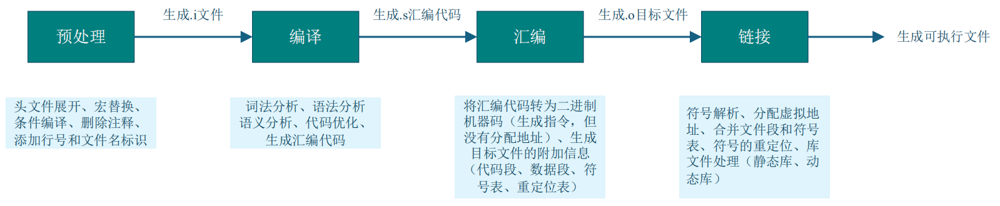
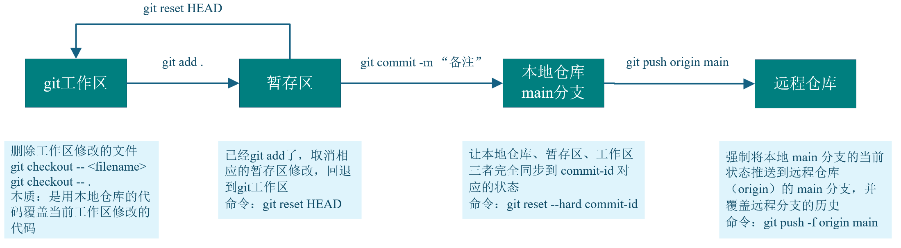

# C++学习

## 1、两种创建对象方式

C++中创建对象主要有两种方式：

- 在栈上创建（不使用new）：对象在声明时创建，作用域结束时自动销毁。

- 在堆上创建（使用new）：通过动态内存分配创建，需要手动delete销毁，或者使用智能指针自动管理。

此外，现代C++还推荐使用智能指针（如std::unique_ptr, std::shared_ptr）来管理堆上的对象，以避免内存泄漏。

```c++
// 1.示例：栈上创建对象
MyClass obj;  // 构造函数自动调用,作用域结束时自动调用析构函数

// 2.示例：堆上创建对象
MyClass* ptr = new MyClass();  // 显式调用 new
// ...使用对象...
delete ptr;  // 必须显式释放

#include <memory>
// 使用 unique_ptr（C++11+）
auto obj = std::make_unique<MyClass>();  // 自动管理内存
// 当 obj 离开作用域时自动释放内存
```

## 2、C++中的struct

在C++中，struct不再是”简单的数据结构“，而是一个完善的、支持面向对象特性的类，与class唯一的区别就是，默认访问权限都为public，而class的变量与方法默认为private

## 3、什么是抽象类

抽象类：至少存在一个“纯虚函数”。**抽象类不能创建对象**,但可以声明指针和引用

普通的虚函数并不能让类变成抽象类，它只负责给多态机制一个动态绑定的入口。

抽象类指针=“遥控器”，派生类对象=“电视机”。遥控器本身不是电视机，但它能指向任何一个具体电视机，并帮你切换频道（调用接口）

```C++
class Animal {     // 抽象类（有纯虚函数）
public:
    virtual void makeSound() const = 0;  // =0 表示纯虚函数  纯虚函数（必须被子类实现）
};

class Dog : public Animal {        // 具体子类1
public:
    void makeSound() const override {  // 实现纯虚函数
        std::cout << "汪汪！" << std::endl;
    }
};

int main() {
    // Animal animal;  // 错误！不能创建抽象类对象
    Dog dog;
    Animal* animal1 = &dog;        // 通过抽象类指针操作具体对象
    animal1->makeSound();  // 输出：汪汪！
    return 0;
}
```

## 4、引用

- 引用的本质就是起别名，例如  张三→三哥   都指向的同一个人    


- 引用：int&，声明时 & 紧贴类型  


- 取地址：&var，&在变量前面


- &&：右值引用。右值引用的主要设计目的就是为了支持移动语义。（我没搞懂这个的作用）

```c++
int main() {
    int original = 42;  // 原始变量（本尊）
    
    // 1. 引用（起别名）：声明时 & 紧贴类型
    int& alias = original;  // alias 是 original 的别名（张三→三哥）
    
    // 2. 取地址：& 在变量前面
    int* pointer = &original;  // 获取 original 的内存地址
    
    cout << "原始值: " << original << endl;  // 42
    cout << "别名值: " << alias << endl;     // 42
    cout << "指针值: " << *pointer << endl;  // 42
    
    // 通过别名修改
    alias = 100;
    cout << "\n修改后原始值: " << original << endl;  // 100
    
    // 通过指针修改
    *pointer = 200;
    cout << "再次修改后原始值: " << original << endl;  // 200
    
    // 验证本质
    cout << "\n原始地址: " << &original << endl;
    cout << "别名地址: " << &alias << endl;   // 与原始地址相同
    cout << "指针地址: " << pointer << endl;  // 与原始地址相同
    
    return 0;
}
```

### 引用和指针的区别

- 引用必须初始化，指针可以不初始化
- 引用一旦初始化就不能再引用其他对象，而指针可以重新指向其他地址
- 引用只有一级引用，没有多级引用；指针可以有一级指针，也可以有多级指针
- 从汇编指令来看，定义引用变量和指针变量，汇编指令是一模一样的；通过引用修改变量的值和通过指针修改变量的值，汇编指令也是一模一样的

## 5、友元函数

在 C++ 中，友元函数是一种特殊的函数，它可以访问类的**私有成员和保护成员**，就像类的成员函数一样，但友元函数本身**不是类的成员函数**。

友元函数主要用于以下场景：

- 当需要在类外部操作类的私有成员，且这种操作逻辑更适合用非成员函数实现时（例如某些运算符重载，如 `+` 用于两个不同类对象或类对象与基本类型的运算）。
- 实现跨类的操作，需要同时访问多个类的私有成员时。

在不破坏类封装性的前提下（仅授权特定函数访问），允许外部函数灵活操作类的私有成员，特别适合运算符重载等场景。

```c++
class Complex {
private:
    double real;   // 实部（私有成员）
    double imag;   // 虚部（私有成员）
public:
    Complex(double r = 0, double i = 0) : real(r), imag(i) {}              // 构造函数：初始化real和imag
    
    friend Complex operator+(const Complex& c1, const Complex& c2);        // 声明友元函数：允许operator+访问私有成员
    
    void display() {                                       // 成员函数：打印复数
        cout << real << " + " << imag << "i" << endl;
    }
};

Complex operator+(const Complex& c1, const Complex& c2) {       // 友元函数定义：实现两个复数相加
    Complex res;  // 临时对象：存储相加结果
    res.real = c1.real + c2.real;  // 直接访问c1、c2的私有成员real
    res.imag = c1.imag + c2.imag;  // 直接访问c1、c2的私有成员imag
    return res;   // 返回结果对象
}

int main() {
    Complex c1(1, 2), c2(3, 4);  // 创建两个复数对象
    Complex c3 = c1 + c2;        // 调用友元函数实现加法
    c3.display();                // 输出结果：4 + 6i
    return 0;
}
```

以下运算符**只能通过类的成员函数**重载，不能通过友元函数重载（因为它们与类的 “成员访问”“状态修改” 强相关）：

- 赋值运算符 `=`；
- 下标运算符 `[]`；
- 函数调用运算符 `()`；
- 指向成员的指针运算符 `->` 等。

## 6、构造函数

- 如果一个类没有定义任何构造函数，编译器会自动生成一个默认构造函数（不做任何初始化）。
- 如果定义了构造函数，那么编译器就不会再自动生成默认构造函数。
- 但是，如果定义的构造函数的所有参数都有默认值，那么它就可以作为默认构造函数使用。

## 7、流操作

strstream类专门用于处理字符串流操作,它允许将字符串当作流来处理,可以方便地进行字符串的读写操作。（C++11 后已被弃用）

fstream用于文件流操作,主要处理文件的输入输出。

iostream是标准的输入输出流类,用于控制台的输入输出操作。

## 8、构造函数的初始化列表

在C++中，基类和成员变量的初始化顺序与初始化列表中的书写顺序无关，而是遵循以下固定规则：

- 首先按照基类的声明顺序初始化基类，在本题中类B的声明为"public A2, public A1"，所以A2先初始化，A1后初始化。

- 然后才是按照成员变量的声明顺序初始化成员变量。

```c++
#include <iostream>
using namespace std;
 
class A1 {
    int a1;
 
public:
    A1(int _a1) : a1(_a1) {}
};
 
class A2 {
    int a2;
 
public:
    A2(int _a2) : a2(_a2) {}
};
 
class B : public A2, public A1 {
    int b;
 
public:
    B(int _a1, int _b, int _a2) : A1(_a1), b(_b), A2(_a2){}
};

 B c(6, 7, 8);     // 执行代码，初始化的顺序为  a2,a1,b
```

## 9、转义字符表示法

- **八进制转义**：`\` + 1-3 个八进制数字（0-7），如 `\112`（对应 'J'）；

- **十六进制转义**：`\x` + 1 个及以上十六进制数字，如 `\x4A`（也对应 'J'）；

- **特殊转义序列**：预定义的固定含义字符，如 `\n`（换行）、`\t`（制表符）等。

合法的转义需要保证最终数值在 `char` 的范围内（通常 0-255）

## 10、free()和malloc()

- free()函数只是内存归还给程序的堆空间，由操作系统统一管理，而不能直接释放物理内存
- malloc()函数实际上是向操作系统申请虚拟内存，而不是直接申请物理内存

## 11、编译和链接



## 12、形参给默认值

形参默认值是 C++ 中简化函数调用的实用特性，核心要点：

- **从右向左指定默认值**，不能跳过前面的参数；

  ```c++
  void func(int a, int b = 2, int c = 3) {}    // 从右向左依次指定默认值
  void func(int a = 1, int b) {}               // 错误：b左侧的a没有默认值，却给b设了默认值
  ```

- **同一个形参只能给一次默认值**；

  ```C++
  void printAdd(int a, int b = 10);  // 函数声明：为b指定默认值
  void printAdd(int a, int b = 20)   // 函数定义：如果再次给b指定默认值，会编译错误
      
  void printAdd(int a, int b = 10);  
  void printAdd(int a = 5, int b)    // 正确，两个变量只给了一次默认值
  ```


## 13、静态联编和动态联编

  ​		在 C++ 中，**联编（Binding）** 指的是将函数调用与具体的函数实现代码关联起来的过程。根据关联发生的时机，分为**静态联编（Static Binding）** 和**动态联编（Dynamic Binding）**，二者的核心区别在于 “确定调用哪个函数” 的时机不同

###   （1）静态联编

  ​		静态联编也称为**早期绑定（Early Binding）**，指的是**在编译阶段就确定函数调用与函数实现的关联**。编译器在编译时就能明确知道应该调用哪个函数，无需运行时的额外判断。使用场景为：

  - **普通函数调用**（非成员函数、非虚成员函数）；
  - **函数重载**（编译器根据参数类型、个数等确定具体调用版本）；
  - **非虚成员函数的调用**（即使通过对象指针 / 引用调用，也在编译时确定）。

### 	（2）动态联编

​		动态联编也称为**晚期绑定（Late Binding）**，指的是**在程序运行阶段才确定函数调用与函数实现的关联**。编译器在编译时无法确定具体调用哪个函数，需要根据运行时的对象实际类型来判断。

​		动态联编是 C++ 多态（Polymorphism）的核心实现机制，仅适用于**虚函数** 的调用，且需满足：

- 通过**基类的指针或引用**调用虚函数；

- 派生类重写（Override）了基类的虚函数

## 14、inline内联函数

- inline内联函数，在编译过程中，**没有函数调用的开销**，直接在函数的调用点将函数体展开
- inline内联函数不再生成相应的函数符号
- inline只是建议编译器把这个函数处理成内联函数，并不是所有的inline都会被处理为内联函数（比如递归函数，递归次数需要在运行的时候确定）
- 类体内实现的方法会被自动处理为内联函数

内联函数的核心适用原则是：**“短小精悍且高频调用”**。它通过牺牲代码体积（适度范围内）换取调用效率，适合那些逻辑简单、被频繁执行的小函数。需要注意的是，`inline`只是对编译器的 “建议”，最终是否内联由编译器决定（复杂函数会被自动忽略）

## 15、const的用法

### （1）C和C++中const的区别

- **C**中的const修饰的变量**可以不初始化**，叫做**常变量**
- **C++**中的const修饰的变量**必须初始化**，叫做**常量**
- C++中，所有出现const常量的地方都被常量初始化替换了（相当于变成了立即数，在编译的时候就已经替换了）

### （2）const修饰的变量和普通变量的区别

- 编译方式不同：const修饰的变量在编译的时候直接替换，也就是变量替换为立即数

- 不能作为左值（初始化完成后，值不能被修改）

### （3）const修饰的变量经常出现的错误

- 常量不能再作为左值（不能直接修改常量的值）

- 不能把常量的地址泄露给普通的指针或普通引用变量（可以间接修改常量的值）

### （4）总结const和指针的类型转换公式

```c++
int*   <===    const int*      错误
const int*   <===    int*      正确
    
int**  <===   const int**      错误
const int**   <===  int**      错误  二级指针必须两边都要加const才正确
 
int**  <===   int*const*       错误
int*const*  <===    int**      可以  蜕化为一级指针
```

**注意：const右边如果没有指针*，考虑数据类型的时候忽略const**

## 16、volatile

volatile是一个类型修饰符，用于告知编译器：

​		被修饰的变量的值可能被程序之外的因素（如硬件、中断、其他线程）意外修改，因此编译器不能对该变量的访问进行优化。必须每次都从内存中读取新值，而不能使用寄存器缓存的值。

## 17、编译器报错：Segmentation fault

有可能有三种错误：

- 访问空指针
- 数组访问越界
- 使用已释放的内存

## 18、全局变量和static修饰的局部变量

全局变量和static修饰的局部变量不进行初始化即可自动获得初始值为0

## 19、左值和右值

左值：有内存地址，有名字，值是可以被修改的

右值：没内存地址，没名字

```C++
int main()
{
	int a = 10;     // a是左值，10是右值
	int &c = 20;    // 左值引用
	int &&c = 20;   // 右值引用
	c = 30;
    int &&d = c;    // 错误，不能用一个右值引用变量来引用一个左值
	return 0；
}
```

## 20、右值引用

- int &&c = 20；专门用来引用右值类型，指令上，可以自动产生临时量，然后直接引用临时量c=30;
- 右值引用变量本身是一个左值，只能用左值引用来引用它
- 不能用一个右值引用变量来引用一个左值

## 21、运算符优先级

| 优先级 | 运算符组         | 具体运算符                                                   | 结合性      | 示例代码                                      |
| ------ | ---------------- | ------------------------------------------------------------ | ----------- | --------------------------------------------- |
| 1      | 基础成员访问     | `()`（函数调用 / 分组）、`[]`（数组访问）、<br />`->`（指针成员）、`.`（对象成员） | 左结合      | `func(3)`、`arr[0]`、`p->x`、`obj.y`          |
| 1      | 后缀增减         | `++`（后缀自增）、`--`（后缀自减）                           | 左结合      | `a++`、`b--`                                  |
| 1      | 类型相关         | `typeid`、`const_cast`/`dynamic_cast`/`reinterpret_cast`/`static_cast` | 左结合      | `typeid(int)`、`static_cast<int>(3.14)`       |
| 2      | 前缀增减与符号   | `++`（前缀自增）、`--`（前缀自减）、`+`（正号）、`-`（负号） | 右结合      | `++a`、`-b`、`+3.14`                          |
| 2      | 逻辑非与位运算   | `!`（逻辑非）、`~`（按位取反）                               | 右结合      | `!flag`、`~0x0F`                              |
| 2      | 指针操作         | `*`（解引用）、`&`（取地址）                                 | 右结合      | `*p`、`&a`                                    |
| 2      | 内存管理         | `new`、`new[]`（动态分配）、`delete`、`delete[]`（动态释放） | 右结合      | `int* p = new int`、`delete p`                |
| 2      | 大小计算         | `sizeof`（类型 / 对象大小）、`sizeof...`（参数包大小）       | 右结合      | `sizeof(int)`、`sizeof(arr)`                  |
| 3      | 成员指针访问     | `->*`（指针访问成员指针）、`.*`（对象访问成员指针）          | 左结合      | `p->*mem_ptr`、`obj.*mem_ptr`                 |
| 4      | 乘法与除法       | `*`（乘法）、`/`（除法）、`%`（取模）                        | 左结合      | `a * b`、`c / d`、`e % 3`                     |
| 5      | 加法与减法       | `+`（加法）、`-`（减法）                                     | 左结合      | `x + y`、`m - n`                              |
| 6      | 移位运算         | `<<`（左移）、`>>`（右移）                                   | 左结合      | `a << 2`（左移 2 位）、`b >> 1`（右移 1 位）  |
| 7      | 关系运算（大小） | `<`（小于）、`>`（大于）、`<=`（小于等于）、`>=`（大于等于） | 左结合      | `a < b`、`x >= y`                             |
| 8      | 关系运算（相等） | `==`（等于）、`!=`（不等于）                                 | 左结合      | `a == 5`、`x != y`                            |
| 9      | 按位与           | `&`（按位与）                                                | 左结合      | `a & 0x01`（取最低位）                        |
| 10     | 按位异或         | `^`（按位异或）                                              | 左结合      | `a ^ b`                                       |
| 11     | 按位或           | `                                                            | `（按位或） | 二进制位逻辑或（对应位有 1 则为 1）           |
| 12     | 逻辑与           | `&&`（逻辑与）                                               | 左结合      | `a > 0 && b < 10`                             |
| 13     | 逻辑或           | `                                                            |             | 左结合                                        |
| 14     | 三目运算符       | `?:`（条件运算符）                                           | 右结合      | `a > b ? a : b`（取较大值）                   |
| 15     | 赋值运算         | `=`、`+=`、`-=`、`*=`、`/=`、`%=`、`<<=`、`>>=`、`&=`、`^=`、` | =`          | 赋值或复合赋值（如`a += b`等价于`a = a + b`） |
| 16     | throw 表达式     | `throw`（抛出异常）                                          | 右结合      | `throw std::runtime_error("error")`           |
| 17     | 逗号运算符       | `,`（逗号）                                                  | 左结合      | `a = 1, b = 2, a + b`（结果为 3）             |

## 22、指针数组和数组指针

### （1）指针数组  `P* a[3]`

- **本质**：一个**数组**，数组名为 `a`，包含 3 个元素。
- **元素类型**：每个元素都是 `P*`（指向类 `P` 的指针）。
- 解析逻辑：`[]` 运算符优先级高于 `*`，因此 `a` 先与 `[3]` 结合，形成数组，再被 `*` 修饰，表示数组元素是指针。

```C++
class P {};
P p1, p2, p3;

// 指针数组：数组a的3个元素都是指向P的指针
P* a[3] = {&p1, &p2, &p3}; 
```

### （2）数组指针  `P(*a)[3]`

- **本质**：一个**指针**，指针名为 `a`。
- **指向的类型**：该指针指向一个**数组**，数组包含 3 个元素，每个元素的类型是 `P`（类 `P` 的对象）。
- 解析逻辑：括号 `()` 改变优先级，`*` 先与 `a` 结合，形成指针，再与 `[3]` 结合，表示指针指向的是一个含 3 个 `P` 元素的数组。

`()`和 [] `优先级相同，因左结合性，先处理左边的`()`，再处理右边的`[]。

```C++
class P {};
P arr[3]; // 一个包含3个P对象的数组

// 数组指针：a是指针，指向包含3个P元素的数组
P(*a)[3] = &arr; 
```

## 23、this指针

​		`this`指针是类的**非静态成员函数**中隐含的一个特殊指针，它**指向当前调用该成员函数的对象**。简单来说，当对象调用成员函数时，`this`指针就代表这个对象本身，用于在成员函数内部访问当前对象的成员（变量或函数）

​		`this`指针是 C++ 实现面向对象的重要机制，它隐式关联了成员函数与调用它的对象，解决了同名变量冲突问题，并支持灵活的对象操作（如链式调用）。

## 24、深拷贝与浅拷贝

深拷贝和浅拷贝的核心区别在于**是否复制 “指针 / 引用指向的底层资源”**，主要发生在：

- **对象的拷贝构造和赋值操作；**   特别要注意类的成员变量里面包含指针，这种情况下拷贝构造和赋值操作会出现浅拷贝的问题，释放指针会出现二次释放的问题
- **函数参数 / 返回值按值传递对象；**
- **指针、动态数组等复合类型的复制。**

当复制的对象 / 变量包含**动态分配的资源**（堆内存、文件句柄等）时，必须使用深拷贝；若仅包含基本类型（`int`、`float`等），浅拷贝足够且安全。

出现浅拷贝问题的时候，一定要自定义拷贝构造函数，赋值重载函数

### （1）针对“包含指针/引用的复合类型变量”

当变量是指针、数组、结构体（含指针成员）等复合类型时，拷贝可能涉及“浅”或“深”的区别：

```C++
int* p = new int(10);
int* q = p;   //浅拷贝：q和p指向同一块内存

int* p1 = new int(10);
int* q1 = new int(*p1);   //深拷贝：q1指向新内存，内容与p1指向的相同
```

### （2）针对 “对象”

当对象包含动态分配的资源（如指针成员指向堆内存）时，拷贝对象的行为会区分深浅；

**浅拷贝：**复制对象的所有成员变量（包括指针的地址），但不复制指针指向的底层资源。此时两个对象的指针成员会指向同一块内存，可能导致二次释放的问题。**类的默认拷贝构造函数就是浅拷贝**：

```c++
class A {
public:
    int* data;
    A(int val) : data(new int(val)) {}
};

A a(10);
A b = a; // 浅拷贝：b.data和a.data指向同一块内存
```

**深拷贝：**不仅复制对象的成员变量，还会为指针成员重新分配内存，并复制底层数据，确保两个对象的资源完全独立，互不影响。

例如：**自定义的深拷贝构造函数**

```c++
class A {
public:
    int* data;
    A(int val) : data(new int(val)) {}
    A(const A& other) : data(new int(*(other.data))) {}    // 深拷贝构造函数
};

A a(10);
A b = a; // 深拷贝：b.data指向新内存，内容与a.data相同
```

## 25、构造函数初始化列表

成员变量的初始化和它们**定义的顺序有关**，和构造函数初始化列表中出现的先后顺序无关！

对于这个题，创建对象t后，调用show()函数，会进行构造函数初始化列表，按照变量的定义顺序，先对ma赋值，因为编译器的原因，会对申请的空间进行初始化为0xcccccccc（-858993460），因此ma=-858993460，mb=10。

```C++
class Test
{
public:
    Test(int data=10):mb(data),ma(mb){}
    void show(){ cout << "ma:" << ma << "mb:" << mb << endl;}
private:
    int ma;
    int mb;
};

int main(){
    Test t;
    t.show();   // ma:-858993460  mb:10
    return 0; 
}
```

## 26、类的几种成员方法

### （1）普通成员方法

- 编译器会添加一个this形参变量
- 属于类的作用域
- 调用该方法时，需要依赖一个对象
- 可以访问对象的私有成员

### （2）static静态成员方法

- 不会生成this形参

- 属于类的作用域

- 用类名作用域来调用方法

- 可以任意访问对象的私有成员，仅限于不依赖对象的成员（只能调用其他的static静态成员）

  注意：静态成员变量一定要在类外进行定义并且初始化。
###     （3）const常成员方法

- 编译器会生成    const 类名 *this   指针
- 调用依赖一个对象，普通对象或者常对象都可以
- 可以任意访问对象的私有成员，但是只能读，不能写
  注意：只要是只读的成员方法，一律实现成const常成员方法

## 27、函数模板

- 函数模板是一个**模板定义**，是生成具体函数的 "蓝图" 或 "模具"，本身不是可执行的函数。模板的意义是：类型也可以初始化了。编译器不编译，因为类型不知道。

  ```C++
  // 函数模板（模板定义）
  template <typename T>
  T add(T a, T b) {
      return a + b;
  }
  ```

- 模板函数

  - 本质：是由函数模板实例化产生的具体函数，是可执行的函数
- 在调用点，编译器根据用户指定的类型，从原模板实例化一份函数代码（需要被编译器编译），每种类型实例化生成独立的函数代码，与普通函数一样可被调用。
  
```c++
  // 由函数模板实例化生成的模板函数（int类型）
int add(int a, int b) {
    return a + b;
} 
```

​	**函数模板**是 "模板"，是抽象的定义，不占用内存；

​	**函数**是 "实例"，是具体的函数，由模板生成，占用内存并可执行。

​	简单说：**函数模板是 "图纸"，模板函数是根据图纸造出的 "实物"**。

- 实例化推演：根据用户传入的实参类型，来推导出模板类型参数的具体类型。

- 模板的特例化：模板特例化是为特定类型提供专门的实现，当使用该类型时，会优先调用特例化版本而不是通用模板。

  ```C++
  template <typename T>          // 通用函数模板：返回两个同类型参数中的较大值
  T max(T a, T b) {
      std::cout << "使用通用模板: ";
      return (a > b) ? a : b;
  }
  
  template <>                   // 模板特例化：针对const char*类型（C风格字符串）
  const char* max<const char*>(const char* a, const char* b) {
      std::cout << "使用const char*特例化模板: ";
      // 比较字符串内容而非指针地址
      return (std::strcmp(a, b) > 0) ? a : b;
  }
  
  int main() {
      int num1 = 10, num2 = 20;  // 1. 使用通用模板（int类型）
      std::cout << "较大的整数：" << max(num1, num2) << std::endl;
      
      double d1 = 3.14, d2 = 2.71;  // 2. 使用通用模板（double类型）
      std::cout << "较大的小数：" << max(d1, d2) << std::endl;
      
      std::string s1 = "apple", s2 = "banana";    // 3. 使用通用模板（std::string类型）
      std::cout << "较大的字符串：" << max(s1, s2) << std::endl;
      
      const char* cstr1 = "hello";   // 4. 使用const char*的特例化版本
      const char* cstr2 = "world";
      std::cout << "较大的C风格字符串：" << max(cstr1, cstr2) << std::endl;
      
      return 0;
  }
  ```

- 模板代码在调用之前，一定要看到模板定义的地方，这样才能够进行正常的实例化，产生能够被编译器编译的代码。所以模板代码都是放在头文件当中的
- 模版函数、模板的特例化、非模板函数的重载三者之间的关系

​			他们三者核心关系体现在**编译器对函数调用的匹配规则**上。

​		（1）概念回顾

​		**模板函数（通用模板）**：带类型参数的函数模板（如`template <typename T> void func(T a)`），是生成具体函数的 “蓝图”，可通过实参推演自动实例化出针对特定类型的函数。

​		**模板的特例化**：针对模板中特定类型（如`int`、`const char*`）的特殊实现（如`template <> void func<int>(int a)`），用于覆盖通用模板在该类型下的默认行为。

​		**非模板函数的重载**：与模板函数同名但无模板参数的普通函数（如`void func(int a)`），是独立的函数实体，不依赖模板。

​		（2）核心关系：调用优先级

​		当程序中同时存在这三类函数时，编译器会按照 **“最具体匹配” 原则 ** 选择调用版本，优先级从高到低为：

​					**非模板函数（普通重载） > 模板的特例化 > 通用模板函数**

为什么是这个顺序？

- 非模板函数是**完全具体**的实现，不需要编译器实例化，因此优先匹配。
- 模板特例化是针对**特定类型**的特殊实现，比通用模板更具体，因此在相同类型下优先于通用模板。
- 通用模板是**最泛化**的实现，仅在没有更具体的匹配（非模板函数或特例化）时才被实例化调用。

```C++
#include <iostream>

// 1. 通用模板函数（最泛化）
template <typename T>
void print(T a) {
    std::cout << "通用模板: " << a << std::endl;
}

// 2. 模板特例化（针对int类型，比通用模板具体）
template <>
void print<int>(int a) {
    std::cout << "int特例化模板: " << a << std::endl;
}

// 3. 非模板函数（普通重载，最具体）
void print(int a) {
    std::cout << "非模板重载: " << a << std::endl;
}

int main() {
    print(10);      // 调用：非模板函数（优先级最高）
    print(3.14);    // 调用：通用模板（无更具体的匹配）
    print('a');     // 调用：通用模板（无更具体的匹配）
    print<int>(20); // 显式指定模板参数，强制调用int特例化
    return 0;
}
```

## 28、类模板

实现一个vector向量容器

```C++
template<typename T>
class vector {
public:
	vector(int size = 10) {
		_first = new T[size];
		_last = _first;
		_end = _first + size;
	}

	~vector() {
		delete[] _first;
		_first = _last = _end = nullptr;
	
	}

	vector(const vector<T>& rhs)       // 拷贝构造函数
	{
		int size = rhs._end - rhs._first;
		_first = new T[size];
		int len = rhs._last - rhs._first;
		for (int i = 0; i < len; ++i)
		{
			_first[i] = rhs._first[i];
		} 
		_last = _first + len;
		_end = _first+ size;
	}

	vector<T>& operator=(const vector<T>& rhs)     //赋值构造函数
	{
		if(this==&rhs)
			return *this;
		delete[] _first;
		int size = rhs._end - rhs._first;
		_first = new T[size];
		int len = rhs._last - rhs._first;
		for (int i = 0; i < len; ++i)
		{
			_first[i] = rhs._first[i];
		}
		_last = _first + len;
		_end = _first + size;

	}

	void push_back(const T& val)
	{
		if (full())
			expand();
		*_last++ = val;
	}

	void pop_back()
	{
		if (empty())
			return;
		--_last;
	}

	T back()const
	{
		return *(_last - 1);
	}
	bool full()const { return _last == _end; }
	bool empty()const { return _last == _first; }
	int size()const { return _last - _first; }

private:
	T* _first;   //指向数组起始位置
	T* _last;    //指向数组最后一个元素的下一个位置
	T* _end;     //指向数组的最后一个位置

	void expand()
	{
		int size = _end - _first;
		T* ptmp = new T[size * 2];
		for (int i = 0; i < size; ++i)
		{
			ptmp[i] = _first[i];
		}
		delete[] _first;
		_first = ptmp;
		_last = _first + size;
		_end = _first + size * 2;
	}
};

int main()
{
	vector<int> vec;
	for (int i = 0; i < 20; ++i)
	{
		vec.push_back(rand() % 100);
	}

	while (!vec.empty())
	{
		cout << vec.back() << " ";
		vec.pop_back();
	}
	cout << endl;

	return 0;
}
```

## 29、空间配置器

### （1）分离 “内存分配” 与 “对象构造 / 析构”

主要做了四件事情：内存开辟、内存释放、对象构造、对象析构

配置器的职责是**纯粹的 “内存块操作”**（比如分配一段能存`n`个`T`类型对象的内存）；而**对象的构造 / 析构由容器或相关组件（如 “类型萃取” 机制）控制**。这种分离让性能更优：

- 对于简单类型（如`int`、`double`等 POD 类型），构造 / 析构无需额外操作，直接操作内存块即可，节省函数调用开销；
- 对于自定义类型，容器会主动调用构造 / 析构函数，保证对象正确初始化和资源释放。

```C++
template<typename T>
class Allocator
{
public:
	T* allocate(size_t size)  // 负责内存开辟
	{
		return (T*)malloc(sizeof(T) * size);
	}

	void deallocate(void* p)  // 负责内存释放
	{
		free(p);
	}

	void construct(T* p, const T& val)  // 负责对象构造（使用定位new）
	{
		new (p) T(val);
	}

	void destroy(T* p)  // 负责对象析构（调用对象的析构函数）
	{
		p->~T();
	}
};
```

## 30、运算符的重载

目的：使对象之间的运算和编译器内置类型一样

编译器做对象运算的时候，会调用对象的运算符重载函数（优先调用成员方法），如果没有成员方法，就在全局作用域找合适的运算符重载函数

++运算符的重载：

- 前置++：operator++()
- 后置++：operator++(int)     后置++  括号里面要带参数

```C++
#include <iostream>
using namespace std;

class Complex {
private:
    double real;  // 实部
    double imag;  // 虚部

public:
    // 构造函数
    Complex(double r = 0, double i = 0) : real(r), imag(i) {}

    // 重载+运算符，实现两个复数相加
    Complex operator+(const Complex& other) const;

    // 重载前缀++运算符
    Complex& operator++();

    // 重载后缀++运算符
    Complex operator++(int);

    // 友元函数，重载<<运算符，用于输出复数
    friend ostream& operator<<(ostream& out, const Complex& c);
};

// 实现+运算符重载
Complex Complex::operator+(const Complex& other) const {
    // 复数相加：实部加实部，虚部加虚部
    return Complex(real + other.real, imag + other.imag);
}

// 实现前缀++运算符重载
Complex& Complex::operator++() {
    // 前缀自加：先加后用，这里选择对实部进行加1操作
    real++;
    return *this;
}

// 实现后缀++运算符重载
Complex Complex::operator++(int) {
    // 后缀自加：先用后加，通过参数int区分
    Complex temp = *this;  // 保存当前值
    real++;                // 实部加1
    return temp;           // 返回未加之前的值
}

// 实现<<运算符重载，方便输出复数
ostream& operator<<(ostream& out, const Complex& c) {
    out << c.real;
    if (c.imag >= 0) {
        out << "+";  // 虚部为正时显示加号
    }
    out << c.imag << "i";
    return out;
}

int main() {
    Complex c1(2.5, 3.7);
    Complex c2(1.6, -2.8);

    cout << "初始值：" << endl;
    cout << "c1 = " << c1 << endl;
    cout << "c2 = " << c2 << endl;

    // 测试加法运算
    Complex c3 = c1 + c2;
    cout << "\nc1 + c2 = " << c3 << endl;

    // 测试前缀自加
    ++c1;
    cout << "++c1 = " << c1 << endl;

    // 测试后缀自加
    Complex c4 = c2++;
    cout << "c2++ 运算后，返回值 = " << c4 << endl;
    cout << "c2++ 运算后，c2 = " << c2 << endl;

    return 0;
}
```

## 31、迭代器

​		可以把迭代器理解为 **“带逻辑的指针”**—— 不仅存储元素的地址，还关联着容器的结构规则。当容器的 “底层支撑”（内存、节点关系等）被改变时，迭代器的 “指向逻辑” 就会被破坏，从而失效。

功能：提供一种统一的方式，**来透明的遍历容器**

迭代器失效的3种情况：

- 当容器调用erase方法后，从当前位置到容器末尾元素的所有迭代器全部失效了
- 当容器调用insert方法后，从当前位置到容器末尾元素的所有迭代器全部失效了
- 对于insert方法来说，如果引起容器内存扩容，那么原来容器的所有迭代器就全部失效了

怎样解决失效的问题：

​	对插入/删除点的迭代器进行更新操作

```C++
#include <iostream>
#include <vector>
using namespace std;

int main() {
    vector<int> v = {1, 2, 3, 4, 5};
    auto it = v.begin();    // 情况1：erase导致迭代器失效及解决
    // 正确做法：用erase的返回值更新迭代器（返回下一个有效迭代器）
    while (it != v.end()) {
        if (*it % 2 == 0) { // 删除偶数
            it = v.erase(it); // 关键：更新迭代器
        } else {
            ++it; // 非删除情况正常递增
        }
    }
    // 输出结果：1 3 5（偶数已被正确删除）
    for (int num : v) cout << num << " ";
    cout << endl << endl;

    // 重置vector用于测试
    v = {1, 2, 3, 4, 5};

    // 情况2：insert（未扩容）导致迭代器失效及解决
    it = v.begin() + 2; // 指向元素3
    // 错误做法：插入后原迭代器（及后面）失效，需用返回值更新
    it = v.insert(it, 10); // 正确做法：插入10到3的位置，返回指向10的迭代器
    cout << "插入位置元素：" << *it << "，下一个元素：" << *(++it) << endl;
    // 输出结果：1 2 10 3 4 5（插入成功）
    for (int num : v) cout << num << " ";
    cout << endl << endl;


    // 重置vector并预留空间（避免扩容），再测试扩容场景
    v = {1, 2, 3};
    v.reserve(5); // 预留5个元素空间（此时容量足够，插入不会扩容）
    cout << "=== 测试insert（扩容）导致的迭代器失效 ===" << endl;
    it = v.begin() + 1; // 指向元素2
    cout << "扩容前容量：" << v.capacity() << endl;

    // 插入大量元素导致扩容（超过预留容量）
    for (int i = 0; i < 5; ++i) {
        v.insert(it, 100 + i);
    }
    cout << "扩容后容量：" << v.capacity() << endl;

    // 错误：扩容后原迭代器it已失效，直接使用会崩溃
    // cout << *it << endl; // 这行代码会导致未定义行为

    // 正确做法：重新获取迭代器（通过位置偏移）
    it = v.begin() + 1; // 重新定位到逻辑上的目标位置
    cout << "扩容后重新获取的迭代器指向：" << *it << endl;
    // 输出当前vector内容
    for (int num : v) cout << num << " ";
    cout << endl;

    return 0;
}

```

32、


# 面试问题

## 1、为什么子类对象的地址可以被父类指针接受？

这是C++中多态的核心机制之一，向上转型，本质是父类指针/引用可以安全地指向子类对象，因为子类包含了父类的所有成员。

比如：“狗”是“动物”的子类，那么狗的对象自然也可以被视为动物。

## 2、new和malloc有什么区别？

- malloc和free是库函数，new和delete是运算符
- malloc只开辟内存，而new不仅可以开辟内存，同时还可以做初始化的操作
- malloc开辟内存失败是通过返回值和nullptr做比较；而new开辟内存失败是通过抛出bad_alloc类型的异常来判断
**注意：**C++代码里面尽量不用malloc和free


# git工作流程

## （1）一些git命令

- git clone ssh地址，将远程仓库代码拉取到本地

- git add . ，把git工作区的代码改动添加到暂存区

- git commit -m "备注"，把暂存区的代码提交到本地分支

- git push origin main，将本地仓库代码更新到远程origin/main仓库

- git pull，把远程代码拉取到本地

- git status，查看当前操作的状态信息

- git log，查看代码修改日志

- git checkout -- <file> 在git add之前，把工作区的代码用版本库中的代码覆盖掉，注意命令中的--不能去掉，否则成切换分支的命令了

- git reset HEAD 把git add之后，暂存区的内容全部撤销

- git reset --hard commit-id  把提交到本地仓库中的代码改动进行回退

- git reflog 查看HEAD指针的改动日志

- git push -f origin main 强制推送本地仓库代码到远程仓库

- git diff HEAD -- <file> 查看工作区file文件和仓库中该文件最新版本的 代码有什么区别



## （2）名词介绍

- 工作区：当前存放项目代码的目录
- 暂存区：git add把工作区修改的内容添加到暂存区当中
- 本地仓库：git commit 把本地暂存区的修改提交到本地代码仓库分支中（不同分支代表不同的代码版本）
- 远程仓库：通过git push 把本地仓科的某一分支上的代码推送到远程仓库的某个分支上
- HEAD指针：本地仓库每一个分支上的代码修改都会生成一个commit id 信息，HEAD指针指向最近一次的commit提交，通过这个commit id 可以进行版本回退
