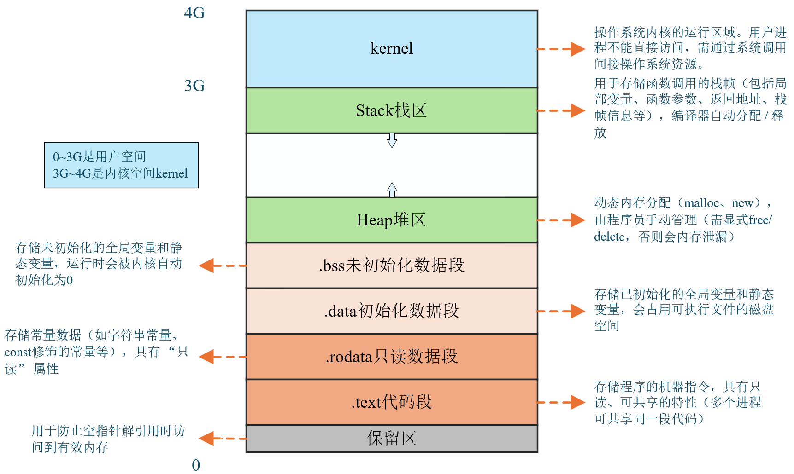
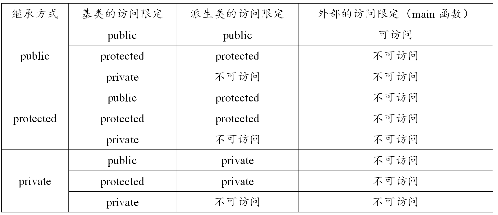
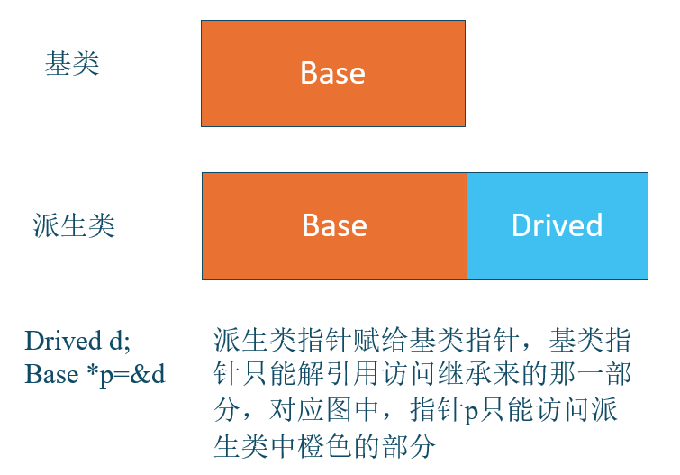
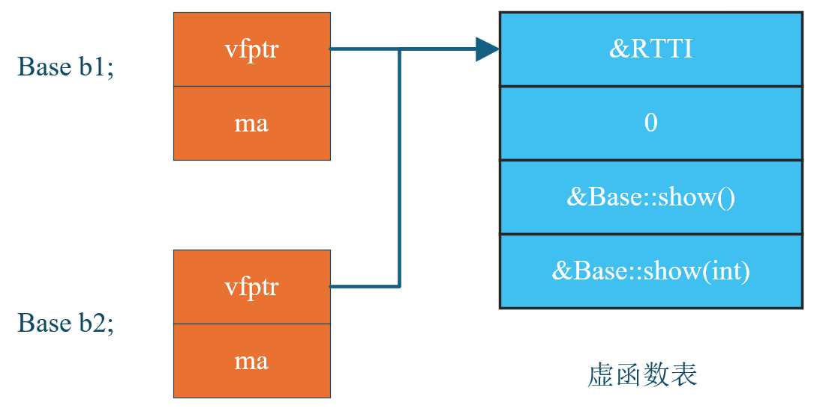
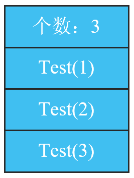

# 1. 基础知识

## 1.1 流操作

strstream类专门用于处理字符串流操作,它允许将字符串当作流来处理,可以方便地进行字符串的读写操作。（C++11 后已被弃用）

fstream用于文件流操作,主要处理文件的输入输出。

iostream是标准的输入输出流类,用于控制台的输入输出操作。

## 1.2 转义字符表示法

- **八进制转义**：`\` + 1-3 个八进制数字（0-7），如 `\112`（对应 'J'）；

- **十六进制转义**：`\x` + 1 个及以上十六进制数字，如 `\x4A`（也对应 'J'）；

- **特殊转义序列**：预定义的固定含义字符，如 `\n`（换行）、`\t`（制表符）等。

合法的转义需要保证最终数值在 `char` 的范围内（通常 0-255）

## 1.3 free()和malloc()

- free()函数只是内存归还给程序的堆空间，由操作系统统一管理，而不能直接释放物理内存
- malloc()函数实际上是向操作系统申请虚拟内存，而不是直接申请物理内存

## 1.4 编译和链接


## 1.5 编译器报错：Segmentation fault

有可能有三种错误：

- 访问空指针
- 数组访问越界
- 使用已释放的内存

## 1.6 左值和右值

- 左值：有内存地址，有名字，值是可以被修改的


- 右值：没内存地址，没名字

```C++
int main()
{
	int a = 10;     // a是左值，10是右值
	int &c = 20;    // 左值引用
	int &&c = 20;   // 右值引用
	c = 30;
    int &&d = c;    // 错误，不能用一个右值引用变量来引用一个左值
	return 0；
}
```

## 1.7 运算符优先级

| 优先级 | 运算符组         | 具体运算符                                                   | 结合性                              | 示例代码                                     |
| ------ | ---------------- | ------------------------------------------------------------ | ----------------------------------- | -------------------------------------------- |
| 1      | 基础成员访问     | `()`（函数调用 / 分组）、`[]`（数组访问）、<br />`->`（指针成员）、`.`（对象成员） | 左结合                              | `func(3)`、`arr[0]`、`p->x`、`obj.y`         |
| 1      | 后缀增减         | `++`（后缀自增）、`--`（后缀自减）                           | 左结合                              | `a++`、`b--`                                 |
| 1      | 类型相关         | `typeid`、`const_cast`/`dynamic_cast`/`reinterpret_cast`/`static_cast` | 左结合                              | `typeid(int)`、`static_cast<int>(3.14)`      |
| 2      | 前缀增减与符号   | `++`（前缀自增）、`--`（前缀自减）、`+`（正号）、`-`（负号） | 右结合                              | `++a`、`-b`、`+3.14`                         |
| 2      | 逻辑非与位运算   | `!`（逻辑非）、`~`（按位取反）                               | 右结合                              | `!flag`、`~0x0F`                             |
| 2      | 指针操作         | `*`（解引用）、`&`（取地址）                                 | 右结合                              | `*p`、`&a`                                   |
| 2      | 内存管理         | `new`、`new[]`（动态分配）、`delete`、`delete[]`（动态释放） | 右结合                              | `int* p = new int`、`delete p`               |
| 2      | 大小计算         | `sizeof`（类型 / 对象大小）、`sizeof...`（参数包大小）       | 右结合                              | `sizeof(int)`、`sizeof(arr)`                 |
| 3      | 成员指针访问     | `->*`（指针访问成员指针）、`.*`（对象访问成员指针）          | 左结合                              | `p->*mem_ptr`、`obj.*mem_ptr`                |
| 4      | 乘法与除法       | `*`（乘法）、`/`（除法）、`%`（取模）                        | 左结合                              | `a * b`、`c / d`、`e % 3`                    |
| 5      | 加法与减法       | `+`（加法）、`-`（减法）                                     | 左结合                              | `x + y`、`m - n`                             |
| 6      | 移位运算         | `<<`（左移）、`>>`（右移）                                   | 左结合                              | `a << 2`（左移 2 位）、`b >> 1`（右移 1 位） |
| 7      | 关系运算（大小） | `<`（小于）、`>`（大于）、`<=`（小于等于）、`>=`（大于等于） | 左结合                              | `a < b`、`x >= y`                            |
| 8      | 关系运算（相等） | `==`（等于）、`!=`（不等于）                                 | 左结合                              | `a == 5`、`x != y`                           |
| 9      | 按位与           | `&`（按位与）                                                | 左结合                              | `a & 0x01`（取最低位）                       |
| 10     | 按位异或         | `^`（按位异或）                                              | 左结合                              | `a ^ b`                                      |
| 11     | 按位或           | `                                                            | `（按位或） | 二进制位逻辑或（对应位有 1 则为 1） |                                              |
| 12     | 逻辑与           | `&&`（逻辑与）                                               | 左结合                              | `a > 0 && b < 10`                            |
| 13     | 逻辑或           | `                                                            |                                     | 左结合                                       |
| 14     | 三目运算符       | `?:`（条件运算符）                                           | 右结合                              | `a > b ? a : b`（取较大值）                  |
| 15     | 赋值运算         | `=`、`+=`、`-=`、`*=`、`/=`、`%=`、`<<=`、`>>=`、`&=`、`^=`、` | =` | 赋值或复合赋值                      | （如`a += b`等价于`a = a + b`）              |
| 16     | throw 表达式     | `throw`（抛出异常）                                          | 右结合                              | `throw std::runtime_error("error")`          |
| 17     | 逗号运算符       | `,`（逗号）                                                  | 左结合                              | `a = 1, b = 2, a + b`（结果为 3）            |

## 1.8 或、与、非、异或（逻辑 / 位运算）总结表

| 运算类型     | 运算符 | 运算名称 | 核心用法                                                     | 操作数要求                                                   | 关键特性                                       |
| ------------ | ------ | -------- | ------------------------------------------------------------ | ------------------------------------------------------------ | ---------------------------------------------- |
| **逻辑运算** | &&     | 逻辑与   | 判断两个条件是否**同时成立**，常用于多条件同时满足的判断（如 `if (cond1 && cond2)`） | 操作数需能隐式转换为 `bool` 类型（如 int、bool、指针等）     | 有短路特性（左操作数为假时，右操作数不执行）   |
| **逻辑运算** | \|\|   | 逻辑或   | 判断两个条件是否**至少一个成立**，常用于多条件满足其一的判断（如 `if (cond1cond2)`） | 同逻辑与，操作数需能隐式转换为 `bool` 类型                   | 有短路特性（左操作数为真时，右操作数不执行）   |
| **逻辑运算** | !      | 逻辑非   | 对单个条件的真假性**取反**，常用于否定条件（如 `if (!cond)`） | 同逻辑与，操作数需能隐式转换为 `bool` 类型                   | 单目运算，优先级高于算术运算符，需注意括号搭配 |
| **位运算**   | &      | 位与     | 对两个整数的**每一位逐位运算**，用于保留指定位（如保留特定位、判断奇偶性） | 操作数必须是整数类型（char、short、int、long 等，不可为 bool 或浮点数） | 无短路特性                                     |
| **位运算**   | \|     | 位或     | 对两个整数的**每一位逐位运算**，用于设置指定位（如将某位置为 1） | 同一位与，操作数必须是整数类型                               | 无短路特性，左右操作数均会执行                 |
| **位运算**   | `^`    | 位异或   | 用于翻转指定位、交换两个整数（无需临时变量）    “**同 0 异 1**”。 | 同一位与，操作数必须是整数类型                               | 无短路特性                                     |
| **位运算**   | `~`    | 位非     | 对单个整数的**每一位逐位取反**（0→1，1→0），用于按位翻转数值 | 同一位与，操作数必须是整数类型                               | 单目运算，取反范围包含符号位（依赖补码规则）   |

## 1.9 显式类型转换

| 转换运算符         | 核心作用                                     | 适用场景                                                     | 特点 / 限制                                                  |
| ------------------ | -------------------------------------------- | ------------------------------------------------------------ | ------------------------------------------------------------ |
| `static_cast`      | 编译时完成类型转换，不进行运行时类型检查     | 1. 基本数据类型间转换（如 `double`→`int`）2. 类层次中基类与派生类的指针 / 引用转换（向上转换安全，向下转换有风险）3. 空指针与目标类型空指针的转换、任意类型与 `void` 类型的转换 | 1. 无法移除指针 / 引用的 `const`/`volatile` 属性2. 依赖开发者保证转换安全性，编译不检查实际类型匹配 |
| `dynamic_cast`     | 运行时进行类型转换，支持安全的向下转换       | 1. 多态类（含虚函数）的指针 / 引用转换，尤其是基类→派生类的 “向下转换”2. 类层次中的交叉转换 | 1. 要求基类必须包含至少一个虚函数（支持运行时类型识别 RTTI）2. 转换失败时：指针返回 `nullptr`，引用抛出 `std::bad_cast` 异常 |
| `const_cast`       | 移除指针或引用的 `const`/`volatile` 属性     | 1. 通过指针 / 引用间接修改 “被 `const` 修饰的对象”（需确保原对象本身非 `const` 定义，否则行为未定义） | 1. 仅能操作指针或引用，不能直接修改 `const` 修饰的内置变量2. 不改变对象本身的 `const` 性，仅改变指针 / 引用对其的访问权限 |
| `reinterpret_cast` | 重新解释数据的二进制表示，仅改变类型解读方式 | 1. 不同类型指针 / 引用之间的转换（如 `int*`→`char*`）2. 指针与整数类型（如 `uintptr_t`）之间的转换3. 函数指针之间的转换 | 1. 不进行任何类型检查，几乎允许所有类型转换2. 不改变底层比特位，仅修改类型标签3. 结果依赖平台（如指针大小、字节序），可移植性差4. 风险极高，易导致未定义行为（如访问非法内存） |

## 1.10 数组名和数组

**多数情况下数组名会隐式转换为 “指向第一个元素的指针”，但在少数特殊场景中会保留 “整个数组” 的语义**。以下是具体总结：

### （1）数组名表示 “指向第一个元素的指针”（默认转换）

- **参与指针运算（如 `+`、`-`）**

```C++
int arr[5] = {1,2,3,4,5}; 
arr + 1：         //arr 转换为 int* 类型（指向 arr[0]），+1 后指向 arr[1]（步长为 sizeof(int)）
*(arr + 2);       //等价于 arr[2]，结果为 3。
```

- **作为函数参数传递**

​		C 语言中，数组作为参数传递时，会被自动转换为指向首元素的指针（“数组退化”）。

```C++
void func(int arr[]) {  // 等价于 void func(int* arr)
    // 此处 arr 是 int* 类型，而非数组
}
int main() {
    int arr[5] = {1,2,3,4,5};
    func(arr);  // arr 转换为指向 arr[0] 的 int*
}
```

- **赋值给同类型指针**

```C++
int arr[5];
int* p = arr;  // 正确：arr 转换为 int*，指向 arr[0]
```

- **作为解引用运算符 `*` 的操作数**

例：`*arr` 等价于 `arr[0]`（`arr` 转换为指向 `arr[0]` 的指针，解引用后得到首元素）。

### （2）数组名表示 “整个数组的地址”

- **作为 `sizeof` 运算符的操作数**

​		`sizeof(数组名)` 计算的是**整个数组的总字节数**（而非指针的大小），此时数组名表示整个数组。

```C++
int arr[5];
printf("%zu", sizeof(arr));  // 结果为 5 * sizeof(int)（通常是 20 字节）
printf("%zu", sizeof(arr + 0));  // arr+0 触发转换，结果为 sizeof(int*)（通常是 8 字节）
```

- **作为 `&`（取地址运算符）的操作数**

​		`&数组名` 得到的是 “整个数组的地址”，类型为 “指向数组的指针”（而非指向首元素的指针）。

```C++
int arr[5] = {1,2,3,4,5};
int (*p)[5] = &arr;  // 正确：&arr 类型是 int (*)[5]（指向“5个int的数组”的指针）
```

**注意：**`&arr`和`arr`的数值地址相同（都指向数组起始位置），但类型不同：

​			`arr` 是 `int*` 类型，`+1` 移动 `sizeof(int)` 字节（指向 `arr[1]`）；

​			`&arr` 是 `int (*)[5]` 类型，`+1` 移动 `5*sizeof(int)` 字节（指向数组末尾的下一个位置）。

- **作为字符串字面量初始化另一个数组**

当用字符串字面量（本质是字符数组）初始化另一个字符数组时，字符串字面量保留数组语义，用于完整初始化目标数组。

```C++
char str[] = "hello";  // "hello" 是字符数组（含 '\0'），此处表示整个数组，用于初始化 str
```

| 场景                       | 数组名的含义               | 类型示例（以 `int arr[5]` 为例）     |
| -------------------------- | -------------------------- | ------------------------------------ |
| 多数表达式（运算、传参等） | 指向首元素的指针           | `int*`（指向 `arr[0]`）              |
| `sizeof(数组名)`           | 整个数组（计算总大小）     | 数组类型 `int[5]`                    |
| `&数组名`                  | 整个数组的地址             | `int (*)[5]`（指向整个数组）         |
| 字符串字面量初始化数组     | 整个字符串数组（完整赋值） | 字符数组类型 `char[6]`（如 "hello"） |

```C++
int arr[5]={1,2,3,4,5};

&arr;  				//类型为 int (*)[5]，表示整个数组的地址
*&arr;  			//表示数组首元素arr[0]的地址
**&arr;  			//*&arr（已转换为 int*）再解引用，得到 arr[0] 的值,1
&arr+1;  			//表示从arr[5]开始的下一个数组地址
arr;   				//表示数组首元素arr[0]的地址
*arr;  				//表示数组首元素arr[0]的值
arr+1;  			//指向 arr[1]（值为 2 的地址）
&arr[0];  			//指向 arr[0]（值为 1 的地址）
*(arr + 1);   		//等价于arr[1]，2
&arr[0] + 1; 		// 指向 arr[1] 的地址
sizeof(arr); 		//整个数组的总字节数（通常 20 字节）
sizeof(&arr);  		//通常 4 字节（32 位系统）
sizeof(arr + 0);    //通常 4 字节（32 位系统）
```

## 1.11 程序的内存布局

**32 位系统** 下的进程虚拟地址空间布局



## 1.12 数值类型取值范围

| 类型类别                              | 具体类型                      | 字节数                 | 取值范围                                                 |
| ------------------------------------- | ----------------------------- | ---------------------- | -------------------------------------------------------- |
| **固定宽度无符号整数**（`<cstdint>`） | `uint8_t`                     | 1                      | `0` ~ `2⁸ - 1`（即 `0` ~ `255`）                         |
|                                       | `uint16_t`                    | 2                      | `0` ~ `2¹⁶ - 1`（即 `0` ~ `65535`）                      |
|                                       | `uint32_t`                    | 4                      | `0` ~ `2³² - 1`（即 `0` ~ `4,294,967,295`）              |
|                                       | `uint64_t`                    | 8                      | `0` ~ `2⁶⁴ - 1`                                          |
| **固定宽度有符号整数**（`<cstdint>`） | `int8_t`                      | 1                      | `-2⁷` ~ `2⁷ - 1`（即 `-128` ~ `127`）                    |
|                                       | `int16_t`                     | 2                      | `-2¹⁵` ~ `2¹⁵ - 1`（即 `-32,768` ~ `32,767`）            |
|                                       | `int32_t`                     | 4                      | `-2³¹` ~ `2³¹ - 1`                                       |
|                                       | `int64_t`                     | 8                      | `-2⁶³` ~ `2⁶³ - 1`                                       |
| **基础无符号整数**                    | `unsigned char`               | 1                      | `0` ~ `255`（与 `uint8_t` 等价）                         |
|                                       | `unsigned short`              | 2                      | `0` ~ `65535`（与 `uint16_t` 等价）                      |
|                                       | `unsigned int`                | 4                      | `0` ~ `4,294,967,295`（多数环境与 `uint32_t` 等价）      |
|                                       | `unsigned long`               | 4（32 位）/ 8（64 位） |                                                          |
|                                       | `unsigned long long`          | 8                      | `0` ~ `18,446,744,073,709,551,615`（与 `uint64_t` 等价） |
| **基础有符号整数**                    | `signed char`                 | 1                      | `-128` ~ `127`（与 `int8_t` 等价）                       |
|                                       | `short` / `short int`         | 2                      | `-32,768` ~ `32,767`（与 `int16_t` 等价）                |
|                                       | `int`                         | 4                      | `-2³¹` ~ `2³¹ - 1`                                       |
|                                       | `long` / `long int`           | 4（32 位）/ 8（64 位） |                                                          |
|                                       | `long long` / `long long int` | 8                      |                                                          |
| **浮点类型**                          | `float`                       | 4                      | 约 `3.4×10⁻³⁸` ~ `3.4×10³⁸`（有效数字约 7 位）           |
|                                       | `double`                      | 8                      | 约 `1.7×10⁻³⁰⁸` ~ `1.7×10³⁰⁸`（有效数字约 15~17 位）     |
|                                       | `long double`                 | 8（或 16，依平台）     | 通常与 `double` 精度一致；                               |

## 1.13 strcpy用法

**（1）函数原型**

```c
char* strcpy(char* dest, const char* src);
```

- 参数
  - `dest`：目标缓冲区（char 类型指针），用于存储复制后的字符串。
  - `src`：源字符串（const char 类型指针），需以空字符 `'\0'` 结尾（C 风格字符串的标志）。
- **返回值**：返回目标缓冲区 `dest` 的指针（通常很少使用该返回值）。

**（2）工作原理**

`strcpy` 会从 `src` 的第一个字符开始，逐个复制到 `dest` 中，**直到遇到 `src` 中的 `'\0'`**（包括 `'\0'` 也会被复制到 `dest` 中）。

例如，若 `src` 是 `"abc"`（实际存储为 `'a','b','c','\0'`），则 `strcpy` 会将这 4 个字符完整复制到 `dest`。


# 2. C++基础部分

## 2.1 C++中的struct

​		在C++中，struct不再是”简单的数据结构“，而是一个完善的、支持面向对象特性的类，与class唯一的区别就是，默认访问权限都为public，而class的变量与方法默认为private

​		在 C++ 中，结构体（或类）的成员若为**自身的对象类型**，会因 “无限递归、大小无法确定” 而不允许；但如果是**自身的指针类型**或**引用类型**，则是允许的（指针大小固定，引用无无限递归问题）。此外，**相互引用**时，可通过 “前向声明”+“指针 / 引用” 的方式实现。

```C++
struct A{A a;};   // 不允许的
struct A{A* a;};  // 可以
struct A{A& a;};  // 可以
struct B; struct A{B& b;}; struct B{A& a;};  //可以相互引用
```


## 2.2 引用

- 引用的本质就是起别名，例如  张三→三哥   都指向的同一个人    


- 引用：int&，声明时 & 紧贴类型  


- 取地址：&var，&在变量前面


- &&：右值引用。右值引用的主要设计目的就是为了支持移动语义。（我没搞懂这个的作用）

  - int &&c = 20；专门用来引用右值类型，指令上，可以自动产生临时量，然后直接引用临时量c=20;
  - 右值引用变量本身是一个左值，只能用左值引用来引用它
  - 不能用一个右值引用变量来引用一个左值
  
  ```C++
  int main() {
      int original = 42;  // 原始变量（本尊）
      
      // 1. 引用（起别名）：声明时 & 紧贴类型
      int& alias = original;  // alias 是 original 的别名（张三→三哥）
      
      // 2. 取地址：& 在变量前面
      int* pointer = &original;  // 获取 original 的内存地址
      
      cout << "原始值: " << original << endl;  // 42
      cout << "别名值: " << alias << endl;     // 42
      cout << "指针值: " << *pointer << endl;  // 42
      
      // 通过别名修改
      alias = 100;
      cout << "\n修改后原始值: " << original << endl;  // 100
      
      // 通过指针修改
      *pointer = 200;
      cout << "再次修改后原始值: " << original << endl;  // 200
      
      // 验证本质
      cout << "\n原始地址: " << &original << endl;
      cout << "别名地址: " << &alias << endl;   // 与原始地址相同
      cout << "指针地址: " << pointer << endl;  // 与原始地址相同
      
      return 0;
  }
  ```

### 2.2.1 引用和指针的区别

- 引用必须初始化，指针可以不初始化

- 引用一旦初始化就不能再引用其他对象，而指针可以重新指向其他地址

- 引用只有一级引用，没有多级引用；指针可以有一级指针，也可以有多级指针

- 从汇编指令来看，定义引用变量和指针变量，汇编指令是一模一样的；通过引用修改变量的值和通过指针修改变量的值，汇编指令也是一模一样的

### 2.2.2 父类和子类的引用

```C++
#include <iostream>
using namespace std;
class shape 
{public:  
        virtual int area()=0;
};  

class rectangle:public shape 
{public: 
        int a, b;  
        void setLength (int x, int y) {a=x;b=y;} 
        int area() {return a*b;} 
};

rectangle r; 

shape *s1=&r;   // 父类指针指向子类对象
shape &s2=r;    // 父类引用绑定到子类对象上
```

| 特性               | `shape *s1 = &r;`（基类指针）                         | `shape &s2 = r;`（基类引用）                          |
| ------------------ | ----------------------------------------------------- | ----------------------------------------------------- |
| **本质**           | 定义一个指针变量 `s1`，存储派生类对象 `r` 的地址      | 定义一个引用 `s2`，作为派生类对象 `r` 的 “别名”       |
| **是否创建新对象** | 指针 `s1` 是独立变量（占内存，如 4/8 字节），存储地址 | 引用 `s2` 不创建新对象，仅绑定到 `r`，无额外内存开销  |
| **初始化要求**     | 可先定义再赋值（如 `shape *s1; s1 = &r;`）            | 必须在定义时初始化（`shape &s2; s2 = r;` 是错误的）   |
| **是否可改变指向** | 可重新指向其他对象（如 `s1 = &another_rect;`）        | 一旦绑定，无法再绑定到其他对象（引用的指向是 “常量”） |
| **是否可为空**     | 可赋值为 `nullptr`（如 `s1 = nullptr;`）              | 不存在 “空引用”，必须绑定到有效对象                   |
| **访问成员方式**   | 使用 `->` 访问成员（如 `s1->area();`）                | 使用 `.` 访问成员（如 `s2.area();`）                  |

**总结：**

- 两者的**核心功能相似**（都能通过基类类型操作派生类对象，实现多态），但**本质和使用规则完全不同**。
- 指针更灵活（可重指向、可为空），但需手动管理地址；引用更安全（无空引用、不可变），但初始化后无法修改绑定。

## 2.3 友元函数

在 C++ 中，友元函数是一种特殊的函数，它可以访问类的**私有成员和保护成员**，就像类的成员函数一样，但友元函数本身**不是类的成员函数**。

友元函数主要用于以下场景：

- 当需要在类外部操作类的私有成员，且这种操作逻辑更适合用非成员函数实现时（例如某些运算符重载，如 `+` 用于两个不同类对象或类对象与基本类型的运算）。
- 实现跨类的操作，需要同时访问多个类的私有成员时。

在不破坏类封装性的前提下（仅授权特定函数访问），允许外部函数灵活操作类的私有成员，特别适合运算符重载等场景。

```C++
class Complex {
private:
    double real;   // 实部（私有成员）
    double imag;   // 虚部（私有成员）
public:
    Complex(double r = 0, double i = 0) : real(r), imag(i) {}              // 构造函数：初始化real和imag
    
    friend Complex operator+(const Complex& c1, const Complex& c2);        // 声明友元函数：允许operator+访问私有成员
    
    void display() {                                       // 成员函数：打印复数
        cout << real << " + " << imag << "i" << endl;
    }
};

Complex operator+(const Complex& c1, const Complex& c2) {       // 友元函数定义：实现两个复数相加
    Complex res;  // 临时对象：存储相加结果
    res.real = c1.real + c2.real;  // 直接访问c1、c2的私有成员real
    res.imag = c1.imag + c2.imag;  // 直接访问c1、c2的私有成员imag
    return res;   // 返回结果对象
}

int main() {
    Complex c1(1, 2), c2(3, 4);  // 创建两个复数对象
    Complex c3 = c1 + c2;        // 调用友元函数实现加法
    c3.display();                // 输出结果：4 + 6i
    return 0;
}
```

以下运算符**只能通过类的成员函数**重载，不能通过友元函数重载（因为它们与类的 “成员访问”“状态修改” 强相关）：

- 赋值运算符 `=`；
- 下标运算符 `[]`；
- 函数调用运算符 `()`；
- 指向成员的指针运算符 `->` 等。

## 2.4 形参默认值

形参默认值是 C++ 中简化函数调用的实用特性，核心要点：

- **从右向左指定默认值**，不能跳过前面的参数；

  ```C++
  void func(int a, int b = 2, int c = 3) {}    // 从右向左依次指定默认值
  void func(int a = 1, int b) {}               // 错误：b左侧的a没有默认值，却给b设了默认值
  ```

- **同一个形参只能给一次默认值**；

  ```C++
  void printAdd(int a, int b = 10);  // 函数声明：为b指定默认值
  void printAdd(int a, int b = 20)   // 函数定义：如果再次给b指定默认值，会编译错误
      
  void printAdd(int a, int b = 10);  
  void printAdd(int a = 5, int b)    // 正确，两个变量只给了一次默认值
  ```

## 2.5 inline内联函数

- inline内联函数，在**编译过程**中，**没有函数调用的开销**，直接在函数的调用点将函数体展开
- inline内联函数不再生成相应的函数符号
- inline只是建议编译器把这个函数处理成内联函数，并不是所有的inline都会被处理为内联函数（比如递归函数，递归次数需要在运行的时候确定）
- 类体内实现的方法会被自动处理为内联函数

内联函数的核心适用原则是：**“短小精悍且高频调用”**。它通过牺牲代码体积（适度范围内）换取调用效率，适合那些逻辑简单、被频繁执行的小函数。需要注意的是，`inline`只是对编译器的 “建议”，最终是否内联由编译器决定（复杂函数会被自动忽略）

## 2.6 const的用法

### 2.6.1 C和C++中const的区别

- **C**中的const修饰的变量**可以不初始化**，叫做**常变量**
- **C++**中的const修饰的变量**必须初始化**，叫做**常量**
- C++中，所有出现const常量的地方都被常量初始化替换了（相当于变成了立即数，在编译的时候就已经替换了）

### 2.6.2 const修饰的变量和普通变量的区别

- 编译方式不同：const修饰的变量在编译的时候直接替换，也就是变量替换为立即数

- 不能作为左值（初始化完成后，值不能被修改）

### 2.6.3 const修饰的变量经常出现的错误

- 常量不能再作为左值（不能直接修改常量的值）

- 不能把常量的地址泄露给普通的指针或普通引用变量（可以间接修改常量的值）

### 2.6.4 总结const和指针的类型转换公式

```c++
int* p   <===    const int* q      错误
const int* p   <===    int* q     正确   p指向q，但不能通过p修改q的值
    
int**  <===   const int**      错误
const int**   <===  int**      错误  二级指针必须两边都要加const才正确
 
int**  <===   int*const*       错误
int*const*  <===    int**      可以  蜕化为一级指针
```

**注意：const右边如果没有指针*，考虑数据类型的时候忽略const**

### 2.6.5 `const char * const * p;` 的层级关系

这个声明包含三级结构（从右到左）：

- p作为二级指针，存放的是一级指针的地址，由于p没有直接被const修改，p的指向可以改变
- `const *p`，`*p`是一级指针的地址，用const修饰，那么说明一级指针的地址不可修改
- `const **p`，`**p`是一级指针的指向的内容，用const修饰，那么说明一级指针的指向的内容不可修改（分析的时候去掉char）

### 2.6.6 const修饰成员函数

在 C++ 中，`const`修饰成员函数核心是**限制函数对对象状态的修改**

**（1）核心作用：保证 “只读” 行为**

const 成员函数的核心语义是：**不会修改对象的非静态成员变量**，也不会调用非 const 成员函数（避免间接修改对象）。

这一特性使得：

- **const 对象**只能调用 const 成员函数（防止修改 const 对象的状态）；
- **非 const 对象**可以调用 const 和非 const 成员函数（灵活性更高）。

**（2）使用规则与限制**

- 不能修改非静态成员变量

- 不能调用非 const 成员函数
- 可以访问成员变量，但不能修改
- 静态成员变量不受限制
- 例外情况：`mutable`关键字

```C++
#include <iostream>

class MyClass {
private:
    int m_value = 10;                  // 非静态成员变量
    static int s_count;                // 静态成员变量
    mutable int m_cache = 0;           // mutable成员变量（例外情况）

public:
    // const成员函数：展示各种规则
    void print() const {
        // 1. 可以访问成员变量，但不能修改非静态成员变量
        std::cout << "访问m_value: " << m_value << std::endl;  // 合法
        // m_value = 20;  // 错误：不能修改非静态成员变量

        // 2. 不能调用非const成员函数
        // modify();  // 错误：const函数不能调用非const成员函数

        // 3. 静态成员变量不受限制（可修改）
        s_count++;  // 合法：静态成员变量不受const限制
        std::cout << "修改后s_count: " << s_count << std::endl;

        // 4. mutable关键字例外（可修改）
        m_cache = 100;  // 合法：mutable成员可在const函数中修改
        std::cout << "修改后m_cache: " << m_cache << std::endl;
    }

    // 非const成员函数
    void modify() {
        m_value = 20;  // 合法：非const函数可修改成员变量
    }
};

// 初始化静态成员变量
int MyClass::s_count = 0;

int main() {
    const MyClass obj1;  // const对象
    MyClass obj2;        // 非const对象

    // 5. const对象只能调用const成员函数
    obj1.print();        // 合法：const对象调用const函数
    // obj1.modify();    // 错误：const对象不能调用非const函数

    // 6. 非const对象可以调用const和非const成员函数
    obj2.print();        // 合法：非const对象调用const函数
    obj2.modify();       // 合法：非const对象调用非const函数

    return 0;
}
```


## 2.7 volatile

volatile是一个类型修饰符，用于告知编译器：

​		被修饰的变量的值可能被程序之外的因素（如硬件、中断、其他线程）意外修改，因此编译器不能对该变量的访问进行优化。必须每次都从内存中读取新值，而不能使用寄存器缓存的值。

## 2.8 指针数组和数组指针

### （1）指针数组  `P* a[3]`

- **本质**：一个**数组**，数组名为 `a`，包含 3 个元素。
- **元素类型**：每个元素都是 `P*`（指向类 `P` 的指针）。
- 解析逻辑：`[]` 运算符优先级高于 `*`，因此 `a` 先与 `[3]` 结合，形成数组，再被 `*` 修饰，表示数组元素是指针。

```C++
class P {};
P p1, p2, p3;

// 指针数组：数组a的3个元素都是指向P的指针
P* a[3] = {&p1, &p2, &p3}; 
```

### （2）数组指针  `P(*a)[3]`

- **本质**：一个**指针**，指针名为 `a`。
- **指向的类型**：该指针指向一个**数组**，数组包含 3 个元素，每个元素的类型是 `P`（类 `P` 的对象）。
- 解析逻辑：括号 `()` 改变优先级，`*` 先与 `a` 结合，形成指针，再与 `[3]` 结合，表示指针指向的是一个含 3 个 `P` 元素的数组。

`()`和 [] `优先级相同，因左结合性，先处理左边的`()`，再处理右边的`[]。

```C++
class P {};
P arr[3]; // 一个包含3个P对象的数组

// 数组指针：a是指针，指向包含3个P元素的数组
P(*a)[3] = &arr; 
```

## 2.9 深拷贝与浅拷贝

深拷贝和浅拷贝的核心区别在于**是否复制 “指针 / 引用指向的底层资源”**，主要发生在：

- **对象的拷贝构造和赋值操作；**   特别要注意类的成员变量里面包含指针，这种情况下拷贝构造和赋值操作会出现浅拷贝的问题，释放指针会出现二次释放的问题
- **函数参数 / 返回值按值传递对象；**
- **指针、动态数组等复合类型的复制。**

当复制的对象 / 变量包含**动态分配的资源**（堆内存、文件句柄等）时，必须使用深拷贝；若仅包含基本类型（`int`、`float`等），浅拷贝足够且安全。

出现浅拷贝问题的时候，一定要自定义拷贝构造函数，赋值重载函数

### (1）针对“包含指针/引用的复合类型变量”

当变量是指针、数组、结构体（含指针成员）等复合类型时，拷贝可能涉及“浅”或“深”的区别：

```C++
int* p = new int(10);
int* q = p;   //浅拷贝：q和p指向同一块内存

int* p1 = new int(10);
int* q1 = new int(*p1);   //深拷贝：q1指向新内存，内容与p1指向的相同
```

### （2）针对 “对象”

当对象包含动态分配的资源（如指针成员指向堆内存）时，拷贝对象的行为会区分深浅；

**浅拷贝：**复制对象的所有成员变量（包括指针的地址），但不复制指针指向的底层资源。此时两个对象的指针成员会指向同一块内存，可能导致二次释放的问题。**类的默认拷贝构造函数就是浅拷贝**：

```
class A {
public:
    int* data;
    A(int val) : data(new int(val)) {}
};

A a(10);
A b = a; // 浅拷贝：b.data和a.data指向同一块内存
```

**深拷贝：**不仅复制对象的成员变量，还会为指针成员重新分配内存，并复制底层数据，确保两个对象的资源完全独立，互不影响。

例如：**自定义的深拷贝构造函数**

```C++
class A {
public:
    int* data;
    A(int val) : data(new int(val)) {}
    A(const A& other) : data(new int(*(other.data))) {}    // 深拷贝构造函数
};

A a(10);
A b = a; // 深拷贝：b.data指向新内存，内容与a.data相同
```


# 3 面向对象

## 3.1 两种创建对象方式

C++中创建对象主要有两种方式：

- 在栈上创建（不使用new）：对象在声明时创建，作用域结束时自动销毁。

- 在堆上创建（使用new）：通过动态内存分配创建，需要手动delete销毁，或者使用智能指针自动管理。

此外，现代C++还推荐使用智能指针（如std::unique_ptr, std::shared_ptr）来管理堆上的对象，以避免内存泄漏。

```C++
// 1.示例：栈上创建对象
MyClass obj;  // 构造函数自动调用,作用域结束时自动调用析构函数

// 2.示例：堆上创建对象
MyClass* ptr = new MyClass();  // 显式调用 new
// ...使用对象...
delete ptr;  // 必须显式释放

#include <memory>
// 使用 unique_ptr（C++11+）
auto obj = std::make_unique<MyClass>();  // 自动管理内存
// 当 obj 离开作用域时自动释放内存
```

## 3.2 什么是抽象类

抽象类：至少存在一个“纯虚函数”。**抽象类不能创建对象**,但可以声明指针和引用

普通的虚函数并不能让类变成抽象类，它只负责给多态机制一个动态绑定的入口。

抽象类指针=“遥控器”，派生类对象=“电视机”。遥控器本身不是电视机，但它能指向任何一个具体电视机，并帮你切换频道（调用接口）

```C++
class Animal {     // 抽象类（有纯虚函数）
public:
    virtual void makeSound() const = 0;  // =0 表示纯虚函数  纯虚函数（必须被子类实现）
};

class Dog : public Animal {        // 具体子类1
public:
    void makeSound() const override {  // 实现纯虚函数
        std::cout << "汪汪！" << std::endl;
    }
};

int main() {
    // Animal animal;  // 错误！不能创建抽象类对象
    Dog dog;
    Animal* animal1 = &dog;        // 通过抽象类指针操作具体对象
    animal1->makeSound();  // 输出：汪汪！
    return 0;
}
```

## 3.3 构造函数

- 如果一个类没有定义任何构造函数，编译器会自动生成一个默认构造函数（不做任何初始化）。
- 如果定义了构造函数，那么编译器就不会再自动生成默认构造函数。
- 但是，如果定义的构造函数的所有参数都有默认值，那么它就可以作为默认构造函数使用。

### 3.3.1 构造函数的初始化列表

成员变量的初始化和它们**定义的顺序有关**，和构造函数初始化列表中出现的先后顺序无关！

对于这个题，创建对象t后，调用show()函数，会进行构造函数初始化列表，按照变量的定义顺序，先对ma赋值，因为编译器的原因，会对申请的空间进行初始化为0xcccccccc（-858993460），因此ma=-858993460，mb=10。

```C++
class Test
{
public:
    Test(int data=10):mb(data),ma(mb){}
    void show(){ cout << "ma:" << ma << "mb:" << mb << endl;}
private:
    int ma;
    int mb;
};

int main(){
    Test t;
    t.show();   // ma:-858993460  mb:10
    return 0; 
}
```

### 3.3.2 构造函数的类型

| 构造函数类型   | 参数形式             | 调用场景                                     | 核心作用                       |
| -------------- | -------------------- | -------------------------------------------- | ------------------------------ |
| 默认构造函数   | 无参数或全默认参数   | 无参创建对象（如`Student s;`）               | 提供默认初始化                 |
| 带参数构造函数 | 自定义参数           | 有参创建对象（如`Student s("Tom", 20, 80)`） | 自定义初始化对象               |
| 拷贝构造函数   | `const 类名&`        | 用已有对象初始化新对象（如`s3 = s2`）        | 复制对象（深拷贝避免资源问题） |
| 移动构造函数   | `类名&&`（右值引用） | 用临时对象初始化新对象（如`s4 = 临时对象`）  | 接管资源，提高效率             |

```C++
#include <iostream>
#include <string>
using namespace std;

class Student {
private:
    string name;
    int age;
    int* score; // 模拟堆资源

public:
    // 1. 默认构造函数（无参数）
    Student() {
        name = "Unknown";
        age = 0;
        score = new int(0); // 初始化堆内存
        cout << "默认构造函数被调用\n";
    }

    // 2. 带参数的构造函数
    Student(string n, int a, int s) {
        name = n;
        age = a;
        score = new int(s); // 用参数初始化堆内存
        cout << "带参数构造函数被调用\n";
    }

    // 3. 拷贝构造函数（参数为const引用）
    Student(const Student& other) {
        name = other.name;
        age = other.age;
        // 深拷贝：重新分配堆内存，避免浅拷贝导致的double free
        score = new int(*other.score); 
        cout << "拷贝构造函数被调用\n";
    }

    // 4. 移动构造函数（参数为右值引用）
    Student(Student&& other) noexcept {
        name = other.name;
        age = other.age;
        // 直接接管other的堆资源，不复制
        score = other.score; 
        other.score = nullptr; // 避免other析构时释放资源
        cout << "移动构造函数被调用\n";
    }

    // 析构函数：释放堆资源
    ~Student() {
        if (score != nullptr) {
            delete score;
            score = nullptr;
        }
        cout << "析构函数被调用\n";
    }

    // 打印信息（辅助函数）
    void print() {
        cout << "Name: " << name << ", Age: " << age 
             << ", Score: " << *score << endl;
    }
};

int main() {
    // 调用默认构造函数
    Student s1; 
    s1.print(); // Name: Unknown, Age: 0, Score: 0

    // 调用带参数的构造函数
    Student s2("Alice", 18, 90); 
    s2.print(); // Name: Alice, Age: 18, Score: 90

    // 调用拷贝构造函数（用s2初始化s3）
    Student s3 = s2; 
    s3.print(); // Name: Alice, Age: 18, Score: 90

    // 调用移动构造函数（用临时对象初始化s4）
    Student s4 = Student("Bob", 19, 85); // 临时对象是右值
    s4.print(); // Name: Bob, Age: 19, Score: 85

    return 0;
}
```

注意：**一个空类默认会生成构造函数,拷贝构造函数,赋值操作符,析构函数**

在 C++ 中，当一个类为空（没有任何用户定义的成员）时，编译器会**自动生成以下 6 个默认成员函数**（C++11 及以后标准）：

- 默认构造函数（无参）

- 拷贝构造函数

- 拷贝赋值运算符（`operator=`）

- 析构函数

- 移动构造函数（C++11 新增）

- 移动赋值运算符（C++11 新增）

```C++
#include <iostream>
using namespace std;

// 空类：没有任何用户定义的成员
class Empty {};

int main() {
    // 1. 调用默认构造函数（编译器生成）
    Empty e1; 

    // 2. 调用拷贝构造函数（编译器生成）
    Empty e2(e1);  // 用e1初始化e2
    Empty e3 = e1; // 等价于拷贝构造

    // 3. 调用拷贝赋值运算符（编译器生成）
    Empty e4;
    e4 = e1;       // 赋值操作

    // 4. 析构函数（编译器生成）：程序结束时自动调用，释放资源（空类无实际资源）
    return 0;
}
```

## 3.4 静态联编和动态联编

  ​		在 C++ 中，**联编（Binding）** 指的是将函数调用与具体的函数实现代码关联起来的过程。根据关联发生的时机，分为**静态联编（Static Binding）** 和**动态联编（Dynamic Binding）**，二者的核心区别在于 “确定调用哪个函数” 的时机不同

###   （1）静态联编

  ​		静态联编也称为**早期绑定（Early Binding）**，指的是**在编译阶段就确定函数调用与函数实现的关联**。编译器在编译时就能明确知道应该调用哪个函数，无需运行时的额外判断。使用场景为：

  - **普通函数调用**（非成员函数、非虚成员函数）；
  - **函数重载**（编译器根据参数类型、个数等确定具体调用版本）；
  - **非虚成员函数的调用**（即使通过对象指针 / 引用调用，也在编译时确定）。

### 	（2）动态联编

​		动态联编也称为**晚期绑定（Late Binding）**，指的是**在程序运行阶段才确定函数调用与函数实现的关联**。编译器在编译时无法确定具体调用哪个函数，需要根据运行时的对象实际类型来判断。

​		动态联编是 C++ 多态（Polymorphism）的核心实现机制，仅适用于**虚函数** 的调用，且需满足：

- 通过**基类的指针或引用**调用虚函数；

- 派生类重写（Override）了基类的虚函数

## 3.5 this指针

​		`this`指针是类的**非静态成员函数**中隐含的一个特殊指针，它**指向当前调用该成员函数的对象**。简单来说，当对象调用成员函数时，`this`指针就代表这个对象本身，用于在成员函数内部访问当前对象的成员（变量或函数）

​		`this`指针是 C++ 实现面向对象的重要机制，它隐式关联了成员函数与调用它的对象，解决了同名变量冲突问题，并支持灵活的对象操作（如链式调用）。

## 3.6 类的几种成员方法

### （1）普通成员方法

- 编译器会添加一个this形参变量
- 属于类的作用域
- 调用该方法时，需要依赖一个对象
- 可以访问对象的私有成员

### （2）static静态成员方法

- 不会生成this形参

- 属于类的作用域

- 用类名作用域来调用方法

- 可以任意访问对象的私有成员，仅限于不依赖对象的成员（只能调用其他的static静态成员）

  注意：静态成员变量一定要在类外进行定义并且初始化。

###     （3）const常成员方法

- 编译器会生成    const 类名 *this   指针
- 调用依赖一个对象，普通对象或者常对象都可以
- 可以任意访问对象的私有成员，但是只能读，不能写
  注意：只要是只读的成员方法，一律实现成const常成员方法

## 3.7 空间配置器

### （1）分离 “内存分配” 与 “对象构造 / 析构”

主要做了四件事情：内存开辟、内存释放、对象构造、对象析构

配置器的职责是**纯粹的 “内存块操作”**（比如分配一段能存`n`个`T`类型对象的内存）；而**对象的构造 / 析构由容器或相关组件（如 “类型萃取” 机制）控制**。这种分离让性能更优：

- 对于简单类型（如`int`、`double`等 POD 类型），构造 / 析构无需额外操作，直接操作内存块即可，节省函数调用开销；
- 对于自定义类型，容器会主动调用构造 / 析构函数，保证对象正确初始化和资源释放。
- 对于空间配置器allocator，通过四个函数allocate、deallocate、construct、destrory来实现

```C++
template<typename T>
class Allocator
{
public:
	T* allocate(size_t size)  // 负责内存开辟
	{
		return (T*)malloc(sizeof(T) * size);
	}

	void deallocate(void* p)  // 负责内存释放
	{
		free(p);
	}

	void construct(T* p, const T& val)  // 负责对象构造（使用定位new）
	{
		new (p) T(val);
	}

	void destroy(T* p)  // 负责对象析构（调用对象的析构函数）
	{
		p->~T();
	}
};
```

## 3.8 运算符的重载

目的：使对象之间的运算和编译器内置类型一样

编译器做对象运算的时候，会调用对象的运算符重载函数（优先调用成员方法），如果没有成员方法，就在全局作用域找合适的运算符重载函数

++运算符的重载：

- 前置++：operator++()
- 后置++：operator++(int)     后置++  括号里面要带参数

```C++
#include <iostream>
using namespace std;

class Complex {
private:
    double real;  // 实部
    double imag;  // 虚部

public:
    // 构造函数
    Complex(double r = 0, double i = 0) : real(r), imag(i) {}

    // 重载+运算符，实现两个复数相加
    Complex operator+(const Complex& other) const;

    // 重载前缀++运算符
    Complex& operator++();

    // 重载后缀++运算符
    Complex operator++(int);

    // 友元函数，重载<<运算符，用于输出复数
    friend ostream& operator<<(ostream& out, const Complex& c);
};

// 实现+运算符重载
Complex Complex::operator+(const Complex& other) const {
    // 复数相加：实部加实部，虚部加虚部
    return Complex(real + other.real, imag + other.imag);
}

// 实现前缀++运算符重载
Complex& Complex::operator++() {
    // 前缀自加：先加后用，这里选择对实部进行加1操作
    real++;
    return *this;
}

// 实现后缀++运算符重载
Complex Complex::operator++(int) {
    // 后缀自加：先用后加，通过参数int区分
    Complex temp = *this;  // 保存当前值
    real++;                // 实部加1
    return temp;           // 返回未加之前的值
}

// 实现<<运算符重载，方便输出复数
ostream& operator<<(ostream& out, const Complex& c) {
    out << c.real;
    if (c.imag >= 0) {
        out << "+";  // 虚部为正时显示加号
    }
    out << c.imag << "i";
    return out;
}

int main() {
    Complex c1(2.5, 3.7);
    Complex c2(1.6, -2.8);

    cout << "初始值：" << endl;
    cout << "c1 = " << c1 << endl;
    cout << "c2 = " << c2 << endl;

    // 测试加法运算
    Complex c3 = c1 + c2;
    cout << "\nc1 + c2 = " << c3 << endl;

    // 测试前缀自加
    ++c1;
    cout << "++c1 = " << c1 << endl;

    // 测试后缀自加
    Complex c4 = c2++;
    cout << "c2++ 运算后，返回值 = " << c4 << endl;
    cout << "c2++ 运算后，c2 = " << c2 << endl;

    return 0;
}
```

## 3.9 继承

### 3.9.1 单继承



**总结：**

- 外部只能访问对象public的成员，protected和private成员无法直接访问

- 在继承结构中，派生类可以继承基类中的private成员，但派生类无法直接访问

- 在基类中protected定义的成员，可以被派生类访问，但不能被外部访问。private定义的成员，只有自己能访问到，派生类和外部都无法访问

- 私有变量只有自己或者友元函数能访问

- 派生类的访问权限是不会超过继承方式的

**使用继承的好处：**

- 代码的复用
- 在基类中给派生类提供统一的虚函数接口，让派生类进行重写，然后就可以使用多态

**基类和派生类之间的类型转换：**

在继承结构中进行上下类型转化，只支持从下到上的类型转换。（从派生类→基类）



### 3.9.2多重继承

#### （1）多重继承的对象内存布局

- 派生类（如`ClassC`）继承多个基类（`ClassA`、`ClassB`）时，其对象内存中会**包含所有基类的完整子对象**（每个基类的成员和虚函数相关数据会作为独立部分存在于派生类对象中）。
- 这些基类子对象在内存中占据**不同的位置**，按继承声明的顺序排列（如`ClassC`先继承`ClassA`，再继承`ClassB`，则`ClassA`子对象在前，`ClassB`子对象在后）。

#### （2）基类指针指向派生类对象的地址规则

- 当基类指针（如`ClassA *pA ，ClassB* pB`）指向派生类对象（`ClassC aObject`）时，指针实际指向的是派生类对象中

  对应基类子对象的起始地址

  - `pA`指向`ClassC`对象中`ClassA`子对象的起始地址；
  - `pB`指向`ClassC`对象中`ClassB`子对象的起始地址；
  - 由于两个基类子对象在内存中位置不同，因此`pA`和`pB`的地址**不相等**。

#### （3）派生类指针与第一个基类指针的地址关系

- 在标准 C++ 实现中，**派生类对象的起始地址与第一个基类子对象的起始地址相同**（因第一个基类子对象在内存布局中位于最前方）。

  题目中`ClassA`是`ClassC`的第一个基类，因此`ClassC* pC`（指向整个派生类对象）与`ClassA* pA`（指向第一个基类子对象）的地址**相等**。

```C++
class ClassA
{
public:
    virtual ~ ClassA() {};
    virtual void FunctionA() {};
};
class ClassB
{
public:
    virtual void FunctionB() {};
};
class ClassC : public ClassA,public ClassB
{
public:
};
ClassC aObject;
ClassA* pA=&aObject;
ClassB* pB=&aObject;
ClassC* pC=&aObject;    // pA和pB不相同，pC和pA相同
```


## 3.10 重载、隐藏、覆盖

- **重载关系：**一组函数要重载，必须处在同一作用域当中；且函数名字相同，参数列表不同（基类和派生类有相同名字的成员函数，不算是重载关系）

- **隐藏（作用域的隐藏）关系：**在继承结构中，派生类的同名成员，把基类的同名成员给隐藏调用了

- **覆盖：**如果派生类中的方法和基类继承的某个方法的返回值、函数名、参数列表都相同，而且基类的方法是virtual虚函数，那么派生类的这个方法，会自动处理成虚函数。（进行了虚函数表中虚函数地址的覆盖）

注意：

- **覆盖**仅发生在**虚函数**上，且要求子类重写父类的虚函数（函数签名、返回类型需一致）

- 子类中定义了与父类**同名的非虚函数**时，子类的函数会 “屏蔽” 父类的同名函数。当通过**子类对象或子类指针**调用该函数时，会优先使用子类的版本，而父类的版本被 “**隐藏**” 了。

```C++
class A
{
public:
    void foo()
    {
        printf("1");
    }
    virtual void fun()
    {
        printf("2");
    }
};
class B: public A
{
public:
    void foo()
    {
        printf("3");
    }
    void fun()
    {
        printf("4");
    }
};
int main(void)
{
    A a;
    B b;
    A *p = &a;
    p->foo();     // 1
    p->fun();     // 2
    p = &b;
    p->foo();     // 1
    p->fun();     // 4
    A *ptr = (A *)&b;
    ptr->foo();   // 1
    ptr->fun();   // 4
    return 0;
}
```

## 3.11 虚函数

- 如果类里面定义了虚函数，那么**编译阶段**，编译器给这个类类型产生一个唯一的vftable虚函数表，虚函数表中主要存储的是RTTI指针和虚函数的地址。当程序运行时，每一张虚函数表都会加载到内存的.rodata区。

- 一个类里面定义了虚函数，那么这个类定义的对象，在**运行时**，内存在开辟阶段，多存储一个vfptr虚函数指针，指向相应类型的虚函数表vftable。一个类型定义的多个对象，他们的vfptr指向的都是同一张虚函数表。

- 一个类里面的虚函数的个数，不影响对象内存的大小，影响的是虚函数表的大小。

```c++
class Base{
public:
    Base(int data=10):ma(data){}
    
    virtual void show(){cout<<"Base::show()"<<endl;}
    virtual void show(int){cout<<"Base::show(int)"<<endl;}
protected:
    int ma;
}
```



## 3.12 静态绑定和动态绑定

### （1）静态绑定

​		又称 “编译时绑定”，指**在程序编译阶段**，编译器就根据**变量 / 指针的 “声明类型”**（而非实际指向的对象类型）确定要调用的函数版本。 **静态绑定的适用场景：**

​		只要不满足 “基类指针 / 引用 + 虚函数” 的组合，均为静态绑定，常见场景：

- 调用**普通函数**（非虚函数）、**静态成员函数**（`static` 修饰）；

- 通过**对象本身**（而非指针 / 引用）调用虚函数；

- 在**构造函数 / 析构函数**中调用虚函数（此时对象类型不完整，强制静态绑定）；

- 虚函数被 `final` 修饰（禁止派生类重写，无多态版本）。

### （2）动态绑定

又称 “运行时绑定”，指**在程序运行阶段**，根据**指针 / 引用实际指向的对象类型**（而非声明类型）确定要调用的函数版本。

基类指针调用虚函数时，无论指向的是基类对象还是派生类对象，只要满足 **“基类指针 / 引用 + 虚函数” 的条件，就是动态绑定。**

**动态绑定的适用场景应该是：通过指针或引用调用虚函数**，而不仅仅是 “基类的指针或引用”。

### （3）两者对比

| 对比维度           | 静态绑定                               | 动态绑定                                 |
| ------------------ | -------------------------------------- | ---------------------------------------- |
| 绑定时机           | 程序编译阶段                           | 程序运行阶段                             |
| 确定函数版本的依据 | 变量 / 指针的 “声明类型”               | 指针 / 引用 “实际指向的对象类型”         |
| 依赖条件           | 无需虚函数，不依赖多态                 | 必须满足：① 虚函数重写；② 指针 / 引用    |
| 适用函数类型       | 普通函数、静态函数、对象调用的虚函数等 | 基类指针 / 引用调用的虚函数              |
| 效率               | 高（编译时已确定，无运行时开销）       | 稍低（运行时需通过 “虚函数表” 查找函数） |
| 灵活性             | 低（无法适应对象类型变化）             | 高（支持多态，动态适配对象类型）         |

```C++
#include <iostream>
using namespace std;

// 基类
class Base {
public:
    // 1. 普通函数（非虚函数）
    void non_virtual_func() {
        cout << "Base: 普通函数（静态绑定）" << endl;
    }

    // 2. 虚函数（支持动态绑定）
    virtual void virtual_func() {
        cout << "Base: 虚函数（可能动态绑定）" << endl;
    }

    // 3. 构造函数（内部调用虚函数）
    Base() {
        cout << "Base 构造函数调用：";
        virtual_func(); // 构造函数中调用虚函数
    }

    // 4. 析构函数（内部调用虚函数）
    ~Base() {
        cout << "Base 析构函数调用：";
        virtual_func(); // 析构函数中调用虚函数
    }
};

// 派生类（公有继承 Base）
class Derived : public Base {
public:
    // 重写普通函数（非虚函数，不支持多态）
    void non_virtual_func() {
        cout << "Derived: 普通函数（静态绑定）" << endl;
    }

    // 重写虚函数（必须加 override 明确重写）
    void virtual_func() override {
        cout << "Derived: 虚函数（可能动态绑定）" << endl;
    }

    // 派生类构造函数
    Derived() {
        cout << "Derived 构造函数调用：";
        virtual_func();
    }

    // 派生类析构函数（必须加 virtual，否则基类指针析构时不触发多态）
    ~Derived() override {
        cout << "Derived 析构函数调用：";
        virtual_func();
    }
};

int main() {
    // 场景1：普通函数调用（静态绑定）
    cout << "=== 场景1：普通函数（非虚函数） ===" << endl;
    Base* base_ptr1 = new Derived(); // 基类指针指向派生类对象
    base_ptr1->non_virtual_func();   // 静态绑定：按声明类型 Base 调用
    delete base_ptr1;
    cout << endl;

    // 场景2：对象直接调用虚函数（静态绑定）
    cout << "=== 场景2：对象直接调用虚函数 ===" << endl;
    Derived der_obj;                 // 派生类对象
    der_obj.virtual_func();          // 静态绑定：按对象实际类型 Derived 调用
    cout << endl;

    // 场景3：基类指针指向派生类，调用虚函数（动态绑定）
    cout << "=== 场景3：基类指针 + 虚函数（动态绑定） ===" << endl;
    Base* base_ptr2 = new Derived(); // 基类指针指向派生类对象
    base_ptr2->virtual_func();       // 动态绑定：按实际对象类型 Derived 调用
    delete base_ptr2;                // 析构时动态绑定（因基类析构是虚函数）
    cout << endl;

    return 0;
}
```

## 3.13 多态

### （1）静态多态（编译时多态）

静态多态指**在编译阶段就已确定要调用的具体函数**，其核心是 “编译期绑定”，主要通过以下机制实现：

- **函数重载**：同一作用域内的同名函数，因参数列表（参数类型、个数、顺序）不同而形成重载。编译时编译器会根据实参的类型 / 数量，匹配到唯一对应的函数（通过 “名字粉碎” 技术生成不同的内部标识）。
- **模板（函数模板 / 类模板）**：通过 “参数化类型” 实现多态，编译器在编译期会根据传入的具体类型，实例化出针对该类型的具体函数 / 类（模板的 “单态化”）。例如`template <typename T> void swap(T& a, T& b)`可适配 int、double 等各种类型，编译后会生成多个具体版本的`swap`函数。

### （2）动态多态（运行时多态）

动态多态指**在程序运行阶段才确定要调用的具体函数**，其核心是 “运行期绑定”，需满足以下条件：

- 基于继承结构：存在基类和派生类的继承关系；

- 基类中声明虚函数：基类的成员函数需用`virtual`关键字修饰；

- 派生类重写（override）虚函数：派生类的函数需与基类虚函数的 “函数签名”（参数列表、const 属性等）和返回类型（协变返回类型除外）完全一致，否则会形成 “隐藏” 而非 “重写”；

- 通过基类指针 / 引用调用：必须通过基类的指针或引用指向派生类对象，才能触发动态绑定。

## 3.14 函数对象

把有operator()小括号运算符重载函数的对象，称为函数对象，或者仿函数。有以下优点：

- 通过函数对象调用 operator () 比通过函数指针调用函数更高效，是因为函数对象的 operator () 在多数情况下能被编译器进行内联优化（inline）。
- 因为函数对象是用类生成的，所以可添加相关的成员变量，用来记录函数对象使用时的更多信息

```C++
#include <iostream>

// 定义一个函数对象类（仿函数），用于累加计算
class Adder {
private:
    int total;  // 成员变量，用于记录累加的中间结果（保存状态）
public:
    // 构造函数初始化累加值
    Adder(int init = 0) : total(init) {}

    // 重载()运算符，实现累加逻辑
    int operator()(int num) {
        total += num;  // 每次调用都更新状态
        return total;  // 返回当前累加结果
    }

    // 获取当前累加总和（可选，用于展示状态）
    int getTotal() const {
        return total;
    }
};

int main() {
    // 创建函数对象实例（初始累加值为10）
    Adder adder(10);

    // 像调用函数一样使用对象
    std::cout << adder(5) << std::endl;   // 10+5=15，输出15
    std::cout << adder(3) << std::endl;   // 15+3=18，输出18
    std::cout << adder(7) << std::endl;   // 18+7=25，输出25

    // 查看最终累加结果（通过成员函数获取状态）
    std::cout << "最终总和：" << adder.getTotal() << std::endl;  // 输出25

    return 0;
}
```


# 4 模板

## 4.1函数模板

- 函数模板是一个**模板定义**，是生成具体函数的 "蓝图" 或 "模具"，本身不是可执行的函数。模板的意义是：类型也可以初始化了。编译器不编译，因为类型不知道。

```C++
// 函数模板（模板定义）
template <typename T>
T add(T a, T b) {
    return a + b;
}
```

- 模板函数

  - 本质：是由函数模板实例化产生的具体函数，是可执行的函数
- 在调用点，编译器根据用户指定的类型，从原模板实例化一份函数代码（需要被编译器编译），每种类型实例化生成独立的函数代码，与普通函数一样可被调用。

```C++
  // 由函数模板实例化生成的模板函数（int类型）
int add(int a, int b) {
    return a + b;
}
```

**函数模板**是 "模板"，是抽象的定义，不占用内存；

​	**函数**是 "实例"，是具体的函数，由模板生成，占用内存并可执行。

​	简单说：**函数模板是 "图纸"，模板函数是根据图纸造出的 "实物"**。

- 实例化推演：根据用户传入的实参类型，来推导出模板类型参数的具体类型。

- 模板的特例化：模板特例化是为特定类型提供专门的实现，当使用该类型时，会优先调用特例化版本而不是通用模板。

```C++
template <typename T>          // 通用函数模板：返回两个同类型参数中的较大值
T max(T a, T b) {
    std::cout << "使用通用模板: ";
    return (a > b) ? a : b;
}

template <>                   // 模板特例化：针对const char*类型（C风格字符串）
const char* max<const char*>(const char* a, const char* b) {
    std::cout << "使用const char*特例化模板: ";
    // 比较字符串内容而非指针地址
    return (std::strcmp(a, b) > 0) ? a : b;
}

int main() {
    int num1 = 10, num2 = 20;  // 1. 使用通用模板（int类型）
    std::cout << "较大的整数：" << max(num1, num2) << std::endl;
    
    double d1 = 3.14, d2 = 2.71;  // 2. 使用通用模板（double类型）
    std::cout << "较大的小数：" << max(d1, d2) << std::endl;
    
    std::string s1 = "apple", s2 = "banana";    // 3. 使用通用模板（std::string类型）
    std::cout << "较大的字符串：" << max(s1, s2) << std::endl;
    
    const char* cstr1 = "hello";   // 4. 使用const char*的特例化版本
    const char* cstr2 = "world";
    std::cout << "较大的C风格字符串：" << max(cstr1, cstr2) << std::endl;
    
    return 0;
}
```

- 模板代码在调用之前，一定要看到模板定义的地方，这样才能够进行正常的实例化，产生能够被编译器编译的代码。所以模板代码都是放在头文件当中的
- 模版函数、模板的特例化、非模板函数的重载三者之间的关系

​			他们三者核心关系体现在**编译器对函数调用的匹配规则**上。

​		（1）概念回顾

​		**模板函数（通用模板）**：带类型参数的函数模板（如`template <typename T> void func(T a)`），是生成具体函数的 “蓝图”，可通过实参推演自动实例化出针对特定类型的函数。

​		**模板的特例化**：针对模板中特定类型（如`int`、`const char*`）的特殊实现（如`template <> void func<int>(int a)`），用于覆盖通用模板在该类型下的默认行为。

​		**非模板函数的重载**：与模板函数同名但无模板参数的普通函数（如`void func(int a)`），是独立的函数实体，不依赖模板。

​		（2）核心关系：调用优先级

​		当程序中同时存在这三类函数时，编译器会按照 **“最具体匹配” 原则 ** 选择调用版本，优先级从高到低为：

​					**非模板函数（普通重载） > 模板的特例化 > 通用模板函数**

为什么是这个顺序？

- 非模板函数是**完全具体**的实现，不需要编译器实例化，因此优先匹配。
- 模板特例化是针对**特定类型**的特殊实现，比通用模板更具体，因此在相同类型下优先于通用模板。
- 通用模板是**最泛化**的实现，仅在没有更具体的匹配（非模板函数或特例化）时才被实例化调用。

```C++
#include <iostream>

// 1. 通用模板函数（最泛化）
template <typename T>
void print(T a) {
    std::cout << "通用模板: " << a << std::endl;
}

// 2. 模板特例化（针对int类型，比通用模板具体）
template <>
void print<int>(int a) {
    std::cout << "int特例化模板: " << a << std::endl;
}

// 3. 非模板函数（普通重载，最具体）
void print(int a) {
    std::cout << "非模板重载: " << a << std::endl;
}

int main() {
    print(10);      // 调用：非模板函数（优先级最高）
    print(3.14);    // 调用：通用模板（无更具体的匹配）
    print('a');     // 调用：通用模板（无更具体的匹配）
    print<int>(20); // 显式指定模板参数，强制调用int特例化
    return 0;
}
```

## 4.2 类模板

实现一个vector向量容器

```C++
template<typename T>
class vector {
public:
	vector(int size = 10) {
		_first = new T[size];
		_last = _first;
		_end = _first + size;
	}

	~vector() {
		delete[] _first;
		_first = _last = _end = nullptr;
	
	}

	vector(const vector<T>& rhs)       // 拷贝构造函数
	{
		int size = rhs._end - rhs._first;
		_first = new T[size];
		int len = rhs._last - rhs._first;
		for (int i = 0; i < len; ++i)
		{
			_first[i] = rhs._first[i];
		} 
		_last = _first + len;
		_end = _first+ size;
	}

	vector<T>& operator=(const vector<T>& rhs)     //赋值构造函数
	{
		if(this==&rhs)
			return *this;
		delete[] _first;
		int size = rhs._end - rhs._first;
		_first = new T[size];
		int len = rhs._last - rhs._first;
		for (int i = 0; i < len; ++i)
		{
			_first[i] = rhs._first[i];
		}
		_last = _first + len;
		_end = _first + size;

	}

	void push_back(const T& val)
	{
		if (full())
			expand();
		*_last++ = val;
	}

	void pop_back()
	{
		if (empty())
			return;
		--_last;
	}

	T back()const
	{
		return *(_last - 1);
	}
	bool full()const { return _last == _end; }
	bool empty()const { return _last == _first; }
	int size()const { return _last - _first; }

private:
	T* _first;   //指向数组起始位置
	T* _last;    //指向数组最后一个元素的下一个位置
	T* _end;     //指向数组的最后一个位置

	void expand()
	{
		int size = _end - _first;
		T* ptmp = new T[size * 2];
		for (int i = 0; i < size; ++i)
		{
			ptmp[i] = _first[i];
		}
		delete[] _first;
		_first = ptmp;
		_last = _first + size;
		_end = _first + size * 2;
	}
};

int main()
{
	vector<int> vec;
	for (int i = 0; i < 20; ++i)
	{
		vec.push_back(rand() % 100);
	}

	while (!vec.empty())
	{
		cout << vec.back() << " ";
		vec.pop_back();
	}
	cout << endl;

	return 0;
}
```


# 5 STL

## 5.1 迭代器

​		可以把迭代器理解为 **“带逻辑的指针”**—— 不仅存储元素的地址，还关联着容器的结构规则。当容器的 “底层支撑”（内存、节点关系等）被改变时，迭代器的 “指向逻辑” 就会被破坏，从而失效。

功能：提供一种统一的方式，**来透明的遍历容器**

迭代器失效的3种情况：

- 当容器调用erase方法后，从当前位置到容器末尾元素的所有迭代器全部失效了
- 当容器调用insert方法后，从当前位置到容器末尾元素的所有迭代器全部失效了
- 对于insert方法来说，如果引起容器内存扩容，那么原来容器的所有迭代器就全部失效了

怎样解决失效的问题：

​	对插入/删除点的迭代器进行更新操作

```C++
#include <iostream>
#include <vector>
using namespace std;

int main() {
    vector<int> v = {1, 2, 3, 4, 5};
    auto it = v.begin();    // 情况1：erase导致迭代器失效及解决
    // 正确做法：用erase的返回值更新迭代器（返回下一个有效迭代器）
    while (it != v.end()) {
        if (*it % 2 == 0) { // 删除偶数
            it = v.erase(it); // 关键：更新迭代器
        } else {
            ++it; // 非删除情况正常递增
        }
    }
    // 输出结果：1 3 5（偶数已被正确删除）
    for (int num : v) cout << num << " ";
    cout << endl << endl;

    // 重置vector用于测试
    v = {1, 2, 3, 4, 5};

    // 情况2：insert（未扩容）导致迭代器失效及解决
    it = v.begin() + 2; // 指向元素3
    // 错误做法：插入后原迭代器（及后面）失效，需用返回值更新
    it = v.insert(it, 10); // 正确做法：插入10到3的位置，返回指向10的迭代器
    cout << "插入位置元素：" << *it << "，下一个元素：" << *(++it) << endl;
    // 输出结果：1 2 10 3 4 5（插入成功）
    for (int num : v) cout << num << " ";
    cout << endl << endl;


    // 重置vector并预留空间（避免扩容），再测试扩容场景
    v = {1, 2, 3};
    v.reserve(5); // 预留5个元素空间（此时容量足够，插入不会扩容）
    cout << "=== 测试insert（扩容）导致的迭代器失效 ===" << endl;
    it = v.begin() + 1; // 指向元素2
    cout << "扩容前容量：" << v.capacity() << endl;

    // 插入大量元素导致扩容（超过预留容量）
    for (int i = 0; i < 5; ++i) {
        v.insert(it, 100 + i);
    }
    cout << "扩容后容量：" << v.capacity() << endl;

    // 错误：扩容后原迭代器it已失效，直接使用会崩溃
    // cout << *it << endl; // 这行代码会导致未定义行为

    // 正确做法：重新获取迭代器（通过位置偏移）
    it = v.begin() + 1; // 重新定位到逻辑上的目标位置
    cout << "扩容后重新获取的迭代器指向：" << *it << endl;
    // 输出当前vector内容
    for (int num : v) cout << num << " ";
    cout << endl;

    return 0;
}
```

## 5.2 顺序容器

### （1）vector容器

底层数据结构：动态开辟的数组，内存是连续的，当空间不够时，每次以原来**空间大小的2倍**进行扩容

```C++
vector<int> vec;
//增加
vec.push_back(20);   //末尾添加20元素   O(1)  有可能发生扩容
vec.insert(it,20);   //在it迭代器指向位置插入20元素      O(n)

//删除
vec.pop_back();      //删除末尾元素
vec.earse(it);       //删除it迭代器指向的元素   O(n)

//查询
operate[];           //下标的随机访问
iterator;            //通过迭代器查询
find,for_each,foreach;     //通过迭代器实现的查询

//常用方法
size(),empty(),reserve(),resize(),swap();
```

注意：对容器进行连续插入或者删除操作(insert/erase)，**一定要更新迭代器**，否则第一次insert或者earse完成，迭代器就失效了。

### （2）deque容器

双端队列（两端都可进可出），底层内存**并不是完全连续存储的**

底层数据结构：动态开辟的二维数组（也称为分段数组或块数组），这种结构结合了数组和链表的优点，既能高效地在两端进行插入和删除操作，又能提供随机访问的能力。

```C++
deque<int> deq;
//增加
deq.push_back(20);         // 从末尾添加元素   O(1)
deq.push_front(20);        // 从首部添加元素   O(1)
deq.insert(it,20);         // it迭代器添加元素   O(n)

//删除
deq.pop_back();            // 从末尾删除元素   O(1)
deq.pop_front();           // 从首部删除元素   O(1)
deq.earse(it);             // 从it指向的位置删除元素  O(1)

//查询
iterator                   // 通过迭代器查询
```

### （3）list容器

底层数据结构：双向循环链表

增删改查和deque一样

## 5.3 容器适配器

- 适配器底层没有自己的数据结构，它是另外一个容器的封装，它的方法全部由底层依赖的容器进行实现（stack依赖deque、queue依赖deque、priority_queue依赖vector）
- 没有实现自己的迭代器
- stack：push、pop、top、empty、size
- queue：push、pop、front、back、empty、size
- priority_queue：push、pop、top、empty、size

## 5.4 关联式容器

（1）无序关联容器

​		元素无序，底层实现：哈希表，平均 O (1) 查找效率

（2）有序关联容器

​		元素按键的升序排列，支持范围查找，键的比较通过`less<Key>`（默认）或自定义比较器实现。底层：红黑树，O (log n) 查找效率

| 容器类型             | 底层结构 | 键特性（唯一 / 有序） | 核心特点                        | 典型用法场景                    |
| -------------------- | -------- | --------------------- | ------------------------------- | ------------------------------- |
| `set`                | 红黑树   | 键唯一、有序          | 去重 + 排序，键即值             | 存储唯一 ID、排序后的不重复数据 |
| `multiset`           | 红黑树   | 键可重复、有序        | 允许重复 + 排序                 | 统计成绩次数、可重复的排序数据  |
| `map`                | 红黑树   | 键唯一、有序          | 键值对映射 + 排序，通过键访问值 | 字典、按名称排序的配置表        |
| `multimap`           | 红黑树   | 键可重复、有序        | 一对多映射 + 排序               | 学生 - 课程表（一个学生多门课） |
| `unordered_set`      | 哈希表   | 键唯一、无序          | 去重，高效查找（平均 O (1)）    | 查重、缓存存储                  |
| `unordered_multiset` | 哈希表   | 键可重复、无序        | 允许重复，高效查找              | 频率统计、允许重复的快速查询    |
| `unordered_map`      | 哈希表   | 键唯一、无序          | 键值对映射，高效查找            | 哈希表、缓存表、快速键值查询    |
| `unordered_multimap` | 哈希表   | 键可重复、无序        | 一对多映射，高效查找            | 快速查询一个键对应的多个值      |

# 问题整理

## 一、基础知识

### 1、C++为什么区分单个元素和数组的内存分配和释放？

- 对于普通的编译器内置类型  new/delete[]    new[]/delete  是可以混用的

- 对于自定义的类类型，有析构函数，为了调用正确的析构函数，那么开辟对象数组的时候，会额外开辟4个字节，用来记录对象的个数

  ```C++
  #include <iostream>
  using namespace std;
  
  class Test {
  private:
      int id; 
  public:
      Test(int id) : id(id) {
          cout << "Test(" << id << ") 构造函数被调用" << endl;
      }
  
      ~Test() {
          cout << "~Test(" << id << ") 析构函数被调用" << endl;
      }
  };
  
  int main() {
      // 情况1：正确使用 new[] 创建数组，delete[] 释放（匹配）
      cout << "=== 正确用法：new[] + delete[] ===" << endl;
      Test* arr = new Test[3]{1, 2, 3}; // 创建3个对象的数组
      delete[] arr; // 释放数组
      cout << endl;
  
      // 情况2：错误用法：new[] 创建数组，却用 delete 释放（不匹配）
      cout << "=== 错误用法：new[] + delete ===" << endl;
      Test* arr2 = new Test[3]{4, 5, 6};
      delete arr2; // 错误：用单个delete释放数组
      cout << endl;
  
      // 情况3：错误用法：new 创建单个对象，却用 delete[] 释放（不匹配）
      cout << "=== 错误用法：new + delete[] ===" << endl;
      Test* single = new Test(7); // 创建单个对象
      delete[] single; // 错误：用delete[]释放单个对象
      cout << endl;
  
      return 0;
  }
  ```

  ### 关键原理分析

  （1）**自定义类的 `new[]` 操作**：

  当用 `new[]` 创建对象数组时（如 `new Test[3]`），编译器会：

  - 额外分配 **4 字节（或平台对齐的字节数）** 用于存储 “对象个数”（这里是 3）。
  - 依次调用每个对象的构造函数（3 次）。

  内存布局大致为：

  

（2）**`delete[]` 的工作逻辑**：

释放数组时，`delete[]` 会：

- 先读取开头的 “4 字节个数”（3），依次调用每个对象的析构函数（3 次）。
- 再释放包括 “4 字节个数” 在内的整块内存。

（3）**不匹配使用的问题**：

- **`new[] + delete`**：`delete` 不知道 “4 字节个数” 的存在，只会调用**1 次析构函数**（通常是第一个对象），导致剩余对象未析构（内存泄漏，若对象持有资源如堆内存，会导致严重问题）。
- **`new + delete[]`**：`delete[]` 会试图读取 “4 字节个数”，但 `new` 创建的单个对象没有这部分数据，会读取到**随机垃圾值**，导致析构函数被调用 “随机次数”（可能崩溃）。

（4）**内置类型为什么可以混用？**

内置类型（如 `int`、`double`）没有析构函数，`new[]` 不需要额外存储 “个数”（或存储了也无需使用）。`delete` 和 `delete[]` 此时仅需释放内存，不会涉及析构函数调用，因此看似可以混用（但仍不推荐，不符合规范）。

### 2、堆内存和栈内存的区别


## 二、C++基础部分

### 1、new和malloc有什么区别？

- malloc和free是库函数，new和delete是运算符
- malloc是按字节开辟内存的，所以malloc开辟的内存都是void*；new开辟内存时需要指定类型
- malloc只开辟内存，而new不仅可以开辟内存，同时还可以做初始化的操作
- malloc开辟内存失败是通过返回值和nullptr做比较；而new开辟内存失败是通过抛出bad_alloc类型的异常来判断
  **注意：**C++代码里面尽量不用malloc和free

### 2、为什么函数调用的参数要从右往左压栈？


## 三、面向对象

### 1、为什么子类对象的地址可以被父类指针接受？

这是C++中多态的核心机制之一，向上转型，本质是父类指针/引用可以安全地指向子类对象，因为子类包含了父类的所有成员。

比如：“狗”是“动物”的子类，那么狗的对象自然也可以被视为动物。

### 2、派生类对象构造和析构的顺序

构造：基类构造函数→初始化基类成员变量→派生类构造函数→派生类成员变量

析构：派生类析构→基类析构

### 3、什么时候把基类的析构函数必须实现成虚函数

​		基类指针（引用）指向堆上new出来的派生类对象的时候，且通过该指针 / 引用调用 `delete` 释放对象时，基类的析构函数必须定义为虚函数。**基类的析构函数是虚函数，那么派生类的析构函数自动成为虚函数。**

```C++
#include <iostream>
#include <cstring>
using namespace std;

// 基类：析构函数非虚
class Base {
public:
    Base() {
        cout << "Base 构造函数：初始化基类成员" << endl;
    }

    // 非虚析构函数（错误：若用基类指针管理派生类对象，会导致泄漏）
    ~Base() {       // 这里必须写成 virtual ~Base()
        cout << "Base 析构函数：释放基类资源" << endl;
    }
};

// 派生类：包含动态分配的资源（char* 数组）
class Derived : public Base {
private:
    char* buffer; // 动态内存：需在析构中释放

public:
    Derived(const char* str) {
        cout << "Derived 构造函数：分配动态内存" << endl;
        buffer = new char[strlen(str) + 1]; // 分配内存
        strcpy(buffer, str);                // 拷贝字符串
    }

    // 派生类析构函数：需释放动态内存
    ~Derived() override { // override 可选，但加了更规范（需基类析构为虚才生效）
        cout << "Derived 析构函数：释放动态内存（buffer = " << buffer << "）" << endl;
        delete[] buffer; // 释放动态内存
    }
};

int main() {
    // 用基类指针指向派生类对象（典型场景）
    Base* ptr = new Derived("Hello Derived"); 

    // 错误：delete 基类指针，仅调用 Base 析构，Derived 的 buffer 未释放（内存泄漏）
    delete ptr; 

    return 0;
}
```

### 4、怎么避免多继承问题

**（1）优先使用 “单继承 + 组合” 替代多继承**

​		多继承的核心问题是会增加类之间的耦合性和复杂度，而 “组合”（Has-a 关系）比 “继承”（Is-a 关系）更灵活，能有效避免继承链的混乱。

**（2）限制多继承为 “接口继承”（纯虚函数类）**

​		如果必须使用多继承，应仅继承**纯虚函数接口**（不含成员变量和实现的类），避免继承 “带实现的类”。因为纯虚接口没有数据和实现，不会导致数据冗余或冲突。

**（3）通过 “虚继承” 解决菱形继承问题**

若不可避免需要继承多个带实现的类，且存在 “菱形继承”（多个派生类继承自同一基类，最终又被一个类多继承），可使用**虚继承**消除基类的多份副本。

### 5、析构函数可以被重载吗？

在 C++ 中，**析构函数不能被重载**。

原因如下：

1. **析构函数的特殊语法**：析构函数的名字是固定的（类名前加`~`），且**没有参数**，也**没有返回值类型**。
2. **重载的前提不满足**：函数重载要求多个函数具有相同的名字，但**参数列表（参数个数、类型或顺序）不同**。由于析构函数没有参数，无法通过参数列表区分不同的析构函数，因此无法重载。
3. **语言规定**：C++ 标准明确规定，每个类**只能有一个析构函数**。如果尝试定义多个析构函数，编译器会报错。

对比：与析构函数不同，**构造函数可以被重载**，因为构造函数可以有不同的参数列表（例如默认构造函数、带参数的构造函数等），满足重载的条件。


## 四、模板


## 五、STL


# git工作流程

## （1）一些git命令

- git clone ssh地址，将远程仓库代码拉取到本地

- git add . ，把git工作区的代码改动添加到暂存区

- git commit -m "备注"，把暂存区的代码提交到本地分支

- git push origin main，将本地仓库代码更新到远程origin/main仓库

- git pull，把远程代码拉取到本地

- git status，查看当前操作的状态信息

- git log，查看代码修改日志

- git branch 分支名     创建分支

- git checkout 分支名   切换分支

- git branch -a  查看所有分支

- 

- git checkout -- <file> 在git add之前，把工作区的代码用版本库中的代码覆盖掉，注意命令中的--不能去掉，否则成切换分支的命令了

- git reset HEAD 把git add之后，暂存区的内容全部撤销

- git reset --hard commit-id  把提交到本地仓库中的代码改动进行回退

- git reflog 查看HEAD指针的改动日志

- git push -f origin main 强制推送本地仓库代码到远程仓库

- git diff HEAD -- <file> 查看工作区file文件和仓库中该文件最新版本的 代码有什么区别


## （2）名词介绍

- 工作区：当前存放项目代码的目录
- 暂存区：git add把工作区修改的内容添加到暂存区当中
- 本地仓库：git commit 把本地暂存区的修改提交到本地代码仓库分支中（不同分支代表不同的代码版本）
- 远程仓库：通过git push 把本地仓科的某一分支上的代码推送到远程仓库的某个分支上
- HEAD指针：本地仓库每一个分支上的代码修改都会生成一个commit id 信息，HEAD指针指向最近一次的commit提交，通过这个commit id 可以进行版本回退


cl 文件名 /d1reportSingleClassLayoutB                         B是类名