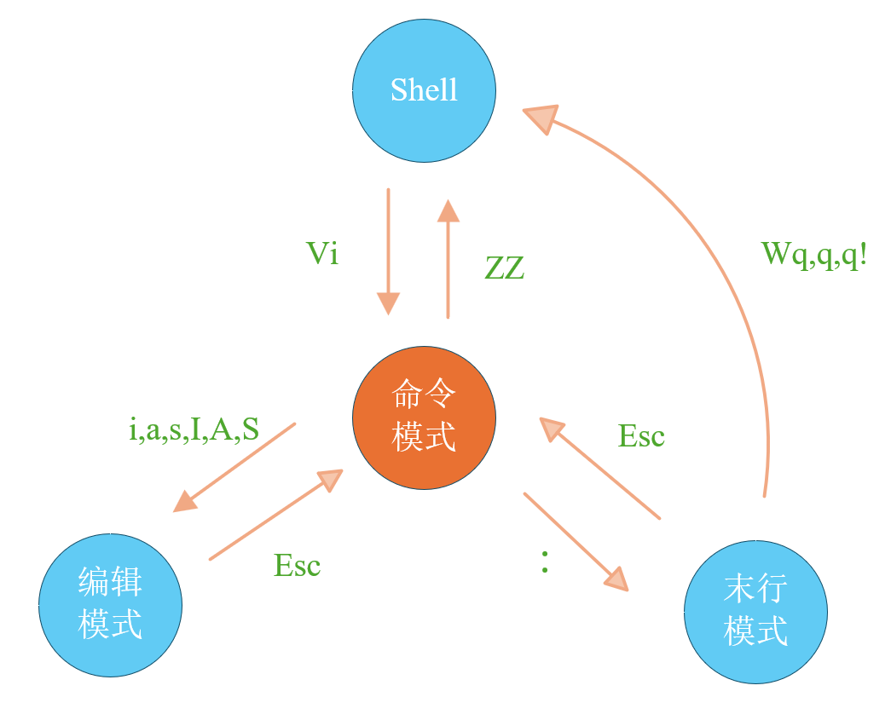
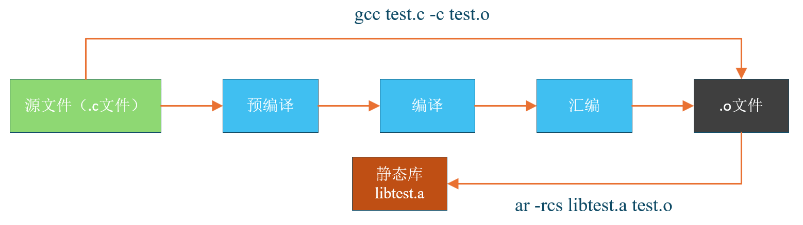

# 1 Linux 常见目录

Linux 有多个常见目录，各有特定功能：

- **/（根目录）**：整个文件系统的起点，所有内容都从这里展开，其他目录均为其分支。
- **/bin、  /usr/bin**：存放可执行二进制文件，像 `ls`（列出目录内容）、`tar`（归档解压）、`mv`（移动文件）、`cat`（查看文件内容）等常用命令都在此。
- **/boot**：存储系统启动相关文件，比如 Linux 内核文件（`/boot/vmlinuz`）、系统引导管理器（`/boot/grub`），是系统启动的关键所在。
- **/dev**：存放设备文件，访问这里的文件就如同访问对应设备，例如可通过 `mount /dev/cdrom /mnt` 挂载光驱。
- **/etc**：系统配置文件的存放地，像 `inittab`（系统初始化配置）、`fstab`（文件系统挂载配置）等重要配置文件都在此，不建议存放可执行文件。
- **/home**：默认的用户家目录，新增用户时，其家目录会存放在此，`~` 代表当前用户家目录，`~edu` 代表用户 edu 的家目录。
- **/lib、/usr/lib、/usr/local/lib**：系统函数库目录，程序执行时若需调用额外参数，会借助这里的函数库。
- **/lost+found**：系统异常出错时，会将遗失的文件片段放到这个目录。
- **/mnt、/media**：光盘默认挂载点，不过也能选择其他位置挂载光盘。
- **/opt**：用于存放主机额外安装的软件。（第三方软件安装地方）
- **/proc**：此目录数据在内存中，包含系统核心、外部设备、网络状态等信息，不占用磁盘空间，像 `cpuinfo`（CPU 信息）、`interrupts`（中断信息）等重要文件在此。
- **/root**：系统管理员 root 的家目录。
- **/sbin、/usr/sbin、/usr/local/sbin**：存放系统管理员使用的可执行命令，如 `fdisk`（磁盘分区）、`shutdown`（关机）、`mount`（挂载）等，一般用户仅能查看，无法设置和使用。
- **/tmp：**存放**临时文件**的公共存储点，许多程序运行时会在此创建临时数据。系统可能会定期清理该目录下的文件（不同发行版清理规则有差异）。
- **/var**存放**运行时动态变化的数据**，典型子目录：

​	**/var/log：**系统和各类应用的**日志文件**（如系统启动日志、服务运行日志等）。

​	**/var/spool：**邮件队列、打印队列等**待处理任务数据**。

​	**/var/tmp：**临时文件目录，但与 `/tmp` 相比，文件保留时间更长，不会被频繁自动删除。

- **/usr** 

​	`/usr/bin`：普通用户常用的**应用程序**（如文本编辑器、工具类命令等）。

​	/usr/sbin`：系统管理员使用的**管理程序**（权限更高的系统工具）。

​	/usr/include`：开发和编译应用程序所需的**头文件**（C/C++ 等语言开发时依赖）。

​	/usr/lib`/`usr/lib64`：程序运行所需的共享库文件（`lib64` 专为 64 位程序设计）。

​	/usr/share`：共享的**只读数据**（如文档、帮助手册、图标等）。

​	/usr/local`：系统管理员**本地安装软件**的目录（非系统默认分发的软件，常放在这里）。

​	`/usr/src`：软件**源代码**存储区（如 Linux 内核源码会放在 `/usr/src/linux`）。

-  **/run：**存放**运行时数据**（系统启动后生成），比如进程的 PID 文件、锁文件、状态信息等。它是**临时文件系统**（类似内存文件系统），系统启动时创建，关机时自动删除。

- **/srv：**用于存放**服务相关的数据**，比如 Web 服务器的网页文件、FTP 服务器的共享文件等，各服务的 “专属数据” 常放在 `/srv` 的子目录中（如 `/srv/www` 用于 Web 服务）。

- **/sys：**虚拟文件系统**，提供内核与系统硬件的**详细交互接口。通过 `/sys` 可查看硬件信息（如显卡、传感器状态），也能对硬件进行细粒度控制（如调整设备参数）。

- **/lib64` / `/usr/lib64**：专为 64 位系统设计的共享库目录，作用与 `/lib`/`/usr/lib` 类似，但仅用于支持 64 位程序的运行（若系统为 32 位，则可能没有这些目录）。

# 2 终端命令

## 2.1 Bash 常用命令

Bash 解析器有很多常用快捷键，能提升操作效率：

- **命令历史相关**：`↑`（上箭头）和 `↓`（下箭头）可快速调用历史命令；`!!` 执行上一条命令；`!n`（n 为历史命令序号）执行第 n 条历史命令；`!string` 执行最近以 string 开头的历史命令。

- **命令编辑相关**：`Ctrl + A` 跳到命令行开头；`Ctrl + E` 跳到命令行结尾；`Ctrl + U` 清除光标前的内容；`Ctrl + K` 清除光标后的内容；`Ctrl + W` 按单词删除光标前的内容；`Ctrl + Y` 粘贴之前用 `Ctrl + U`、`Ctrl + K` 等删除的内容。

- **命令执行与中断相关**：`Ctrl + C` 中断当前正在执行的命令；`Ctrl + D` 退出当前 Shell 会话（相当于 `exit` 命令）；`Ctrl + L` 清屏（相当于 `clear` 命令）。

- **命令补全相关**：`Tab` 键可进行命令、文件名、路径等的自动补全，按一次若有多个匹配项会提示，按两次会列出所有匹配项。

## 2.2. 终端常用命令

| 快捷键           | 功能                  |
| ---------------- | --------------------- |
| Ctrl + Shift + N | 新建一个终端          |
| Ctrl + Shift + T | 在终端里新建一个标签  |
| Ctrl + Shift + W | 关闭标签页            |
| Ctrl + Shift + Q | 关闭窗口              |
| Ctrl + Shift + C | 复制                  |
| Ctrl + Shift + V | 粘贴                  |
| Alt + [1 - 9]    | 标签之间切换          |
| Ctrl + Shift + = | 放大终端字体          |
| Ctrl + -         | 缩小终端字体          |
| Ctrl + 0         | 普通大小              |
| F11              | 全屏，再次按 F11 退出 |
| Ctrl + D         | 关闭当前一个终端      |
| Alt + F4         | 关闭整个终端          |
| Ctrl + Shift + F | 查找                  |
| Ctrl + Alt + F7  | 回到图形界面          |

# 3 文件操作

## 3.1 目录相关命令

| 命令    | 功能                       | 示例                                                         |
| ------- | -------------------------- | ------------------------------------------------------------ |
| `pwd`   | 显示当前工作目录的绝对路径 | 执行 `pwd`，若当前在 `/home/ubuntu/Documents`，则输出 `/home/ubuntu/Documents` |
| `cd`    | 切换工作目录               | `cd /etc`（切换到 `/etc` 目录）；`cd ~`（切换到当前用户家目录）；`cd ..`（切换到上一级目录） |
| `mkdir` | 创建新目录                 | `mkdir test_dir`（创建名为 `test_dir` 的空目录）；`mkdir -p dirA/dirB`（递归创建 `dirA` 及其中的 `dirB`） |
| `rmdir` | 删除空目录                 | `rmdir empty_dir`（删除空目录 `empty_dir`，若目录非空则无法用此命令删除） |

## 3.2 文件相关命令

| 命令    | 功能                                   | 示例                                                         |
| ------- | -------------------------------------- | ------------------------------------------------------------ |
| `ls`    | 列出目录中的文件和子目录               | `ls`（列出当前目录内容）；`ls -l /home`（以长格式列出 `/home` 目录内容） |
| `touch` | 创建空文件，或更新文件的访问和修改时间 | `touch newfile.txt`（创建空文件 `newfile.txt`）；`touch -d "2025-10-15 10:00" oldfile.txt`（更新 `oldfile.txt` 的时间戳为指定时间） |
| `cp`    | 复制文件或目录                         | `cp file1.txt file2.txt`（复制 `file1.txt` 为 `file2.txt`）；`cp -r dir1 dir2`（递归复制目录 `dir1` 到 `dir2`） |
| `rm`    | 删除文件或目录                         | `rm file.txt`（删除 `file.txt`）；`rm -r dir`（递归删除目录 `dir` 及其内容）；`rm -f file.txt`（强制删除 `file.txt`，不提示） |
| `mv`    | 移动或重命名文件 / 目录                | `mv file1.txt /path/to/new/location/`（移动 `file1.txt` 到指定位置）；`mv oldname.txt newname.txt`（将 `oldname.txt` 重命名为 `newname.txt`） |

## 3.3 文件查看命令

| 命令   | 功能                                                         | 示例                                                         |
| ------ | ------------------------------------------------------------ | ------------------------------------------------------------ |
| `cat`  | 一次性显示文件全部内容，适合查看内容较少的文件。             | `cat file.txt`（显示 `file.txt` 全部内容）；`cat file1.txt file2.txt`（同时显示 `file1.txt` 和 `file2.txt` 内容） |
| `more` | 分页显示文件内容，按回车键向下滚动一行，按空格键向下翻页，无法向上翻页（了解即可）。 | `more longfile.txt`（分页查看 `longfile.txt` 内容）          |
| `less` | 分页显示文件内容，支持向上、向下滚动查看，按 `q` 键退出，功能比 `more` 更强大。 | `less longfile.txt`（分页查看 `longfile.txt` 内容，可上下滚动） |
| `head` | 显示文件开头部分内容，默认显示前 10 行，可通过参数指定显示行数。 | `head file.txt`（显示 `file.txt` 前 10 行）；`head -n 5 file.txt`（显示 `file.txt` 前 5 行） |
| `tail` | 显示文件末尾部分内容，默认显示最后 10 行，可通过参数指定显示行数，还支持实时跟踪文件更新（如日志文件）。 | `tail file.txt`（显示 `file.txt` 最后 10 行）；`tail -n 5 file.txt`（显示 `file.txt` 最后 5 行）；`tail -f log.txt`（实时跟踪 `log.txt` 的更新内容） |

## 3.4 查找命令

| 命令   | 功能描述                                                     | 常用用法示例                                                 |
| ------ | ------------------------------------------------------------ | ------------------------------------------------------------ |
| `find` | 在文件系统中，根据文件的**名称、类型、大小、修改时间等属性**查找文件 / 目录 | - 按名称查找：`find /home -name "document.txt"`（在`/home`下找名为`document.txt`的文件）<br />- 按类型查找普通文件：`find . -type f`（在当前目录找所有普通文件）<br />- 按大小查找（大于 100MB）：`find / -size +100M`（在根目录找大小超 100MB 的文件） |
| `grep` | 在文件内容或命令输出中，**匹配包含指定模式（文本 / 正则表达式）的行**，用于内容过滤 | - 查找文件内文本：`grep "error" log.txt`（在`log.txt`中找含 "error" 的行）<br />- 递归查找目录内文件内容：`grep -rn "warning" /var/log`（递归在`/var/log`下的文件中找含 "warning" 的行，显示行号）<br />- 管道过滤：`ps -efgrep "nginx"`（过滤`ps`输出中含"nginx" 的进程行） |

# 4 vim操作

| 模式名称 | 功能描述                                                     | 进入方式                                           | 退出 / 切换方式                                              |
| -------- | ------------------------------------------------------------ | -------------------------------------------------- | ------------------------------------------------------------ |
| 命令模式 | Vim 默认启动模式，用于执行各种编辑命令（如移动光标、删除、复制、粘贴等），不能直接输入文本。 | 打开 Vim 时自动进入；或从其他模式按 `Esc` 键返回。 | 按 `i`（在光标前插入）、`a`（在光标后插入）、`o`（在光标下一行插入）等键进入插入模式；按 `:` 进入末行模式。 |
| 插入模式 | 用于输入和编辑文本，此时键盘输入的内容会直接显示在文档中。   | 从命令模式按 `i`、`a`、`o` 等插入类命令进入。      | 按 `Esc` 键返回命令模式。                                    |
| 末行模式 | 用于执行文件操作、全局替换、保存退出等命令，命令以 `:` 开头，在屏幕底部输入。 | 从命令模式按 `:` 键进入（底部会出现 `:` 提示符）。 | 执行命令后自动返回命令模式；或按 `Esc` 键取消输入，返回命令模式。 |



## 4.1 命令模式

#### （1）切换到插入模式

| 命令 | 功能描述                                                     |
| ---- | ------------------------------------------------------------ |
| `i`  | 在**光标当前位置前**插入文本（最常用）                       |
| `a`  | 在**光标当前位置后**插入文本（补充 `i` 的不足，避免光标遮挡） |
| `s`  | 删除**光标所在位置的字符**，并立即进入插入模式（相当于先按 `x` 删除字符，再按 `i` 插入） |
| `o`  | 在**光标所在行的下方**新建一行，并在新行开头插入文本         |
| `O`  | 在**光标所在行的上方**新建一行，并在新行开头插入文本         |
| `I`  | 直接跳到**当前行的开头**并插入文本（等价于先按 `^` 到行首，再按 `i`） |
| `A`  | 直接跳到**当前行的末尾**并插入文本（等价于先按 `$` 到行尾，再按 `a`） |
| S    | 删除**光标所在的整行内容**（保留空行），并进入插入模式（相当于先按 `dd` 删除行，再按 `o` 插入，但更简洁） |

#### （2）光标移动

| 按键       | 功能                               |
| ---------- | ---------------------------------- |
| Ctrl + f   | 向前滚动一个屏幕                   |
| Ctrl + b   | 向后滚动一个屏幕                   |
| gg         | 到文件第一行行首                   |
| G (大写)   | 到文件最后一行行首，G 必须为大写   |
| mG 或 mgg  | 到指定行，m 为目标行数             |
| 0 (数字)   | 光标移到行首（第一个字符位置）     |
| $          | 光标移到行尾                       |
| l (小写 L) | 向右移动光标                       |
| h          | 向左移动光标                       |
| k          | 向上移动光标                       |
| j          | 向下移动光标                       |
| ^          | 光标移到行首（第一个有效字符位置） |

#### （3）复制粘贴

| 按键    | 功能                                                         |
| ------- | ------------------------------------------------------------ |
| `[n]yy` | 复制从光标所在行开始的 `n` 行内容（`n` 为数字，若省略 `n`，则默认复制当前行） |
| `p`     | 将复制的内容粘贴到光标所在行的下方                           |
| `P`     | 将复制的内容粘贴到光标所在行的上方（与 `p` 方向相反）        |

#### （4）删除

| 按键    | 功能                                                         |
| ------- | ------------------------------------------------------------ |
| `[n]x`  | 删除光标后 `n` 个字符（`n` 为数字，若省略 `n`，默认删除光标后 1 个字符） |
| `[n]X`  | 删除光标前 `n` 个字符（`n` 为数字，若省略 `n`，默认删除光标前 1 个字符） |
| `D`     | 删除从光标所在位置开始到当前行末尾的内容                     |
| `[n]dd` | 删除从当前行开始的 `n` 行内容（`n` 为数字，若省略 `n`，默认删除当前行）（剪切） |
| `dG`    | 删除从光标所在行开始到文件末尾的内容                         |
| `dw`    | 删除从光标开始位置的单词（包括光标所在字符，到下一个单词开头前） |
| `d0`    | 删除光标前本行所有内容（到行首）                             |
| `dgg`   | 删除从光标所在行开始到文件开头的内容                         |

#### （5）撤销恢复

| 按键       | 功能                                                         |
| ---------- | ------------------------------------------------------------ |
| `.`（点）  | 执行上一次的操作（可重复执行最近的修改类操作，比如重复上次的删除、修改等） |
| `u`        | 撤销前一次操作（回退上一步对文本的修改）                     |
| `Ctrl + r` | 反撤销（恢复被 `u` 撤销的操作，相当于 “重做”）               |
| `100 + .`  | 执行上一次操作 100 次（批量重复最近的操作，数字可自定义）    |

#### （6）查找和替换

| 按键      | 功能                                                         |
| --------- | ------------------------------------------------------------ |
| `/字符串` | 从当前光标位置**向下**查找指定字符串，按 `n` 跳到下一个匹配结果，按 `N` 跳到上一个匹配结果 |
| `?字符串` | 从当前光标位置**向上**查找指定字符串，按 `n` 跳到上一个匹配结果，按 `N` 跳到下一个匹配结果 |
| `r`       | 替换光标当前所在位置的**单个字符**（按 `r` 后直接输入新字符即可完成替换） |
| `R`       | 进入 “替换模式”，从光标位置开始，输入的字符会**覆盖光标后的内容**，按 `Esc` 键可退出替换模式 |

#### （7）可视模式

| 按键        | 功能描述                                                     |
| ----------- | ------------------------------------------------------------ |
| `v`         | 字符级可视模式：按字符移动选中文本，可配合 `h`（左）、`j`（下）、`k`（上）、`l`（右）选择内容，选好后可用 `d` 删除、`y` 复制。 |
| `Shift + v` | 行级可视模式：以行为单位选中文本，可配合 `h`、`j`、`k`、`l` 选择多行内容，选好后可用 `d` 删除、`y` 复制。 |
| `Ctrl + v`  | 列级可视模式：以列为单位选中文本（适合表格、多列内容批量操作），可配合 `h`、`j`、`k`、`l` 选择列内容，选好后可用 `d` 删除、`y` 复制。 |

## 4.2 末行模式

#### （1）保存退出

| 按键          | 功能描述                                                     |
| ------------- | ------------------------------------------------------------ |
| `：`          | 从命令模式转换到末行模式                                     |
| `:w`          | 保存                                                         |
| `:wq`         | 保存当前文件并退出 Vim 编辑器。                              |
| `:x`（小写）  | 保存当前文件并退出 Vim 编辑器（与 `:wq` 功能类似，更简洁）。 |
| `:w filename` | 将当前文件的内容保存到指定名称（`filename`）的新文件中。     |
| `:q`          | 退出 Vim 编辑器；若文件有未保存的修改，会提示无法退出。      |
| `:q!`         | 强制退出 Vim 编辑器，且不保存文件的修改内容。                |

#### （2）替换

| 按键命令           | 功能描述                                                     |
| ------------------ | ------------------------------------------------------------ |
| `:s/abc/123/`      | 将光标所在行的**第一个**“abc” 替换为 “123”。                 |
| `:s/abc/123/g`     | 将光标所在行的**所有**“abc” 替换为 “123”（`g` 表示 global，全局行内替换）。 |
| `:1,10s/abc/123/g` | 将第 1 行到第 10 行之间的**所有**“abc” 替换为 “123”。        |
| `:%s/abc/123/g`    | 将**整个文件**中的所有 “abc” 替换为 “123”（`%` 表示所有行）。 |
| `:%s/abc/123/gc`   | 将整个文件中的所有 “abc” 替换为 “123”，**每次替换前会询问用户是否确认**（`c` 表示 confirm）。 |
| `:1,$s/abc/123/g`  | 效果同 `:%s/abc/123/g`，将整个文件（从第 1 行到最后一行 `$`）中的所有 “abc” 替换为 “123”。 |

#### （3）分屏

| 按键 / 命令              | 功能描述                                                     |
| ------------------------ | ------------------------------------------------------------ |
| `:sp`                    | 水平分屏显示当前文件。                                       |
| `:vsp`                   | 垂直分屏显示当前文件。                                       |
| `:sp 文件名`             | 水平分屏并打开指定文件。                                     |
| `:vsp 文件名`            | 垂直分屏并打开指定文件。                                     |
| `Ctrl + w + w`           | 在多个分屏窗口之间循环切换。                                 |
| `:wall`/`:wqall`/`:qall` | 分别为保存所有分屏文件、保存所有分屏文件并退出、退出所有分屏（若有未保存会提示）。 |
| `vim -O a.c b.c`         | 启动 Vim 时垂直分屏打开 `a.c` 和 `b.c` 文件。                |
| `vim -o a.c b.c`         | 启动 Vim 时水平分屏打开 `a.c` 和 `b.c` 文件。                |

# 5 gcc操作

## 5.1 gcc工作流程


编译命令格式：gcc [options] file....

| 选项           | 作用                        |
| -------------- | --------------------------- |
| -o file        | 指定生成的输出文件名为 file |
| -E             | 只进行预处理                |
| -S（大写）     | 只进行预处理和编译          |
| -c（小写）     | 只进行预处理、编译和汇编    |
| -v / --version | 查看 gcc 版本号             |
| -g             | 包含调试信息                |
| -On （n=0~3）  | 编译优化，n 越大优化得越多  |
| -Wall          | 提示更多警告信息            |
| -D             | 编译时定义宏                |

## 5.2 打包静态库



## 5.3 打包动态库


# 6 Makefile操作

## 6.1 make命令格式

`make` 命令格式为 `make [-f file] [options] [targets]`，各部分含义如下：

- **`[-f file]`**：`make` 默认查找工作目录下名为 `GNUmakefile`、`makefile`、`Makefile` 的文件作为输入文件；`-f` 可指定其他名称的文件作为 `makefile` 输入文件。
- `[options]`：
  - `-v`：显示 `make` 工具的版本信息。
  - `-w`：在处理 `makefile` 前后显示工作路径。
  - `-C dir`：读取 `makefile` 前将工作路径切换至 `dir` 目录。
  - `-n`：仅打印要执行的命令，不实际执行。
  - `-s`：执行命令但不显示执行的命令内容。
- `[targets]`：
  - 若未指定目标，`make` 会默认实现 `makefile` 内的第一个目标后退出。
  - 可指定一个或多个目标（多个目标间用空格隔开）。

## 6.2 Makefile的语法规则

### 6.2.1 一条规则

>目标：依赖文件列表
>
><Tab> 命令文件

- 目标：通常是要产生的文件名称，目标是可执行的文件或其他文件，也可以是一个动作的名称
- 依赖文件：用来输入从而产生目标的文件，一个目标通常有几个依赖文件
- 命令：make执行的动作，一个规则可以包含几个命令，有多个命令时，每个命令占一行。

### 6.2.2 三个变量

>$@:表示目标
>
>$^:表示所有的依赖
>
>$<:表示第一个依赖

### 6.2.3 两个函数

（1）wildcard：查找当前目录下所有的.c文件

（2）patsubst：匹配替换，把SRC变量里所有后缀为.c的文件替换为.o文件

```makefile
SRC=$(wildcard ./*.c)
OBJS=$(patsubst %.c,%.o,$(SRC))
```

### 6.2.4 伪目标

>伪目标声明：.PHONY:clean

声明为伪目标之后，makefile中的命令将会无条件执行


fork()函数在子进程中返回0，在父进程中返回子进程的pid

