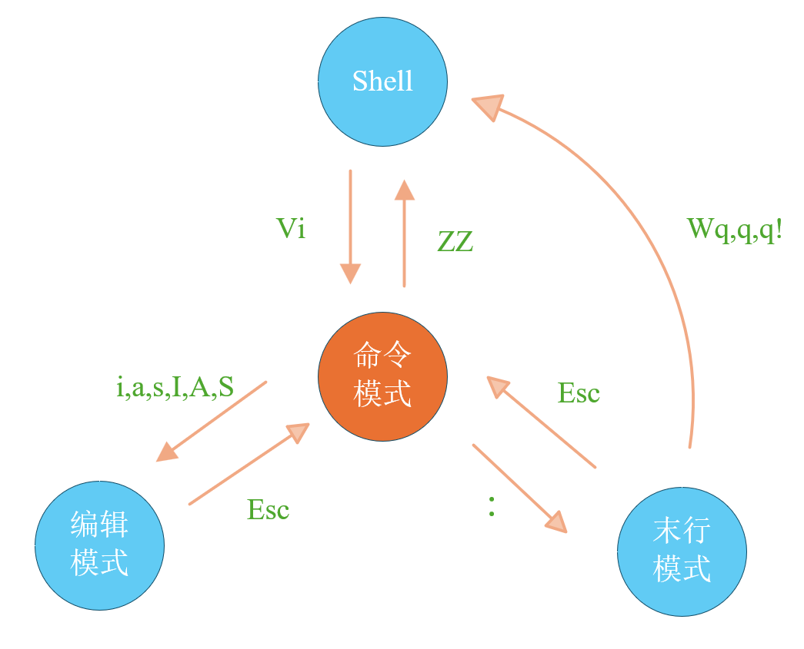
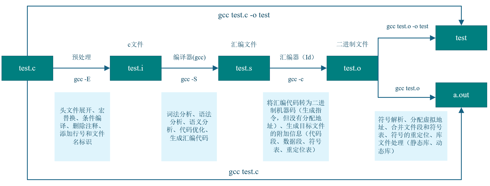
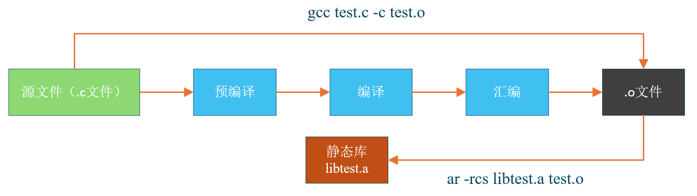

# 1 Linux 常见目录

Linux 有多个常见目录，各有特定功能：

- **/（根目录）**：整个文件系统的起点，所有内容都从这里展开，其他目录均为其分支。
- **/bin、  /usr/bin**：存放可执行二进制文件，像 `ls`（列出目录内容）、`tar`（归档解压）、`mv`（移动文件）、`cat`（查看文件内容）等常用命令都在此。
- **/boot**：存储系统启动相关文件，比如 Linux 内核文件（`/boot/vmlinuz`）、系统引导管理器（`/boot/grub`），是系统启动的关键所在。
- **/dev**：存放设备文件，访问这里的文件就如同访问对应设备，例如可通过 `mount /dev/cdrom /mnt` 挂载光驱。
- **/etc**：系统配置文件的存放地，像 `inittab`（系统初始化配置）、`fstab`（文件系统挂载配置）等重要配置文件都在此，不建议存放可执行文件。
- **/home**：默认的用户家目录，新增用户时，其家目录会存放在此，`~` 代表当前用户家目录，`~edu` 代表用户 edu 的家目录。
- **/lib、/usr/lib、/usr/local/lib**：系统函数库目录，程序执行时若需调用额外参数，会借助这里的函数库。
- **/lost+found**：系统异常出错时，会将遗失的文件片段放到这个目录。
- **/mnt、/media**：光盘默认挂载点，不过也能选择其他位置挂载光盘。
- **/opt**：用于存放主机额外安装的软件。（第三方软件安装地方）
- **/proc**：此目录数据在内存中，包含系统核心、外部设备、网络状态等信息，不占用磁盘空间，像 `cpuinfo`（CPU 信息）、`interrupts`（中断信息）等重要文件在此。
- **/root**：系统管理员 root 的家目录。
- **/sbin、/usr/sbin、/usr/local/sbin**：存放系统管理员使用的可执行命令，如 `fdisk`（磁盘分区）、`shutdown`（关机）、`mount`（挂载）等，一般用户仅能查看，无法设置和使用。
- **/tmp：**存放**临时文件**的公共存储点，许多程序运行时会在此创建临时数据。系统可能会定期清理该目录下的文件（不同发行版清理规则有差异）。
- **/var**存放**运行时动态变化的数据**，典型子目录：

​	**/var/log：**系统和各类应用的**日志文件**（如系统启动日志、服务运行日志等）。

​	**/var/spool：**邮件队列、打印队列等**待处理任务数据**。

​	**/var/tmp：**临时文件目录，但与 `/tmp` 相比，文件保留时间更长，不会被频繁自动删除。

- **/usr** 

​	`/usr/bin`：普通用户常用的**应用程序**（如文本编辑器、工具类命令等）。

​	/usr/sbin`：系统管理员使用的**管理程序**（权限更高的系统工具）。

​	/usr/include`：开发和编译应用程序所需的**头文件**（C/C++ 等语言开发时依赖）。

​	/usr/lib`/`usr/lib64`：程序运行所需的共享库文件（`lib64` 专为 64 位程序设计）。

​	/usr/share`：共享的**只读数据**（如文档、帮助手册、图标等）。

​	/usr/local`：系统管理员**本地安装软件**的目录（非系统默认分发的软件，常放在这里）。

​	`/usr/src`：软件**源代码**存储区（如 Linux 内核源码会放在 `/usr/src/linux`）。

-  **/run：**存放**运行时数据**（系统启动后生成），比如进程的 PID 文件、锁文件、状态信息等。它是**临时文件系统**（类似内存文件系统），系统启动时创建，关机时自动删除。

- **/srv：**用于存放**服务相关的数据**，比如 Web 服务器的网页文件、FTP 服务器的共享文件等，各服务的 “专属数据” 常放在 `/srv` 的子目录中（如 `/srv/www` 用于 Web 服务）。

- **/sys：**虚拟文件系统**，提供内核与系统硬件的**详细交互接口。通过 `/sys` 可查看硬件信息（如显卡、传感器状态），也能对硬件进行细粒度控制（如调整设备参数）。

- **/lib64` / `/usr/lib64**：专为 64 位系统设计的共享库目录，作用与 `/lib`/`/usr/lib` 类似，但仅用于支持 64 位程序的运行（若系统为 32 位，则可能没有这些目录）。

# 2 终端命令

## 2.1 Bash 常用命令

Bash 解析器有很多常用快捷键，能提升操作效率：

- **命令历史相关**：`↑`（上箭头）和 `↓`（下箭头）可快速调用历史命令；`!!` 执行上一条命令；`!n`（n 为历史命令序号）执行第 n 条历史命令；`!string` 执行最近以 string 开头的历史命令。

- **命令编辑相关**：`Ctrl + A` 跳到命令行开头；`Ctrl + E` 跳到命令行结尾；`Ctrl + U` 清除光标前的内容；`Ctrl + K` 清除光标后的内容；`Ctrl + W` 按单词删除光标前的内容；`Ctrl + Y` 粘贴之前用 `Ctrl + U`、`Ctrl + K` 等删除的内容。

- **命令执行与中断相关**：`Ctrl + C` 中断当前正在执行的命令；`Ctrl + D` 退出当前 Shell 会话（相当于 `exit` 命令）；`Ctrl + L` 清屏（相当于 `clear` 命令）。

- **命令补全相关**：`Tab` 键可进行命令、文件名、路径等的自动补全，按一次若有多个匹配项会提示，按两次会列出所有匹配项。

## 2.2. 终端常用命令

| 快捷键           | 功能                  |
| ---------------- | --------------------- |
| Ctrl + Shift + N | 新建一个终端          |
| Ctrl + Shift + T | 在终端里新建一个标签  |
| Ctrl + Shift + W | 关闭标签页            |
| Ctrl + Shift + Q | 关闭窗口              |
| Ctrl + Shift + C | 复制                  |
| Ctrl + Shift + V | 粘贴                  |
| Alt + [1 - 9]    | 标签之间切换          |
| Ctrl + Shift + = | 放大终端字体          |
| Ctrl + -         | 缩小终端字体          |
| Ctrl + 0         | 普通大小              |
| F11              | 全屏，再次按 F11 退出 |
| Ctrl + D         | 关闭当前一个终端      |
| Alt + F4         | 关闭整个终端          |
| Ctrl + Shift + F | 查找                  |
| Ctrl + Alt + F7  | 回到图形界面          |

# 3 文件操作

## 3.1 目录相关命令

| 命令    | 功能                       | 示例                                                         |
| ------- | -------------------------- | ------------------------------------------------------------ |
| `pwd`   | 显示当前工作目录的绝对路径 | 执行 `pwd`，若当前在 `/home/ubuntu/Documents`，则输出 `/home/ubuntu/Documents` |
| `cd`    | 切换工作目录               | `cd /etc`（切换到 `/etc` 目录）；`cd ~`（切换到当前用户家目录）；`cd ..`（切换到上一级目录） |
| `mkdir` | 创建新目录                 | `mkdir test_dir`（创建名为 `test_dir` 的空目录）；`mkdir -p dirA/dirB`（递归创建 `dirA` 及其中的 `dirB`） |
| `rmdir` | 删除空目录                 | `rmdir empty_dir`（删除空目录 `empty_dir`，若目录非空则无法用此命令删除） |

## 3.2 文件相关命令

| 命令    | 功能                                   | 示例                                                         |
| ------- | -------------------------------------- | ------------------------------------------------------------ |
| `ls`    | 列出目录中的文件和子目录               | `ls`（列出当前目录内容）；`ls -l /home`（以长格式列出 `/home` 目录内容） |
| `touch` | 创建空文件，或更新文件的访问和修改时间 | `touch newfile.txt`（创建空文件 `newfile.txt`）；`touch -d "2025-10-15 10:00" oldfile.txt`（更新 `oldfile.txt` 的时间戳为指定时间） |
| `cp`    | 复制文件或目录                         | `cp file1.txt file2.txt`（复制 `file1.txt` 为 `file2.txt`）；`cp -r dir1 dir2`（递归复制目录 `dir1` 到 `dir2`） |
| `rm`    | 删除文件或目录                         | `rm file.txt`（删除 `file.txt`）；`rm -r dir`（递归删除目录 `dir` 及其内容）；`rm -f file.txt`（强制删除 `file.txt`，不提示） |
| `mv`    | 移动或重命名文件 / 目录                | `mv file1.txt /path/to/new/location/`（移动 `file1.txt` 到指定位置）；`mv oldname.txt newname.txt`（将 `oldname.txt` 重命名为 `newname.txt`） |

## 3.3 文件查看命令

| 命令   | 功能                                                         | 示例                                                         |
| ------ | ------------------------------------------------------------ | ------------------------------------------------------------ |
| `cat`  | 一次性显示文件全部内容，适合查看内容较少的文件。             | `cat file.txt`（显示 `file.txt` 全部内容）；`cat file1.txt file2.txt`（同时显示 `file1.txt` 和 `file2.txt` 内容） |
| `more` | 分页显示文件内容，按回车键向下滚动一行，按空格键向下翻页，无法向上翻页（了解即可）。 | `more longfile.txt`（分页查看 `longfile.txt` 内容）          |
| `less` | 分页显示文件内容，支持向上、向下滚动查看，按 `q` 键退出，功能比 `more` 更强大。 | `less longfile.txt`（分页查看 `longfile.txt` 内容，可上下滚动） |
| `head` | 显示文件开头部分内容，默认显示前 10 行，可通过参数指定显示行数。 | `head file.txt`（显示 `file.txt` 前 10 行）；`head -n 5 file.txt`（显示 `file.txt` 前 5 行） |
| `tail` | 显示文件末尾部分内容，默认显示最后 10 行，可通过参数指定显示行数，还支持实时跟踪文件更新（如日志文件）。 | `tail file.txt`（显示 `file.txt` 最后 10 行）；`tail -n 5 file.txt`（显示 `file.txt` 最后 5 行）；`tail -f log.txt`（实时跟踪 `log.txt` 的更新内容） |

## 3.4 查找命令

| 命令   | 功能描述                                                     | 常用用法示例                                                 |
| ------ | ------------------------------------------------------------ | ------------------------------------------------------------ |
| `find` | 在文件系统中，根据文件的**名称、类型、大小、修改时间等属性**查找文件 / 目录 | - 按名称查找：`find /home -name "document.txt"`（在`/home`下找名为`document.txt`的文件）<br />- 按类型查找普通文件：`find . -type f`（在当前目录找所有普通文件）<br />- 按大小查找（大于 100MB）：`find / -size +100M`（在根目录找大小超 100MB 的文件） |
| `grep` | 在文件内容或命令输出中，**匹配包含指定模式（文本 / 正则表达式）的行**，用于内容过滤 | - 查找文件内文本：`grep "error" log.txt`（在`log.txt`中找含 "error" 的行）<br />- 递归查找目录内文件内容：`grep -rn "warning" /var/log`（递归在`/var/log`下的文件中找含 "warning" 的行，显示行号）<br />- 管道过滤：`ps -efgrep "nginx"`（过滤`ps`输出中含"nginx" 的进程行） |

# 4 vim操作

| 模式名称 | 功能描述                                                     | 进入方式                                           | 退出 / 切换方式                                              |
| -------- | ------------------------------------------------------------ | -------------------------------------------------- | ------------------------------------------------------------ |
| 命令模式 | Vim 默认启动模式，用于执行各种编辑命令（如移动光标、删除、复制、粘贴等），不能直接输入文本。 | 打开 Vim 时自动进入；或从其他模式按 `Esc` 键返回。 | 按 `i`（在光标前插入）、`a`（在光标后插入）、`o`（在光标下一行插入）等键进入插入模式；按 `:` 进入末行模式。 |
| 插入模式 | 用于输入和编辑文本，此时键盘输入的内容会直接显示在文档中。   | 从命令模式按 `i`、`a`、`o` 等插入类命令进入。      | 按 `Esc` 键返回命令模式。                                    |
| 末行模式 | 用于执行文件操作、全局替换、保存退出等命令，命令以 `:` 开头，在屏幕底部输入。 | 从命令模式按 `:` 键进入（底部会出现 `:` 提示符）。 | 执行命令后自动返回命令模式；或按 `Esc` 键取消输入，返回命令模式。 |



## 4.1 命令模式

#### （1）切换到插入模式

| 命令 | 功能描述                                                     |
| ---- | ------------------------------------------------------------ |
| `i`  | 在**光标当前位置前**插入文本（最常用）                       |
| `a`  | 在**光标当前位置后**插入文本（补充 `i` 的不足，避免光标遮挡） |
| `s`  | 删除**光标所在位置的字符**，并立即进入插入模式（相当于先按 `x` 删除字符，再按 `i` 插入） |
| `o`  | 在**光标所在行的下方**新建一行，并在新行开头插入文本         |
| `O`  | 在**光标所在行的上方**新建一行，并在新行开头插入文本         |
| `I`  | 直接跳到**当前行的开头**并插入文本（等价于先按 `^` 到行首，再按 `i`） |
| `A`  | 直接跳到**当前行的末尾**并插入文本（等价于先按 `$` 到行尾，再按 `a`） |
| S    | 删除**光标所在的整行内容**（保留空行），并进入插入模式（相当于先按 `dd` 删除行，再按 `o` 插入，但更简洁） |

#### （2）光标移动

| 按键       | 功能                               |
| ---------- | ---------------------------------- |
| Ctrl + f   | 向前滚动一个屏幕                   |
| Ctrl + b   | 向后滚动一个屏幕                   |
| gg         | 到文件第一行行首                   |
| G (大写)   | 到文件最后一行，G 必须为大写       |
| mG 或 mgg  | 到指定行，m 为目标行数             |
| 0 (数字)   | 光标移到行首（第一个字符位置）     |
| $          | 光标移到行尾                       |
| l (小写 L) | 向右移动光标                       |
| h          | 向左移动光标                       |
| k          | 向上移动光标                       |
| j          | 向下移动光标                       |
| ^          | 光标移到行首（第一个有效字符位置） |

#### （3）复制粘贴

| 按键    | 功能                                                         |
| ------- | ------------------------------------------------------------ |
| `[n]yy` | 复制从光标所在行开始的 `n` 行内容（`n` 为数字，若省略 `n`，则默认复制当前行） |
| `p`     | 将复制的内容粘贴到光标所在行的下方                           |
| `P`     | 将复制的内容粘贴到光标所在行的上方（与 `p` 方向相反）        |

#### （4）删除

| 按键    | 功能                                                         |
| ------- | ------------------------------------------------------------ |
| `[n]x`  | 删除光标后 `n` 个字符（`n` 为数字，若省略 `n`，默认删除光标后 1 个字符） |
| `[n]X`  | 删除光标前 `n` 个字符（`n` 为数字，若省略 `n`，默认删除光标前 1 个字符） |
| `D`     | 删除从光标所在位置开始到当前行末尾的内容                     |
| `[n]dd` | 删除从当前行开始的 `n` 行内容（`n` 为数字，若省略 `n`，默认删除当前行）（剪切） |
| `dG`    | 删除从光标所在行开始到文件末尾的内容                         |
| `dw`    | 删除从光标开始位置的单词（包括光标所在字符，到下一个单词开头前） |
| `d0`    | 删除光标前本行所有内容（到行首）                             |
| `dgg`   | 删除从光标所在行开始到文件开头的内容                         |

#### （5）撤销恢复

| 按键       | 功能                                                         |
| ---------- | ------------------------------------------------------------ |
| `.`（点）  | 执行上一次的操作（可重复执行最近的修改类操作，比如重复上次的删除、修改等） |
| `u`        | 撤销前一次操作（回退上一步对文本的修改）                     |
| `Ctrl + r` | 反撤销（恢复被 `u` 撤销的操作，相当于 “重做”）               |
| `100 + .`  | 执行上一次操作 100 次（批量重复最近的操作，数字可自定义）    |

#### （6）查找和替换

| 按键      | 功能                                                         |
| --------- | ------------------------------------------------------------ |
| `/字符串` | 从当前光标位置**向下**查找指定字符串，按 `n` 跳到下一个匹配结果，按 `N` 跳到上一个匹配结果 |
| `?字符串` | 从当前光标位置**向上**查找指定字符串，按 `n` 跳到上一个匹配结果，按 `N` 跳到下一个匹配结果 |
| `r`       | 替换光标当前所在位置的**单个字符**（按 `r` 后直接输入新字符即可完成替换） |
| `R`       | 进入 “替换模式”，从光标位置开始，输入的字符会**覆盖光标后的内容**，按 `Esc` 键可退出替换模式 |

#### （7）可视模式

| 按键        | 功能描述                                                     |
| ----------- | ------------------------------------------------------------ |
| `v`         | 字符级可视模式：按字符移动选中文本，可配合 `h`（左）、`j`（下）、`k`（上）、`l`（右）选择内容，选好后可用 `d` 删除、`y` 复制。 |
| `Shift + v` | 行级可视模式：以行为单位选中文本，可配合 `h`、`j`、`k`、`l` 选择多行内容，选好后可用 `d` 删除、`y` 复制。 |
| `Ctrl + v`  | 列级可视模式：以列为单位选中文本（适合表格、多列内容批量操作），可配合 `h`、`j`、`k`、`l` 选择列内容，选好后可用 `d` 删除、`y` 复制。 |

## 4.2 末行模式

#### （1）保存退出

| 按键          | 功能描述                                                     |
| ------------- | ------------------------------------------------------------ |
| `：`          | 从命令模式转换到末行模式                                     |
| `:w`          | 保存                                                         |
| `:wq`         | 保存当前文件并退出 Vim 编辑器。                              |
| `:x`（小写）  | 保存当前文件并退出 Vim 编辑器（与 `:wq` 功能类似，更简洁）。 |
| `:w filename` | 将当前文件的内容保存到指定名称（`filename`）的新文件中。     |
| `:q`          | 退出 Vim 编辑器；若文件有未保存的修改，会提示无法退出。      |
| `:q!`         | 强制退出 Vim 编辑器，且不保存文件的修改内容。                |

#### （2）替换

| 按键命令           | 功能描述                                                     |
| ------------------ | ------------------------------------------------------------ |
| `:s/abc/123/`      | 将光标所在行的**第一个**“abc” 替换为 “123”。                 |
| `:s/abc/123/g`     | 将光标所在行的**所有**“abc” 替换为 “123”（`g` 表示 global，全局行内替换）。 |
| `:1,10s/abc/123/g` | 将第 1 行到第 10 行之间的**所有**“abc” 替换为 “123”。        |
| `:%s/abc/123/g`    | 将**整个文件**中的所有 “abc” 替换为 “123”（`%` 表示所有行）。 |
| `:%s/abc/123/gc`   | 将整个文件中的所有 “abc” 替换为 “123”，**每次替换前会询问用户是否确认**（`c` 表示 confirm）。 |
| `:1,$s/abc/123/g`  | 效果同 `:%s/abc/123/g`，将整个文件（从第 1 行到最后一行 `$`）中的所有 “abc” 替换为 “123”。 |

#### （3）分屏

| 按键 / 命令              | 功能描述                                                     |
| ------------------------ | ------------------------------------------------------------ |
| `:sp`                    | 水平分屏显示当前文件。                                       |
| `:vsp`                   | 垂直分屏显示当前文件。                                       |
| `:sp 文件名`             | 水平分屏并打开指定文件。                                     |
| `:vsp 文件名`            | 垂直分屏并打开指定文件。                                     |
| `Ctrl + w + w`           | 在多个分屏窗口之间循环切换。                                 |
| `:wall`/`:wqall`/`:qall` | 分别为保存所有分屏文件、保存所有分屏文件并退出、退出所有分屏（若有未保存会提示）。 |
| `vim -O a.c b.c`         | 启动 Vim 时垂直分屏打开 `a.c` 和 `b.c` 文件。                |
| `vim -o a.c b.c`         | 启动 Vim 时水平分屏打开 `a.c` 和 `b.c` 文件。                |

# 5 gcc操作

## 5.1 gcc工作流程



编译命令格式：gcc [options] file....

| 选项           | 作用                        |
| -------------- | --------------------------- |
| -o file        | 指定生成的输出文件名为 file |
| -E             | 只进行预处理                |
| -S（大写）     | 只进行预处理和编译          |
| -c（小写）     | 只进行预处理、编译和汇编    |
| -v / --version | 查看 gcc 版本号             |
| -g             | 包含调试信息                |
| -On （n=0~3）  | 编译优化，n 越大优化得越多  |
| -Wall          | 提示更多警告信息            |
| -D             | 编译时定义宏                |

## 5.2 打包静态库



## 5.3 打包动态库


# 6 Makefile操作

## 6.1 make命令格式

`make` 命令格式为 `make [-f file] [options] [targets]`，各部分含义如下：

- **`[-f file]`**：`make` 默认查找工作目录下名为 `GNUmakefile`、`makefile`、`Makefile` 的文件作为输入文件；`-f` 可指定其他名称的文件作为 `makefile` 输入文件。
- `[options]`：
  - `-v`：显示 `make` 工具的版本信息。
  - `-w`：在处理 `makefile` 前后显示工作路径。
  - `-C dir`：读取 `makefile` 前将工作路径切换至 `dir` 目录。
  - `-n`：仅打印要执行的命令，不实际执行。
  - `-s`：执行命令但不显示执行的命令内容。
- `[targets]`：
  - 若未指定目标，`make` 会默认实现 `makefile` 内的第一个目标后退出。
  - 可指定一个或多个目标（多个目标间用空格隔开）。

## 6.2 Makefile的语法规则

### 6.2.1 一条规则

>目标：依赖文件列表
>
><Tab> 命令文件

- 目标：通常是要产生的文件名称，目标是可执行的文件或其他文件，也可以是一个动作的名称
- 依赖文件：用来输入从而产生目标的文件，一个目标通常有几个依赖文件
- 命令：make执行的动作，一个规则可以包含几个命令，有多个命令时，每个命令占一行。

### 6.2.2 三个变量

>$@:表示目标
>
>$^:表示所有的依赖
>
>$<:表示第一个依赖

### 6.2.3 两个函数

（1）wildcard：查找当前目录下所有的.c文件

（2）patsubst：匹配替换，把SRC变量里所有后缀为.c的文件替换为.o文件

```makefile
SRC=$(wildcard ./*.c)
OBJS=$(patsubst %.c,%.o,$(SRC))
```

### 6.2.4 伪目标

>伪目标声明：.PHONY:clean

声明为伪目标之后，makefile中的命令将会无条件执行

fork()函数在子进程中返回0，在父进程中返回子进程的pid


# 7 网络编程

## 7.1 TCP服务器启动的三个阶段

1. **`socket()`：创建 “基础套接字”（类似 “电话设备”）**

`socket` 函数创建的 `server_sock` 是一个 “未初始化” 的套接字，仅相当于申请了一个 “网络通信设备”，但还没有绑定到具体的端口，也不能接收连接。

2. **`bind()` + `listen()`：**让套接字进入 “监听状态”（类似 “绑定号码并开机”）

- `bind` 将 `server_sock` 与具体的 IP 地址和端口（如 `9527`）绑定，相当于给 “电话设备” 分配了一个 “电话号码”。
- `listen` 函数将 `server_sock` 设为 “监听模式”，并设置连接请求队列的长度（如 `5`），相当于 “开机并打开铃声”，此时服务器可以**接收客户端的连接请求**（但还没 “接起电话”）。

到这一步，服务器确实已经 “启动”，客户端可以看到 `9527` 端口处于 “监听中”（用 `netstat` 或 `lsof` 能查到），但此时还没有任何实际的连接被建立。

3. **`accept()`：接收连接并创建 “通信套接字”（类似 “接起电话”）**

客户端通过 `connect` 函数发起连接请求后，请求会进入服务器的 “连接队列”（由 `listen` 的第二个参数 `5` 限制长度）。

`accept` 函数的作用是：

- 阻塞等待连接队列中的第一个请求（类似 “等待电话铃声并接起”）；
- 接收到请求后，创建一个**新的套接字**（如 `client_sock`），专门用于与这个客户端通信；
- 原有的 `server_sock` 继续留在监听状态（如果服务器设计为多连接模式），等待其他客户端的请求。

**关键区别：“监听套接字” 与 “通信套接字”**

- `server_sock`：称为 “监听套接字”，仅用于**接收连接请求**，不参与实际的数据传输。它的生命周期贯穿服务器整个运行过程（从 `socket` 创建到服务器退出）。
- `client_sock`：`accept` 返回的 “通信套接字”，每个客户端连接对应一个，专门用于与该客户端进行 `read`/`write` 操作（传输数据）。通信完成后会被 `close` 释放。

**举例：类比电话系统**

- `socket()`：买了一部电话机（有了通信硬件）。
- `bind()`：给电话机绑定了一个号码（如 `10086`）。
- `listen()`：打开电话机并允许铃声响起（可以接收来电了）。
- `accept()`：听到铃声后，拿起话筒（建立了实际的通话链路），此时才能开始说话（传输数据）。


## 7.2 TCP的三次握手和四次挥手

**（1）三次握手**

- 客户端向服务器发送SYN包，表示客户端请求建立连接

- 服务器收到客户端的SYN包，会给客户端发送SYN+ACK应答，表示已做好准备，随时可以连接

- 客户端收到服务器发送的SYN+ACK包后，发送一个ACK应答，表示确认连接。

**（2）四次挥手**

- 客户端向服务器发送FIN包，表示发送数据完成，准备断开连接
- 服务器接收到FIN包后，向客户端发送ACK包，表示收到断开的请求
- 服务器在向客户端发送完数据后，发送FIN包，表示可以断开连接
- 客户端收到FIN包后，向服务器发送ACK应答，表示断开连接


## 7.3 TCP的流式传输

**（1）核心特点：数据是 “无边界的字节流”**

TCP 把应用层**发送的数据看作一串连续的字节**（类似一条 “字节河流”）。

- 发送方应用程序将数据放入发送缓冲区，最大传输单元 （MTU）拆分为多个 TCP 报文段发送
- 接收方将收到的报文段按序列号重组，拼接成完整的字节流，放入接收缓冲区，再由应用程序按需读取

**（2）没有 “消息边界”，需应用层自行处理**

​	由于 TCP 是流式传输，**发送方的多次 `send()` 调用与接收方的 `recv()` 调用不保证一一对应**。TCP 不会为应用层数据添加 “消息边界” 标记，接收方依赖其可靠传输特性（序列号、确认应答、重传机制等）来保证字节流的完整性。而消息的划分，则由应用层自行处理。

**（3）依托可靠传输机制保证 “流的完整性”**

TCP 的流式传输依赖其可靠传输特性（序列号、确认应答、重传机制等），确保字节流的**顺序性、完整性和不重复性**：

- 每个 TCP 报文段都包含序列号（标记该段数据在字节流中的位置）；
- 接收方通过确认应答（ACK）告知发送方已收到的字节范围；
- 若报文段丢失，发送方会重传，直到接收方确认；
- 最终，接收方会按序列号将所有报文段重组为与发送方完全一致的字节流。

**总结：流式传输的本质**

​	TCP 的流式传输本质是 “以**连续字节流**为单位进行数据传输，不维护消息边界，但通过可靠机制保证字节流的完整与有序”。这种特性适合需要 “数据无丢失、按顺序完整传输” 的场景（如文件传输、HTTP 通信等），但需应用层额外处理消息边界问题；而 UDP 的 “数据包传输” 则保留消息边界，但不保证可靠，适合实时性优先的场景（如视频通话、游戏）。

## 7.4 TCP的粘包

​	由于TCP是面向字节流流的协议，发送的数据没有边界，接收方可能在一次读取操作中接收到多个发送方的数据包，导致数据粘在一起。

解决方法：

- 业务简单：用 “简单分隔符” 就能实现封装，用换行符 `\n` 分隔命令；用特殊字符（比如 `|`）分隔参数；固定包长度

- 复杂业务：手动封装结构化包，一般来说包括（包头、长度、命令、数据、校验）


## 7.5 UDP传输特性

UDP 将应用层数据封装为独立的 “数据报”（Datagram）进行传输，每个数据报都是一个独立的传输单元，且传输过程不建立连接、不保证可靠性。以下是其核心传输机制和流程：

**（1）核心特性：“面向数据包” 的本质**

- **数据以 “独立数据报” 为单位**：应用层交给 UDP 的数据会被直接封装为一个完整的 UDP 数据报，每个数据报包含完整的源 / 目的端口、数据长度等信息，是一个独立的 “传输单元”。
- **保留 “消息边界”**：发送方调用一次 `sendto()` 发送的数据，接收方会通过一次 `recvfrom()` 完整接收（前提是接收缓冲区足够），发送次数与接收次数一一对应（例如：发送方分 3 次发 3 个数据报，接收方会收到 3 个独立的数据报，不会合并为一个）。
- **无连接、无状态**：发送数据前不需要像 TCP 那样建立连接（无三次握手），发送后也不维护连接状态，每个数据报的传输都是独立的。

**（2）UDP 的 “不可靠性” 体现**

UDP 不保证数据传输的可靠性，核心原因是缺少 TCP 的复杂机制：

1. **无确认机制**：发送方发送数据报后，不会收到接收方的 “确认应答（ACK）”，无法知道数据是否到达。
2. **无重传机制**：若数据报在网络中丢失（如路由错误、拥塞），发送方不会重传。
3. **无顺序保证**：多个数据报可能通过不同路由到达，接收顺序可能与发送顺序不一致（TCP 通过序列号保证顺序）。
4. **无流量控制 / 拥塞控制**：发送方会按自身节奏发送数据，可能导致接收方缓冲区溢出（数据丢失）。

**总结：UDP 的传输核心**

​	UDP 以 “独立数据报” 为单位，无连接、无状态、保留消息边界，不保证可靠传输，但传输效率高。其流程可概括为：**创建套接字 → 服务器绑定端口 → 发送方用 sendto () 指定目标发送数据报 → 接收方用 recvfrom () 接收完整数据报 → 关闭套接字**。这种特性使其在实时性优先的场景中不可替代。

## 7.6 UDP传输数据的过程


## 7.7 TCP和UDP的区别

核心结论：TCP 是**面向连接、可靠的传输协议**，UDP 是**无连接、高效的传输协议**，两者的差异围绕 “可靠性” 和 “效率” 的权衡展开。

**关键区别（核心维度）**

1. 连接性：TCP 需三次握手建立连接，断开需四次挥手；UDP 无需连接，直接发送数据。
2. 可靠性：TCP 通过确认、重传、排序等机制保证数据完整有序；UDP 不提供可靠性保障，可能丢包、乱序。
3. 传输效率：TCP 因可靠性机制开销大，速度较慢；UDP 无额外开销，传输速度快、延迟低。

| 对比维度            | TCP（传输控制协议）                                          | UDP（用户数据报协议）                                        |
| ------------------- | ------------------------------------------------------------ | ------------------------------------------------------------ |
| **连接性**          | 面向连接：需通过 “三次握手” 建立连接，“四次挥手” 断开连接，传输过程中维持连接状态。 | 无连接：无需建立连接，直接发送数据，发送方和接收方无状态关联。 |
| **传输单位**        | 报文段（Segment）：数据被拆分为多个字节流片段，通过序号标识。 | 数据报（Datagram）：数据以独立的 “数据报” 为单位传输，每个数据报包含完整的源 / 目的端口和数据。 |
| **数据边界**        | 无边界（字节流）：接收方无法区分发送方的 “单次发送” 边界，可能出现 “粘包”（多次发送的数据被合并接收）。 | 有明确边界：接收方会按数据报独立接收，一次读取一个完整数据报，不会粘包。 |
| **可靠性保障**      | 强可靠性：通过序列号（保证有序）、确认应答（ACK，保证接收）、超时重传（丢失重发）、流量控制（滑动窗口，避免接收方过载）、拥塞控制（避免网络拥堵）等机制，确保数据不丢、不重、有序到达。 | 无可靠性保障：不确认、不重传、不排序，数据可能丢失、重复、乱序，也不控制流量和拥塞。 |
| **头部开销**        | 较大：固定头部 20 字节，可选字段最多 40 字节（总计 60 字节），包含序列号、确认号、窗口大小等控制字段。 | 极小：固定头部 8 字节，仅包含源端口、目的端口、数据长度、校验和（可选）。 |
| **速度与延迟**      | 较慢，延迟较高：因可靠性机制（如等待确认、重传）增加额外耗时。 | 较快，延迟低：无额外控制开销，数据直接发送，适合实时场景。   |
| **广播 / 多播支持** | 不支持：仅支持**点对点**（单播）传输。                       | 支持：可用于广播（同一网络所有设备）和多播（特定组设备）。   |
| **适用场景**        | 数据完整性优先：文件传输（FTP）、网页浏览（HTTP/HTTPS）、邮件（SMTP）、远程登录（SSH）等。 | 实时性优先：实时音视频（如 Zoom）、游戏联机、DNS 查询、DHCP 配置、广播 / 多播通信等。 |


# 8 进程

## 8.1 waitpid()

```cpp
#include <sys/wait.h>
pid_t waitpid(pid_t pid, int *wstatus, int options);
```

参数说明：

- `pid`：指定要等待的子进程 ID
  - `pid > 0`：等待 ID 为`pid`的子进程
  - `pid = 0`：等待与调用进程同组的任何子进程
  - `pid = -1`：等待任何子进程（与`wait()`功能相同）
  - `pid < -1`：等待进程组 ID 为`pid`绝对值的任何子进程

- `wstatus`：用于存储子进程的退出状态信息

- `options`：选项控制选项，常用的有`WNOHANG`（非阻塞等待）和`WUNTRACED`（等待停止的子进程）

`options` 的常见取值及含义：

| 标志         | 含义                                                         |
| ------------ | ------------------------------------------------------------ |
| `0`          | 默认阻塞等待，仅关注子进程终止（退出或被杀死）。             |
| `WNOHANG`    | 非阻塞等待，立即返回（子进程未结束则返回 0，结束则返回子进程 PID）。 |
| `WUNTRACED`  | 除终止外，还关注子进程被暂停的状态（如收到 SIGSTOP）。       |
| `WCONTINUED` | 除终止外，还关注被暂停的子进程恢复运行的状态（如收到 SIGCONT）。 |

- 返回值：

| 场景                                | 返回值       | 说明                                               |
| ----------------------------------- | ------------ | -------------------------------------------------- |
| 成功捕获符合条件的子进程状态变化    | 子进程的 PID | 状态变化包括终止、暂停、恢复等（取决于 `options`） |
| 非阻塞模式（`WNOHANG`）且无状态变化 | 0            | 没有子进程符合条件或状态未变化                     |
| 调用失败                            | -1           | 需通过 `errno` 查看具体错误原因                    |

## 8.2sigaction()

`sigaction` 函数是 Linux 中用于设置信号处理方式的核心函数，其原型为：

```c
#include <signal.h>
int sigaction(int signum, const struct sigaction *act, struct sigaction *oldact);
```

### 三个参数的具体含义：

#### 1. 第一个参数 `signum`

- **含义**：指定要操作的信号编号（即需要设置处理方式的信号）。

- **取值**：必须是有效的信号常量（或对应的整数编号），例如：

  - `SIGCHLD`：子进程状态变化时（结束、暂停等）产生的信号（你代码中使用的信号）。
  - `SIGINT`：终端中断信号（比如按下 `Ctrl+C` 时产生）。
  - `SIGTERM`：程序终止信号（默认是终止进程，可被捕获）。
  - `SIGKILL`：强制终止信号（**不能被捕获、忽略或阻塞**，用于强制杀死进程）。
  - `SIGSEGV`：段错误信号（程序访问非法内存时产生）。
  - 其他常用信号：`SIGHUP`（终端断开）、`SIGQUIT`（终端退出，`Ctrl+\`）等。

  所有信号的定义可通过 `man 7 signal` 查看，编号通常在 1~64 之间（不同系统可能略有差异）。

#### 2. 第二个参数 `act`

- **含义**：指向 `struct sigaction` 结构体的指针，用于指定该信号的**新处理方式**。如果为 `NULL`，表示不修改当前的信号处理方式（仅用于获取旧处理方式）。

  ```c
  struct sigaction {
      void (*sa_handler)(int);  // 信号处理函数（普通处理方式）
      sigset_t sa_mask;         // 信号处理期间需要阻塞的信号集
      int sa_flags;             // 信号处理的标志位（控制行为）
      // 其他成员（如 sa_sigaction 用于高级处理，需配合 SA_SIGINFO 标志）
  };
  ```

  - sa_handler：可以是自定义的处理函数（如你代码中的hand_childProc），也可以是特殊值：
    - `SIG_IGN`：忽略该信号（不做任何处理）。
    - `SIG_DFL`：使用系统默认处理方式（例如 `SIGINT` 的默认处理是终止进程）。
  - `sa_mask`：在信号处理函数执行期间，需要额外阻塞的信号（防止处理过程中被其他信号打断）。
  - sa_flags：控制信号处理的细节，常用取值：
    - `0`：默认行为。
    - `SA_RESTART`：被该信号中断的系统调用（如 `read`、`accept`）会自动重启（避免返回错误）。
    - `SA_NOCLDWAIT`：针对 `SIGCHLD` 信号，子进程结束后不会变成僵尸进程（系统自动回收）。
    - `SA_SIGINFO`：使用 `sa_sigaction` 作为处理函数（比 `sa_handler` 多传递更多信号信息）。

#### 3. 第三个参数 `oldact`

- **含义**：指向 `struct sigaction` 结构体的指针，用于**保存该信号原来的处理方式**（以便之后恢复）。如果为 `NULL`（或 `0`，如你代码中），表示不需要保存旧处理方式。

### 你的代码中 `sigaction(SIGCHLD, &act, 0)` 的含义：

- 对 `SIGCHLD` 信号设置新的处理方式：使用 `act` 结构体中定义的 `hand_childProc` 作为处理函数（`sa_handler = hand_childProc`），不设置额外阻塞信号（`sa_mask` 未显式初始化，默认空），无特殊标志（`sa_flags = 0`）。
- 第三个参数为 `0`（即 `NULL`），表示不保存该信号原来的处理方式。

### 总结：

- `signum`：指定要处理的信号（如 `SIGCHLD`、`SIGINT`）。
- `act`：指定新的处理方式（处理函数、阻塞信号集、标志位），`NULL` 表示不修改。
- `oldact`：用于保存旧处理方式，`NULL` 表示不保存。

通过这三个参数，`sigaction` 可以灵活地控制信号的处理逻辑，是比 `signal` 函数更强大、更可移植的信号处理接口。

## 8.3 僵尸进程

在 Unix/Linux 系统中，**僵尸进程（Zombie Process）** 是一种特殊的进程状态，指 “子进程已终止，但父进程未读取其退出状态，导致子进程的进程描述符仍保留在系统中的进程”。其核心特征是 “已死亡但未被回收”，具体可从以下几个方面理解：

### **1. 形成原因**

进程终止时，内核会释放其占用的内存、CPU 等资源，但会保留**少量关键信息**（如进程 PID、退出状态码、终止原因等），等待父进程通过 `wait()` 或 `waitpid()` 等系统调用来 “读取” 这些信息。

若父进程：

- 未调用 `wait()`/`waitpid()` 回收子进程状态；
- 或父进程自身陷入死循环、崩溃（但未被终止），无法处理子进程退出；

子进程的残留信息会一直保存在内核中，此时子进程就会成为 “僵尸进程”。

### **2. 特点与危害**

- **特点**：

  - 僵尸进程已终止，不再执行任何代码，不占用 CPU 和内存资源；
  - 内核中仍保留其 PID 和退出状态，可通过 `ps` 命令查看（状态标记为 `Z` 或 `Z+`）。

- **危害**：

  系统的 PID 数量是有限的（如 Linux 默认最大 PID 为 32768），僵尸进程会持续占用 PID 资源。若大量僵尸进程累积，会导致系统无法创建新进程（无可用 PID），最终引发服务异常。

### **3. 如何避免和解决**

**避免僵尸进程（核心：及时回收子进程）**

- **父进程主动调用 `wait()`/`waitpid()`**：

  父进程在子进程终止后，通过 `wait()`（阻塞等待任意子进程退出）或 `waitpid()`（指定子进程 PID，支持非阻塞）读取子进程退出状态，内核会随之释放僵尸进程的残留信息。

  ```c
  pid_t pid = fork();
  if (pid == 0) { /* 子进程逻辑 */ exit(0); }
  else { wait(NULL); /* 父进程回收子进程 */ }
  ```

- **利用 `SIGCHLD` 信号自动处理**：

  子进程终止时，内核会向父进程发送 `SIGCHLD` 信号。父进程可注册该信号的处理函数，在函数中调用 `wait()` 回收子进程，避免阻塞主逻辑。

- **让子进程成为 “孤儿进程”**：

  若父进程无需关注子进程退出状态，可通过 “两次 `fork()`” 让子进程的父进程（即当前进程的子进程）先退出，此时子进程会被 `init` 进程（或 `systemd`，进程号为 1）收养，`init` 会自动回收其状态，避免僵尸进程。

**解决已存在的僵尸进程**

- 若僵尸进程的父进程仍在运行，需手动终止父进程（如 `kill -9 父进程PID`），此时僵尸进程会被 `init` 收养并回收。
- 若父进程已崩溃（成为僵尸进程的父进程本身也是僵尸），需重启系统释放 PID 资源（极端情况）。

### **总结**

僵尸进程是 “子进程终止后未被父进程回收” 的残留状态，核心危害是耗尽 PID 资源。避免的关键是父进程通过 `wait()` 系列函数或信号机制及时回收子进程；解决已存在的僵尸进程需终止其父进程，由系统进程接管回收。理解僵尸进程的本质，是掌握 Unix/Linux 进程管理的基础。

## 8.4 孤儿进程

**孤儿进程**是指：**父进程（Parent Process）先于子进程（Child Process）终止（退出或被杀死），但子进程仍在运行**的情况。

- 此时，子进程失去了原本的“父亲”，变成了“孤儿”。
- **关键点**：孤儿进程是**活着**的（Running/Sleeping），它还在执行代码，占用 CPU 和内存资源。

### **1. 产生原因**

- **父进程正常结束**：父进程完成了它的任务，调用 `exit()` 或从 `main` 返回，而此时它创建的子进程还在忙碌（例如处理长时间的计算、网络请求等）。
- **父进程异常崩溃**：父进程因为段错误（Segmentation Fault）或其他信号被操作系统强制杀死，子进程幸存下来。
- **故意设计**：在某些守护进程（Daemon）的创建过程中，会故意让父进程退出，使子进程成为孤儿，从而脱离控制终端。

### **2. 系统如何处理？（核心机制）**

孤儿进程**不会**变成僵尸进程，也不会无人管理。Linux 内核有一套完善的“收养”机制：

1. **重新父进程化 (Re-parenting)**：
   - 当父进程退出时，内核会检测到它还有存活的子进程。
   - 内核会将这些孤儿进程的 **PPID (父进程 ID)** 修改为 **1**。
   - **PID 1** 是系统的初始化进程（在现代 Linux 中通常是 `systemd`，旧系统是 `init`）。
   - 也就是说，**`init`/`systemd` 进程成为了这些孤儿进程的新“养父”**。
2. **自动回收资源**：
   - `init`/`systemd` 进程会定期调用 `wait()` 或 `waitpid()` 系统调用。
   - 当孤儿进程最终执行完毕退出时，`init` 会自动收集它的退出状态，释放其进程控制块（PCB）资源。
   - **结论**：孤儿进程**无害**，系统能自动清理，不会造成资源泄漏。

### **3. 孤儿进程 vs 僵尸进程 (高频考点)**

这是最容易混淆的两个概念，请务必区分清楚：

| 特性           | **孤儿进程 (Orphan)**       | **僵尸进程 (Zombie)**                                    |
| :------------- | :-------------------------- | :------------------------------------------------------- |
| **状态**       | **活着** (Running/Sleeping) | **死了** (Terminated)                                    |
| **父子关系**   | 父先死，子后死              | 子先死，父没回收                                         |
| **资源占用**   | 占用内存、CPU 等运行资源    | **不占用**内存/CPU，仅占用**进程表项 (PID)**             |
| **父进程是谁** | 被 `init` (PID 1) 收养      | 仍然是原来的父进程 (直到父进程调用 wait)                 |
| **危害性**     | **无害** (系统自动处理)     | **有害** (若大量积累，耗尽 PID 资源，导致无法创建新进程) |
| **处理方式**   | 无需人工干预，系统自动收养  | 需要杀死父进程或修复代码让父进程调用 `wait()`            |

### **4. 总结**

> **孤儿进程是“父死子活”，会被系统_init_进程自动收养并善后，因此它是安全的；而僵尸进程是“子死父不收”，会占用系统 PID 资源，是危险的**


## 8.5 进程通信方式

**（1）管道（Pipe/FIFO）**

- 半双工通信，数据单向流动，FIFO（命名管道）支持无亲缘关系进程通信。
- 基于文件系统实现，无需显式创建缓冲区，简单易用但传输效率较低。

------

**（2）消息队列**

- 数据以 “消息” 为单位传递，支持双向通信，可实现异步通信。
- 自带独立缓冲区，数据生命周期独立于进程，但存在数据拷贝开销。

------

**（3）共享内存**

- 多个进程映射到同一块物理内存，直接读写数据，不需要内核参与，是效率最高的 IPC 方式。
- 无数据拷贝开销，但需配合信号量等同步机制，避免资源竞争。
- 需要反复加锁同步

------

**（4）信号量（Semaphore）**

- 不传递数据，仅用于进程同步与互斥，控制共享资源的访问权限。（通知信号状态的变化）
- 本质是计数器，支持多进程协作，但无法传输大量数据。

------

**（5）套接字（Socket）**

- 支持跨主机、跨网络通信，也可用于同一主机内进程交互。
- 通用性极强，支持 TCP/UDP 协议，但通信延迟相对较高，配置稍复杂。

| 通信方式          | 适用场景                        | 效率等级       | 跨主机支持 | 数据传输方式          | 同步需求         |
| ----------------- | ------------------------------- | -------------- | ---------- | --------------------- | ---------------- |
| 管道（Pipe/FIFO） | 亲缘 / 无亲缘进程、简单数据交换 | 中低           | 不支持     | 字节流（单向 / 双向） | 无需额外同步     |
| 消息队列          | 异步通信、有格式数据传输        | 中             | 不支持     | 消息包（离散单元）    | 无需额外同步     |
| 共享内存          | 高频大数据交换、高性能需求      | 高             | 不支持     | 直接读写内存          | 需配合信号量等   |
| 信号量            | 进程互斥、资源访问控制          | （不传输数据） | 不支持     | 无（仅计数器）        | 本身就是同步工具 |
| 套接字（Socket）  | 跨网络 / 本地进程、通用通信     | 中             | 支持       | 字节流 / 数据报       | TCP 自带同步     |

## 8.6 信号量

信号量（Semaphore）的核心作用是**进程同步与互斥**，本身不负责数据传输，因此在大多数场景下会配合其他进程间通信（IPC）方式使用；但也存在单独使用的情况（仅用于控制进程执行顺序）。

### 1. 信号量与其他 IPC 方式的典型配合场景

信号量的核心价值是解决 “多个进程竞争共享资源” 的问题，因此当其他 IPC 方式涉及 “共享资源访问” 时，通常需要信号量配合：

- **与共享内存配合（最典型）**

  共享内存允许多个进程直接读写同一块物理内存，效率极高，但缺乏原生同步机制。如果多个进程同时写入，会导致数据错乱（比如进程 A 写了一半，进程 B 插入修改）。

  此时需用信号量控制访问：例如设置一个二元信号量（0 或 1），进程访问共享内存前先 “获取信号量”（P 操作），操作完成后 “释放信号量”（V 操作），确保同一时间只有一个进程操作共享内存。

- **与管道 / 消息队列配合**

  管道和消息队列本身有简单的阻塞机制（比如读端等待写端数据），但在复杂场景下仍需信号量辅助。

  例如：多个进程向同一管道写入数据时，用信号量控制 “每次只允许一个进程写入”，避免数据交织；或者用信号量标记 “管道中数据的数量”，实现生产者 - 消费者模型（生产者写数据后增加信号量，消费者读数据前检查信号量是否大于 0）。

- **与文件配合**

  当多个进程读写同一文件时，信号量可用于实现 “文件锁” 的效果：进程修改文件前获取信号量，防止并发写入导致文件损坏。

### 2. 信号量单独使用的场景

信号量也可以不依赖其他 IPC 方式，仅用于**控制进程的执行顺序**。

例如：

- 进程 A 需要等待进程 B 完成初始化后才能启动，可在进程 B 初始化完成后执行 “V 操作”（信号量 + 1），进程 A 启动时先执行 “P 操作”（若信号量为 0 则阻塞，直到进程 B 触发 V 操作）。
- 多个进程协作完成任务时，用信号量标记 “前序步骤是否完成”，实现按顺序执行。

### 总结

信号量的定位是 “进程间的同步工具”，而非 “数据传输工具”：

- **多数情况**下，它需要配合共享内存、管道等 “数据传输类 IPC”，解决共享资源的竞争问题；
- **少数情况**下，可单独用于控制进程的执行节奏（无需数据传输）。

## 8.7 共享内存

共享内存的**数据存储区域不在内核空间**，而是位于物理内存中，通过内存映射机制被映射到多个进程的**用户空间虚拟地址**中；内核仅负责管理共享内存的元数据（如大小、权限、关联进程等），这些元数据存储在内核空间。具体原理可以拆解为两步：

1. **内核分配与管理元数据**

   当进程通过系统调用（如 Linux 的`shmget`）创建共享内存时，内核会：

   - 在物理内存中开辟一块连续的内存区域（这部分是实际存储数据的地方）；
   - 在内核空间中创建一个 “共享内存控制结构”（如`struct shmid_ds`），记录该共享内存的大小、所有者、权限、关联的物理页等元数据。

   这里的关键是：**实际存储数据的物理内存块不属于内核空间的虚拟地址范围**，内核只是 “管理” 它，而不直接使用它存储数据。

2. **映射到用户空间**

   其他进程通过`shmat`等系统调用 “附加” 到该共享内存时，内核会将这块物理内存映射到当前进程的**用户空间虚拟地址**中。

   此后，进程对共享内存的读写操作完全在用户态完成（直接操作用户空间的虚拟地址），无需经过内核转发（比如不需要像管道那样通过内核缓冲区拷贝数据），这也是共享内存效率最高的核心原因。

**总结：**

- **数据区域**：位于物理内存，被映射到进程的用户空间虚拟地址，属于用户态可直接访问的范围；
- **管理元数据**：位于内核空间，由内核维护，用于跟踪共享内存的状态。

这种设计让共享内存绕开了内核空间与用户空间之间的数据拷贝，因此成为效率最高的进程间通信方式。

8.7 孤儿进程

# 9 线程

## 9.1 pthread_create()

```c
int pthread_create(
    pthread_t *thread,          // 参数1：线程ID输出
    const pthread_attr_t *attr, // 参数2：线程属性设置
    void *(*start_routine)(void*), // 参数3：线程入口函数
    void *arg                   // 参数4：传递给入口函数的参数
);
```

1. `pthread_t *thread`

- **类型**：`pthread_t` 指针（`pthread_t` 是线程 ID 的类型，类似进程 ID 的 `pid_t`）。

- **作用**：**输出参数**，用于存储新创建线程的唯一标识符（线程 ID）。

- 细节：

  函数调用成功后，会将新线程的 ID 写入thread指针指向的内存空间（例如&thread）。

  后续可通过该 ID 操作线程（如pthread_join等待线程结束、pthread_cancel终止线程等）。

  若不需要后续操作线程（如用pthread_detach分离线程），仍需传入有效指针（不可为NULL）。

2. `const pthread_attr_t *attr`

- **类型**：`pthread_attr_t` 结构体指针（`const` 修饰，表示只读）。
- **作用**：指定新线程的**属性**（如栈大小、调度策略、分离状态等）。
- 细节：
  - 若传入 `NULL`，表示使用**默认属性**（如默认栈大小、非分离状态、默认调度策略）。
  - 若需要自定义属性，需先通过 `pthread_attr_init` 初始化 `pthread_attr_t` 结构体，设置属性后再传入。
  - 常见属性：
    - 分离状态（`PTHREAD_CREATE_DETACHED` 表示线程创建后自动分离，无需 `pthread_join`）；
    - 栈大小（`pthread_attr_setstacksize` 设置线程栈的大小）；
    - 调度优先级（需结合系统调度策略设置）。

3. `void *(*start_routine)(void*)`

- **类型**：函数指针，指向一个 “参数为 `void*`、返回值为 `void*`” 的函数。
- **作用**：新线程的**入口函数**（线程创建后会自动执行该函数）。
- 细节：
  - 这是线程的核心逻辑所在，线程从该函数开始执行，函数执行结束后线程随之终止。
  - 函数参数 `void*` 用于接收 `pthread_create` 第四个参数传递的数据（通过类型转换使用）。
  - 函数返回值 `void*` 可作为线程的 “退出状态”，供 `pthread_join` 函数获取。

4. `void *arg`

- **类型**：`void*` 通用指针（可指向任意类型的数据）。
- **作用**：传递给线程入口函数（`start_routine`）的**参数**。
- 细节：
  - 由于是 `void*` 类型，可传递任意数据（如整数、结构体、数组地址等），但需在入口函数中通过类型转换还原（例如 `(int*)arg`、`(struct MyData*)arg`）。
  - 注意：若传递的是栈上的局部变量地址，需确保变量生命周期长于线程生命周期（否则线程可能访问到已释放的内存，导致 “悬空指针” 错误）。
  - 若无需传递参数，可传入 `NULL`。

函数返回值

- 成功创建线程时，返回 `0`。
- 失败时，返回**非 0 的错误码**（POSIX 线程库不设置 `errno`，直接通过返回值返回错误），常见错误如：线程属性无效、系统资源不足等。

## 9.2 线程通信

线程间通信的核心基础是 “共享同一进程的地址空间”（共享内存、全局变量等），因此通信方式更依赖共享资源的协作，同时需要同步机制避免竞态条件。主要方式及特点如下：

### 1. 共享变量（全局变量 / 静态变量）

- **原理**：线程属于同一进程，共享进程的内存空间，因此可直接访问全局变量、静态变量或堆内存中的共享数据。
- 特点：
  - 最简单直接，无需额外 IPC 机制；
  - 必须配合同步机制（如锁、信号量），否则会因并发读写导致数据错乱（竞态条件）；
  - 适用于数据频繁交互、逻辑简单的场景。

### 2. 互斥锁（Mutex）

- **原理**：通过 “加锁 - 解锁” 控制对共享资源的独占访问，确保同一时间只有一个线程操作共享数据。
- 特点：
  - 本质是 “同步工具”，但通过控制共享资源的访问权限间接实现线程间的 “状态协作”（例如：线程 A 解锁后，线程 B 才能感知到数据已更新）；
  - 支持 “阻塞” 和 “非阻塞” 两种模式，阻塞模式下未获取锁的线程会进入等待状态；
  - 是线程通信中最基础的同步保障，几乎所有共享变量场景都需要配合互斥锁。

### 3. 条件变量（Condition Variable）

- **原理**：允许线程在某个条件未满足时进入等待状态，当条件满足时由其他线程唤醒，实现 “等待 - 通知” 机制。
- 特点：
  - 必须与互斥锁配合使用（等待前释放锁，唤醒后重新获取锁），避免 “虚假唤醒”；
  - 解决 “线程轮询等待共享资源” 的低效问题（无需不停检查条件，节省 CPU）；
  - 典型场景：生产者 - 消费者模型（生产者生产数据后通知消费者，消费者等待数据就绪）。

### 4. 信号量（Semaphore）

- **原理**：通过计数器控制对共享资源的访问数量（类似进程间的信号量，但线程间信号量更轻量）。
- 特点：
  - 可用于 “限制并发线程数”（如控制同时访问某个资源的线程上限）；
  - 也可实现简单的 “消息传递”（例如：用信号量计数 “待处理任务数”，生产者 + 1，消费者 - 1）；
  - 比互斥锁更灵活（互斥锁是信号量的特殊情况，计数器仅为 0 或 1）。

### 5. 消息队列 / 阻塞队列（Thread-safe Queue）

- **原理**：线程通过线程安全的队列传递数据（队列内部已实现锁或原子操作），发送方入队，接收方出队。
- 特点：
  - 无需手动处理同步，队列内部保证线程安全；
  - 支持 “阻塞式读写”（队列为空时读线程阻塞，队列满时写线程阻塞），适合异步通信；
  - 编程语言层面常提供封装（如 Java 的`BlockingQueue`、Python 的`queue.Queue`），易用性高。

### 6. 信号（Signal）

- **原理**：通过操作系统信号机制（如`SIGUSR1`）通知线程，但线程共享进程的信号处理函数，需谨慎使用。
- 特点：
  - 传递的是 “事件通知”（非数据），适合简单的状态触发（如终止线程、唤醒线程）；
  - 存在局限性：信号处理函数中不能执行复杂操作（可能打断线程原有逻辑），且多线程下信号分发不直观。

### 7. 屏障（Barrier）

- **原理**：让多个线程等待彼此，直到所有线程都到达某个 “屏障点” 后再同时继续执行。
- 特点：
  - 用于多线程协作的 “阶段同步”（如：所有线程完成初始化后，再一起开始处理任务）；
  - 需指定参与线程数量，满足数量后自动唤醒所有等待线程。

### 总结

线程间通信的核心是 “共享内存 + 同步机制”：

- 简单场景用**共享变量 + 互斥锁**；
- 复杂协作（如等待特定条件）用**条件变量**；
- 异步数据传递用**线程安全队列**；
- 阶段同步用**屏障**。

## 9.3 信号和信号量

信号（Signal）和信号量（Semaphore）虽然名字相似，但本质是完全不同的机制：前者是**事件通知工具**，后者是**同步与互斥工具**，核心区别体现在设计目标、工作方式和应用场景上。

**（1）定义与核心目标**

- **信号（Signal）**

  是操作系统向进程 / 线程发送的**异步事件通知**，用于告知 “某个特定事件发生”（如中断、错误、外部触发等）。

  核心目标：传递 “事件信号”，触发接收方的预设处理逻辑（如终止进程、忽略事件、执行自定义函数）。

- **信号量（Semaphore）**

  是一种**同步原语**，通过一个 “计数器” 控制多个进程 / 线程对共享资源的访问。

  核心目标：解决 “共享资源竞争” 问题，确保进程 / 线程按规则访问资源（如互斥访问、控制并发数量）。

**（2）数据传递能力**

- **信号**：不传递具体数据，仅传递 “事件类型”（如`SIGINT`表示中断，`SIGSEGV`表示段错误）。接收方只能根据信号类型判断发生了什么事件，无法获取额外信息。
- **信号量**：也不传递数据，但其 “计数器值” 本身隐含了资源状态（如 “可用资源数量”）。例如，计数器为 0 表示资源已被占用，正数表示可用资源数。

**（3）操作方式**

- **信号**：
  - 由发送方（内核、其他进程或自身）通过`kill()`、`raise()`等系统调用主动发送；
  - 接收方被动响应（无法主动 “请求” 信号），且处理方式是异步的（信号可能在任意时刻打断进程的正常执行）；
  - 常见处理动作：忽略、终止进程、暂停进程、执行自定义信号处理函数（`signal()`或`sigaction()`注册）。
- **信号量**：
  - 由进程 / 线程主动执行 “P 操作”（`wait`，计数器 - 1）和 “V 操作”（`post`，计数器 + 1）来改变状态；
  - 操作是同步的：P 操作若计数器为 0，会阻塞等待直到计数器 > 0；V 操作会唤醒等待的进程 / 线程；
  - 动作是确定性的（严格按 P/V 顺序执行），不会打断正常执行流程。

**（4）适用场景**

- **信号**：
  - 处理异步事件（如用户按`Ctrl+C`触发`SIGINT`终止进程）；
  - 进程间简单的 “紧急通知”（如父进程通知子进程退出）；
  - 注意：多线程中信号处理较复杂（所有线程共享信号处理函数），通常不推荐用于线程间通信。
- **信号量**：
  - 进程 / 线程间的互斥（如用二元信号量实现 “锁”，确保同一时间只有一个线程操作共享内存）；
  - 控制并发数量（如用计数信号量限制同时访问数据库的线程数）；
  - 生产者 - 消费者模型（生产者 V 操作增加资源数，消费者 P 操作获取资源）。

| 维度     | 信号（Signal）         | 信号量（Semaphore）             |
| -------- | ---------------------- | ------------------------------- |
| 本质     | 事件通知机制           | 同步与互斥机制                  |
| 核心作用 | 告知 “事件发生”        | 控制共享资源访问                |
| 数据传递 | 仅传递事件类型，无数据 | 无数据，通过计数器表示资源状态  |
| 操作方式 | 异步发送 - 被动响应    | 主动 P/V 操作 - 同步阻塞 / 唤醒 |
| 典型场景 | 中断处理、异常通知     | 互斥访问、并发控制              |

简单说：**信号是 “告知出事了”，信号量是 “管好别出事”**。两者在操作系统中承担完全不同的角色，几乎不会混淆使用。

## 9.4 进程和线程的区别

线程和进程是操作系统中两个核心概念，两者的区别体现在**资源分配、调度方式、独立性**等多个维度，核心差异可总结为：**进程是 “资源分配的基本单位”，线程是 “CPU 调度的基本单位”**。具体区别如下：

**（1）资源分配与共享**

- **进程**：作为独立的资源分配单位，拥有**独立的地址空间、内存、文件描述符、信号处理机制**等资源。进程间的资源相互隔离，一个进程无法直接访问另一个进程的内存（需通过 IPC 机制）。
- **线程**：属于进程的一部分，**共享进程的全部资源**（如地址空间、内存、文件描述符等），仅拥有自己的私有数据（如栈空间、寄存器状态、线程本地存储 TLS）。线程间无需额外机制即可直接访问共享资源。

**（2）上下文切换开销**

- **进程切换**：需要保存和恢复整个进程的状态（包括地址空间、内存映射、打开的文件等），涉及内核态操作，**开销大**（通常是线程切换的几十到上百倍）。
- **线程切换**：仅需保存和恢复线程的私有数据（栈、寄存器等），共享的进程资源无需切换，**开销小**，更适合高频调度场景。

**（3）独立性与健壮性**

- **进程**：独立性强，进程间相互隔离。一个进程崩溃（如内存错误）通常不会影响其他进程，系统稳定性高。
- **线程**：依赖所属进程，线程间共享资源。一个线程崩溃（如野指针访问共享内存）可能导致整个进程崩溃，进而影响同进程内的所有线程。

**（4）通信方式**

- **进程间通信（IPC）**：需通过专门的机制（如管道、消息队列、共享内存、套接字等），因资源隔离，通信复杂且效率较低。
- **线程间通信**：基于共享内存（全局变量、堆内存等），通信简单直接，但需通过同步机制（锁、条件变量等）避免数据竞争。

**（5）创建与销毁效率**

- **进程**：创建时需分配独立资源（如地址空间），销毁时需释放所有资源，**效率低**。
- **线程**：仅需分配私有数据（栈、寄存器），创建和销毁依赖进程的资源，**效率高**（通常比进程快 10-100 倍）。

**（6）调度单位**

- **进程**：是操作系统资源分配的基本单位，但不是调度的最小单位（早期 OS 仅以进程为调度单位，现代 OS 引入线程后，调度粒度更细）。
- **线程**：是 CPU 调度和执行的基本单位，操作系统通过调度线程实现 CPU 时间的分配，更灵活地利用多核资源。

| 维度            | 进程（Process）                | 线程（Thread）                 |
| --------------- | ------------------------------ | ------------------------------ |
| 资源单位        | 资源分配的基本单位（独立资源） | 不独立分配资源（共享进程资源） |
| 调度单位        | 非最小调度单位（粒度粗）       | 最小调度单位（粒度细）         |
| 资源隔离性      | 强（进程间相互隔离）           | 弱（线程间共享资源）           |
| 上下文切换开销  | 大（需切换全部资源状态）       | 小（仅切换私有数据）           |
| 通信方式        | 依赖 IPC 机制（复杂）          | 基于共享内存（简单，需同步）   |
| 健壮性          | 高（一个崩溃不影响其他）       | 低（一个崩溃可能导致进程崩溃） |
| 创建 / 销毁效率 | 低                             | 高                             |

简单说：**进程是 “独立的运行实体”，线程是 “进程内的执行流”**。进程提供资源隔离，线程提供轻量调度，两者结合实现了操作系统的高效并发。

## 9.5 死锁

​	死锁的本质是**多个执行单元互相争夺资源而陷入的一种的循环等待状态**，若无外力作用，则执行单元无法继续向前执行。

**怎么破解（避免）死锁？**

​	死锁的破解（避免）核心是**破坏死锁发生的四个必要条件中的至少一个**（互斥、持有并等待、不可剥夺、循环等待），或通过主动策略防止死锁形成。常见方法如下：

**（1）破坏 “互斥条件”**

**原理**：死锁的前提是资源必须互斥访问（即一次只能被一个进程使用），若能让资源可共享访问，则无死锁可能。

**做法**：用可共享的资源替代互斥资源（如用共享内存替代独占文件）。

**局限性**：多数关键资源（如打印机、锁）的互斥属性是固有需求（必须独占使用），因此该方法适用场景有限。

**（2）破坏 “持有并等待条件”**

**原理**：避免进程 “持有部分资源的同时等待其他资源”，从根源上阻止 “部分占有” 导致的循环等待。

**具体策略**：

- 一次性申请所有资源

  ：进程启动前，必须一次性声明并申请所需的全部资源，申请不到则不执行；执行过程中不再申请新资源。

  （优点：简单直接；缺点：资源利用率低，进程可能因某一非急需资源未就绪而长期阻塞）

- **释放已持有资源再申请**：进程若需新资源，必须先释放已持有的所有资源，再重新申请包括原有资源在内的全部所需资源。

**（3）破坏 “不可剥夺条件”**

**原理**：允许资源被 “剥夺”，即当进程持有资源且请求新资源失败时，强制释放已持有的资源，避免长期占用导致死锁。

**具体策略**：

- 当进程请求新资源无法满足时，主动释放已持有的资源，进入等待状态；待后续重新申请时，再一并获取所需资源。
- 系统可优先剥夺低优先级进程的资源，分配给高优先级进程（需资源支持 “可剥夺” 特性，如内存、CPU 时间片等，而打印机等资源不适用）。

**（4）破坏 “循环等待条件”**

**原理**：通过规则避免进程间形成 “你等我、我等你” 的循环依赖链。

**最常用策略：资源有序分配**

- 对系统中所有资源进行统一编号（如资源 1、资源 2、…、资源 n），规定进程必须按**编号递增的顺序**申请资源。
- 例如：进程需同时使用资源 2 和资源 5 时，必须先申请资源 2，再申请资源 5；任何进程都不能先申请编号大的资源，再申请编号小的资源。
- 效果：由于申请顺序严格递增，进程间无法形成环形等待（每个进程等待的资源编号都比已持有资源大，不可能回头等待编号小的资源）。

**（5）死锁避免（动态检测与决策）**

**原理**：不刻意破坏条件，而是在资源分配前通过算法判断 “分配后是否可能导致死锁”，仅在安全时分配资源。

**典型算法：银行家算法**

- **模拟资源分配后系统的 “安全状态”**（即**存在一种资源分配顺序，使所有进程都能完成执行**），若安全则分配，否则拒绝。
- 适用于资源数量固定、进程需求可预知的场景（如操作系统对进程的资源管理），但计算复杂，实时性较差。

**（6）死锁检测与恢复（事后处理）**

若未预防或避免死锁，可通过检测机制发现死锁，并采取恢复措施：

- **死锁检测**：定期检查系统资源分配图中是否存在 “循环等待”（如通过资源分配图化简法）。
- 恢复措施：
  - 终止部分进程（优先终止优先级低、占用资源少的进程），释放其资源；
  - 剥夺部分进程的资源（强制释放，分配给其他进程），让阻塞进程继续执行。

**总结**

​	实际开发中，**资源有序分配**（破坏循环等待）和**一次性申请资源**（破坏持有并等待）是最常用的预防手段，实现简单且有效；死锁避免（如银行家算法）适用于对安全性要求极高的场景；死锁检测与恢复则作为兜底策略，用于无法完全预防死锁的复杂系统。


# 10 IO复用

在网络编程中，**I/O 复用** 是一种让单个进程（或线程）能够同时监控多个 I/O 事件（如网络连接的读写请求）的技术。它的核心作用是**高效处理大量并发的 I/O 操作**，避免因单个 I/O 阻塞而导致整个程序停滞，从而提升程序的吞吐量和响应性。

常见的多路复用机制：select、poll、epoll

## 10.1 条件触发和边缘触发

​	在计算机网络编程（尤其是 I/O 多路复用模型，如 select、poll、epoll 等）中，**条件触发（Level Triggered, LT）** 和**边缘触发（Edge Triggered, ET）** 是两种事件通知机制，用于判断何时通知应用程序处理 I/O 事件（如可读、可写）。两者的核心区别在于**触发通知的条件和时机**，直接影响程序的处理逻辑和效率。

### 10.1.1条件触发

- **触发逻辑**：只要文件描述符（如 socket）的状态满足事件条件（例如，内核缓冲区中有数据可读），就会持续触发通知，直到该条件被消除（例如，数据被读完）。

- **形象理解**：类似 “状态维持触发”—— 只要状态有效（如缓冲区非空），就一直提醒，直到状态消失。

- **典型应用**：select、poll 默认使用条件触发，epoll 也支持条件触发（默认模式）。

- 特点：

  - **易用性高**：应用程序无需一次性处理完所有数据，即使某次读取不彻底，后续仍会收到通知，降低了漏处理风险。
  - **效率较低**：可能导致重复通知（只要条件未消除），增加不必要的系统调用开销。

- 示例：

  当 socket 接收缓冲区有数据时，LT 会立即通知应用程序 “可读”；如果应用程序只读取了部分数据，剩余数据仍在缓冲区中，LT 会再次通知 “可读”，直到数据被完全读取。

### 10.1.2 边缘触发

- **触发逻辑**：仅在文件描述符的状态**从 “不满足条件” 变为 “满足条件” 的瞬间**触发一次通知，后续即使条件持续满足（如缓冲区仍有数据），也不会再次通知，直到状态再次发生变化（如又有新数据到来）。

- **形象理解**：类似 “状态突变触发”—— 只在状态首次满足时提醒一次，后续状态不变则不再提醒。

- **典型应用**：epoll 支持边缘触发（需手动配置），是高性能场景的常用选择。

- 特点：

  - **效率高**：减少了重复通知，适合高并发场景，降低系统调用次数。
  - **编程复杂度高**：应用程序必须在单次通知中**彻底处理完当前事件**（例如，一次性读完缓冲区所有数据），否则可能遗漏后续数据（因为不会再收到通知，直到新数据到来）。

- 示例：

  ​	当 socket 接收缓冲区从 “空” 变为 “有数据” 时，ET 会触发一次 “可读” 通知；如果应用程序只读取了部分数据，剩余数据仍在缓冲区中，ET 不会再次通知，直到新的数据到来（此时缓冲区状态从 “有旧数据” 变为 “有更多数据”，再次触发一次通知）。

| **维度**     | **条件触发（LT）**                     | **边缘触发（ET）**                         |
| ------------ | -------------------------------------- | ------------------------------------------ |
| 触发时机     | 只要条件满足（如缓冲区非空），持续触发 | 仅在条件从 “不满足” 变为 “满足” 时触发一次 |
| 数据处理要求 | 可分多次处理，无需一次完成             | 必须一次处理完当前所有数据，否则可能遗漏   |
| 系统调用次数 | 较多（重复通知）                       | 较少（单次通知）                           |
| 编程难度     | 低（容错性高）                         | 高（需严格处理边界情况）                   |
| 适用场景     | 简单场景、对效率要求不高的场景         | 高并发、高性能场景（如服务器开发）         |

边缘触发（ET）适用于高并发场景，**减少系统调用是直接原因**，但其本质是通过 “仅在状态变化时触发一次” 的机制，避免了无效唤醒和重复处理，适配了高并发下 “批量处理、减少开销” 的核心需求。不过，这也要求程序必须严格处理数据读取（确保一次性读完），并配合非阻塞 I/O，因此编程复杂度更高，但在性能敏感的高并发场景（如 Nginx、高性能服务器）中，这种复杂度的代价是值得的。

## 10.2 select()

​	`select` 让程序能同时监控多个 FD（如套接字、管道、标准输入），无需为每个 FD 创建独立线程 / 进程，实现 “单线程处理多 I/O 事件”。

```cpp
#include <sys/select.h>
#include <sys/time.h>

int select(
    int nfds,                  // 需监控的最大 FD + 1
    fd_set* readfds,           // 监控“读就绪”的 FD 集合
    fd_set* writefds,          // 监控“写就绪”的 FD 集合
    fd_set* exceptfds,         // 监控“异常就绪”的 FD 集合
    struct timeval* timeout    // 超时时间（NULL=永久阻塞，0=非阻塞）
);
```

### 10.2.1 步骤

- 定义并初始化文件描述符集合fd_set
- 添加需要监控的服务器socket
- 调用select，将新生成的客户端 socket加入监控集合，进行监控
- 服务器和客户端正常通信

### 10.2.2 核心特点

1. **监控范围有限**：`select`的监控范围受限于系统定义的`FD_SETSIZE`（通常为 1024），无法监控过多连接。
2. **需要轮询检查就绪描述符**：每次`select`返回后，必须通过`for`循环遍历所有可能的描述符（从 0 到`max_sock`），用`FD_ISSET`判断是否就绪，效率随连接数增加而下降。
3. **集合需重复初始化**：由于`select`会修改输入的集合，每次循环都需要用原集合（`reads`）复制出临时集合（`copy_reads`），增加了额外开销。
4. **支持超时机制**：通过`timeval`设置超时时间，避免进程永久阻塞。

## 10.3 epoll()

### 10.3.1 步骤

- 创建epoll实例
- 添加需要监控的服务器socket
- 等待就绪事件
- 处理就绪事件，服务器和客户端正常通信

### 10.3.2 核心特点

1. **事件驱动，无需轮询**：`epoll`内核维护就绪列表，`epoll_wait`直接返回就绪事件，无需像`select`那样遍历所有注册的描述符，效率极高。
2. **支持边缘触发（ET）**：代码中通过`EPOLLET`启用 ET 模式，配合非阻塞 I/O 实现高效数据处理，减少通知次数。
3. **注册一次，长期有效**：通过`epoll_ctl`注册事件后，描述符会被内核的红黑树管理，无需每次等待前重新传入，减少内核态 / 用户态数据复制。
4. **无连接数限制**：仅受系统内存限制，可支持十万级甚至百万级连接，远超`select`的 1024 上限。

## 10.4 select和epoll的区别

`select` 和 `epoll` 是两种主流的 I/O 复用机制，核心目标都是让单进程 / 线程高效处理多个 I/O 事件，但在设计理念、性能表现和适用场景上有本质区别。以下从 **核心机制、性能瓶颈、功能特性** 等维度详细对比：

#### **1. 核心机制：轮询 vs 事件驱动**

- **select**：基于 “轮询” 机制

  每次调用 `select` 时，用户态需将**所有待监控的文件描述符集合（`fd_set`）** 复制到内核态，内核会**逐个遍历**这些描述符，检查是否有就绪事件（如可读、可写）。遍历完成后，内核修改原集合（仅保留就绪描述符），再将集合复制回用户态。用户态需要再次遍历整个集合，通过 `FD_ISSET` 筛选出就绪的描述符。

  **本质是 “用户态告诉内核‘要监控谁’，内核逐个检查后返回结果，用户再逐个排查”。**

- **epoll**：基于 “事件驱动” 机制

  epoll 在内核中维护两个关键数据结构：

  - **红黑树**：存储所有通过 `epoll_ctl` 注册的文件描述符（仅需注册一次，无需每次复制到内核）。
  - **就绪链表**：当某个描述符的事件就绪时（如数据到达），内核会**主动将其加入就绪链表**。

  调用 `epoll_wait` 时，内核直接从就绪链表中取出事件，复制到用户态提供的缓冲区（如 `all_events` 数组），用户态只需遍历就绪事件列表即可。

  **本质是 “用户态告诉内核‘要监控谁’，内核主动记录‘谁就绪了’，直接返回结果”。**

#### **2. 监控数量：有限制 vs 无限制**

- **select**：有硬性限制

  受系统宏 `FD_SETSIZE` 限制（通常为 1024），即单次最多监控 1024 个文件描述符。若需监控更多连接，需重新编译内核修改该宏，但会导致效率急剧下降（遍历成本过高）。

- **epoll**：无限制（仅受系统资源约束）

  监控的文件描述符数量仅受系统内存限制，理论上可支持十万级、百万级连接（实际中受内核参数和内存影响）。这是 epoll 适合高并发场景的核心原因之一。

#### **3. 效率对比：随连接数增长的性能变化**

- **select**：效率随连接数增加而**急剧下降**

  - 每次调用需将所有监控的描述符从用户态复制到内核态（O (n) 复制成本，n 为监控数量）。

  - 内核需遍历所有描述符检查就绪状态（O (n) 遍历成本）。

  - 用户态需再次遍历所有描述符筛选就绪事件（O (n) 遍历成本）。

    

    因此，当连接数超过 1000 时，select 的性能会明显恶化。

- **epoll**：效率随连接数增加**基本稳定**

  - 描述符仅在注册时复制到内核一次（`epoll_ctl` 阶段），后续无需重复复制（O (1) 成本）。

  - 内核通过红黑树管理描述符，增删改操作的时间复杂度为 O (log n)，高效且稳定。

  - 就绪事件直接从内核的 “就绪链表” 中获取，用户态只需遍历就绪事件（数量远小于总连接数，O (k) 成本，k 为就绪数）。

    因此，即使连接数达到数万，epoll 的性能也不会显著下降。

#### **4. 数据复制：重复复制 vs 一次复制**

- **select**：每次调用都需全量复制

  用户态的 `fd_set` 集合在每次 `select` 调用时都要完整复制到内核态，内核处理后再复制回用户态（因为内核会修改原集合）。这种 “用户态 ↔ 内核态” 的重复数据复制，在高并发场景下会成为显著性能瓶颈。

- **epoll**：仅注册时复制一次

  描述符通过 `epoll_ctl` 注册到内核的红黑树后，后续无需再复制（内核直接操作红黑树）。`epoll_wait` 仅需将 “就绪事件列表” 从内核复制到用户态的缓冲区（数量少，成本低）。

#### **5. 触发模式：仅支持 LT vs 支持 LT 和 ET**

- **select**：仅支持**水平触发（Level Triggered, LT）**

  只要描述符的事件条件持续满足（如缓冲区有未读数据），`select` 就会反复触发通知。优点是编程简单（无需一次性处理完数据），缺点是可能导致重复通知（如未读完的数据会再次触发），增加无效操作。

- **epoll**：支持**水平触发（LT）** 和**边缘触发（Edge Triggered, ET）**

  - **LT（默认）**：与 select 行为一致，适合简单场景，容错性高。
  - **ET**：仅在事件状态从 “不满足” 变为 “满足” 时触发一次（如缓冲区从空→有数据）。需配合非阻塞 I/O 一次性处理完所有数据（否则会遗漏），但能减少通知次数，效率更高，适合高并发场景（如 Nginx）。

#### **6. API 设计：繁琐 vs 简洁**

- **select**：接口设计繁琐
  - 需手动维护 `fd_set` 集合（`FD_ZERO`/`FD_SET`/`FD_CLR`），且每次调用前需重置集合（因为内核会修改原集合）。
  - 需手动记录最大文件描述符（`max_sock`），作为 `select` 的第一个参数。
  - 不区分事件类型（可读 / 可写 / 异常）需通过三个独立集合传递，使用不便。
- **epoll**：接口更清晰、可维护性高
  - 分三个函数：`epoll_create`（创建实例）、`epoll_ctl`（添加 / 修改 / 删除事件）、`epoll_wait`（等待就绪事件），职责明确。
  - 事件通过 `epoll_event` 结构体定义（包含事件类型和关联数据），支持灵活绑定自定义数据（如文件描述符、指针等）。
  - 无需手动维护最大描述符，内核自动管理。

#### **7. 适用场景**

- **select**：适合**连接数少且固定**的场景（如简单的客户端工具、低并发服务器），或需要**跨平台**（Windows、Linux、Unix 均支持）的场景。
- **epoll**：适合**高并发、大连接数**的场景（如 Web 服务器、即时通讯服务器），仅在 Linux 系统可用，是高性能服务器的首选（如 Nginx、Redis 均基于 epoll）。

#### **总结对比表**

| 维度             | select                             | epoll                               |
| ---------------- | ---------------------------------- | ----------------------------------- |
| 核心机制         | 轮询（全量检查）                   | 事件驱动（内核维护就绪列表）        |
| 监控数量限制     | 受 `FD_SETSIZE` 限制（通常 1024）  | 无限制（仅受系统内存）              |
| 效率随连接数变化 | 急剧下降（O (n) 成本）             | 基本稳定（O (1) 或 O (log n) 成本） |
| 数据复制         | 每次调用全量复制（用户态↔内核态）  | 仅注册时复制一次                    |
| 触发模式         | 仅水平触发（LT）                   | 支持 LT 和边缘触发（ET）            |
| API 易用性       | 繁琐（需手动维护集合和最大描述符） | 简洁（分三个函数，职责明确）        |
| 适用场景         | 低并发、跨平台                     | 高并发、Linux 环境                  |

简言之，`select` 是 “遍历所有可能，筛选有效结果”，而 `epoll` 是 “直接定位有效结果，无需遍历”。这种设计上的差异，使得 epoll 在高并发场景下性能远超 select，成为现代高性能网络编程的核心技术之一。

## 10.5 同步IO和异步IO

IO 完整分为**两步**：

1. **等待数据就绪**（网卡数据来到内核缓冲区）
2. **数据拷贝**（内核缓冲区 → 用户程序内存）

​	**同步 IO**：内核只通知就绪，拷贝必须用户自己主动调用 read 完成整个 IO 过程，用户需要主动参与、主动取数据。（select、poll、epoll）

​	**异步 IO**：内核自己完成：等待就绪 + 数据拷贝全部做完，全部干完之后，再回调通知用户。用户全程不用主动做任何 IO 操作。（Windows下的 IOCP，Linux下的异步io不怎么用）


